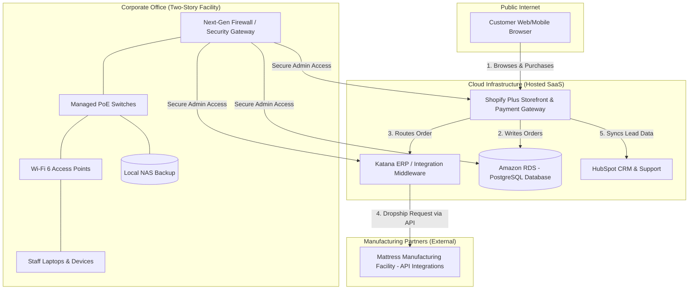
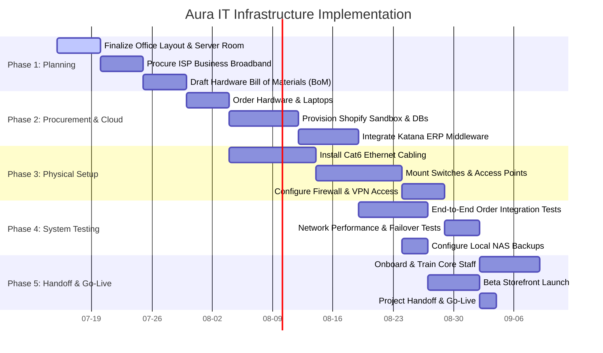

# Aura - Enterprise E-Commerce IT Infrastructure Plan

This repository showcases the comprehensive, 90-day Information Systems Project Plan for **Aura**, a premium sleep-wellness e-commerce start-up. Designed from the perspective of the Chief Technology Officer (CTO), this project outlines the strategy for establishing a scalable IT infrastructure to support a rapidly growing business.

---

## 🚀 Business Profile: Aura
Aura is an innovative e-commerce startup specializing in technology-enabled sleep and bedding systems (mattresses, accessories, and wellness sleep tracking).
* **Current Status:** 10 core corporate employees | $5 Million annual revenue
* **2-Year Projections:** 30 core corporate employees | $30 Million annual revenue
* **Facility:** New standalone, two-story corporate headquarters (transitioning from no pre-existing IT infrastructure).
* **Supply Chain Model:** Hybrid dropship and light-inventory model inspired by Wayfair.

---

## 🛠 Tech Stack & Architecture
To support rapid scalability and eliminate warehousing overhead, Aura's technology system is designed as a hybrid cloud and on-premise model:

* **Storefront & Checkout:** Shopify Plus (Fully hosted SaaS, PCI-DSS compliant)
* **ERP & Integration Middleware:** Katana ERP (manages automated order routing to mattress manufacturing partners via APIs)
* **Customer Relationship Management (CRM):** HubSpot CRM (integrates sleep-trial tracking and marketing)
* **Database & Analytics:** Amazon RDS (PostgreSQL transactional database) & Snowflake Data Warehouse (Business Intelligence)
* **Physical Office IT:** Local Area Network (LAN) utilizing a Next-Generation Firewall (NGFW), managed PoE switches, and 5x Wi-Fi 6 wireless access points.
* **On-Site Storage:** Local NAS configured in a RAID-10 array for secure, redundant backups.

---

## 📂 Project Milestones & Deliverables

### 📅 Week 2: Project Plan Inception
* **Core Proposal:** [Aura_Project_Plan_Inception.docx](./Week%202/Aura_Project_Plan_Inception.docx) — Fully formatted academic document (Times New Roman, double-spaced, 1-inch margins) featuring cover page, demographics, and technical systems details.
* **Source File:** [Aura_Project_Plan_Inception.md](./Week%202/Aura_Project_Plan_Inception.md) — Source text in Markdown.
* **Gantt Chart (Excel):** [Part_2_Gantt_Chart.xlsx](./Week%202/Part_2_Gantt_Chart.xlsx) — Interactive project tracker with WBS, durations, predecessors, and a cell-colored visual bar chart.
* **Gantt Chart (XML):** [Part_2_Gantt_Chart.xml](./Week%202/Part_2_Gantt_Chart.xml) — Direct MS Project file for importing into Microsoft Project.

#### Systems Infrastructure Diagram
Below is the system block diagram showing customer interactions, secure administrative pathways, API dropship logic, and local office hardware setup.

#### 90-Day Implementation Timeline
The IT rollout schedule is represented below using native Markdown Gantt syntax:

---

### 📅 Week 4: Business Requirements
*🔓 Unlocks in Week 4*

---

### 📅 Week 6: Infrastructure Design
*🔓 Unlocks in Week 6*

---

### 📅 Week 8: System Implementation
*🔓 Unlocks in Week 8*

---

### 📅 Week 10: Comprehensive Project Plan & Executive Presentation
*🔓 Unlocks in Week 10*
