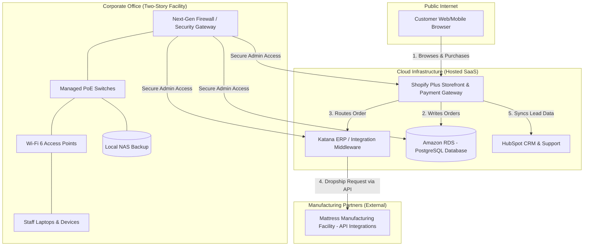

# Capstone Project: Project Plan Inception for Aura

---

## 1. Company Background and Mission

Aura is an innovative, early-stage e-commerce start-up specializing in premium, technology-enabled sleep and bedding products. Funded by a venture capital group, the company's mission is to redefine the mattress and sleep-wellness shopping experience by delivering customizable, high-end sleep systems directly to consumers. By leveraging a high-margin, customer-centric Business-to-Consumer (B2C) model, Aura bridges the gap between premium retail bedding products and seamless digital commerce. 

Currently, Aura is in an active growth phase:
* **Current Status:** 10 core corporate employees, generating $5 million in annual revenue.
* **Growth Projections (2-Year Horizon):** Expanding to 30 corporate employees and scaling annual revenue to $30 million.
* **Facility Relocation:** The company is relocating its headquarters to a new, standalone, two-story facility. Currently, this building lacks any pre-existing IT or networking infrastructure.

To minimize overhead and scale rapidly, Aura uses a **hybrid dropship and light-inventory model** inspired by the logistical efficiency of Wayfair. Instead of maintaining massive, capital-intensive warehouse operations, Aura acts as a high-tech design and retail layer. Custom mattress orders placed on the digital storefront are routed automatically via Application Programming Interfaces (APIs) to manufacturing partners who build and ship the products directly to the consumer’s home. A small, on-site storage area at the new office holds high-turnover accessories, such as premium pillows and sheets, to facilitate quick local distribution.

---

## 2. Business Type, Target Market, and Customer Demographics

Aura operates exclusively in the B2C e-commerce sector, targeting the rapidly growing "sleep-wellness" industry. 

### Target Audience
The target customer base is divided into two primary segments:
1. **Wellness-Oriented Professionals:** Consumers who prioritize sleep hygiene as a cornerstone of physical and mental health. These customers view high-quality bedding as a long-term investment in their well-being.
2. **First-Time Homebuyers & Suburban Renovators:** Individuals seeking to fully furnish new living spaces with premium, long-lasting furniture and bedding, choosing the convenience of online delivery over traditional mattress showrooms.

### Customer Demographics
* **Age Range:** 25 to 54 years old (primarily digitally native Millennials and Gen X).
* **Income Level:** Middle-to-upper-middle-income brackets (household income of $75,000+).
* **Behavioral Profile:** Tech-savvy shoppers who rely heavily on peer reviews, sleep data, and online guides before making high-value purchases. They prefer hassle-free shipping, direct-to-door delivery, and comprehensive sleep-trial policies (e.g., 100-night risk-free trials).

---

## 3. Technical Systems Infrastructure

To support the corporate team in the new two-story standalone building and manage high-volume online sales, the Chief Technology Officer (CTO) must implement a robust, secure, and scalable information systems infrastructure. The system is designed as a **hybrid cloud and on-premise model**, utilizing hosted Software-as-a-Service (SaaS) platforms for core business logic, backed by local network infrastructure for the physical office.

### Hardware Infrastructure
* **Employee Workstations:** Standardized company-issued laptops (e.g., Apple MacBook Air or Lenovo ThinkPad) running secure operating systems, equipped with mobile device management (MDM) software for remote data wipes.
* **Office Networking Hardware:**
  * **Next-Generation Firewall (NGFW):** Located at the building's network entrance on the ground floor to inspect inbound and outbound traffic.
  * **Core and Managed Switches:** Power-over-Ethernet (PoE) switches distributed on both floors to connect physical workstations, printers, and access points.
  * **Wireless Access Points (WAPs):** Five Wi-Fi 6 access points (three on the first floor, two on the second floor) to provide seamless, high-speed wireless coverage throughout the facility.
* **On-Site Storage:** A network-attached storage (NAS) device configured in a RAID-10 array for secure, high-speed local data backups of creative assets and business records.

### Software and Platform Infrastructure
* **E-Commerce Front-End and Back-End:** Shopify Plus (hosted cloud solution) handles storefront presentation, shopping cart operations, credit card processing (PCI-DSS compliant), and basic customer accounts.
* **Enterprise Resource Planning (ERP) & Inventory Middleware:** Katana ERP connects Shopify to our manufacturing partners. When an order is placed, the ERP automatically translates the order details into production tickets sent directly to the manufacturer's fulfillment system.
* **Customer Relationship Management (CRM):** HubSpot CRM tracks customer interactions, marketing campaigns, and post-purchase sleep trials.
* **Collaboration Suite:** Google Workspace (email, drive, document collaboration) and Slack for internal corporate communication.

### Database Architecture
* **Cloud Database System:** A hosted Amazon Relational Database Service (RDS) running PostgreSQL manages core transactional data, customer purchase histories, and operational metrics.
* **Data Warehouse:** Snowflake acts as our centralized data repository, pulling information from Shopify, the ERP, and HubSpot. This allows the executive team to run business intelligence reports on sales trends, growth metrics, and supplier performance.

---

## 4. High-Level Infrastructure Block Diagram

The block diagram below illustrates the relationship between the e-commerce customers, the cloud platforms, the manufacturing partners, and the local corporate office network.

---

## 5. Part 2: Supporting Gantt Chart Tasks Outline

For **Part 2** of the assignment, the following tasks must be modeled in Microsoft Project to construct the timeline for establishing this infrastructure.

### Phase 1: Planning and Site Design (Days 1–15)
* 1.1 Finalize office floorplans and locate server room on the first floor.
* 1.2 Select and purchase ISP business broadband connection.
* 1.3 Draft hardware bill of materials (firewalls, switches, access points, and NAS).

### Phase 2: Procurement and Cloud Provisioning (Days 16–35)
* 2.1 Order corporate laptops and office networking hardware.
* 2.2 Provision Shopify Plus environment and set up sandbox database.
* 2.3 Integrate ERP middleware with manufacturing partner API endpoints.

### Phase 3: Physical Installation and Cabling (Days 36–60)
* 3.1 Install Cat6 Ethernet cabling throughout the two-story building.
* 3.2 Mount and configure Wi-Fi access points and managed switches.
* 3.3 Set up firewall security profiles and configure office VPN.

### Phase 4: Integration and System Testing (Days 61–75)
* 4.1 Conduct end-to-end testing of customer order to manufacturer routing.
* 4.2 Test office network performance and run simulated failover tests.
* 4.3 Configure and verify local NAS backups.

### Phase 5: Go-Live and Training (Days 76–90)
* 5.1 Onboard 10 initial staff members on new hardware and software tools.
* 5.2 Launch e-commerce storefront for beta customers.
* 5.3 Conduct final project wrap-up and handoff to operational staff.

---

## 6. Sources (SWS Format)

1. McKinsey & Company. (2020). *Retail Operations 2020: The Next Horizon*. McKinsey Publications. This resource provides insight into consumer retail behaviors, online purchasing patterns, and the integration of omni-channel customer support.
2. ValueWalk. (2020). *Top 10 Largest Ecommerce Companies in the US in 2020*. ValueWalk Business Analysis. Used to model the business characteristics of premium e-commerce entities, specifically adopting the dropship-light distribution model utilized by major modern home furnishing websites.
3. Laudon, K. C., & Laudon, J. P. (2020). *Management Information Systems: Managing the Digital Firm* (16th ed.). Pearson. This text outlines standard corporate networking architectures, security protocols, database designs, and system implementation methodologies.
