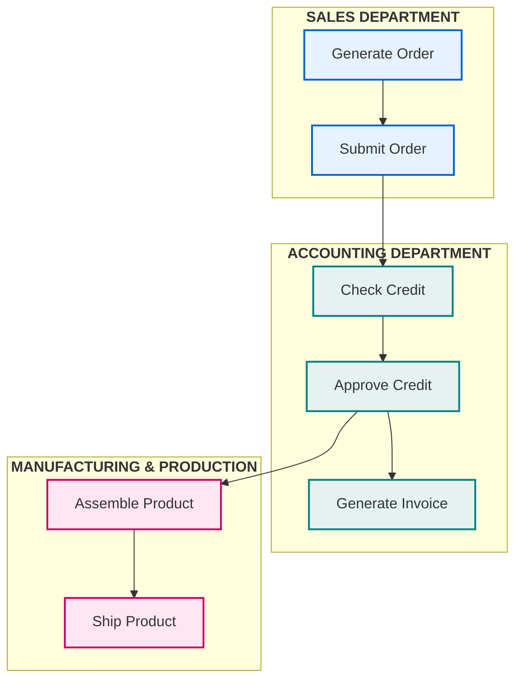
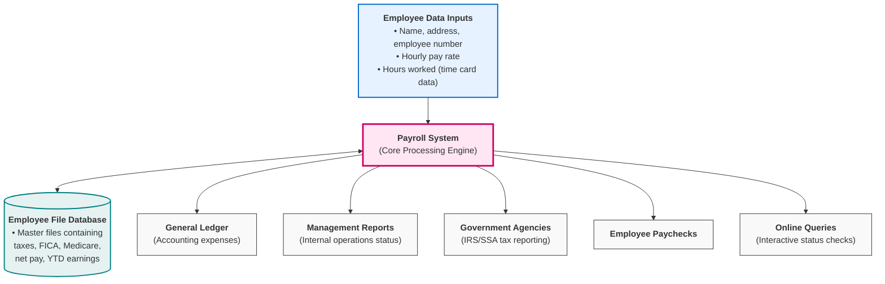
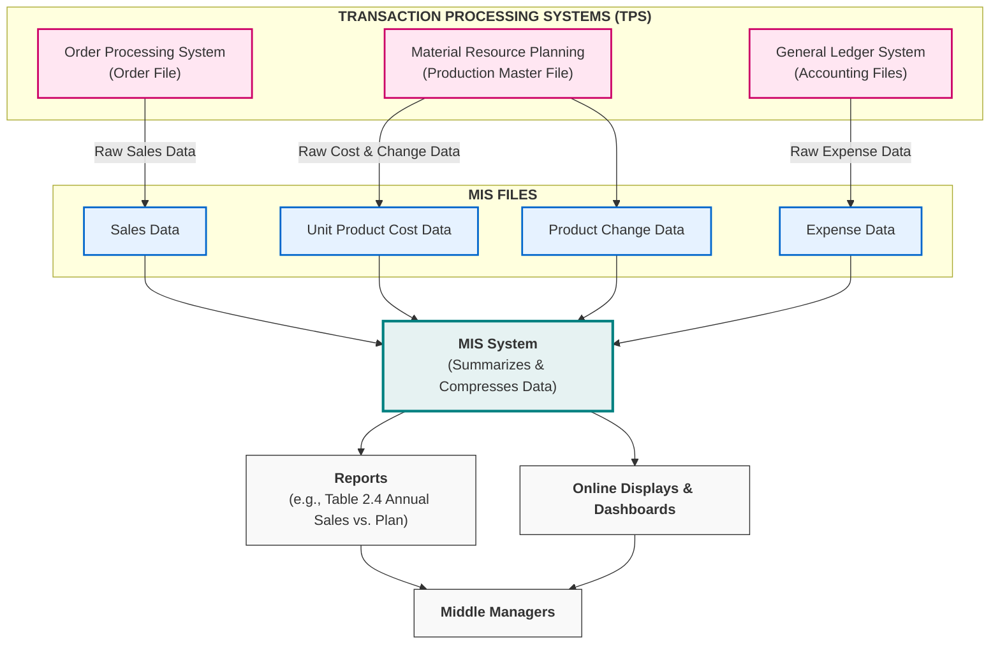
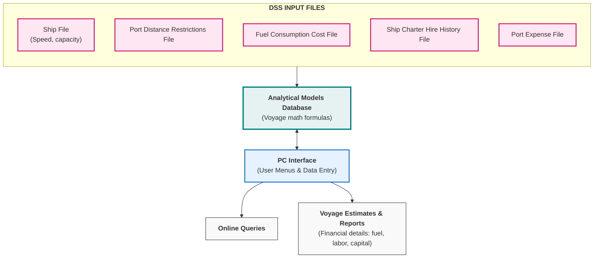
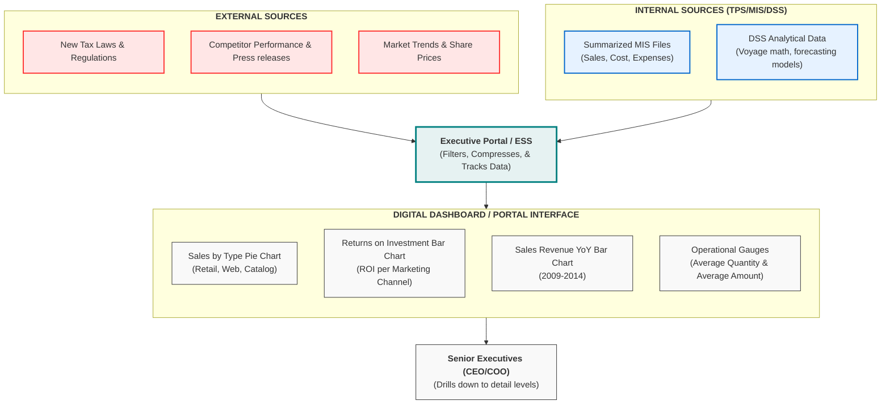
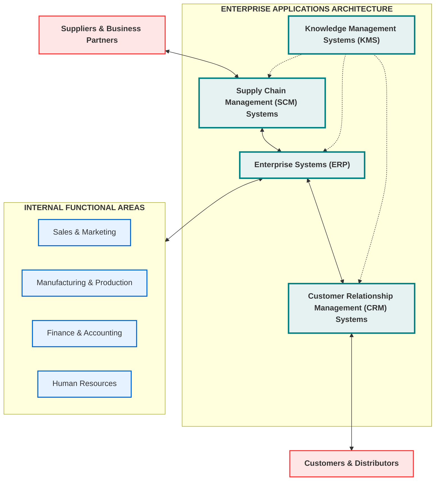
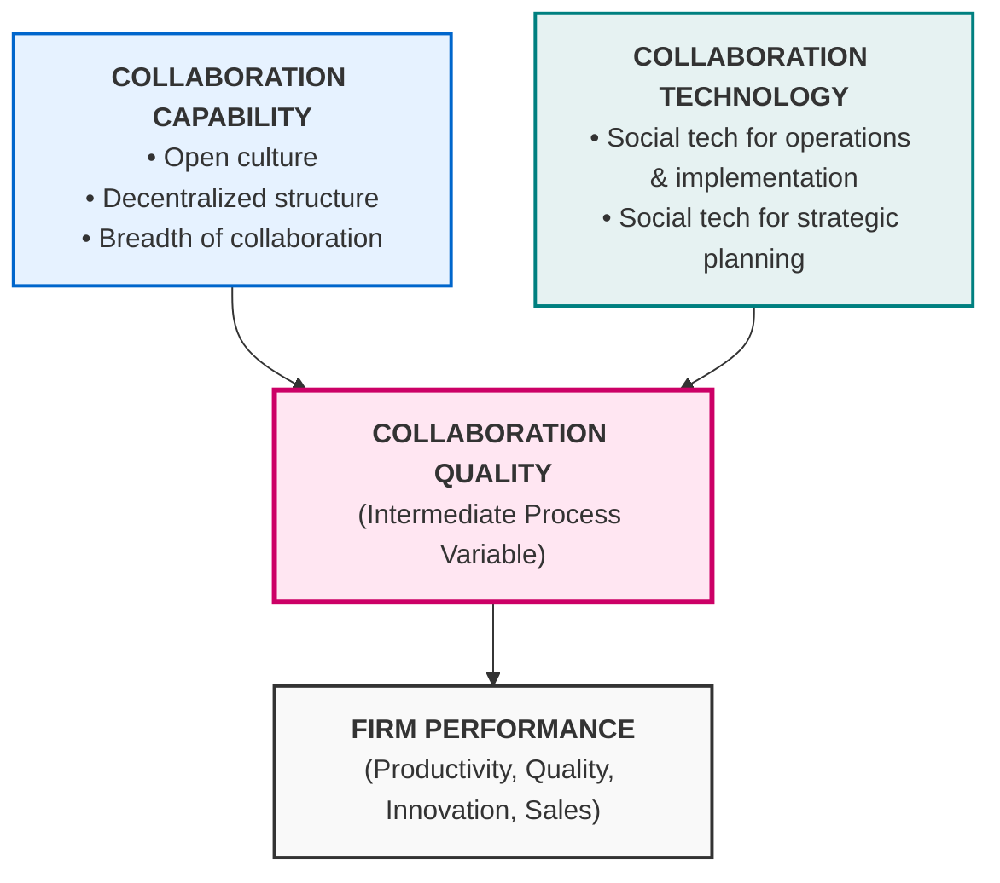
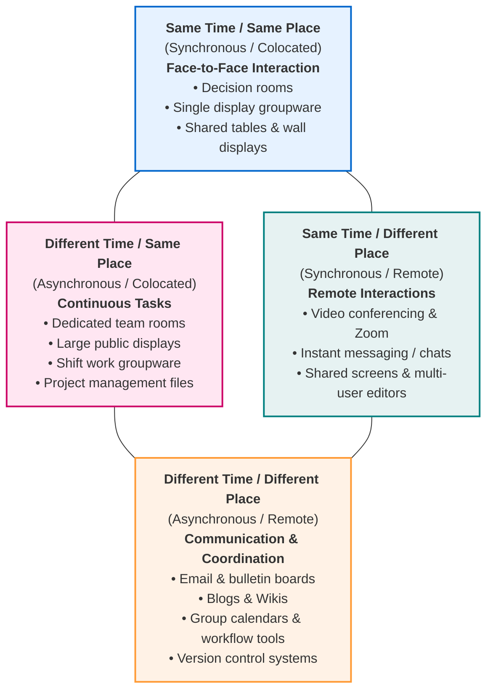
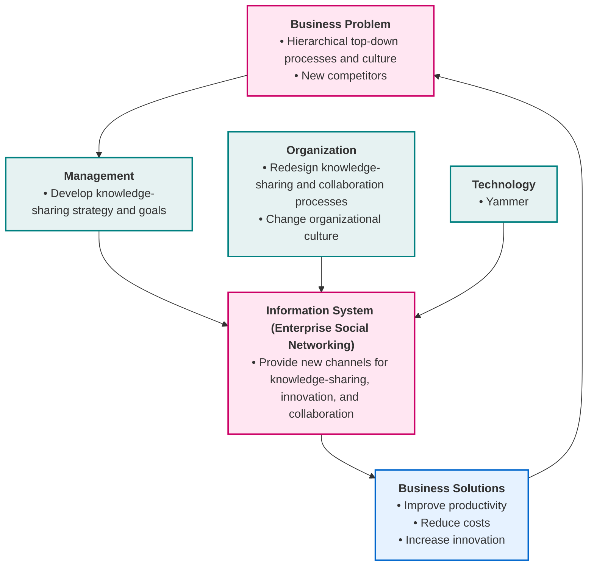

# Chapter 2: Global E-business and Collaboration

## Learning Objectives
After reading this chapter, you will be able to answer the following questions:

1. **2-1** What are business processes? How are they related to information systems?
2. **2-2** How do systems serve the different management groups in a business, and how do systems that link the enterprise improve organizational performance?
3. **2-3** Why are systems for collaboration and social business so important, and what technologies do they use?
4. **2-4** What is the role of the information systems function in a business?
5. **2-5** How will MIS help my career?

---

## Chapter & Video Cases

### Chapter Cases
* **Enterprise Social Networking Transforms Sharp Corporation into a More Innovative Connected Organization** (Detailed below)
* **The City of Mississauga Goes Digital**
* **Quality Videoconferencing: Something for Every Budget**
* **Is Social Business Good Business?**

### Video Cases
* **IS in Action: VisionX Lighting Grows with Business One**
* **CEMEX: Becoming a Social Business**

---

## 2-1: Business Processes and Information Systems

### What are Business Processes?
* **Definition:** The unique ways in which organizations coordinate work, information, and knowledge. They are a collection of activities required to produce a valuable product or service.
* **Flows:** Supported by flows of materials, information, and knowledge among participants.
* **Competitive Strength vs. Strategic Liability:**
  * **Asset:** If processes enable the firm to execute better, innovate, and adapt faster than competitors.
  * **Liability:** If based on outdated, inefficient workflows that slow down organizational responsiveness.

### Examples of Functional Business Processes (Table 2.1)
Most business processes are tied to specific functional departments:

| Functional Area | Typical Business Processes |
| :--- | :--- |
| **Manufacturing & Production** | • Assembling the physical product • Quality control testing • Generating bills of materials |
| **Sales & Marketing** | • Identifying customers • Creating product awareness • Selling the product |
| **Finance & Accounting** | • Paying creditors and managing cash accounts • Creating financial statements |
| **Human Resources** | • Hiring and onboarding employees • Evaluating job performance • Enrolling staff in benefits plans |

### Cross-Functional Business Processes
Many complex business processes cross multiple functional boundaries, requiring tight coordination among different departments. A prime example is **Order Fulfillment**.

#### Order Fulfillment Process Flowchart (Figure 2.1)

### Explanatory Breakdown of the Flowchart
The process of fulfilling a customer order is a multi-step workflow requiring close coordination across three main departments:
1. **Sales Department:** 
   * **Step 1 (Generate Order):** The sales team collects customer order details.
   * **Step 2 (Submit Order):** The completed order is submitted into the system, initiating the cross-functional flow.
2. **Accounting Department:**
   * **Step 3 (Check Credit):** Receives the submitted order to verify credit status or payment confirmation.
   * **Step 4 (Approve Credit):** Approves the credit check. If credit is cleared, it triggers the manufacturing process.
   * **Step 5 (Generate Invoice):** Generates the bill or invoice for billing.
3. **Manufacturing & Production:**
   * **Step 6 (Assemble Product):** Pulls materials from inventory and assembles the product.
   * **Step 7 (Ship Product):** Coordinates logistics (often with delivery partners like UPS/FedEx) to ship the physical product, notifying the customer and sales team.

> [!IMPORTANT]
> **Role of Information Systems:** Fulfilling a customer order requires that data flows rapidly within the firm from one decision maker to another, as well as outward to business partners and customers. Computer-based information systems act as the bridge that makes this rapid cross-functional coordination possible.

### How Information Technology Improves Business Processes
Information systems improve business processes in several fundamental ways:
* **Automation of Manual Processes:** Automates historically manual, paper-heavy tasks such as credit checks, invoice generation, and shipping order processing.
* **Information Flow Optimization:** Streamlines the flow of data, enabling more employees to access, edit, and share information simultaneously.
* **Parallel Execution:** Replaces slow, sequential tasks with tasks that can be performed concurrently, eliminating delays in decision making.
* **Enabling New Business Models:** Drives entirely new digital-first business models that were previously inconceivable (e.g., downloading Kindle e-books from Amazon, ordering computers online from Best Buy, and streaming music on Apple Music).

---

## 2-2: How Systems Serve Different Management Groups

Because there are different interests, specialties, and levels in an organization, firms use different kinds of information systems. No single system can provide all the information an organization needs.

### 1. Transaction Processing Systems (TPS)
* **Target Audience:** Operational managers and supervisors.
* **Definition:** Computerized systems that perform and record the daily routine transactions necessary to conduct business.
* **Scope of Tracking:** Elementary organizational activities and transactions (e.g., sales, receipts, cash deposits, payroll, shipping, and credit decisions).
* **Characteristics:** The decisions made at this level are highly structured, predefined, and based on fixed criteria. TPS must deliver information that is easily available, current, and highly accurate.
* **Business Centrality:** Failure of a TPS for even a few hours can halt operations and cause a firm's demise (e.g., if UPS's package tracking or an airline's computerized reservation system goes down).

#### Figure 2.2: A Payroll TPS Flowchart

### Explanatory Breakdown of the Payroll Flowchart
The payroll system is a classic example of a transaction processing system, managing structured daily employee payment events:
1. **Inputs:** The system accepts time card transaction data (employee number, name, address, hours worked, pay rate).
2. **Master Database:** The Payroll System queries the employee file database, which permanently maintains payroll history, FICA/Medicare rates, and tax withholding profiles.
3. **Core Processing Engine:** The system calculates gross pay, tax deductions, and net pay, updating the master file with year-to-date (YTD) earnings.
4. **Outputs:** The system generates five critical outputs:
   * *General Ledger:* Feeds consolidated cost data to the company's central financial ledger.
   * *Management Reports:* Supplies operational data to managers monitoring payroll expenses.
   * *Government Agencies:* Sends tax data to agencies like the IRS and Social Security Administration.
   * *Employee Paychecks:* Issues physical or electronic payroll disbursements.
   * *Online Queries:* Enables instant, interactive inquiries for checking payment status.

### 2. Systems for Business Intelligence
Firms also deploy **business intelligence (BI)** systems, which are software and data tools for organizing, analyzing, and providing access to data to help managers make more informed decisions.
* **Management Information Systems (MIS):**
  * **Target Audience:** Middle management.
  * **Role:** Focuses on monitoring, controlling, and administrative activities.
  * **Data Source & Flow:** Summarizes and reports on basic operations using data supplied by Transaction Processing Systems (TPS).
  * **Characteristics:** MIS typically answer routine questions specified in advance. They have a predefined procedure, are relatively inflexible, and rely on simple routines (summaries and comparisons) rather than complex math or statistical models.

#### Figure 2.3: Data Flow from TPS to MIS

#### Explanatory Breakdown of the TPS-to-MIS Data Flow
1. **TPS Data Collection (Inputs):** Three distinct Transaction Processing Systems (Order Processing, Material Resource Planning, and General Ledger) perform daily activities and store raw transaction logs in separate databases (Order file, Production master, Accounting files).
2. **Data Extraction & Storage (MIS Files):** Periodically (e.g., end of day/month), raw transaction logs are extracted and categorized into structured MIS files: *Sales data, Unit product cost data, Product change data,* and *Expense data*.
3. **MIS Core Processing (Compression):** The MIS engine pulls data from the MIS files, compresses the raw transactions using simple routines (summarizing, averaging, and comparing), and structures the data.
4. **Outputs:** The system generates structured annual reports (such as the *Table 2.4 Sales by Product/Region report*) and online interactive dashboards.
5. **Audience:** Middle managers use these reports to monitor performance against planned targets, track costs, and make routine decisions.

---

### 3. Decision-Support Systems (DSS)
* **Target Audience:** Middle managers, business analysts, and "super-users".
* **Role:** Supports **nonroutine** decision making. Focuses on unique, rapidly changing problems where the solution procedure is not predefined.
* **Characteristics:** Highly flexible with strong analytical capabilities. Focuses on mathematical modeling and data simulations (e.g., *"What-if"* scenarios).
* **Data Sources:** Uses internal data from TPS and MIS, but frequently integrates **external information** (e.g., current stock prices, market trends, or competitor pricing).
* **Types of DSS:**
  * *Model-driven DSS:* Relies heavily on mathematical models to calculate scenarios (e.g., the *Voyage-Estimating DSS*).
  * *Data-driven DSS:* Focuses on analyzing very large pools of customer data (e.g., ski resorts analyzing lodging, equipment rental, and pass data to build marketing programs).

#### Figure 2.5: Voyage-Estimating Decision-Support System

#### Explanatory Breakdown of the Voyage-Estimating DSS Diagram
1. **Inputs (DSS Files):** The system relies on five specialized database files: *Ship characteristics* (speed/capacity), *Port distances/restrictions*, *Fuel consumption costs*, *Charter hire history*, and *Port expenses*.
2. **Analytical Models Database:** Contains mathematical formulas representing voyage variables (e.g., calculating travel time, fuel burn, freight rates, and labor expenses).
3. **PC Interface:** The manager enters cargo requirements, delivery schedules, and freight rates through a menu-driven program on a PC. The PC queries the analytical database to run calculations.
4. **Outputs:** The system generates voyage estimates (predicting profitability, optimal speeds, and loading patterns) and supports online queries, allowing the manager to adjust variables in real-time to find the most profitable vessel assignment.

---

### 4. Executive Support Systems (ESS)
* **Target Audience:** Senior management (executives).
* **Role:** Supports **nonroutine** decision making requiring judgment, evaluation, and insight (where there is no agreed-upon procedure for arriving at a solution).
* **Scope:** Focuses on strategic issues and long-term trends (both internal operations and the external environment).
* **Data Sources:** Incorporates external data (e.g., new tax laws, regulations, competitor activity) and draws summarized, compressed info from internal MIS and DSS.
* **Delivery & Interface:**
  * **Portals:** Web interfaces that present integrated, personalized business content.
  * **Digital Dashboards:** Single-screen visual displays of graphs, charts, and key performance indicators (KPIs) to help executives quickly spot areas requiring attention.
  * **Drill-Down Capability:** Allows executives to start at high-level summary charts and click through to retrieve progressively finer levels of operational detail.
* **Real-World Example:** *Valero Refining Dashboard.* Plant managers and the COO use a digital dashboard to display plant reliability, inventory, safety, and energy consumption. Executives review U.S. and Canadian refinery performance compared to planned targets and can drill down from the executive overview level down to the individual plant or system-operator level.

#### Figure 2.4: Executive Support System (ESS) Data Flow & Portal Interface

#### Explanatory Breakdown of the ESS Flowchart & Dashboard Interface
1. **Diverse Data Inputs:** The ESS gathers data from both **External Sources** (regulatory changes, competitor press releases, market pricing) and **Internal Sources** (summarized logs from Transaction Processing Systems, performance metrics from Management Information Systems, and simulation models from Decision-Support Systems).
2. **Filtering & Compression:** The ESS portal filters out noise, compresses massive data volumes, and tracks Key Performance Indicators (KPIs) to display only what is of greatest importance to senior executives.
3. **The Digital Dashboard Interface:** Presents the summarized data on a single, easy-to-read web screen:
   * *Sales by Type:* Shows a pie chart of sales distribution (e.g. Web sales vs. Retail chains) to evaluate channel performance.
   * *Returns on Investment (ROI):* Displays a horizontal bar chart comparing the dollar returns across marketing channels (e.g. email marketing vs. display ads) to guide advertising spend.
   * *Sales Revenue:* A year-over-year bar chart to track long-term growth trends.
   * *Operational Gauges:* Visually represents real-time operational thresholds (similar to a speedometer) for tracking average quantities and transaction amounts.
4. **Drill-Down Action:** Executive users (like the CEO or COO) review the visual gauges. If a metric indicates a problem (e.g., revenue drop in a specific area), they can click the graphic to "drill down" into the raw data, viewing plant-level or employee-level transaction logs to locate the root cause.

---

## Systems for Linking the Enterprise (Enterprise Applications)

Getting all the different kinds of systems in a company to work together is a major challenge due to organizational growth and acquisitions. To solve this, companies implement **enterprise applications**, which are systems that span functional areas, focus on executing business processes across the entire firm, and include all levels of management.

### The Four Major Enterprise Applications

1. **Enterprise Systems (ERP - Enterprise Resource Planning):**
   * **Role:** Integrates key business processes (Manufacturing/Production, Finance/Accounting, Sales/Marketing, and Human Resources) into a single unified software system.
   * **Data Flow:** Replaces fragmented databases with a single, comprehensive data repository.
   * *Example:* A customer placing an order triggers warehouse picking, factory inventory replenishment, accounts receivable invoicing, and customer service tracking automatically.

2. **Supply Chain Management (SCM) Systems:**
   * **Role:** Helps manage relationships with suppliers, purchasing firms, distributors, and logistics providers.
   * **Mechanism:** Shares information about orders, production schedules, inventory levels, and delivery status to source, produce, and deliver goods/services efficiently.
   * **Classification:** An **interorganizational system** because it automates information flow across organizational boundaries.

3. **Customer Relationship Management (CRM) Systems:**
   * **Role:** Helps manage customer relationships across sales, marketing, and service departments.
   * **Objective:** Optimizes revenue, customer satisfaction, and customer retention by identifying, attracting, and retaining the most profitable customers.

4. **Knowledge Management Systems (KMS):**
   * **Role:** Enables organizations to better manage processes for capturing and applying corporate knowledge and expertise.
   * **Objective:** Collects internal knowledge and experience, making it accessible wherever/whenever it is needed to improve business processes and management decisions.

---

### Alternative Integration Tools
* **Intranets:** Internal company websites that are accessible only by employees. They use Internet technologies to distribute corporate info internally.
* **Extranets:** Private company websites made accessible to authorized vendors, suppliers, and customers to coordinate joint projects, orders, or distribution.
* **Real-World Example:** *Six Flags.* Operates 18 theme parks across North America.
  * **Intranet:** Used by 1,900 full-time employees to retrieve park news and day-to-day operational details (e.g., weather forecasts, performance schedules, VIP guest arrivals).
  * **Extranet:** Used to broadcast scheduling changes and park events to their 30,000 seasonal employees.

---

### Figure 2.6: Enterprise Application Architecture

The following diagram illustrates how the four enterprise applications span the functional areas of the business and link the internal organization to external partners.

#### Explanatory Breakdown of the Enterprise Application Architecture Diagram
* **Functional Areas Base:** The four foundational functional departments—*Sales & Marketing, Manufacturing & Production, Finance & Accounting,* and *Human Resources*—represent the operational pillars of the company.
* **The ERP Core:** **Enterprise Systems (ERP)** sit at the center of the architecture, directly intersecting all internal functional departments. It integrates their business processes and stores their data in a single comprehensive repository so all departments operate on the same data.
* **Supply Chain Management (SCM):** SCM systems overlap with ERP and extend outward to link the company's internal manufacturing/planning systems directly to **Suppliers and Business Partners**. This automates purchasing and production coordination.
* **Customer Relationship Management (CRM):** CRM systems overlap with ERP and extend outward to link the company's internal sales/marketing systems directly to **Customers and Distributors**, streamlining order tracking and customer service.
* **Knowledge Management Systems (KMS):** KMS acts as a supporting layer across all processes, collecting knowledge assets and best practices from all internal systems and external sources to feed back into decision-making.

---

## E-business, E-commerce, and E-government

The technologies used in enterprise applications are transforming relationships with customers, suppliers, employees, and public-sector institutions.

* **Electronic Business (E-business):** The use of digital technology and the Internet to execute the major business processes in the enterprise. It encompasses internal management workflows and cross-organization coordination with suppliers/business partners.
* **Electronic Commerce (E-commerce):** The subset of e-business that deals with the buying and selling of goods and services over the Internet. It supports market transactions (e.g., digital advertising, online customer support, payment processing, and security).
* **E-government:** The application of the Internet and networking technologies to digitally enable relationships between government/public sector agencies and citizens, businesses, and other arms of government.

---

## 2-3: Systems for Collaboration and Social Business

### What is Collaboration?
* **Collaboration:** Working with others to achieve shared and explicit goals. It focuses on task or mission accomplishment and can be short-lived (minutes) or long-term (project duration), operating one-to-one or many-to-many.
* **Teams:** Groups within the firm with a specific assigned mission. Team members must coordinate tasks and combine their skills to achieve this mission.

### Six Reasons Why Collaboration is Crucial Today
1. **Changing Nature of Work:** Work has shifted from sequential, siloed tasks to jobs requiring close interaction. A McKinsey study estimates that **41% of the U.S. labor force** holds "interaction" jobs (where talking, emailing, presenting, and persuading are the primary value-adding activities).
2. **Growth of Professional Work:** Professional roles in the service sector require substantial education and close coordination, where each actor brings unique, specialized expertise to solve complex problems.
3. **Changing Organization of the Firm:** Traditional rigid hierarchies have shifted to collaborative groups and self-managed teams. Decision-making authority is pushed further down the organization.
4. **Changing Scope of the Firm:** Modern firms operate across multiple geographic locations. For instance, in 2020, Ford employed 199,000 people across 61 global plants, necessitating massive cross-border collaboration for design, marketing, and distribution.
5. **Emphasis on Innovation:** Innovation is a social, collaborative process. Think of tech leaders like Bill Gates or Steve Jobs, who relied on collaborative groups rather than individual efforts to drive breakthrough designs.
6. **Changing Culture of Work:** Research shows that diverse, collaborative teams produce better, faster results. Business culture has shifted to support "crowdsourcing" and the "wisdom of crowds."
### What is Social Business?
* **Definition:** The use of social networking platforms (public networks like Facebook/Twitter, and internal corporate tools) to engage employees, customers, and suppliers.
* **Core Goal:** Deepen internal and external interactions to accelerate information sharing, innovation, and decision making.
* **Key Focus ("Conversations"):** Focuses on tuning into natural conversations between customers, suppliers, and employees to strengthen organizational bonds and emotional alignment.
* **Requirement:** Demands high **information transparency** (opinions and facts shared directly without management intervention).

#### Table 2.2: Applications of Social Business
Firms leverage social business applications across a wide variety of operational areas:

| Social Business Application | Description |
| :--- | :--- |
| **Social Networks** | Connect employees and partners through personal and professional profiles. |
| **Crowdsourcing** | Harness collective group knowledge to generate new ideas and product designs. |
| **Shared Workspaces** | Coordinate projects, assign tasks, and co-create digital content. |
| **Blogs and Wikis** | Publish and access corporate knowledge; share opinions and experiences. |
| **Social Commerce** | Share reviews and purchasing opinions directly on social platforms. |
| **File Sharing** | Upload, comment on, and share photos, video, audio, and documents. |
| **Social Marketing** | Interact with customers via social media and analyze customer feedback. |
| **Communities** | Discuss specialized topics in open forums to share expertise. |

### Business Benefits of Collaboration and Social Business
Research from major consulting and research firms highlights the tangible financial and operational value of collaboration:
* **Digital Advantage:** *MIT Sloan Management Review* research demonstrates that collaboration is central to how digitally advanced companies establish a competitive advantage.
* **High ROI:** A *Frost & Sullivan* global survey found that collaboration technology investments yielded organizational improvements returning **over four times the initial investment (400% ROI)**, with R&D, sales, and marketing gaining the most.
* **Productivity Gains:** The *McKinsey Global Institute* estimates that social technologies could increase the productivity of interaction workers by **20% to 25%**.

#### Table 2.3: Core Business Benefits of Collaboration

| Benefit Area | Rationale |
| :--- | :--- |
| **Productivity** | Interactive, collaborative workers capture expert knowledge and solve problems more rapidly, leading to fewer operational errors. |
| **Quality** | Collaborative teams communicate errors and implement corrective actions faster, reducing time delays in design and production. |
| **Innovation** | Working in groups drives more innovative ideas for products, services, and administrative improvements by leveraging diversity and the "wisdom of crowds." |
| **Customer Service** | Staff working together with social tools solve customer complaints and service issues faster than employees operating in isolation. |
| **Financial Performance** | As a direct result of improvements in productivity, quality, innovation, and service, collaborative firms achieve superior sales, sales growth, and overall financial performance. |

---

### Figure 2.7: Requirements for Collaboration (The Performance Loop)

The following diagram illustrates how organizational capability and collaboration technology combine to drive collaboration quality and overall firm performance.

#### Explanatory Breakdown of the Requirements for Collaboration Diagram
To achieve superior firm performance, a business cannot rely on technology alone; it must address both social and technical requirements:
1. **Collaboration Capability (Organizational/Social):** The firm must build a supportive environment characterized by an *open culture* (trust and communication), a *decentralized structure* (empowered local decision-making), and *breadth of collaboration* (connecting employees across all levels).
2. **Collaboration Technology (Technical):** The firm must deploy appropriate tools to support both *implementation/operations* (daily tasks, file sharing, workspaces) and *strategic planning* (long-term forecasting, model-driven portals).
3. **Collaboration Quality:** When capability and technology are aligned, they drive high-quality collaboration (rapid sharing of accurate data, cross-functional project execution, and quick error correction).
4. **Firm Performance:** High-quality collaboration directly translates into business value, yielding higher employee productivity, better product quality, faster innovation, improved customer service, and superior financial performance.

### Building a Collaborative Culture & Business Processes
Collaboration does not occur spontaneously in an organization; it requires active leadership to transition from legacy operational cultures to collaborative models.

| Cultural Characteristic | Command-and-Control Culture (Legacy) | Collaborative Culture (Modern) |
| :--- | :--- | :--- |
| **Decision-Making** | Strict top-down hierarchy. Top executives devise plans; lower-level workers execute them. | Decentralized and democratic. Senior management sets goals but relies on teams at all levels to execute. |
| **Middle Management** | Relays messages vertically (up and down the chain of command). | Builds, supports, coordinates, and monitors cross-functional teams. |
| **Communication Flow** | Strictly vertical. Lateral communication across groups is discouraged or funneled through bosses. | Openly horizontal and vertical. Teams communicate directly across organizational boundaries. |
| **Employee Agency** | Low agency. Workers execute orders without questioning and have no responsibility for process improvement. | High agency. Workers are expected to improve processes, suggest ideas, and share feedback. |
| **Reward Systems** | Individual-based performance metrics. Teamwork is not formally rewarded. | Team-based and individual-in-a-team performance incentives and recognition. |
### Tools and Technologies for Collaboration and Social Business
Firms deploy a variety of tools to enable team-based coordination, horizontal communication, and social business:
* **Email and Instant Messaging (IM):** The baseline communication channels. While email usage has slightly declined, instant messaging and group chats have become preferred channels for real-time interaction.
* **Wikis:** Collaborative websites that allow users to easily add, edit, and share content without programming knowledge. Useful for maintaining a centralized repository of corporate knowledge (e.g., SAP AG uses a wiki to document development information).
* **Virtual Worlds:** 3D online environments where employees participate via avatars. Companies like IBM, Cisco, and Intel use virtual worlds for remote training, interviews, and global meetings.
* **Collaboration & Social Business Platforms:**
  * *Cloud Collaboration Services:* Google Workspace online tools and documents.
  * *Enterprise Portals:* Microsoft SharePoint and IBM Notes for document storage, security, and workspaces.
  * *Enterprise Social Networks:* Salesforce Chatter, Microsoft Yammer, Facebook Workplace, and IBM Connections.
* **Virtual Meeting Systems (Videoconferencing):** High-definition video systems implemented to reduce corporate travel costs and enable remote/hybrid work. Often features **telepresence** technology—integrated audio-visual environments that make remote participants appear physically present in the room. Notable platforms include Zoom, Microsoft Teams, Google Meet, and Amazon Chime.
* **Cloud Collaboration Services:** Google Drive, Google Docs, G Suite, Microsoft OneDrive, and Dropbox provide online file storage, synchronization, and co-editing of documents/spreadsheets.
* **Microsoft SharePoint:** A browser-based collaboration and document management platform integrated with Office. Enables internal workspaces, wiki pages, document versioning, and enterprise search.
* **IBM Notes:** A collaborative software system featuring shared databases, email, messaging, calendars, and application development environments.
* **Enterprise Social Networking Tools:** Capabilities modeled on public social networks (like profiles, feeds, tagging) but tailored to corporate spaces (e.g., Salesforce Chatter, Yammer, Facebook Workplace).

#### Table 2.4: Enterprise Social Networking Capabilities

| Capability | Description |
| :--- | :--- |
| **Profiles** | Displays individual backgrounds, education, skills, interests, active projects, and team associations. |
| **Content Sharing** | Stores and manages shared files, documents, presentations, videos, and images. |
| **Feeds & Notifications** | Streams real-time announcements, status updates, and comments from individuals or groups. |
| **Groups & Workspaces** | Creates private or public team zones for project coordination and archives conversations. |
| **Tagging & Bookmarking** | Keywords applied to categorize, find, or "like" digital content. |
| **Permissions & Privacy** | Secures access to ensure sensitive information stays within designated corporate circles. |

---

### Figure 2.8: The Time/Space Collaboration and Social Tool Matrix

A core framework for selecting and evaluating collaboration software classifies tools based on when (time) and where (space) the collaborative work occurs.

#### Explanatory Breakdown of the Time/Space Matrix Flowchart
The Time/Space Matrix helps managers categorize collaboration tools into four distinct quadrants:
1. **Same Time, Same Place (Synchronous, Colocated):** Teams work together in real-time in the same room. Technology supports group interactions directly (e.g. smartboards, decision rooms, and shared tables).
2. **Different Time, Same Place (Asynchronous, Colocated):** Teams work in the same location but at different times (e.g., shift handovers). Technology centers on maintaining continuity (e.g., project management files, shift check-sheets, and shared team-room displays).
3. **Same Time, Different Place (Synchronous, Remote):** Teams are scattered geographically but must communicate in real-time. Supported by remote interactive tools (e.g., live Zoom calls, instant messaging, and co-authoring tools).
4. **Different Time, Different Place (Asynchronous, Remote):** Teams work at different times and locations (e.g., international operations). Technology coordinates workflows asynchronously (e.g., email, Wikis, group calendars, and version control).
### Checklist for Managers: Evaluating and Selecting Collaboration and Social Tools

To select the correct collaboration software for a firm within a reasonable budget and risk tolerance, managers should use a structured **six-step evaluation framework**:

1. **Locate Time/Space Challenges:** Identify the specific collaboration challenges the firm faces in terms of time and place. Determine which cells of the *Time/Space Matrix* the firm occupies (note: companies often occupy more than one cell, requiring different tools for different scenarios).
2. **Identify Available Solutions:** List available vendor products and software solutions that address the specific challenges identified within each matrix cell.
3. **Analyze Cost-Benefit Profiles:** Evaluate each candidate product in terms of its purchase costs, implementation expenses, benefits, and required user training costs (including IT support overhead).
4. **Evaluate Security and Vendor Risks:** Identify security and vulnerability risks associated with each product. Assess:
   * *Is the firm willing to hand over proprietary information to third-party cloud hosts?*
   * *What are the financial risks of the vendor? Will they be operating in 3–5 years?*
   * *What is the cost/difficulty of switching vendors if the product fails?*
5. **Assess Usability and Training Issues:** Engage potential end-users to test candidates, identify adoption hurdles, and estimate the learning curve for different products.
6. **Select Candidates and Host Presentations:** Select a final shortlist of candidate tools and invite the vendors to give presentations and demonstrations to the selection team.

---

## 2-4: The Role of the Information Systems Function in a Business

Managing a firm's technology infrastructure requires a specialized **information systems function**.

### The Information Systems Department
The formal organizational unit responsible for IT services. It maintains the hardware, software, data storage, and networks comprising the firm's IT infrastructure.

#### Technical Specialists
* **Programmers:** Write the software instructions for computer processors.
* **Systems Analysts:** Act as the principal liaisons between the IT group and the rest of the organization, translating business problems and requirements into technology requirements and systems.
* **Information Systems Managers:** Leaders of programmers, analysts, project managers, database specialists, and physical facility operators.

#### C-Suite & Executive IT Roles
* **Chief Information Officer (CIO):** Senior manager who oversees the firm's strategic use of IT. Integrates technology directly into the business strategy.
* **Chief Security Officer (CSO):** Responsible for information security policies, educating users, threat tracking, and tool maintenance (separate from physical security).
* **Chief Privacy Officer (CPO):** Ensures compliance with data privacy laws and safeguards personal employee/customer data.
* **Chief Knowledge Officer (CKO):** Oversees the firm’s knowledge management program, sourcing and sharing organizational expertise.
* **Chief Data Officer (CDO):** Manages enterprise-wide data governance and utility to maximize the business value of corporate data.

* **End Users:** Representatives of departments outside the IT group for whom applications are built. They play an active role in design and testing.

### Role Transformation: From Back-Office to Change Agent
* **Legacy Function:** Early IT departments were composed primarily of programmers carrying out specialized, narrow technical tasks.
* **Modern Function:** Today, the IT department acts as a **powerful change agent** that suggests new business strategies, develops digital products, and coordinates organizational change.
* **Occupational Shifts:** IT roles (such as security analysts, data scientists, and cloud engineers) are growing rapidly (projected 12% growth). Conversely, traditional computer programmer demand has declined due to cloud software services and offshore outsourcing.

### IT Governance
**IT governance** represents the framework and policies governing the strategic use of information technology. It specifies:
* *Decision rights:* Who has authority to make technology investments.
* *Accountability:* Ensuring the IT function supports the firm’s strategic objectives and delivers measurable returns on investment (ROI).
* *Structure:* The degree of centralization vs. decentralization of the IT department.

---

## Key Terms Glossary

1. **Business Intelligence (BI):** Software and data tools for organizing, analyzing, and providing access to data to help managers and enterprise users make more informed decisions.
2. **Chief Data Officer (CDO):** Executive responsible for enterprise-wide data governance, quality, and utilization to maximize the business value of corporate data assets.
3. **Chief Information Officer (CIO):** Senior C-suite manager who oversees the firm's overall use of information technology and aligns IT strategy with business goals.
4. **Chief Knowledge Officer (CKO):** Executive responsible for the firm's knowledge management program, helping design systems to capture and share organizational expertise.
5. **Chief Privacy Officer (CPO):** Executive responsible for ensuring compliance with data privacy laws and safeguarding customer and employee personal data.
6. **Chief Security Officer (CSO):** Executive responsible for overall information systems security policy, threat mitigation, and security training (sometimes called CISO).
7. **Collaboration:** Working with others to achieve shared, explicit, and mutually understood goals, focusing on task or mission accomplishment.
8. **Customer Relationship Management (CRM) Systems:** Enterprise applications that coordinate business processes in sales, marketing, and service to optimize customer satisfaction, retention, and revenue.
9. **Decision-Support Systems (DSS):** Business intelligence tools that support nonroutine decision-making for middle managers and analysts using analytical models and interactive data.
10. **Digital Dashboard:** A single-screen graphic interface displaying key performance indicators (KPIs) and operational metrics to support real-time decision-making.
11. **Electronic Business (E-business):** The use of digital technology and the Internet to execute major business processes, including internal management and collaboration with suppliers/partners.
12. **Electronic Commerce (E-commerce):** The subset of e-business dealing with the buying and selling of goods/services over the Internet, including supporting activities like marketing and payment.
13. **E-government:** The application of Internet and networking technologies to digitally enable relationships between public sector agencies and citizens, businesses, or other government bodies.
14. **End Users:** Representatives of departments outside the information systems group for whom applications are developed and who use systems in their daily tasks.
15. **Enterprise Applications:** Systems that span functional areas, focus on executing business processes across the entire firm, and include all levels of management.
16. **Enterprise Systems:** Also known as **Enterprise Resource Planning (ERP)** systems; integrated software suites that combine data from manufacturing, finance, sales, and HR into a single database.
17. **Executive Support Systems (ESS):** Information systems serving senior executives that support nonroutine strategic decisions using visual portals, dashboards, and drill-down analytics.
18. **Information Systems Department:** The formal organizational unit responsible for IT services, maintaining hardware, software, data storage, and networks.
19. **Information Systems Managers:** Leaders of technical teams consisting of programmers, systems analysts, project managers, and database specialists.
20. **Interorganizational System:** Information systems that automate the flow of information across organizational boundaries, linking a company to its suppliers, distributors, or customers (e.g., SCM systems).
21. **IT Governance:** The strategic framework, policies, decision rights, and accountability structures designed to ensure IT investments align with and support business objectives.
22. **Knowledge Management Systems (KMS):** Systems that enable organizations to capture, store, distribute, and apply corporate knowledge and expertise to improve processes and decisions.
23. **Management Information Systems (MIS):** Specific category of information systems serving middle management, summarizing basic transaction-level operations (TPS) into scheduled performance reports.
24. **Portal:** Web-based interface that presents integrated, personalized business content from multiple sources to users or executives.
25. **Programmers:** Highly trained technical specialists who write software instructions for computers.
26. **Social Business:** The use of social networking platforms (both public and internal corporate tools) to deepen interaction, information sharing, and collaboration among employees, customers, and suppliers.
27. **Supply Chain Management (SCM) Systems:** Enterprise applications that automate information flow between a firm and its suppliers to optimize product sourcing, manufacturing, and distribution.
28. **Systems Analysts:** IT specialists who act as primary liaisons between the technical systems groups and the rest of the business, translating requirements into systems specifications.
29. **Teams:** Groups of employees with a specific, assigned mission who must collaborate and coordinate tasks to achieve their objectives.
30. **Telepresence:** High-end videoconferencing technology that integrates audio-visual feeds to give remote participants the physical appearance of being in the same room.
31. **Transaction Processing Systems (TPS):** Basic computerized systems that perform and record the daily routine transactions necessary to conduct business (e.g., payroll, sales order entry).

---

## Case Study: Enterprise Social Networking Transforms Sharp Corporation

### Background & Corporate Profile
* **Profile:** Sharp Corporation is a major Japanese multinational manufacturer and seller of telecommunications equipment, consumer/industrial electronics, LCD displays, printing devices, calculators, and sensors. 
* **Acquisition & Size:** Acquired as a subsidiary of Taiwan-based Foxconn Group in 2016, employing over 52,000 people globally.

### The Business Challenge: Structural & Cultural Inefficiencies
* **Financial Strain:** Sharp faced severe financial trouble due to aggressive pricing and competition from other Asian consumer electronics manufacturers.
* **Profit Margins:** Its core electronic manufacturing service operated on razor-thin profit margins.
* **Cultural Obstacles:** 
  * Historically, Sharp operated under a rigid, top-down decision-making structure where directives flowed strictly downward.
  * To survive, management realized they needed to diversify their business portfolio and radically reorganize both business processes and corporate culture.
  * The firm needed to shift to an organizational culture of **two-way dialogue** where lower-level employees could share feedback, collaborate freely, and play leadership roles.

### The Solution: Microsoft Yammer
Sharp deployed **Microsoft Yammer** to establish an internal enterprise social network.
* **Collaborative Capabilities:** Enables staff to create project-specific groups, share and edit documents, coordinate workflows, and read central news feeds.
* **People Directory:** Provides a searchable, organization-wide database detailing employee contact info, specific skills, and area-level expertise.
* **Integration:** Seamlessly connects with Microsoft SharePoint (document management) and Office 365 desktop productivity apps.

### Implementation and Adoption Outcomes
* **Phased Rollout:** Sharp launched a voluntary pilot program in February 2013.
* **Adoption Rates:** Within months, the platform gained over 6,000 active adopters, quickly surpassing 10,000 users. Management planned domestic Japanese expansion followed by overseas offices.
* **Cultural Transformation:**
  * **Open Dialogue:** Significantly improved the vertical flow of information between executive management and rank-and-file workers.
  * **Cross-Departmental Synergy:** Smartphone developers share feedback on user interfaces, and employees learn about active projects in other business units.
  * **Crowdsourced Innovation:** Department leaders use Yammer to solicit ideas from staff on implementing new technology, incorporating the feedback directly into product development and corporate policies.

---

## Case Study Flow Diagram

The following diagram illustrates how the business problem, management strategies, organizational realignment, and technology interact to establish an enterprise social network and deliver business solutions.

### Explanatory Breakdown of the Diagram

* **Business Problem:** Sharp faced two major pressures: rigid hierarchical top-down processes and culture that stifled employee collaboration, and aggressive new competitors that threatened its market share. This limited their ability to develop leading-edge products and maintain profit margins.
* **The Inputs (Management, Organization, and Technology):**
  * **Management:** Set strategic goals and developed a knowledge-sharing strategy to democratize information.
  * **Organization:** Realigned daily operations by redesigning collaboration workflows and committing to a culture of open, two-way dialog instead of top-down directives.
  * **Technology:** Selected and deployed *Microsoft Yammer* as the core software platform to enable this shift.
* **Information System (Enterprise Social Networking):** Yammer acted as the enabling system, providing new social channels for knowledge-sharing, cross-functional collaboration, and bottom-up innovation.
* **Business Solutions:** By combining technology with organizational change, Sharp successfully improved operational productivity, reduced cost overheads, and increased its capacity for innovation to remain competitive.

> [!IMPORTANT]
> **Key Takeaway:** Deploying new technology alone (Yammer) would not have solved Sharp's challenges. The project succeeded because management paired the technology with a deep transformation of business processes and corporate culture to support collaborative work.

---

## Case Study: The City of Mississauga Goes Digital

### Profile & Background
* **Profile:** Mississauga is a suburb of Toronto and Canada's sixth-largest city.
* **Core Goal:** To integrate digital technology into operations and strategic/business planning using a structured *Smart City Master Plan*.
* **Social Objective:** Bridge the "digital divide" to make technology available for everyone, specifically supporting startups, schools, and low-income families/households at risk.

### Technologies Implemented & Operational Roles
1. **Public Sector Network (PSN):** Canada's largest municipally owned high-speed fiber optic network.
2. **Cisco Canada Public Wi-Fi:** Provides free Wi-Fi across libraries, community centers, arenas, and parks.
3. **Advanced Traffic Management System (ATMS):** Connects 700 traffic intersections via fiber and wireless networks.
4. **Rogers Cellular & Onboard Sensors:** Tracks 600 buses to transmit real-time location data, monitor engine telemetry, and plan maintenance schedules.
5. **BYOD & Mobile Field Apps:** Equips snowplow operators and field maintenance workers with real-time route details, salt-spreading rates, and blade-action tracking.
6. **Co-working Hubs & Mobility Kits:** Replaced desktop PCs with mobile laptops and created 100 co-working hubs. Distributed 500 mobility kits (connected laptops) to low-income residents.
7. **"Connects" Terminals:** Planned 500 voice-supported public screens with free Wi-Fi at bus stops, malls, and parks.

---

## City of Mississauga Case Study Questions & Answers

### Q1: Describe the problems the City of Mississauga hoped to address using digital technology.
* **Operational Inefficiencies:** Excessive paper use, slow municipal workflows, and high travel/fuel costs from staff traveling to face-to-face meetings.
* **Lack of Real-Time Information:** City planners lacked real-time route data for transit buses and snowplows, leading to service delays and suboptimal maintenance planning.
* **The Digital Divide:** A noticeable increase in low-income families and households at risk who lacked internet access, computing devices, and opportunities to participate in the digital economy.
* **Traditional Office Rigidities:** Static desk setups that hindered staff flexibility, cross-departmental collaboration, and the city's ability to recruit younger technology talent.

### Q2: What technologies did Mississauga employ for a solution? Describe each of these technologies and the role each played in a solution.
* **Public Sector Network (PSN) & Cisco Wi-Fi:** The high-speed fiber backbone and community-wide Wi-Fi nodes. Role: Served as the digital infrastructure to transmit massive data volumes and provided over 8 million hours of free internet to citizens.
* **Advanced Traffic Management System (ATMS):** Role: Connected 700 traffic intersections to optimize traffic light sequences and reduce city congestion.
* **Rogers Cellular Network & Bus Telemetry Sensors:** Role: Tracked bus locations in real-time, feeding live arrival times to commuters and engine health data to maintenance depots.
* **Mobile Field Applications & BYOD Policies:** Role: Allowed field staff (transit operators, snowplow drivers) to log operational data (e.g. where sand/salt was applied) in real-time.
* **Cloud Computing & Videoconferencing:** Role: Hosted public services online and allowed staff to hold remote meetings, cutting down travel costs and printing requirements.
* **Digital Co-working Hubs:** Role: Created collaborative office environments that allowed 90% of City Hall staff to work wire-free and desk-free.
* **Mobility Kits & "Connects" Portals:** Role: Distributed connected laptops to low-income residents and placed 500 voice-supported public screens in neighborhoods to bridge the digital divide.

### Q3: What management, organization, and technology issues did the City of Mississauga have to address in developing a solution?
* **Management Issues:**
  * Shifting from short-term tech fixes to a unified, long-term strategic plan (the *Smart City Master Plan*).
  * Establishing clear budgets, technology roadmaps, and key performance goals for each municipal service.
  * Facilitating change management to shift leadership from traditional desktop work to mobile operations.
* **Organization Issues:**
  * Restructuring the physical workspace at City Hall (rebuilding the 5th floor into hot-desking zones).
  * Overcoming employee resistance to BYOD and cellular tracking of vehicles/transit routes.
  * Partnering with neighboring municipalities to co-own the Public Sector Network (PSN) and negotiating service agreements with Cisco and Rogers.
* **Technology Issues:**
  * Implementing a secure high-speed fiber-optic network (PSN) and deploying wireless networks over large municipal boundaries.
  * Migrating legacy, fragmented applications into remote cloud hosting centers.
  * Selecting and integrating onboard bus sensors and ATMS interfaces.

### Q4: How did the technologies in this case improve operations and decision making at the City of Mississauga?
* **Operational Improvements:**
  * **Reduced Resource Consumption:** Shifting to paperless processes, cloud documentation, and videoconferencing cut paper and travel costs.
  * **Optimized Transit Sourcing:** Real-time bus telemetry allowed maintenance managers to pull vehicles out of service for preventative maintenance at optimal times, avoiding costly breakdowns.
  * **Real-time Field Operations:** Snowplows tracked and optimized their blade active-status and salt-spreading rates, improving road safety.
* **Decision-Making Improvements:**
  * **Data-driven Resource Allocation:** Real-time traffic data from the ATMS allowed planners to adjust signal timings.
  * **Enhanced Strategic Planning:** City managers used cloud reports to monitor budgets and technology roadmaps for each service department, shifting from reactive troubleshooting to proactive municipal planning.

---

## Case Study: Quality Videoconferencing: Something for Every Budget

### Background & System Democratization
In the past, high-quality videoconferencing was limited to the largest corporations that could afford dedicated telepresence rooms and complex network structures. Today, the technology has been democratized, allowing organizations of all sizes to utilize high-definition video tools like **Zoom** (both *Zoom Meetings* and *Zoom Rooms*).

### Real-World Applications

#### 1. Nepris (Education)
* **Goal:** Austin, Texas-based service that connects classrooms with industry experts to make curriculum topics relevant.
* **Role of Video:** Experts use Zoom to share screens, conduct virtual presentations, and run live demonstrations directly for students, saving travel time and expenses.

#### 2. FCTI (ATM Networks)
* **Goal:** A leading U.S. automated teller machine (ATM) network provider, acquired by Japan's Seven Bank. Collaborates with contractors in Guadalajara, Mexico, requiring robust cross-border communication.
* **Role of Video:** Replaced unstable, legacy video call systems that suffered from dropped connections with Zoom. FCTI now hosts monthly board meetings and coordinates remote employees at airports or field sites via tablets/smartphones in high definition.

---

## Quality Videoconferencing Case Study Questions & Answers

### Q1: How do the videoconferencing tools described in this case promote collaboration and innovation?
* **Promoting Collaboration:** Videoconferencing tools establish virtual face-to-face environments that break down geographic barriers. Teams spread across borders (like FCTI’s offices in LA, Las Vegas, and Guadalajara) can interact simultaneously, share documents, and discuss metrics in real-time. Tablet and smartphone compatibility allows mobile employees (e.g., at airports) to stay connected.
* **Promoting Innovation:** In education, platforms like Nepris connect classrooms with remote industry experts who can demonstrate real-world procedures and answer student questions live. This fosters creative learning environments that would be impossible under traditional classroom structures.

### Q2: How is videoconferencing related to the business models and business strategies of the organizations described in this case?
* **Nepris Business Model & Strategy:** Nepris’s entire business model is built on providing accessible, high-value connection services between schools and corporations. Zoom serves as the core delivery engine, enabling a low-cost, scalable strategy that reaches classrooms anywhere in the world without requiring physical travel.
* **FCTI Business Model & Strategy:** As a multinational ATM provider collaborating with Mexican contractors and Japanese parent companies, FCTI's strategy centers on cross-border efficiency. High-quality videoconferencing enables them to hold secure monthly board meetings and make timely operational decisions, avoiding administrative delays.

### Q3: Describe the specific ways in which videoconferencing technology helped each of the organizations in this case.
* **Nepris:**
  * Allowed industry experts to conduct remote presentations and demonstrations without traveling.
  * Supported screen-sharing features to present complex technical curricula visually.
  * Provided high-quality video streaming that easily scaled down to accommodate classrooms with lower network bandwidth.
* **FCTI:**
  * Resolved the technical challenge of dropped connections and low-resolution feeds from legacy video services.
  * Allowed board members to conduct executive meetings remotely, maintaining continuity even during flight delays.
  * Delivered tablet and smartphone compatibility, giving remote engineers and managers instant access to operational discussions from anywhere.

### Q4: If you were a small or medium-sized business, what criteria would you use to determine whether to use Zoom videoconferencing?
* **Financial Cost and Budget:** Assess if the business needs the free version (with a 40-minute limit on meetings of 3+ people) or paid plans (starting at $14.99–$19.99/user/month), comparing this cost directly against expected savings in travel, lodging, and fuel.
* **Ease of Use and Installation:** Verify that the software is easy to install and run across various user devices (laptops, tablets, smartphones) without requiring dedicated, high-cost hardware or intensive IT support.
* **Network Reliability and Bandwidth:** Determine if the company's internet speed is sufficient to support HD video streams and if the software can scale video resolution down to prevent dropped connections for remote workers.
* **Security and Privacy Requirements:** Review the software's encryption capabilities, waiting-room controls, and access permissions, ensuring it meets security standards for hosting sensitive operational meetings.
* **Integration with Existing Tools:** Check if Zoom integrates smoothly with existing email, calendar, and document-sharing applications (such as Microsoft Office 365 or Google Workspace).

---

## Chapter 2 Review Questions & Answers

### 2-1: Business Processes and Information Systems

#### Q: Define business processes and describe the role they play in organizations.
* **Definition:** Business processes are the collection of activities required to produce a product or service. They represent the unique, concrete ways in which organizations coordinate work, information, and knowledge.
* **Role:** Business processes define how daily tasks are executed and coordinated across departments. They serve as the operational engine of the firm and can either be a source of competitive strength (if designed efficiently to enable innovation and execution) or a strategic liability (if based on outdated, slow workflows that impede responsiveness).

#### Q: Describe the relationship between information systems and business processes.
* **Enabling Flows:** Information systems make it possible for firms to manage their information, coordinate flows of material, and execute processes rapidly.
* **Automation:** They automate formerly manual, paper-intensive tasks (such as credit checks, invoice generation, or shipping orders).
* **Process Redesign:** They optimize workflows by allowing multiple departments to access and share data simultaneously, replacing slow sequential tasks with concurrent (parallel) tasks.
* **New Business Models:** They enable entirely new business processes that underpin digital-first business models (e.g. streaming music on Apple Music or purchasing e-books from Amazon).

---

### 2-2: How Systems Serve Different Management Groups

#### Q: Describe the characteristics of transaction processing systems (TPS) and the roles they play in a business.
* **Characteristics:** TPS serve operational managers by performing and recording the daily routine transactions necessary to conduct business (e.g., payroll, sales order entry, hotel reservations). They handle highly structured, predefined tasks with low ambiguity. Data must be current, accurate, and easily available.
* **Roles:** They monitor the status of internal operations and relationships with the external environment, and act as primary data providers for other systems (such as supplying transaction data to the General Ledger).

#### Q: Describe the characteristics of management information systems (MIS) and explain how MIS differ from TPS and from DSS.
* **Characteristics:** MIS serve middle management, providing reports on the firm's current performance to monitor operations and predict future trends. They are relatively inflexible, answer routine questions specified in advance, and use simple routines (summaries/comparisons) rather than advanced math models.
* **Comparison to TPS:** TPS record raw daily transaction events, whereas MIS compress and summarize raw TPS transaction records into periodic performance reports.
* **Comparison to DSS:** MIS focus on routine, structured questions using internal data, whereas DSS focus on nonroutine, unique, and rapidly changing problems, leveraging mathematical modeling and external data sources.

#### Q: Describe the characteristics of decision-support systems (DSS) and how they benefit businesses.
* **Characteristics:** DSS are interactive business intelligence systems that support middle managers and analysts in nonroutine decision-making. They feature strong analytical capabilities, utilizing mathematical models and simulations (e.g. "what-if" planning).
* **Business Benefits:** They help managers evaluate complex scenarios where the solution is not predefined (such as predicting the ROI of a delayed production schedule or calculating voyage profit estimates based on ship capacity, fuel costs, and port distances).

#### Q: Describe the characteristics of executive support systems (ESS) and explain how these systems differ from DSS.
* **Characteristics:** ESS serve senior executives, addressing nonroutine decisions that require judgment, evaluation, and insight (with no preset resolution procedure). They present consolidated, filtered graphs and KPIs from both internal and external sources (like tax regulations or competitor news) through visual portals and digital dashboards.
* **Comparison to DSS:** DSS focus on model-driven or data-driven analyses for operational/tactical middle management, while ESS focus on strategic, long-term industry trends, relying on summaries from MIS/DSS and external datasets.

#### Q: Explain how enterprise applications improve organizational performance.
* **Cross-Functional Integration:** They span multiple functional departments and organizational levels, integrating separate workflows (Sales, Production, Finance, HR) into a unified corporate system.
* **Process Coordination:** They help businesses become more flexible and productive by coordinating their processes closely, removing data silos, and focusing on resource management and customer service.

#### Q: Define enterprise systems, supply chain management systems, customer relationship management systems, and knowledge management systems and describe their business benefits.
* **Enterprise Systems (ERP):** Integrates manufacturing, finance, sales, and HR data into a single software platform. *Benefits:* Eliminates fragmented databases, ensures a single source of truth, and automates order fulfillment workflows.
* **Supply Chain Management (SCM) Systems:** An interorganizational system that shares order, inventory, and delivery data between a firm and its suppliers. *Benefits:* Optimizes sourcing and production, reduces costs, and ensures correct product delivery.
* **Customer Relationship Management (CRM) Systems:** Coordinates customer-facing processes in sales, marketing, and service. *Benefits:* Maximizes customer satisfaction, retention, and sales revenue.
* **Knowledge Management Systems (KMS):** Manages processes for capturing, storing, and sharing corporate knowledge and expertise. *Benefits:* Retains proprietary knowledge, improves employee decision-making, and links the firm to external knowledge resources.

#### Q: Explain how intranets and extranets help firms integrate information and business processes.
* **Intranets:** Private, internal company websites accessible only to employees. They serve as low-cost platforms to distribute corporate policies, training materials, and news.
* **Extranets:** Web portals that extend access to authorized suppliers, vendors, or customers. They coordinate interorganizational processes, such as enabling suppliers to view inventory levels or tracking order status.

---

### 2-3: Systems for Collaboration and Social Business

#### Q: Define collaboration and social business and explain why they have become so important in business today.
* **Collaboration:** Working with others to achieve shared and explicit goals, focusing on task or mission completion.
* **Social Business:** Using social networking platforms (internal corporate tools and public networks) to engage employees, customers, and suppliers in conversations.
* **Importance Today:** Driven by six major factors: the changing nature of work (shift to interaction-based jobs), growth of professional/service work, decentralized flat firm structures, global scale of operations, group-oriented innovation, and a culture of crowdsourced feedback.

#### Q: List and describe the business benefits of collaboration and social business.
* **Productivity:** Quick communication of expertise leads to faster problem-solving and fewer errors.
* **Quality:** Rapid error detection and faster implementation of corrective measures.
* **Innovation:** Leverages diverse perspectives and the "wisdom of crowds" to generate creative product designs.
* **Customer Service:** Social collaboration tools resolve customer complaints and support calls more effectively.
* **Financial Performance:** Directly leads to higher sales growth, market share, and profitability.

#### Q: Describe a supportive organizational culture and business processes for collaboration.
* **Open & Decentralized Culture:** Empowers teams at all levels to make decisions and encourages open, two-way horizontal dialogue instead of strict vertical communication.
* **Collaborative Reward Systems:** Performance reviews and incentives that recognize team achievements and individual contributions to teams, rather than purely individual metrics.
* **Process Realignment:** Adapting workflows so that teams are expected to collaborate on and co-author deliverables.

#### Q: List and describe the various types of collaboration and social business tools.
* **Email/IM:** Basic communication engines for real-time text exchange.
* **Wikis:** Simple websites allowing users to co-author and store knowledge.
* **Virtual Worlds:** 3D avatar-based environments for remote training and global meetings.
* **Collaboration Suites:** Google Workspace (cloud docs/drives) and SharePoint (document databases/workspaces).
* **Enterprise Social Networks:** Yammer, Salesforce Chatter, and Workplace for internal feeds, profiles, and bookmarking.
* **Virtual Meeting Systems:** HD videoconferencing software (Zoom, Teams) featuring telepresence to simulate physical meetings.

---

### 2-4: The Role of the Information Systems Function in a Business

#### Q: Describe how the information systems function supports a business.
* **Infrastructure Maintenance:** Formally manages the hardware, software, data storage, and networks.
* **Change Agent:** Modern IT departments suggest new business strategies, develop digital products, and coordinate organizational changes.

#### Q: Compare the roles played by programmers, systems analysts, information systems managers, the chief information officer (CIO), the chief security officer (CSO), the chief data officer (CDO), and the chief knowledge officer (CKO).
* **Programmers:** Technical specialists who write software code instructions.
* **Systems Analysts:** Liaisons who translate business requirements into technical system specifications.
* **Information Systems Managers:** Manage technical teams (programmers, analysts, operators).
* **Chief Information Officer (CIO):** Strategic lead aligning the IT roadmap with overall business goals.
* **Chief Security Officer (CSO):** Oversees cybersecurity policies, threat mitigation, and user safety training.
* **Chief Data Officer (CDO):** Manages enterprise-wide data governance and utility to maximize data value.
* **Chief Knowledge Officer (CKO):** Manages the firm's knowledge management program, sourcing and sharing expertise.

---
