# Chapter 3: Information Systems, Organizations, and Strategy

## Learning Objectives
* **3-1:** Which features of organizations do managers need to know about to build and use information systems successfully?
* **3-2:** What is the impact of information systems on organizations?
* **3-3:** How do Porter's competitive forces model, the value chain model, synergies, core competencies, and network economics help companies develop competitive strategies using information systems?
* **3-4:** What are the challenges posed by strategic information systems, and how should they be addressed?
* **3-5:** How will MIS help my career?

---

## 3-1: Organizations and Information Systems

Information systems and business organizations share a reciprocal, two-way relationship. Systems are designed by managers to serve the interests of the business, but the firm must also adapt its internal structures to benefit from new technology.

### Figure 3.1: The Two-Way Relationship Between Organizations and IT

The interaction between technology and organizations is not direct; it is filtered through a series of key organizational and managerial factors.

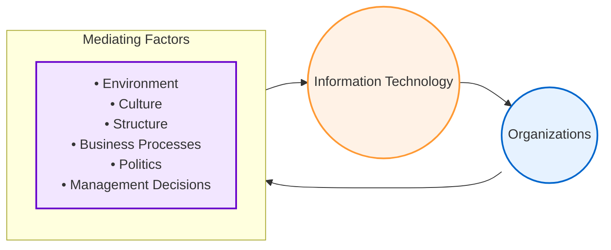

#### Explanatory Breakdown of Figure 3.1 (The Two-Way Relationship)
This flowchart demonstrates that information technology and organizations do not interact in a vacuum. Instead, their relationship is a continuous feedback loop filtered through **Mediating Factors**:
1. **Managers Make Decisions:** Managers decide which technologies to adopt based on corporate goals. However, the system's success is dependent on how the organization responds.
2. **The Mediating Filter:** 
   * **Environment:** External pressures (e.g., new laws, competitive tech like Amazon) force organizations to adopt IT.
   * **Culture:** The firm's shared values dictate how easily workers accept new systems.
   * **Structure:** A highly centralized hierarchy may implement systems differently than a flat, decentralized organization.
   * **Business Processes:** Traditional habits (Standard Operating Procedures) determine how the tech is utilized day-to-day.
   * **Politics:** Different departments compete for resources, which can lead to resistance or lobbying during system rollouts.
   * **Management Decisions:** Strategic choices direct how technology is funded, supported, and aligned.

---

### What is an Organization?

An organization is a stable, formal social structure that takes resources from the environment and processes them to produce outputs. To understand how information systems impact a business, managers must look at organizations through two distinct lenses:

#### 1. Technical Microeconomic Definition (Focus: Capital & Labor Inputs)
* **Viewpoint:** An organization is a production function that combines capital and labor (inputs from the environment) to produce goods and services (outputs to the environment).
* **Focus:** Emphasizes efficiency, production throughput, and quantitative resource substitution (e.g. replacing manual labor with database software).

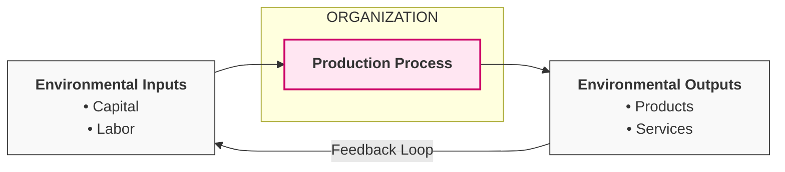

#### Explanatory Breakdown of Figure 3.2 (The Technical View)
* **Environmental Inputs:** The organization imports primary production factors—specifically **Capital** (money, equipment) and **Labor** (employee work hours)—from the external environment.
* **The Production Process (The "Black Box"):** The firm acts as an engine that combines and transforms these raw inputs using technology and machinery.
* **Environmental Outputs:** The transformed resources are released back into the environment as finished **Products** and **Services** (consumed by customers).
* **Feedback Loop:** Sales of these outputs generate revenue, returning capital to the environment and allowing the organization to purchase new inputs, starting the cycle again.
* **IT Implication:** In this view, technology is simply a factor of production that can be easily substituted for capital or labor (e.g., buying servers to reduce administrative labor costs).

#### 2. Behavioral Definition (Focus: Rights & Obligations)
* **Viewpoint:** An organization is a complex collection of rights, privileges, obligations, and responsibilities that are delicately balanced over time through negotiation and conflict resolution.
* **Focus:** Emphasizes how employees work, who controls resources, and how technological changes upset the internal social balance (requiring negotiations to avoid operational failure).

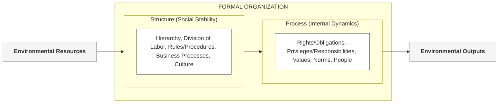

#### Explanatory Breakdown of Figure 3.3 (The Behavioral View)
* **Environmental Resource Exchange:** The organization sits between environmental inputs and outputs. It takes raw resources from the external environment, routes them through its social structures, and outputs finished goods and services.
* **The Social/Behavioral Balance:** Unlike the technical model which views the firm as an efficient machine, the behavioral model focuses on the human relations inside the organization:
  * **Customary Ways of Working:** Employees develop unwritten habits, mutual expectations, and relationships with peers, superiors, and subordinates.
  * **Informal Agreements:** Employees negotiate agreements regarding *how* work will be done, the *amount* of work to be performed, and the *conditions* of that work.
  * **The Invisible Rules:** Most of these arrangements, expectations, and emotional attachments are **not discussed in any formal rulebook**, yet they dictate daily corporate behavior.
* **IT Implication:** When managers introduce a new information system, they are not just installing a tool; they are altering this entire behavioral structure. Technology changes who owns and controls information, which disrupts these unwritten social contracts and attachments. Upsetting this delicate balance leads to political resistance, which is why behavioral alignment is critical to system adoption.

#### Comparison & Synthesis of the Two Definitions

While the technical and behavioral definitions of organizations may seem distinct, they are **not contradictory—they are complementary**:

| Dimension | Technical Microeconomic Definition | Behavioral Definition |
| :--- | :--- | :--- |
| **Primary Focus** | How inputs (capital/labor) are transformed into outputs. | Social and political dynamics inside the firm. |
| **System View** | Firm is "infinitely malleable"; IT capital easily replaces labor. | Firm is a delicate social balance of rights, privileges, and relationships. |
| **IT Implementation Role** | Seen as a direct resource substitute to increase efficiency. | Disrupts established unwritten arrangements, feelings, and authority. |
| **Strategic Utility** | Explains how *thousands of firms in competitive markets* combine IT resources. | Takes us *inside the individual firm* to see how technology affects work design. |

#### Operational Impact on IT Implementations:
* **The Implementation Lag:** Managers often face significant delays when launching new systems because there is a lag between setting up the physical technology and training users. Changing behavioral elements (customary work patterns, unwritten relational agreements with supervisors/subordinates) is highly disruptive and requires extensive time and resources.
* **Information & Power Redirection:** Implementing a new system alters who owns and controls information, who has access to update it, and who makes decisions about whom, when, and how. Since information is power, this shifts the political balance within the firm, requiring change management to resolve disputes.

### Key Features of Organizations

All modern organizations share structural and cultural characteristics that managers must understand to implement systems successfully. Organizations are **bureaucracies** built on:
* **Division of Labor & Specialization:** Clear assignments of tasks to specialized workers.
* **Hierarchy of Authority:** A vertical reporting structure where everyone is accountable to a superior and authority is clearly defined.
* **Abstract Rules & Procedures (SOPs):** Universal standards governing decision-making to maintain impartiality and routineness.
* **Merit-Based Promotion:** Hiring and advancement based on technical qualifications, not personal connections.
* **Principle of Efficiency:** A core devotion to maximizing output using minimal inputs.

---

### Routines, Business Processes, and the Firm (Figure 3.4)

All business firms are composed of nested operational layers, rising from individual tasks to the corporate entity.

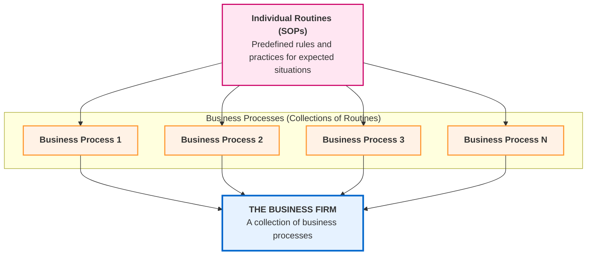

#### Explanatory Breakdown of Figure 3.4:
* **Individual Routines (Standard Operating Procedures):** The base units of operation. These are precise rules and practices developed over time to handle specific expected tasks (e.g. a receptionist gathering customer info, or a nurse preparing a patient chart).
* **Business Processes:** Mid-level structures formed by aggregating related individual routines. For example, a "patient check-in process" combines receptionist, nurse, and billing routines.
* **The Business Firm:** The highest-level entity, representing a collection of integrated business processes.
* **IT Implication:** For a new information system to deliver high performance, managers must change not just the overall company objectives, but the individual routines and business processes that make up the day-to-day operations.

---

### Organizational Politics, Culture, and Environments

Beyond structural features, organizations are governed by dynamic human and environmental forces:

#### 1. Organizational Politics
* **The Source of Conflict:** Employees occupy different specialties, hierarchical levels, and roles. Consequently, they hold divergent viewpoints on how rewards, resources, and punishments should be distributed.
* **Impact on IT:** Developing new systems represents a significant change in goals, resource allocation, and processes. Large IT investments are highly politically charged, and **political resistance** is a major obstacle to technological change. Managers who understand politics are more successful at overcoming resistance.

#### 2. Organizational Culture
* **Bedrock Assumptions:** Culture consists of unquestioned, taken-for-granted assumptions that define the organization's goals, products, and processes (e.g., in a university, that "classes follow a regular schedule").
* **Unifying vs. Restraining Force:** While culture restrains political conflict by promoting common understanding, it acts as a **powerful barrier to technological change**. Organizations will do almost anything to avoid changing core cultural assumptions. If a technology directly opposes existing culture, adoption will stall until the culture slowly adjusts.

#### 3. Organizational Environments

Organizations are open to and dependent on the social and physical environments that surround them. They draw financial/human resources from the environment and supply it with products and services.

### Figure 3.5: The Reciprocal Relationship Between Environments and Organizations

The diagram below illustrates how external environmental factors shape organizations, and how information systems serve as the lens/interface between the firm and its environment.

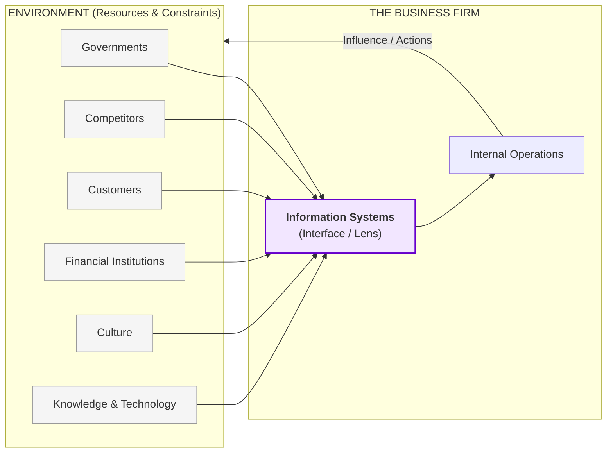

#### Explanatory Breakdown of Figure 3.5:
* **The Environment Layer:** Contains the external forces that place resources and constraints on the firm (e.g. government regulations, competitor pricing, customer tastes, available capital, and societal culture).
* **The Information Systems Interface:** Acting as a "lens" or buffer, information systems perform **environmental scanning**. They help the firm perceive external changes, gather data, and translate those signals into internal operations.
* **The Reciprocal Influence Loop:** Environments shape what firms can do, but firms also actively influence their environments (e.g. forming lobbying alliances, or running advertising campaigns to shape customer taste).
* **Organizational Inertia:** Environments generally change much faster than organizations. Standard operating procedures (SOPs), political conflicts, and cultural values create inertia, inhibiting rapid change. Consequently, only **10 percent of the Fortune 500 companies in 1919 exist today**.

---

### Disruptive Technologies: Riding the Wave

Sometimes a technology comes along that radically changes the business landscape and environment. These are called **disruptive technologies**—substitute products that perform as well or better than anything currently produced.

#### Table 3.1: Disruptive Technologies - Winners and Losers

| Technology | Description | Winners (Prospered) | Losers (Declined/Obsolete) |
| :--- | :--- | :--- | :--- |
| **Microprocessor Chips (1971)** | Thousands (now millions) of transistors placed on a single silicon chip. | Chip manufacturers (Intel, Texas Instruments) | Transistor manufacturers (GE) |
| **Personal Computers (1975)** | Small, inexpensive, fully functional desktop machines. | PC makers (HP, Apple, IBM), chip makers (Intel) | Mainframe (IBM) and minicomputer (DEC) firms |
| **World Wide Web (1989)** | A global database of digital pages/files instantly available to the public. | Owners of online content, search engines, web services | Traditional publishers (newspapers, magazines, broadcast TV) |
| **Internet Media Services (1998)** | Downloadable and streaming music, video, and TV broadcasts. | Streaming platforms, telecom infrastructure providers (AT&T, Verizon) | Physical media retailers (Blockbuster, Tower Records), content owners |
| **Software as a Service (SaaS)** | Delivering software applications remotely over the Internet. | Cloud software companies (Salesforce.com) | Traditional "boxed" software companies (Microsoft, SAP, Oracle) |

* **First Movers vs. Fast Followers:** Being the first to invent a disruptive technology does not guarantee success. First movers often lack resources to exploit the opportunity. For instance, MITS invented the first PC (Altair 8800) but failed to capitalize on it. **Fast followers** (like IBM and Microsoft) let the pioneer make initial mistakes, then entered and captured the market.

---

### Organizational Structure

All organizations have a distinct shape or structure. Henry Mintzberg classified organizations into **five basic types of organizational structure**:

#### Table 3.2: Mintzberg's Organizational Structures

| Organizational Type | Description | Examples |
| :--- | :--- | :--- |
| **Entrepreneurial Structure** | Young, small firm in a fast-changing environment. Simple structure managed by a single entrepreneur CEO. | Small start-up business |
| **Machine Bureaucracy** | Large bureaucracy in a slowly changing environment, producing standardized products. Dominated by a centralized management team. | Midsize manufacturing firm |
| **Divisionalized Bureaucracy** | Combination of multiple machine bureaucracies, each producing a different product/service, topped by a central headquarters. | *Fortune* 500 firms (e.g., General Motors) |
| **Professional Bureaucracy** | Knowledge-based organization where products/services depend on professional expertise. Weak centralized authority. | Law firms, hospitals, school systems |
| **Adhocracy** | Task force organization responding to rapidly changing environments. Short-lived multidisciplinary specialist teams. | Consulting firms (e.g., Rand Corporation) |

* **IT Alignment:** The type of information systems a business requires directly reflects its structure. A divisionalized bureaucracy needs systems to coordinate business units, while an adhocracy requires highly flexible, peer-to-peer collaboration systems.

* **How Structural Types Experience System Issues:**
  * *Professional Bureaucracy (e.g., Hospital):* Tends to suffer from fragmented, parallel patient record systems run separately by doctors, nurses, and administrators.
  * *Entrepreneurial Firm (e.g., Start-up):* Frequently relies on poorly designed systems developed in a rush that are quickly outgrown.
  * *Multidivisional Firm (e.g., Global Enterprise):* Often lacks a single integrated platform, operating isolated local or divisional systems instead.

---

### Other Organizational Features

Beyond basic structures, organizations differ along several key dimensions, all of which influence their system requirements:

* **Organizational Goals:** Organizations employ different means to achieve varied core goals:
  * *Coercive Goals:* Focus on compliance and security (e.g., prisons).
  * *Utilitarian Goals:* Focus on economic value and profit (e.g., businesses).
  * *Normative Goals:* Focus on shared values and education (e.g., universities, religious organizations).
* **Constituencies and Beneficiaries:** Different organizations serve different primary groups (e.g., members, clients, shareholders, or the general public).
* **Leadership Styles:** Ranging from democratic/collaborative models to authoritarian/top-down structures, which dictate how decisions are made and how systems are approved.
* **Tasks and Technology:**
  * *Routine Tasks:* Highly standardized workflows that can be reduced to formal rules requiring minimal judgment (e.g., auto parts manufacturing).
  * *Nonroutine Tasks:* Complex, creative workflows requiring significant judgment and cognitive analysis (e.g., strategy consulting).

---

## 3-2: The Impact of Information Systems on Organizations

Information systems have become integral, online, interactive tools deeply involved in the minute-to-minute operations and decision-making of large organizations. IT fundamentally alters organizational economics and how work is structured.

### 1. Economic Impacts & Resource Substitution

From an economic perspective, information technology changes both the relative costs of capital and the costs of information. 

* **IT as a Production Factor:** IT is a factor of production that can be substituted for traditional capital (like real estate and machinery) and labor.
* **Labor Substitution:** Because the cost of IT has declined, it is substituted for labor (which has historically risen in cost). This drives a reduction in clerical workers and middle management.
* **Capital Substitution:** As IT costs fall, it also substitutes for other expensive forms of capital (such as physical office buildings or machinery), prompting managers to increase IT investment.

---

### 2. Transaction Cost Theory

**Transaction Cost Theory** explains how firms decide whether to build products internally or buy them from the market:

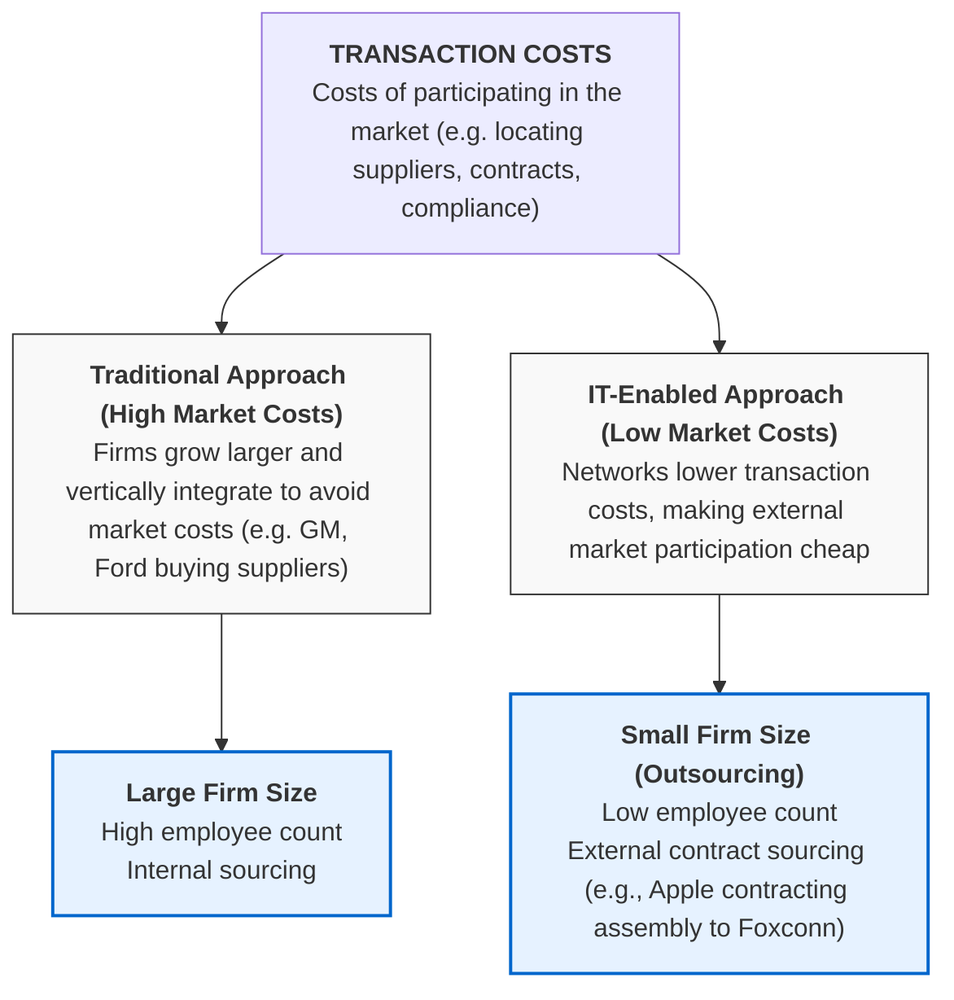

#### Explanatory Breakdown of the Transaction Cost Flowchart:
* **The Concept:** Transaction costs represent the overhead of using the marketplace (finding suppliers, negotiating prices, monitoring quality, purchasing insurance).
* **The Traditional Method:** When market costs were high, firms grew larger to handle everything internally (vertical integration). General Motors and Ford, for example, bought their own supplier and distributor networks.
* **The IT Method:** Modern networks lower market participation costs. It becomes cheaper to outsource work to specialized partners than to hire internal staff.
* **Operational Outcome:** Firms shrink in head-count (number of employees) but can maintain or grow revenues. For example, automakers (Ford, Toyota) now buy over 70% of parts from external suppliers, and Apple outsources iPhone assembly to Foxconn. Similarly, Eastman Chemical Company split from Kodak in 1994 with 24,000 employees and $3.3B in revenue; by 2019, they generated $9.3B with only 14,500 employees.

---

### 3. Agency Theory

**Agency Theory** views the firm as a "nexus of contracts" among self-interested individuals. A principal (owner) employs "agents" (employees) to do work but must supervise them to ensure they align with the firm's interests.

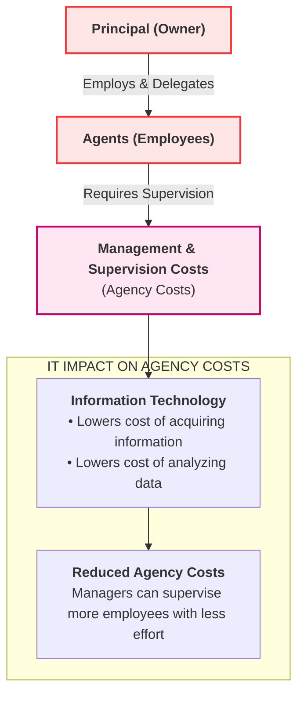

#### Explanatory Breakdown of the Agency Theory Flowchart:
* **The Relationship:** The Principal delegates authority to Agents. Because agents are self-interested, the principal must spend resources supervising them. As a firm grows, these management and coordination costs (agency costs) rise rapidly.
* **IT Impact:** Information systems lower the cost of gathering and analyzing information. 
* **Operational Outcome:** Managers can monitor a larger number of employees with less effort, expanding their span of control. This allows the firm to scale revenues while flattening the organization and reducing the need for middle management.

### 4. Organizational and Behavioral Impacts

Beyond purely economic theories, sociological and behavioral theories explain how and why organizations change when new information systems are introduced.

#### A. IT Flattens Organizations (Figure 3.6)

Information systems make it possible to flatten traditional corporate hierarchies:

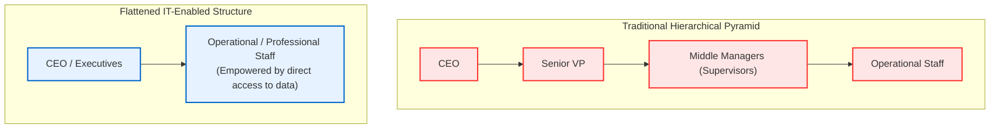

#### Explanatory Breakdown of the Flattening Process (Figure 3.6):
* **The Traditional Hierarchy:** In legacy bureaucracies, multiple layers of middle management are required to supervise subordinates, pass messages, and compile operational reports. This leads to slow decision-making and high overhead.
* **The Flattening Mechanism:** By distributing information directly to lower levels, IT empowers frontline workers to make decisions without constant supervision. Since managers now receive accurate, real-time data directly from the system, their **span of control is broadened**, allowing a small executive group to oversee a larger number of workers spread over greater distances.
* **Outcome:** Layers of middle managers are eliminated, reducing management overhead as a percentage of revenues.

#### B. Postindustrial Organizations
* **Knowledge-Based Authority:** Postindustrial theories suggest that authority relies increasingly on knowledge and competence rather than formal position. Because professional workers tend to be self-managing, decision-making becomes highly decentralized.
* **Task Force-Networked Organizations:** IT encourages temporary, virtual project teams. Groups of professionals assemble (face-to-face or electronically) for short periods to complete a specific task (e.g. designing a new automobile) and then disband.
  * *Example:* Accenture operates with nearly 500,000 employees moving between rotating client projects in more than 50 countries.
  * *Management Challenges:* Evaluating performance in temporary teams, keeping self-directed teams aligned with corporate goals, and tracking career progression in virtual environments.

---

### 5. Organizational Resistance to Change (Figure 3.7)

Information systems are bound up in organizational politics because they influence access to information—a key source of power. Consequently, new technology always meets with **organizational resistance**.

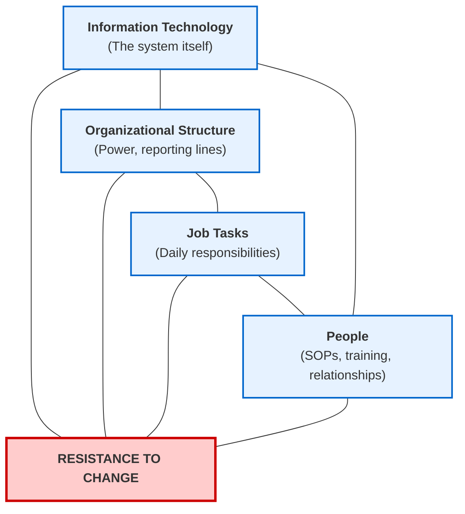

#### Explanatory Breakdown of the Resistance Model (Figure 3.7):
* **The Interconnected Components:** According to this behavioral model, an organization consists of four mutually dependent variables: **Technology**, **Structure**, **People**, and **Job Tasks**.
* **Why Resistance Occurs:** A change in *Technology* (installing a new system) automatically forces changes in *Job Tasks* (how work is done), *Structure* (who controls information), and *People* (requiring retraining and altering unwritten social contracts). If managers only change the technology but ignore the other three elements, the system will be deflected and defeated by user resistance.
* **The Implementation Strategy:** To bring about change successfully, managers must alter **all four elements simultaneously**. This is often visualized as a three-stage change management process:
  1. **Unfreeze:** Open up the organization and prepare employees for change by addressing politics and culture.
  2. **Implement:** Launch the new technology, adjust structures, retrain people, and redesign tasks.
  3. **Refreeze:** Institutionalize and lock in the new system so it becomes the new standard operating procedure.
* **Key Reason for Project Failures:** Research shows that the primary reason large IT projects fail to meet their objectives is **not the failure of the technology, but organizational and political resistance to change**. Many investments flounder and fail to produce productivity gains because managers fail to align all four components.
* **Managerial Takeaway:** As a manager overseeing future IT investments, your ability to work with people, culture, and organizational politics is **just as important as your technical knowledge**.

### 6. The Internet and Organizations

The Internet—especially the World Wide Web—has a profound impact on how firms relate to external entities and how they structure internal business processes:
* **Enhanced Information Flow:** Dramatically increases the accessibility, storage, and distribution of corporate data and expertise.
* **Cost Reductions:** Lowers both transaction and agency costs. For example:
  * *Sales Teams:* Receive instant, real-time product pricing updates via mobile devices.
  * *Suppliers/Vendors:* Access a retailer's internal site to see up-to-the-minute sales data and initiate instant inventory replenishment.
* **Process Simplification:** Rebuilding workflows around Internet technology results in simpler processes, fewer employees, and flatter hierarchies.

---

### 7. Implications for the Design and Understanding of Information Systems

To deliver real business value, information systems must be designed with a clear understanding of the specific organization. The key organizational factors managers must consider when planning a new system are:

1. **Environment:** The external conditions and market spaces in which the firm operates.
2. **Structure:** The organization's hierarchy, specialization, operational routines, and business processes.
3. **Culture & Politics:** The unquestioned assumptions, values, and political interest groups inside the firm.
4. **Leadership Style:** The style of management and decision-making (democratic vs. authoritarian).
5. **Worker Attitudes:** The principal interest groups affected by the system and the attitudes of the employees who will use it.
6. **Task Alignment:** The specific tasks, decisions, and business processes the system is intended to assist.

---

## 3-3: Competitive Strategies Using Information Systems

Firms that do better than others are said to possess a **competitive advantage**. They either have access to unique resources or utilize commonly available resources more efficiently due to superior knowledge and information assets, resulting in higher profitability and market valuations.

---

### Porter's Competitive Forces Model (Figure 3.8)

Arguably the most widely used framework for understanding competitive advantage is Michael Porter’s **Competitive Forces Model**. In this model, the destiny of a firm is determined by a continuous struggle among **five core market forces**:

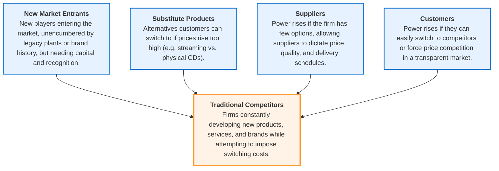

#### Explanatory Breakdown of the Porter's Competitive Forces Model:
1. **Traditional Competitors:** Existing firms in the market space. They continuously optimize production processes and introduce new products/services to capture market share and attract customers.
2. **New Market Entrants:** New companies entering the marketplace. 
   * *Barriers to Entry:* Vary widely (e.g., low for a local pizza shop, but extremely high for microprocessor fabrication due to huge capital costs).
   * *Advantages:* Not locked into legacy plants/equipment, hire younger/motivated workers, and are more agile.
   * *Weaknesses:* Lack of brand recognition, depend on outside funding, and have less experienced staff.
3. **Substitute Products and Services:** Alternative goods/services that customers can switch to if a firm’s prices rise too high (e.g., ethanol replacing gasoline, or digital music streaming substituting for physical CD stores). High availability of substitutes limits a firm's pricing power and shrinks margins.
4. **Customers:** A firm's profitability depends on attracting and retaining customers. Customer power increases if they can easily switch to a competitor, or if there is low **product differentiation** (forcing firms to compete on price alone).
5. **Suppliers:** The power of suppliers determines a firm's input costs. If a firm has few suppliers, the suppliers can raise prices and control delivery schedules, cutting the firm's profits. Having multiple competing suppliers gives the firm greater control.

#### Real-World Example: Walmart’s Continuous Replenishment System
To counter supplier and customer forces, Walmart uses a **continuous replenishment system**. Sales data captured at checkout registers is instantly transmitted directly to Walmart's suppliers. Suppliers are contractually responsible for shipping replacement inventory automatically. This minimizes warehouse storage costs, keeps shelves stocked, and lowers operational overhead, allowing Walmart to offer low prices to consumers.

### Generic Information System Strategies for Dealing with Competitive Forces

To counteract the five competitive forces, firms utilize four generic strategic positions enabled by information systems:

#### 1. Low-Cost Leadership
* **The Strategy:** Use information systems to achieve the lowest operational costs and lowest prices in the industry.
* **The Mechanism:** High-speed systems minimize inventory costs and corporate overhead. Walmart is the prime example:
  * *Efficient Customer Response System:* Directly links consumer behavior to distribution and production chains. POS terminals transmit item codes directly to suppliers, triggering automatic restocking.
  * *Overhead Metrics:* Walmart spends only 16.6% of sales revenue on overhead, compared to competitors like Sears (spending 24.9%) and the retail industry average of 20.7%.
  * *Warehouse Costs:* Because products are replenished immediately, Walmart avoids spending money maintaining large, idle inventories in warehouses.

#### 2. Product Differentiation
* **The Strategy:** Use information systems to enable new products and services, or greatly enhance customer convenience to differentiate products from competitors.
* **The Mechanism:** High-tech personalization and product features prevent competitors from copying products easily.
  * *Big Tech Examples:* Google updates Google Assistant and Google Maps continually using Machine Learning and AI to offer superior voice and location convenience.
  * *Mass Customization:* Nike utilizes its "Nike By You" online configuration portal, allowing customers to design personalized sneakers. The order is transmitted instantly to specialized computer-guided factories in China and Korea, shipping custom shoes to the customer's door within three weeks.

---

### Interactive Session: Shipping Wars Case Study

#### 1. Why is shipping so important for e-commerce? Explain your answer.
* **The Interface of E-Commerce:** In a digital economy, the shipping process is the only physical point of contact between the customer and the business. Seamless, rapid delivery forms the core customer experience.
* **Competitive Advantage:** Offering fast (next-day or two-day) and free delivery acts as a primary differentiator. A firm with superior logistics can steal customers away from traditional brick-and-mortar stores and slower online competitors.
* **The Last Mile Challenge:** The "last mile" (taking a package from a regional distribution hub to the customer's doorstep) is the most expensive and complex part of the supply chain. Mastery of last-mile delivery directly controls a firm's profitability and customer satisfaction.

#### 2. Compare the shipping strategies of Amazon, FedEx, and UPS. How are they related to each company's business model?
* **Amazon (Vertical Integration & Control):**
  * *Strategy:* Building its own insourced logistics infrastructure, including a fleet of delivery vans, cargo airplanes (Amazon Air), and massive airport hubs (e.g., its $1.5 billion Cincinnati hub).
  * *Business Model Link:* Amazon’s model relies on high-volume Prime subscriptions and rapid delivery guarantees. By insourcing logistics, Amazon reduces its reliance on third-party shippers, saves an estimated $2 to $4 per package ($2 billion annually), and gains direct control over the last-mile experience to resolve customer inquiries quickly.
* **FedEx (B2B Specialized Ground & Retail Alliances):**
  * *Strategy:* Securing B2B margins by severing relationships with low-margin accounts (like Amazon, which was <1.3% of its revenue) and focusing on high-margin commercial shippers. FedEx built convenience networks with retail partners (like its alliance with Dollar General, placing drop-off/pickup points in 8,000+ stores) to expand rural reach.
  * *Business Model Link:* FedEx's model is built on high-efficiency transportation networks. Courting Amazon threatened to cannibalize its core shipping business, so FedEx pivoted to serving broader e-commerce retailers, offering 7-days-a-week delivery and "Extra Hours" next-day service.
* **UPS (Neutral Platform Multi-Tenant Carrier):**
  * *Strategy:* Maintaining strict neutrality, courting both Amazon (handling ~21% of its volume) and traditional brick-and-mortar retailers. UPS deepens its ties with Amazon to keep its massive sorting and hub facilities running at maximum capacity.
  * *Business Model Link:* UPS operates as a high-density, multi-tenant network carrier. By staying neutral and absorbing volume from both sides, UPS optimizes its fleet utilization and distribution centers, relying on partnerships (like the USPS for Sunday delivery) to control costs.

#### 3. Will FedEx succeed in its push into ground shipping? Why or why not?
* **Why FedEx Will Succeed (Arguments in Favor):**
  * *Strategic Alliances:* Partnering with giants like Dollar General gives FedEx instant access to thousands of physical storefronts, putting 90% of Americans within 5 miles of a FedEx pickup location. This solves last-mile delivery issues in rural areas.
  * *Service Enhancements:* Initiating seven-day package delivery and "Extra Hours" next-day options directly matches customer expectations set by Amazon Prime.
  * *Avoidance of Low-Margin Accounts:* Dropping Amazon allows FedEx to allocate its capacity to higher-margin e-commerce retailers who do not pose a threat of building competing logistics networks.
* **Why FedEx May Struggle (Arguments Against):**
  * *Loss of Volume Density:* Dropping Amazon removes a massive, steady flow of package volume. Without this density, short-haul home delivery routes become more expensive to run, lowering profit margins.
  * *Fierce Competition:* UPS is doubling down on its infrastructure and remaining friendly with Amazon, while Amazon is expanding its own fleet. Competing in this three-way war will require massive capital expenditures that may depress FedEx's earnings in the short run.

* **Mass Customization:** The ability to offer individually tailored products or services using the same production resources as mass production.

#### A. Customer Experience & Experience Management
* **Customer Experience:** Differentiating products not just by their physical features but by the entire process of buying and using the product.
* **Customer Experience Management (CEM):** A strategic weapon focused on managing the entire customer journey (awareness, discovery, cultivation, advocacy, purchases, and service).

---

### Interactive Session: Customer Experience Management (CEM)

#### 1. What is customer experience management? How can it contribute to competitive advantage?
* **Definition:** Customer Experience Management (CEM) is the practice of monitoring, managing, and optimizing the entire customer journey across all touchpoints (from initial brand awareness and discovery to purchases, delivery, and customer service support).
* **Competitive Advantage Contribution:**
  * *Premium Pricing:* Surveys show customers are willing to pay up to a 13% premium for excellent service.
  * *Increased Loyalty & Retention:* Customers with positive customer experiences stay loyal up to 6 years and spend up to 140% more.
  * *Brand Differentiation:* In transparent markets where products look similar, a superior customer experience serves as the ultimate differentiator, amplifying positive reviews and mitigating the risk of bad social media reviews.

#### 2. How does information technology support customer experience management? Give examples.
* **Data Integration & Personalization:** IT integrates purchase histories, clicks, and profiles to deliver personalized interfaces.
  * *Spotify:* Mines listening histories to create customized daily playlists, keeping users engaged.
  * *Netflix:* Created a custom "Skip Intro" button for binge-watchers, resolving a common frustration.
  * *Amazon:* Reduces transactional friction through "one-click ordering" and Prime benefits, reducing price sensitivity.
* **Operations Automation:**
  * *McDonald's:* Introduced digital self-order kiosks and table-side service to reduce lunch rush queues.
* **Service Personalization:**
  * *Zappos:* Uses advanced CRM databases to track customer interactions. When a customer was late returning shoes due to a family death, Zappos sent a courier to pick up the shoes for free and sent a bouquet of condolences, building deep emotional loyalty.

#### 3. How did information technology and customer experience management change operations and decision making at the organizations described in this case?
* **Operations Shifts:**
  * *McDonald's:* Redesigned storefront layouts to integrate digital kiosks. Kitchen operations adjusted to fulfill orders initiated by customers directly at kiosks or via mobile. Same-store sales growth rose by 4.1% in 2018.
  * *Amazon:* Decided to construct its own logistics network (Amazon Air and local vans) to prevent delivery delays that ruined the e-commerce experience.
  * *Zappos:* Shifted call center metrics away from call duration (speed) toward customer satisfaction and emotional connections.
* **Decision-Making Changes:**
  * *C-Suite Restructuring:* Companies appointed **Chief Experience Officers (CXOs)** to manage brand experience across departments. By 2019, 89% of large organizations surveyed had created CXO roles.
  * *Product Design Changes:* Netflix and Spotify began making data-driven product decisions based on user habits (like skip rates or skip-intro clicks) to continually refine their apps.

---

### Table 3.3: IT-Enabled Products/Services Providing Competitive Advantage

| Company / Product | IT Capability | Competitive Advantage |
| :--- | :--- | :--- |
| **Amazon: One-Click Shopping** | Stores credit card/shipping details for instant purchases. | Holds a patent on one-click shopping (licensed to others), minimizing purchase friction. |
| **Apple iTunes** | Online music ecosystem. | Sells music from an online library of more than 50 million songs, disrupting CD retail. |
| **Golf Club Customization: Ping** | Custom-fit clubs built to individual specifications. | Allows customers to get tailored gear, increasing product performance and loyalty. |
| **Online P2P Payment: PayPal** | Transfers money instantly between bank accounts or credit cards. | E-commerce standard for secure, direct peer-to-peer payments. |

---

#### 3. Focus on Market Niche
* **The Strategy:** Use information systems to enable a specific market focus, serving a narrow target market better than competitors.
* **The Mechanism:** Systems produce and analyze transaction, demographic, and website data for finely-tuned sales and marketing campaigns.
  * *Hilton Hotels OnQ System:* Analyzes guest data across all properties to determine guest preferences and profitability. Highly profitable guests are granted additional privileges (e.g., late checkouts) to secure their business.
  * *Credit Card Profiles:* Data mining allows card issuers to predict highly profitable cardholders and filter out bad credit risks.

#### 4. Strengthen Customer and Supplier Intimacy
* **The Strategy:** Use information systems to tighten linkages with suppliers and develop deep intimacy with customers.
  * *Supplier Side:* Automobile manufacturers (such as Toyota and Ford) give suppliers direct access to production schedules, permitting suppliers to deliver parts just-in-time, lowering overhead.
  * *Customer Side:* Creating high switching costs so customers find it difficult or expensive to transition to competitors.

* **Switching Costs:** The cost (financial, time, effort, training) a customer incurs to switch from one product or service to a competing option. High switching costs lock in customers and strengthen intimacy.

#### Table 3.4: Four Basic Competitive Strategies Summary

| Strategy | Description | Real-World Examples |
| :--- | :--- | :--- |
| **Low-Cost Leadership** | Use information systems to produce goods and services at a lower price than competitors while maintaining/enhancing quality and service level. | Walmart |
| **Product Differentiation** | Use information systems to differentiate products, enable custom specifications, and launch new services/products. | Uber, Nike, Apple |
| **Focus on Market Niche** | Use information systems to analyze buying patterns and demographics to specialize and focus on a single narrow target market. | Hilton Hotels, Harrah's |
| **Customer and Supplier Intimacy** | Use information systems to tie suppliers directly to production schedules (JIT) and lock in customers (high switching costs, personalization). | Toyota Corporation, Amazon |

* **Simultaneous Strategies:** While some companies specialize in one position, many successful modern enterprises pursue **several of these strategies simultaneously**. For example, Walmart uses low-cost leadership as its foundation, but now uses its Supercenters and edge analytics to offer differentiated local services and targeted marketing.

### 5. The Internet's Impact on Competitive Advantage

The Internet has intensified competitive rivalry by introducing universal standards that any company can adopt. This makes it easier for rivals to compete on price alone and lowers barriers to entry.

#### Table 3.5: Impact of the Internet on Competitive Forces

| Competitive Force | Impact of the Internet |
| :--- | :--- |
| **Substitute Products or Services** | Enables rapid emergence of digital substitutes with new approaches to meeting customer needs. |
| **Customers' Bargaining Power** | Global price and product availability information shifts bargaining power to customers (lower switching costs). |
| **Suppliers' Bargaining Power** | Web procurement raises power over suppliers, but suppliers benefit from direct sales, bypassing intermediaries (**disintermediation**). |
| **Threat of New Entrants** | Lowers barriers to entry by eliminating the need for a physical sales force, brick-and-mortar assets, or legacy channels. |
| **Positioning & Industry Rivalry** | Widens the geographic market, drastically increasing the number of competitors and placing intense pressure to compete on price. |

* **Industry Disruption:** The accessibility of online substitutes decimated industries like travel agencies and printed encyclopedias. It severely threatens retail, music, books, retail brokerage, software, and newspapers.
* **New Markets:** Conversely, it birthed entire new e-commerce and media models (such as Amazon, eBay, YouTube, Facebook, and Google).

---

### 6. Smart Products and the Internet of Things (IoT)

The growing use of sensors in industrial and consumer products—referred to as the **Internet of Things (IoT)**—is changing competition and creating new services.
* **Examples of IoT Integration:**
  * *Under Armour:* Sports and fitness wear embedded with sensors to track biometrics and sync to cloud computing centers.
  * *John Deere:* Tractors loaded with GPS, field radar, and sensors to track crop planning and equipment performance.
  * *GE:* Aircraft engines and wind turbines embedded with thousands of sensors to optimize maintenance schedules and client operations.
* **Competitive Dynamics of Smart Products:**
  * **Product Differentiation:** Expands opportunities by adding cloud-based software services to physical goods.
  * **High Switching Costs:** Existing customers are trapped or "locked in" to the dominant firm’s proprietary software environment, inhibiting new entrants.
  * **Diminished Supplier Power:** If software and algorithms drive the product, physical component suppliers lose bargaining power.

---

### 7. The Business Value Chain Model (Figure 3.9)

While Porter's model identifies broad competitive forces, the **Value Chain Model** identifies specific activities inside the business where competitive strategies can be applied most effectively.

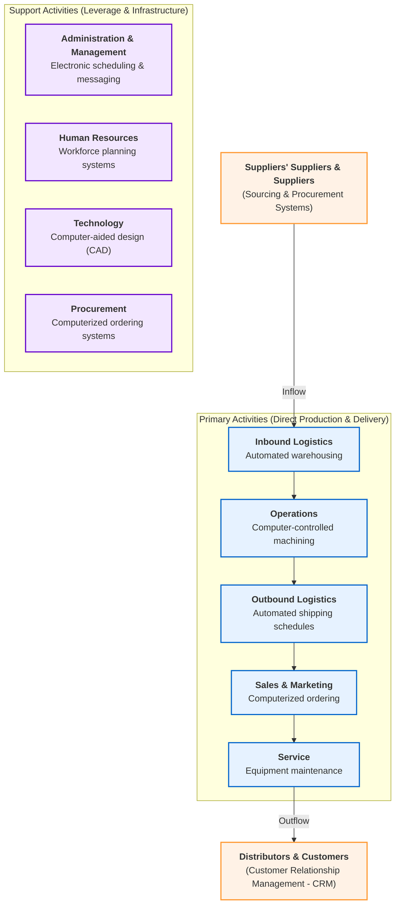

#### Detailed Explanatory Breakdown of the Value Chain Model (Figure 3.9):

The value chain model views the firm as a series of basic activities that add a margin of value to its products or services. These activities are split into two categories, both heavily optimized by specific classes of information systems:

##### 1. Primary Activities (Direct Value Creation)
These activities are directly related to the physical manufacture, distribution, sale, and post-sale support of the firm's goods and services.
* **Inbound Logistics:** Handles the receipt, storage, and internal distribution of raw materials.
  * *IT Implementation:* **Automated Warehousing Systems** track parts locations, inventory levels, and storage space in real time, reducing raw material holding costs.
* **Operations:** The process of converting raw material inputs into finished products.
  * *IT Implementation:* **Computer-Controlled Machining Systems** automate fabrication, assembly lines, and product testing to ensure speed, consistency, and quality.
* **Outbound Logistics:** Manages the storage and physical distribution of finished goods to distributors and end consumers.
  * *IT Implementation:* **Automated Shipment Scheduling Systems** calculate optimal delivery routes, load plans, and dispatch schedules, reducing transport costs.
* **Sales and Marketing:** Promotes the firm’s products and handles transactional selling.
  * *IT Implementation:* **Computerized Ordering Systems** allow sales teams and online portals to capture customer orders instantly, processing transactions with zero delay.
* **Service:** Handles post-sale support, warranty work, and repairs to maintain the product’s value.
  * *IT Implementation:* **Equipment Maintenance Systems** log service tickets, track parts availability, and schedule repair technicians.

##### 2. Support Activities (Infrastructure & Enablement)
These activities make the execution of the primary activities possible by providing the necessary infrastructure, human capital, technology, and materials.
* **Administration and Management:** Corporate governance, legal, finance, and general infrastructure.
  * *IT Implementation:* **Electronic Scheduling & Messaging Systems** coordinate meetings, assign corporate resources, and manage internal communications.
* **Human Resources:** Hiring, training, compensating, and scheduling the workforce.
  * *IT Implementation:* **Workforce Planning Systems** track employee credentials, performance reviews, benefits, and shift schedules.
* **Technology:** Designing and developing new products, services, or manufacturing processes.
  * *IT Implementation:* **Computer-Aided Design (CAD) Systems** enable engineers to draft, test, and model product prototypes virtually, reducing research and development times.
* **Procurement:** Negotiating contracts and purchasing raw assets, goods, and services.
  * *IT Implementation:* **Computerized Ordering Systems** automate purchase requests and track input deliveries.

##### 3. The External Linkages (The Industry Value Web)
Strategic advantage is not achieved in isolation. The flowchart illustrates that the firm's internal chain must link directly to the value chains of external partners:
* **Sourcing and Procurement Systems:** Connect the firm's *Inbound Logistics* and *Procurement* activities directly to the value chains of **Suppliers** and **Suppliers' Suppliers**. This allows for just-in-time replenishment and coordinates logistics between firms.
* **Customer Relationship Management (CRM) Systems:** Link the firm's *Sales, Marketing,* and *Service* activities directly to the value chains of **Distributors** and **Customers**. This tracks customer experiences, drives marketing campaigns, and automates downstream shipments.
* **Operational Outcome:** By aligning the entire industry value chain, businesses can reduce transaction costs, eliminate inventory buffers, and coordinate joint activities, converting a simple firm into a highly competitive **value web**.

### 8. Value Chain Benchmarking & Best Practices

To evaluate how effectively a firm's systems and activities perform, managers employ benchmarking:
* **Benchmarking:** The process of comparing a firm's business processes against strict industry standards or competitor performance metrics.
* **Best Practices:** The most successful, highly efficient solutions or problem-solving methods identified by research organizations, consulting firms, and government agencies for consistently achieving a business objective.
* **Operational Goal:** Once stages of the value chain are analyzed, managers identify candidate IT applications to bring lag-behind activities up to the level of industry best practices.

---

### 9. Extending the Value Chain: The Value Web (Figure 3.10)

As e-commerce grew, linear supply chains evolved into highly synchronized, multi-directional networks called **Value Webs**. A **Value Web** is a collection of independent firms that use information technology to coordinate their value chains to produce a product or service collectively.

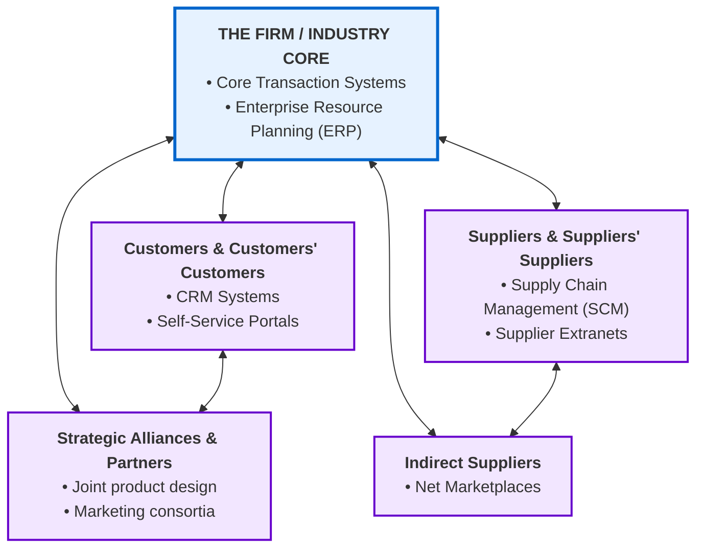

#### Detailed Explanatory Breakdown of the Value Web Flowchart (Figure 3.10):
* **The Central Core (Industry Firm):** Houses the firm's core transaction processing engines and **Enterprise Resource Planning (ERP)** systems, which integrate internal finance, manufacturing, and HR operations.
* **Supplier Linkages (Left Node):** Links the firm to both direct and indirect suppliers via **Supply Chain Management (SCM)** systems and secure extranets, allowing raw material coordinates to synchronize in real time.
* **Net Marketplaces (Bottom Node):** Connects the firm to spot markets and indirect suppliers for buying non-production goods, optimizing procurement costs.
* **Strategic Alliances and Partners (Top Node):** Connects the firm to partner value chains for joint research, design, and marketing campaigns, sharing risk and intelligence.
* **Customer Relationship (Right Node):** Links the firm to customers and distributors using **Customer Relationship Management (CRM)** systems and self-service portals, automating ordering, billing, and logistics updates.
* **Key Strategic Advantages of the Value Web:**
  * *Non-Linear Operations:* Unlike a rigid linear chain where data flows slowly step-by-step, the Value Web synchronizes all parties simultaneously. If demand spikes on the customer side, the signal reaches the suppliers and shipping partners instantly.
  * *Dynamic Bundling:* Relationships can be quickly bundled or unbundled in response to changing market conditions. The firm can swap shipping partners or source new components without breaking the network.
  * *Reduced Time-to-Market:* By coordinating directly with design partners, manufacturers, and logistics firms, companies accelerate product release cycles.
  * *Example (Amazon):* Amazon uses a value web where third-party merchants display goods, payment gateways manage cash flows, shipping carriers (FedEx, UPS) coordinate logistics, and customers track packages in real time.

### 10. Synergies, Core Competencies, and Network-Based Strategies

Large corporations are collections of strategic business units. Information systems can optimize the performance of these units by promoting synergies and core competencies.

#### A. Synergies
* **Concept:** Synergies occur when the outputs of some business units can be used as inputs to other units, or when two organizations pool markets and expertise to lower costs and increase margins.
* **IT Role:** Systems tie together operations across separate business units, enabling them to act as a single unified entity.
* **Example:** When Bank of America acquired Countrywide Financial, it used unified financial databases to extend its mortgage lending business, tap into a massive pool of new customers, cross-market credit cards/checking accounts, and consolidate redundant operational costs.

#### B. Enhancing Core Competencies
* **Concept:** A **core competency** is an activity in which a firm is a world-class leader (e.g. package delivery for FedEx, or miniaturization for Sony). It relies on knowledge gained over years of field experience, R&D, and employee expertise.
* **IT Role:** Systems that encourage sharing knowledge and documents globally across business units enhance core competencies.
* **Example:** Procter & Gamble (P&G) uses collaborative intranets to allow brand managers, researchers, purchasing agents, and engineers globally to share ideas, product trials, and market data, while also linking to external entrepreneurs.

#### C. Network-Based Strategies
Information technologies enable strategies that leverage network effects and virtual structures.

##### 1. Network Economics
* **Traditional vs. Network Economics:**
  * *Traditional Economics:* Built on the **law of diminishing returns**. The more resources applied to production, the lower the marginal gain in output.
  * *Network Economics:* Driven by **increasing returns**. The economic value produced depends on the number of people using the product (network effects). The marginal cost of adding a new participant (like a new Facebook or eBay user) is near zero, while the marginal utility to all participants increases exponentially.
* **Strategic Utility:** Firms build community platforms (e.g., eBay). The more buyers and sellers that join the community, the more valuable the platform becomes to everyone, and supplier competition drives down prices.

##### 2. The Virtual Company Model
* **Concept:** A **virtual company** uses networks to link people, assets, and ideas. This allows it to ally with other companies to create and distribute products without being restricted by physical boundaries or employee payrolls.
* **Example:** Garment manager **Li & Fung** handles design, sourcing, and logistics for companies like Guess, Levi Strauss, and Reebok. Li & Fung does not own fabric, sewing machines, or factories; instead, it outsources all work to a network of 15,000 suppliers in 40 countries, managing the entire lifecycle through a private extranet.

---

### 11. Business Ecosystems and Platforms (Figure 3.11)

In the digital era, Porter's static industry-boundaries model has evolved. Businesses now participate in **Business Ecosystems**—interdependent networks of suppliers, distributors, outsourcing firms, transport carriers, and technology manufacturers spanning multiple industries.

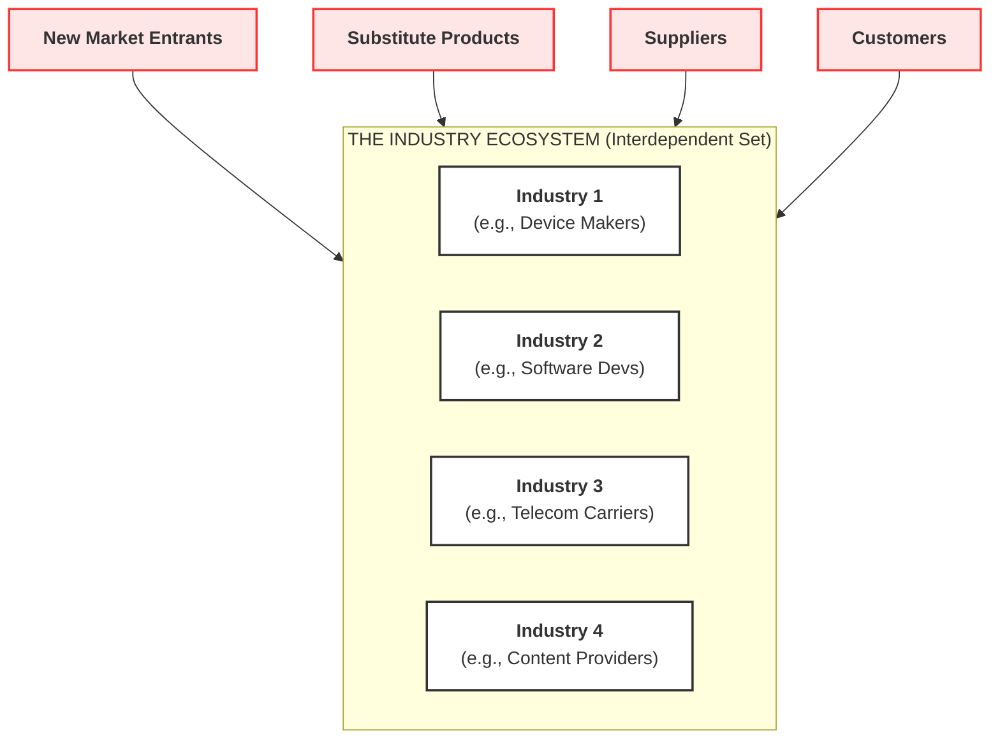

#### Detailed Explanatory Breakdown of the Ecosystem Strategic Model (Figure 3.11):
* **The Industry Set (Center Oval):** Instead of a single firm competing in a silo, competition occurs among *industry sets* (collections of industries that provide related services and products to deliver value to the consumer). For example, the smartphone market requires device manufacturers, mobile OS developers, telecom operators, and app creators to act as an ecosystem.
* **The Input Forces (Outer Nodes):** Traditional Porter forces (New Entrants, Substitutes, Suppliers, Customers) act on the *entire ecosystem* rather than just individual firms.
* **The IT Catalyst:** Information technology acts as the glue, enabling a dense network of real-time interactions, transactions, and communications among participating firms.
* **Strategic Outcome:** Platforms (like Apple's iOS ecosystem or Google's Android ecosystem) dominate because they orchestrate value creation across multiple industries, locking in customers and raising barriers to entry for competitors.

* **Ecosystem Example (Mobile Internet Platform):** Includes four separate industries that must cooperate and compete:
  1. *Device Makers:* Build physical hardware (Apple iPhone, Samsung, LG).
  2. *Wireless Telecoms:* Provide cellular connections (AT&T, Verizon, T-Mobile).
  3. *Independent Software Developers:* Code applications and games.
  4. *Internet Service Providers:* Provide backbone web access to the mobile platform.
  Together, these industries create a mobile digital platform ecosystem that delivers consumer value none could achieve alone.

* **Keystone Firms vs. Niche Players:**
  * **Keystone Firms:** A small number of dominant firms that build and control the **platforms** (information systems, technologies, services) used by other niche players. 
    * *Examples:* Microsoft and Facebook provide the platform infrastructure that thousands of other firms in different industries use to enhance their own capabilities and interact with audiences.
  * **Niche Players:** Smaller or specialized firms that utilize platforms created by keystone firms to sell targeted products and services.
  * **Strategic Choice:** Modern managers must decide whether to build a new platform and become a keystone firm, or specialize as a profitable niche player within an existing platform's ecosystem.

---

## 3-4: Challenges Pposed by Strategic Information Systems

Strategic information systems often change the organization, its products, services, and operational processes, driving the firm into new behavioral patterns.

### 1. Sustaining Competitive Advantage
* **Erosion of Advantage:** The competitive advantages conferred by strategic systems do not necessarily last long enough to guarantee long-term profitability.
* **Competitor Copycats:** Because rivals can observe, copy, and retaliate against strategic systems, competitive advantage is often not sustainable.
* **The Internet Acceleration:** The Web uses universal standards, making it easy for rivals to copy systems quickly, causing competitive advantages to disappear.
* **Tools for Survival:** Classic strategic systems (e.g. American Airlines' SABRE reservation system, Citibank's ATM network, and FedEx's tracking software) initially provided strategic advantages. Today, they are basic **tools for survival**—required by every firm just to stay in the industry.

---

### 2. Aligning IT with Business Objectives

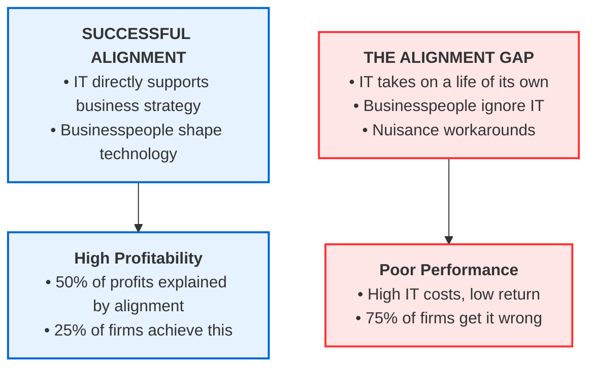

#### Explanatory Breakdown of the Alignment Model:
* **The Alignment Principle:** The more successfully a firm aligns IT with its business goals, the more profitable it will be. Aligning IT with business goals explains about **half (50%) of a firm's profits**.
* **The Alignment Gap:** Only **one-quarter (25%)** of firms achieve alignment. Most businesses get it wrong because businesspeople ignore IT, pretend not to understand it, and tolerate IT failure as a minor nuisance, rather than taking an active role in shaping the systems.

---

### 3. Management Checklist: Performing a Strategic Systems Analysis

To align IT with the business and discover systems that provide competitive advantages, managers must perform a strategic analysis by addressing three core areas:

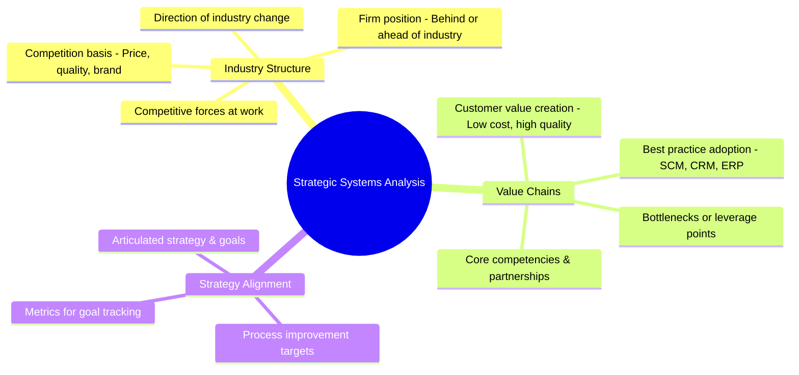

#### Explanatory Breakdown of the Strategic Systems Analysis Checklist:
1. **Industry Structure:**
   * Identify the competitive forces (new entrants, suppliers, customers, substitutes) and their power over prices.
   * Determine the basis of competition (quality, price, or brand).
   * Map the direction of change in the industry and evaluate if the firm is ahead of or behind its rivals.
2. **Business and Industry Value Chains:**
   * Evaluate how the company creates value for the customer (lower prices/costs or higher quality).
   * Pinpoint specific leverage points in the value chain where the firm can create more value and profit.
   * Ensure the firm is utilizing industry best practices, SCM, CRM, and ERP systems.
   * Determine where in the value chain IT will deliver the greatest value.
3. **IT and Strategy Alignment:**
   * Validate that the business strategy and goals are clearly articulated.
   * Verify that IT is improving the specific business processes and activities that promote the strategy.
   * Establish clear metrics to measure progress toward strategic goals.

---

## Case Study: Walmart's New Supercenter Strategy

### Background & Business Problem
* **E-Commerce Strain:** Walmart struggled to establish a profitable standalone online presence. While e-commerce sales grew significantly, the expansion was extremely costly, resulting in a **$2 billion loss in U.S. online operations in 2019**.
* **Strategic Reorientation:** In late 2018, CEO Doug McMillon directed the e-commerce unit to aggressively cut spending. Management realized that attempting to beat Amazon purely via standalone digital logistics was unprofitable. Instead, they decided to leverage Walmart's greatest competitive strength: its massive physical footprint.

### The Strategy: The Integrated "Supercenter" Web
Rather than treating physical retail and online shipping as separate entities, Walmart's strategy uses its physical stores as central hubs (webs of businesses) to drive both physical and digital revenue.

* **Supercenter Profile:** Sprawling 180,000-square-foot facilities carrying over 100,000 products.
* **Community Hub Services:** Offers clinics, pharmacies, money transfers, hair salons, and optical services. Designed to be 24/7 community gathering spaces.
* **Store-Based E-Commerce Fulfillment:** Over 50% of Walmart's 40% growth in U.S. e-commerce came from online grocery pickup and delivery operated directly out of existing physical stores.
* **Third-Party Logistics (3P Marketplace):** Walmart rents out its physical warehouse and shipping capacity to third-party vendors selling on Walmart.com.
* **Anonymized Advertising Network:** Walmart leverages purchase data from hundreds of millions of customers to sell targeted, anonymized online ads to major brands (e.g., Tide, Kellogg's).
* **Edge Computing Infrastructure:** Building edge computing centers directly inside physical stores. Data is processed locally and rapidly to support autonomous store vehicles, and excess processing power is rented out to local business clients.

### Strategic Risks
* **High Implementation Cost:** Setting up edge computing, grocery delivery infrastructure, and ad-targeting systems is complex and capital-intensive.
* **Operational Distraction:** The complexity of managing tech services (advertising, cloud/edge hosting, medical clinics) risks distracting management from core retail operations.

### Case Analysis: The Supercenter System Problem-Solving Framework

The diagram below outlines the components of Walmart’s business challenges, the management, organizational, and technological factors involved, the information system solutions implemented, and the resultant business outcomes.

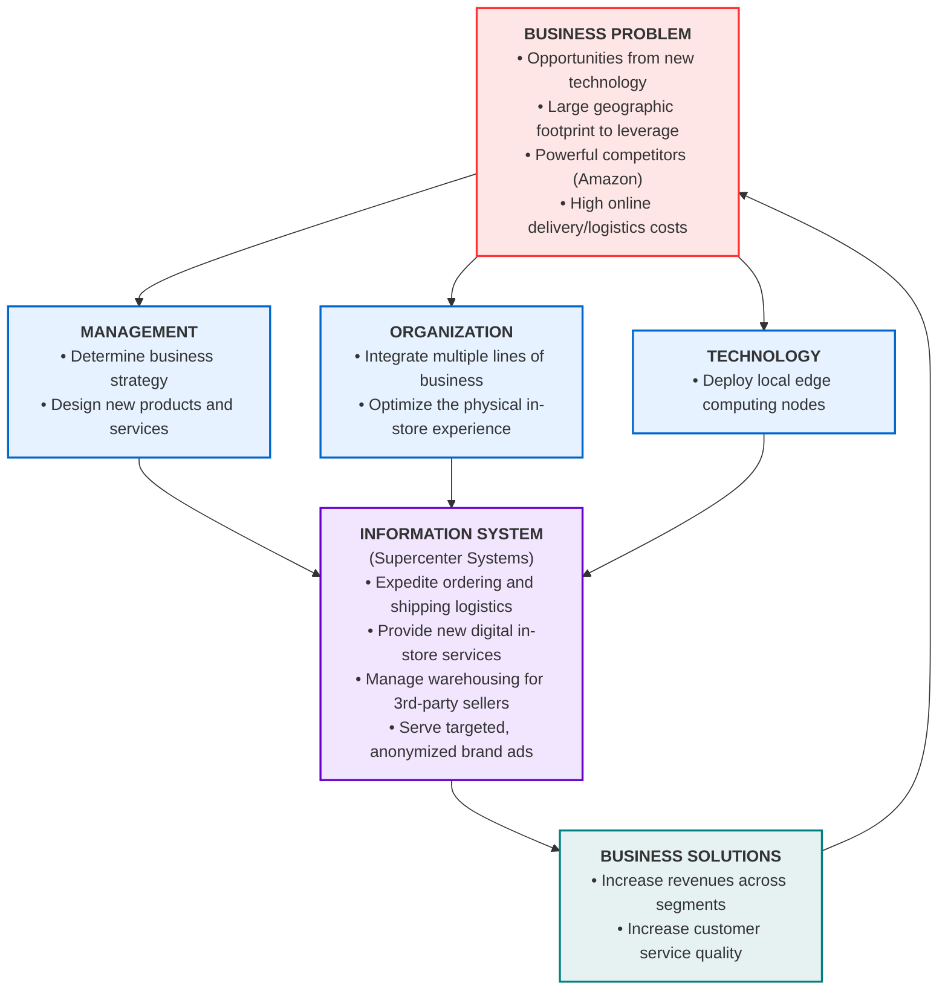

#### Explanatory Breakdown of the Supercenter Systems Flowchart:
* **The Business Problem:** Walmart faces intense competition from Amazon and high costs trying to run a traditional, standalone digital delivery network. However, its massive physical footprint offers a major technology opportunity if stores are repurposed.
* **Management's Role:** Executive leadership must set the overall direction (transitioning to store-based e-commerce) and design new digital and physical service concepts (like edge computing leasing and targeted ad services).
* **Organizational Realignment:** Integrating disparate lines of business (e.g., grocery, clinics, e-commerce, and third-party vendors) while optimizing the in-store layout to serve both walk-in and online pick-up customers simultaneously.
* **Technological Infrastructure:** Deploying edge computing networks directly inside supercenters to handle immediate localized processing and manage local cloud-sharing contracts.
* **The Supercenter Information System:** The software engine that coordinates order pick-ups, tracks third-party logistics, operates ad exchanges, and hosts local business compute servers.
* **Business Solutions & Feedback Loop:** These systems increase revenues (via new ad streams, marketplace fees, and server rental) and improve customer service. These positive outcomes directly resolve the initial business problems of high costs and competitive threat.

---

## Case Study Questions & Answers

### Q1: What are the components of Walmart's supercenter business strategy? How much does technology support that strategy? Explain your answer.

* **Strategy Components:**
  1. **Omnichannel Integration:** Blending e-commerce logistics with physical stores (e.g., store-based grocery pickup and delivery) to maximize the utility of their geographic footprint.
  2. **Diversified Service Offerings:** Transforming stores into multi-service community hubs containing health clinics, financial services, and personal care.
  3. **Third-Party Marketplace (3P):** Selling warehouse storage and shipping capacity to external merchants on Walmart.com.
  4. **Data Monetization:** Operating an anonymized advertising network for brands utilizing Walmart's customer shopping history.
  5. **Edge Computing Hosting:** Using local store-level data centers to process autonomous vehicle data and lease compute resources to local businesses.
* **Technology Support (Critical Enabler):**
  Technology is the primary enabler of this strategy. Without information systems, Walmart could not execute this model:
  * *Inventory & Order Systems:* Essential to coordinate online grocery pickup orders with store stock in real-time.
  * *Data Analytics & Ad Tech:* Crucial to target advertisements to specific consumer segments without exposing private, individual shopper records.
  * *Edge Computing and Networks:* Required to process data at retail locations immediately and manage remote server lease agreements.
  * *Logistics Systems:* Necessary to coordinate third-party merchants, warehouse locations, and carrier networks.

---

## Chapter 3 Review Summary

* **3-1: Features of Organizations Managers Need to Know:**
  All modern organizations are hierarchical, specialized, and impartial, utilizing explicit routines and standard operating procedures (SOPs) to maximize operational efficiency. Every organization possesses its own distinct culture and political dynamics arising from differences in interest groups, and is dependent on its surrounding environment. Organizations differ along goals (coercive, utilitarian, normative), groups served, leadership styles, tasks (routine vs. nonroutine), and Mintzberg's structural types (entrepreneurial, machine bureaucracy, divisionalized, professional, and adhocracy). These features dictate how information systems are implemented and used.
* **3-2: The Impact of Information Systems on Organizations:**
  New systems affect organizational structures, goals, work designs, values, internal politics, decision-making, and day-to-day routines. Economically, IT substitutes for labor and traditional capital, reducing transaction costs (via outsourcing/value webs) and agency costs (allowing managers to supervise larger workgroups, flattening hierarchies). Behavioral resistance to change is common because new systems disrupt unwritten social arrangements, tasks, structures, and power. To succeed, managers must change technology, structure, tasks, and people simultaneously.
* **3-3: Competitive Strategy Models & Frameworks:**
  * *Porter's Competitive Forces Model:* A firm's strategic position is shaped by competition with traditional rivals, new market entrants, substitute products, customer bargaining power, and supplier bargaining power. IT helps companies compete via *Low-Cost Leadership* (Walmart), *Product Differentiation* (Nike, Apple), *Focus on Market Niche* (Hilton), and *Strengthening Customer and Supplier Intimacy* (Toyota).
  * *Value Chain Model:* Highlights specific leverage points inside the firm (primary and support activities) where IT has the greatest strategic impact.
  * *Value Web:* Extends the value chain into a synchronized, non-linear network of suppliers, partners, and customers.
  * *Synergies & Competencies:* IT promotes synergies by linking disparate business units to act as a whole, and enhances core competencies by promoting global knowledge-sharing.
  * *Network Economics:* Explains increasing returns where the marginal cost of adding users is near zero and economic value grows with community size.
  * *Virtual Companies:* Use networks to outsource design, manufacturing, and distribution without physical boundaries.
  * *Business Ecosystems:* Interdependent networks of firms across industries delivering value collectively, organized around platform leaders (keystones) and niche players.
* **3-4: Challenges of Strategic Information Systems:**
  Implementing strategic systems requires painful, long-term organizational change and transitions from one sociotechnical level to another. Most strategic advantages are not permanently sustainable because rivals can copy technologies. Many systems originally designed to be strategic eventually become basic **tools for survival** required just to remain in business. Successful implementation requires aligning IT directly with clear business objectives (IT alignment), which only 25% of firms successfully achieve.

---

## Glossary of Key Terms

* **Agency Theory (p. 87):** Economic theory that views the firm as a "nexus of contracts" among self-interested individuals. A principal (owner) employs agents (employees) to perform work on their behalf, requiring supervision and coordination (agency costs).
* **Benchmarking (p. 101):** The process of comparing the efficiency and effectiveness of a firm's internal business processes against strict industry standards or competitor metrics.
* **Best Practices (p. 101):** The most successful, highly efficient solutions or problem-solving methods identified by consulting firms, research bodies, or government agencies for consistently achieving a business objective.
* **Business Ecosystem (p. 105):** An interdependent network of suppliers, distributors, outsourcing firms, transport providers, and tech manufacturers across multiple industries cooperating and competing to deliver customer value.
* **Competitive Forces Model (p. 91):** Michael Porter's strategic framework identifying five market forces that shape an industry's environment: traditional competitors, new entrants, substitutes, customer bargaining power, and supplier bargaining power.
* **Core Competency (p. 103):** An activity or skill set in which a business is a world-class leader, built over years of field experience and R&D.
* **Customer Experience Management - CEM (p. 97):** The strategic practice of monitoring, managing, and optimizing a customer's entire journey across all touchpoints (discovery, purchase, delivery, and post-sale service).
* **Disruptive Technologies (p. 84):** Substitute products or innovations that perform as well or better than existing offerings, radically changing the business landscape and rendering legacy models obsolete.
* **Efficient Customer Response System (p. 93):** A logistics system that directly links customer purchase behavior at checkouts to distribution and supplier production chains, enabling instant, automated replenishment.
* **Mass Customization (p. 95):** The ability to offer individually tailored products or services using the same manufacturing and production resources as mass production.
* **Network Economics (p. 104):** An economic model based on increasing returns where the marginal cost of adding a participant is near zero, and the utility/value of the product grows with the size of the user base.
* **Organization (p. 79):** A stable, formal social structure that takes resources from the environment and processes them to produce outputs. Technically defined as a bundle of capital, labor, and production; behaviorally defined as a delicate balance of unwritten rights, obligations, and relationships.
* **Platforms (p. 105):** The underlying information systems, technologies, and services built by keystone firms that host and enable niche players to operate.
* **Primary Activities (p. 100):** Activities directly related to the physical manufacture, distribution, sale, and post-sale service of a firm's goods (Inbound/Outbound Logistics, Operations, Sales/Marketing, Service).
* **Product Differentiation (p. 92):** A competitive strategy that uses IT to create unique product features, custom configurations, or enhanced convenience that rivals cannot easily replicate.
* **Routines (p. 82):** Precise rules, procedures, and practices—also known as standard operating procedures (SOPs)—developed over time to handle expected operational situations.
* **Support Activities (p. 101):** Business functions that make primary activities possible by providing infrastructure, procurement, human resources, and technology design.
* **Switching Costs (p. 98):** The financial, time, effort, and training costs a customer incurs when switching from a current product or vendor to a competing alternative.
* **Transaction Cost Theory (p. 87):** Economic theory stating that firms grow larger to minimize transaction costs (locating suppliers, contracts, compliance) of using the marketplace. Modern IT lowers transaction costs, allowing firms to shrink and outsource.
* **Value Chain Model (p. 100):** A strategic model highlighting specific leverage points in primary and support activities inside the firm where IT has the greatest competitive impact.
* **Value Web (p. 102):** A synchronized, non-linear network of independent firms utilizing IT to coordinate their value chains to produce a product or service collectively.
* **Virtual Company (p. 104):** A network-based organization that links people, assets, and ideas across corporate boundaries to design, manufacture, and distribute goods without physical constraints.

---

## Chapter 3 Review Questions and Answers

### Section 3-1: Features of Organizations Managers Need to Know

#### Define an organization and compare the technical definition of organizations with the behavioral definition.
* **Organization Defined:** A stable, formal social structure that takes resources from the environment and processes them to produce outputs.
* **Technical Definition:** Views the firm as a "black box" where capital and labor (production factors) are combined to produce outputs. Technology is seen as easily substitutable for labor, and the organization is assumed to be infinitely malleable.
* **Behavioral Definition:** Looks inside the firm to view it as a delicate balance of unwritten rights, privileges, obligations, and relationships between employees and managers, developed over time. Changing this structure requires extensive training, negotiation, and time.

#### Identify and describe the features of organizations that help explain differences in organizations' use of information systems.
* **Bureaucratic Structure:** Clear division of labor, specialization, hierarchy, and explicit routines (SOPs).
* **Organizational Politics:** Different positions hold divergent views on resource distribution, creating political friction when systems alter information access.
* **Organizational Culture:** Bedrock assumptions about what products/services to make and how to make them, which can resist new technologies.
* **Environments:** The external markets, regulations, and competitors scanned by systems.
* **Other Features:**
  * *Goals:* Coercive (prisons), utilitarian (firms), or normative (churches, schools).
  * *Constituencies:* Key stakeholder groups served.
  * *Leadership Styles:* Authoritarian vs. democratic/collaborative.
  * *Tasks:* Standardized routine workflows vs. cognitive nonroutine processes.
  * *Mintzberg's Structures:* Entrepreneurial, machine bureaucracy, divisionalized, professional, and adhocracy, all requiring different types of systems.

---

### Section 3-2: The Impact of Information Systems on Organizations

#### Describe the major economic theories that help explain how information systems affect organizations.
* **Resource Substitution:** IT is a factor of production that substitutes for labor (reducing middle management and clerical staff) and physical capital (offices, equipment) as its relative cost declines.
* **Transaction Cost Theory:** IT reduces the transaction costs of participating in the market, making it cheaper to outsource production to external vendors rather than vertically integrating.
* **Agency Theory:** IT lowers the cost of acquiring and analyzing information, allowing principals to manage and supervise a larger number of agents with less effort, reducing total agency costs.

#### Describe the major behavioral theories that help explain how information systems affect organizations.
* **Hierarchical Flattening:** IT facilitates the redistribution of information to lower-level employees, empowering them to make decisions without constant supervision, which eliminates layers of middle management.
* **Postindustrial Decentralization:** Authority relies increasingly on knowledge and competence rather than formal positions, encouraging self-managing professional teams and decentralized decision-making.
* **Task Force-Networked Organizations:** IT supports ad-hoc virtual project teams that assemble electronically, complete a task (such as designing an automobile), and then disband.

#### Explain why there is considerable organizational resistance to the introduction of information systems.
* **The Interconnected Variables:** An organization is made up of four mutually dependent components: **Technology, Structure, People, and Job Tasks**.
* **The Change Friction:** Installing a new system alters all four elements simultaneously (who does what, who controls information, and how tasks are run). Upsetting this balance causes political and behavioral resistance. Project failures are usually caused by this resistance rather than technical failure.

#### Describe the impact of the Internet and disruptive technologies on organizations.
* **The Internet:** Lowers barriers to entry, accelerates the emergence of substitutes, increases customer bargaining power, and widens geographic markets, intensifying price competition.
* **Disruptive Technologies:** Substitute products that perform as well or better than legacy products, decimating established industries (e.g. encyclopedias, travel agencies, music stores) while creating entirely new e-commerce models.

---

### Section 3-3: Competitive Strategies and Frameworks

#### Define Porter's competitive forces model and explain how it works.
* **Model Defined:** A framework mapping five core market forces that determine a firm's strategic position and profitability:
  1. *Traditional Competitors:* Rivals optimizing processes.
  2. *New Market Entrants:* Start-ups with agility but lacking brand equity.
  3. *Substitute Products:* Alternative products that limit pricing power.
  4. *Customer Power:* Bargaining power to switch or dictate terms.
  5. *Supplier Power:* Input pricing control due to limited sources.
* **Mechanism:** Firms use information systems to counter these forces and secure market share.

#### Describe what the competitive forces model explains about competitive advantage.
* **Strategic Position:** It explains that competitive advantage depends on a firm's ability to shield itself from the five forces and shape them in its favor using superior information assets and structural strategies.

#### List and describe four competitive strategies enabled by information systems that firms can pursue.
1. **Low-Cost Leadership:** Achieving the lowest operational costs and lowest prices (e.g., Walmart).
2. **Product Differentiation:** Customizing products or services to prevent easy copying (e.g., Nike, Apple).
3. **Focus on Market Niche:** Targeting a narrow customer segment using specialized data analytics (e.g., Hilton OnQ).
4. **Strengthen Customer and Supplier Intimacy:** Linking suppliers to production schedules and raising customer switching costs (e.g., Toyota, Amazon).

#### Describe how information systems can support each of these competitive strategies and give examples.
* **Low-Cost:** POS systems transmit register scans directly to suppliers for automatic replenishment (Walmart's replenishment system).
* **Differentiation:** Online design portals allow mass customization of apparel (Nike By You).
* **Niche:** Analytical databases analyze hotel guest profiles to offer targeted perks to high-value customers (Hilton OnQ).
* **Intimacy:** Shared extranets allow suppliers to see manufacturing schedules and deliver parts just-in-time (Toyota's SCM).

#### Explain why aligning IT with business objectives is essential for strategic use of systems.
* **Profitability Link:** Alignment ensures that technology directly supports corporate goals. IT alignment explains roughly 50% of a firm's profits, yet only 25% of companies successfully achieve it.

#### Define and describe the value chain model.
* **Value Chain Model:** A strategic model highlighting specific leverage points inside the firm where IT has the greatest impact. It splits activities into:
  * *Primary Activities:* Inbound/Outbound Logistics, Operations, Sales/Marketing, Service.
  * *Support Activities:* Administration, HR, Technology, Procurement.

#### Explain how the value chain model can be used to identify opportunities for information systems.
* **Leverage Points:** By examining each step, managers can map specific systems (e.g., CAD for design, or ERP for operations) to lower costs, raise quality, and improve efficiency.

#### Define the value web and show how it is related to the value chain.
* **Value Web Defined:** A synchronized, non-linear network of independent firms that use IT to coordinate their value chains to produce a product collectively.
* **Relationship:** It extends the single firm's value chain externally to integrate with the value chains of suppliers, logistics providers, and customers.

#### Explain how the value web helps businesses identify opportunities for strategic information systems.
* **External Integration:** It identifies opportunities to integrate networks (e.g. SCM or EDI) to reduce industry-wide cycle times and transaction costs.

#### Describe how the Internet has changed competitive forces and competitive advantage.
* **Price Competition:** Universal web standards make it easy for rivals to enter the market and for customers to find the lowest prices, making competitive advantages temporary and hard to sustain.

#### Explain how information systems promote synergies and core competencies.
* **Synergies:** Systems link disparate business units so they coordinate operations and cross-market products (e.g. Bank of America/Countrywide).
* **Competencies:** Knowledge-management platforms allow researchers and engineers to share data and best practices globally (e.g. P&G).

#### Describe how promoting synergies and core competencies enhances competitive advantage.
* **Cost & Quality Advantages:** Lowers transactional costs across divisions, consolidates redundant systems, and accelerates product innovation.

#### Explain how businesses benefit by using network economics and ecosystems.
* **Increasing Returns:** Ecosystem platforms (like iOS or Android) coordinate value across multiple industries, locking in users and creating network effects where value scales as the community grows.

#### Define and describe a virtual company and the benefits of pursuing a virtual company strategy.
* **Virtual Company Defined:** A network-based organization that links assets, people, and ideas across corporate boundaries.
* **Benefits:** Allows a firm to design, make, and ship products without physical assets or payroll constraints, providing extreme operational agility (e.g., Li & Fung).

---

### Section 3-4: Challenges of Strategic Information Systems

#### List and describe the management challenges posed by strategic information systems.
* **Sustainability:** Most strategic advantages are quickly copied or rendered obsolete by web standards, converting strategic systems into basic **tools for survival**.
* **Behavioral Resistance:** Systems disrupt unwritten social contracts, requiring massive change management to align technology, structure, people, and tasks.

#### Explain how to perform a strategic systems analysis.
* **Checklist Execution:** Assess the industry structure (forces, basis of competition), identify internal value chain leverage points (SCM, CRM, ERP, core competencies), and verify that IT goals align with corporate metrics.

