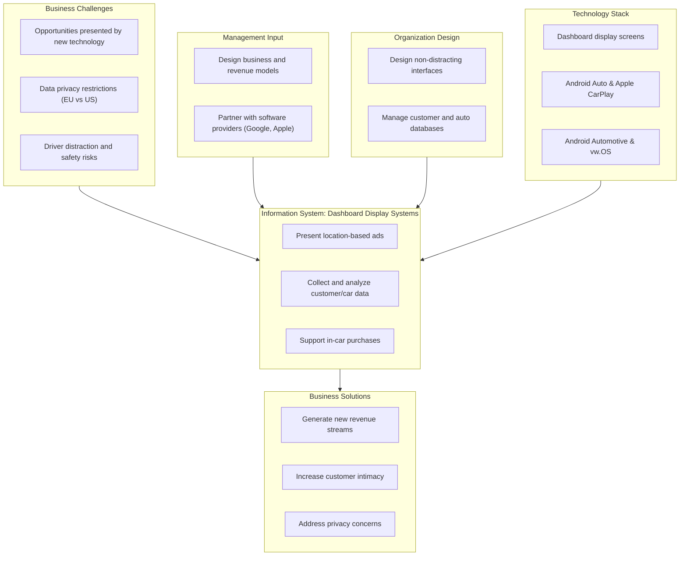

# Chapter 10: E-commerce: Digital Markets, Digital Goods

This document compiles comprehensive, publication-grade study notes for Chapter 10 of *Management Information Systems: Managing the Digital Firm*. These notes are structured chronologically by page, incorporating core learning objectives, detailed section breakdowns, bolded key definitions, high-fidelity Mermaid.js process diagrams, comprehensive case study Q&A, and a centralized glossary of all technical terms.

---

## Learning Objectives
- **Learning Objective 10-1:** What are the unique features of e-commerce, digital markets, and digital goods?
- **Learning Objective 10-2:** What are the principal e-commerce business and revenue models?
- **Learning Objective 10-3:** How has e-commerce transformed marketing?
- **Learning Objective 10-4:** How has e-commerce affected business-to-business transactions?
- **Learning Objective 10-5:** What is the role of m-commerce in business, and what are the most important m-commerce applications?
- **Learning Objective 10-6:** What issues must be addressed when building an e-commerce presence?
- **Learning Objective 10-7:** How will MIS help my career?

---

## Detailed Section Breakdowns

### 10-1: Unique Features of E-commerce, Digital Markets, and Digital Goods

#### E-commerce Today
*   **E-commerce** refers to the use of the Internet and the web to transact business. More formally, e-commerce is about digitally enabled commercial transactions between and among organizations and individuals.
*   **Historical Context**: Began in 1995 when Netscape.com accepted the first corporate advertisements. Since then, it has grown exponentially, remaining the fastest-growing form of retail trade in the U.S., Europe, and Asia.
*   **Market Share & Statistics**:
    *   In 2020, an estimated 230 million Americans (92.5% of the Internet population) shopped online, and 202 million made purchases.
    *   E-commerce consumer sales are divided into retail goods ($675 billion), travel and services ($475 billion), and online content ($67 billion), totaling $1.2 trillion in 2020.
    *   Online retail goods account for about 12% of total U.S. retail sales ($5.6 trillion) and grow at 13% annually (compared to 3% for traditional retail).
    *   Over 45% of retail e-commerce is mobile, with 80% of m-commerce transactions occurring on a smartphone.
    *   The modern e-commerce landscape is defined by the triad: **social, mobile, local**.
*   **The Shift in Paradigm**: Online marketing has shifted **from eyeballs to conversations** (conversational commerce). Success is no longer measured solely by unique visitors and impressions, but by active customer participation and engagement in social media dialogue.

#### Eight Unique Features of E-commerce Technology
1.  **Ubiquity**: Internet and web technology is available everywhere (at home, work, and via mobile devices).
    *   *Significance*: The marketplace is extended beyond traditional physical boundaries and is removed from a temporal and geographic location, creating a **marketspace** (a marketplace extended beyond traditional boundaries and removed from a temporal and geographic location). Ubiquity enhances consumer convenience and reduces **transaction costs** (the costs of participating in a market).
2.  **Global Reach**: The technology reaches across national boundaries and around the earth.
    *   *Significance*: Commerce is enabled across cultural and national boundaries seamlessly. The potential market includes billions of consumers and millions of businesses.
3.  **Universal Standards**: There is one set of technology standards, namely Internet standards.
    *   *Significance*: Disparate computer systems can easily communicate, lowering **market entry costs** (the costs merchants must pay to bring goods to market) and reducing consumer **search costs** (the effort required to find suitable products).
4.  **Richness**: Video, audio, and text messages are possible and can be integrated into a single marketing message and consumer experience.
    *   *Significance*: Prior to the web, there was a trade-off between richness and reach. E-commerce enables information richness at a massive, global scale.
5.  **Interactivity**: The technology works through interaction with the user, establishing two-way and peer-to-peer communication.
    *   *Significance*: Consumers are engaged in dialogue that dynamically adjusts the experience, making them active participants in the process.
6.  **Information Density**: The technology reduces information costs and raises quality, vastly increasing **information density** (the total amount and quality of information available to all market participants).
    *   *Significance*: Promotes **price transparency** (the ease with which consumers can find out the variety of prices in a market) and **cost transparency** (the ability of consumers to discover the actual costs merchants pay for products). It also enables merchants to engage in **price discrimination** (selling the same goods, or nearly the same goods, to different targeted groups at different prices).
7.  **Personalization/Customization**: E-commerce technology allows personalized messages to be delivered to individuals and groups.
    *   *Significance*: **Personalization** (targeting marketing messages to specific individuals based on clickstream behavior, name, interests, and past purchases) and **customization** (changing the delivered product or service based on a user's preferences or prior behavior) are maximized using stored customer transaction histories.
8.  **Social Technology**: The technology supports user content generation and social networking.
    *   *Significance*: Enables user content creation and distribution on a large scale, supporting a unique many-to-many model of mass communications.

#### Key Concepts in Digital Markets
*   **Information Asymmetry**: An **information asymmetry** exists when one party in a transaction has more information that is important for the transaction than the other party. Digital markets dramatically reduce asymmetry by offering open pricing comparison resources (e.g., auto retailing sites).
*   **Reduced Friction**: Digital markets feature lower **menu costs** (merchants' costs of changing prices), reduced search and transaction costs, and enable **dynamic pricing** (the price of a product varies depending on the demand characteristics of the customer or the supply situation of the seller).
*   **Disintermediation**: E-commerce enables **disintermediation** (the removal of organizations or business process layers responsible for intermediary steps in a value chain), allowing manufacturers to sell directly to consumers. This significantly lowers purchase transaction costs for consumers and raises manufacturer profit margins.

    ```mermaid
    graph TD
        subgraph Channel1 ["Three-Layer Channel (Total Cost: $48.50)"]
            M1["Manufacturer"] -->|$20.45| D1["Distributor"]
            D1 -->|$25.00| R1["Retailer"]
            R1 -->|$48.50| C1["Customer"]
        end
        subgraph Channel2 ["Two-Layer Channel (Total Cost: $40.34)"]
            M2["Manufacturer"] -->|$20.45| R2["Retailer"]
            R2 -->|$40.34| C2["Customer"]
        end
        subgraph Channel3 ["Direct Channel (Total Cost: $20.45)"]
            M3["Manufacturer"] -->|$20.45| C3["Customer"]
        end
        style C1 fill:#f9f,stroke:#333,stroke-width:2px
        style C2 fill:#f9f,stroke:#333,stroke-width:2px
        style C3 fill:#f9f,stroke:#333,stroke-width:2px
    ```

    *   **Diagram Explanation (Figure 10.2):** This flowchart compares three supply chain distribution scenarios to illustrate the financial impact of disintermediation:
        *   **Three-Layer Channel:** A manufacturer sells a product to a distributor for $20.45, who marks it up to $25.00 for the retailer, who then sells it to the customer for $48.50.
        *   **Two-Layer Channel:** Bypassing the distributor allows the manufacturer to sell to the retailer for $20.45, who then marks it up to sell to the customer for $40.34 (saving the customer 16.8%).
        *   **Direct Channel:** By bypassing both the distributor and retailer, the manufacturer sells directly to the consumer for the raw cost of $20.45. This represents a **57.8% cost savings** for the consumer while allowing the manufacturer to preserve or even enhance their profit margins by eliminating intermediary transaction costs.

*   **Digital Goods**: Digital markets have expanded the market for **digital goods** (goods that can be delivered over a digital network, such as music, video, software, newspapers, and books).
    *   *Cost Structure*: For digital goods, the marginal cost of producing another unit is zero. The cost of producing the original first unit is extremely high (nearly the entire cost of the product), inventory and physical distribution costs are non-existent, and delivery costs are low.

---

### 10-2: E-commerce Business and Revenue Models

#### Major Categories of E-commerce
*   **Business-to-consumer (B2C)**: Retailing products and services to individual shoppers (e.g., Amazon, Walmart, Apple Music).
*   **Business-to-business (B2B)**: Sales of goods and services among businesses (e.g., Elemica chemical sales).
*   **Consumer-to-consumer (C2C)**: Consumers selling directly to consumers (e.g., eBay, Craigslist).
*   **Mobile commerce (m-commerce)**: The use of handheld wireless devices for purchasing goods and services from any location.

#### Internet Business Models
*   **E-tailer**: Online retail stores, which can be pure-play virtual stores (e.g., eVitamins) or "bricks-and-clicks" divisions of physical stores (e.g., Walmart.com).
*   **Transaction broker**: Processes online sales transactions, saving users time and money while charging a fee per transaction (e.g., E*Trade, Expedia).
*   **Market creator**: Builds a digital environment where buyers and sellers can meet, display products, and establish prices (e.g., eBay, Priceline, Uber, Airbnb, Kickstarter).
*   **Content provider**: Generates revenue by providing digital content (news, music, video, photos) over the web (e.g., WSJ.com, Apple Music, Netflix). Utilizes **podcasting** (publishing audio/video broadcasts via subscription downloads) and **streaming** (flowing continuous content to a device without local storage).
*   **Community provider**: Provides an online meeting place where people with similar interests can communicate, share media, and transact (e.g., Facebook, Twitter, Instagram).
*   **Portal**: Gateways to the web that users set as their homepage, integrating web search, news, email, calendars, and shopping in one place (e.g., Google, Yahoo, MSN).
*   **Service provider**: Offers applications and services online, such as photo sharing, cloud storage, or software as a service (SaaS) (e.g., Google Docs, Dropbox, Salesforce).

#### E-commerce Revenue Models
*   **Advertising Revenue Model**: Websites generate revenue by attracting large audiences exposed to advertisements (e.g., Google, Facebook, Yahoo).
*   **Sales Revenue Model**: Earning revenue by selling goods, information, or services (e.g., Amazon, Gap). Content providers often utilize **micropayment systems** (cost-effective processing of high volumes of very small transactions, typically 25 cents to $5.00, such as Apple's iTunes Store).
*   **Subscription Revenue Model**: Charging an ongoing subscription fee for access to premium content or services (e.g., Netflix, Consumer Reports, Match.com).
*   **Free/Freemium Revenue Model**: Offering basic services for free while charging a premium for advanced or special features (e.g., Pandora, Google Apps).
*   **Transaction Fee Revenue Model**: Earning a fee for enabling or executing a transaction (e.g., eBay, Venmo, Zelle). This model is heavily utilized by **FinTech** (start-up financial technology firms using IT innovatively to compete with banks).
*   **Affiliate Revenue Model**: Affiliate websites steer visitors to other businesses in exchange for a referral or lead-generation fee (e.g., Yelp, MyPoints, personal blogs).

---

### 10-3: How E-commerce Has Transformed Marketing

#### Digital Marketing Innovation
*   **Long Tail Marketing**: The Internet enables **long tail marketing** by allowing merchants to sell niche products with low demand profitably to small, dispersed audiences, as the costs of digital inventory and search are extremely low.
*   **Behavioral Targeting**: E-commerce firms use **behavioral targeting** techniques to track the clickstreams (clicking behavior) of individuals across thousands of websites to compile detailed interest profiles and display highly personalized ads.

    ```mermaid
    flowchart LR
        Start([Shopper Enters]) --> C1[Click 1: Home Page<br/>• Arrives from Yahoo Portal at 2:30 PM<br/>• Cookies loaded to browser]
        C1 --> C2[Click 2-5: Navigates & Selects<br/>• Clicks Blouses<br/>• Views Pink Blouse<br/>• Selects Size 10 Pink<br/>• Places in Shopping Cart]
        C2 --> C3[Click 6: Closes Browser<br/>• Leaves without purchasing<br/>• Indicates cart abandonment or UI issues]
    ```

    *   **Diagram Explanation (Figure 10.3):** This clickstream diagram maps a typical consumer navigation sequence through a retail website to demonstrate how behavioral data is captured:
        *   **Click 1 (Entry & Cookies):** The consumer enters the homepage from a portal referral (Yahoo), triggering the website's host server to deposit unique tracking cookies on the user's local browser cache.
        *   **Clicks 2–5 (Engagement):** The user browses categories (Blouses), views a specific item, configures options (Size 10 Pink), and places it in the cart.
        *   **Click 6 (Exit):** The browser is closed without initiating a purchase transaction, providing metrics on shopping cart abandonment that analysts use to identify design friction points.

*   **Advertising Networks**: Intermediaries like Google Marketing Platform track user behaviors across thousands of member sites. They use programmatic ad buying and real-time bidding (RTB) platforms to auction and display behaviorally targeted ads within milliseconds.

    ```mermaid
    sequenceDiagram
        autonumber
        actor Consumer
        participant Merchant as Merchant Site
        participant AdNet as Ad Network Server (Google Marketing Platform)
        participant DB as Profile Database
        
        Consumer->>Merchant: Requests Web Page
        Merchant->>AdNet: Connects to Ad Server
        AdNet->>Consumer: Reads Cookie (if existing)
        AdNet->>DB: Checks database for user profile
        DB-->>AdNet: Returns profile data (interests, demographics)
        AdNet->>AdNet: Selects highly targeted banner ad
        AdNet-->>Merchant: Serves targeted banner ad
        Merchant-->>Consumer: Renders page with targeted ad
        Note over Consumer,AdNet: GMP tracks consumer across other member sites to update profile
    ```

    *   **Diagram Explanation (Figure 10.4):** This sequence diagram shows how advertising networks execute real-time behavioral targeting across the web:
        *   **Initial Request (Steps 1–2):** The user requests a web page from a merchant site, which contains embedded code redirecting the request to the central ad network server (such as Google Marketing Platform).
        *   **Dossier Retrieval (Steps 3–5):** The ad network reads the user's browser cookie and queries its profile database to retrieve stored interests, purchase history, and demographics.
        *   **Ad Delivery (Steps 6–8):** The ad network server runs an algorithmic auction or matching process, selects a highly relevant banner ad, and serves it back to the merchant site to render on the consumer's screen in milliseconds.
        *   **Continuous Tracking Loop:** The ad network tracks the user's subsequent navigation across all other network member sites, constantly writing new interaction data to update their central profile dossier.

*   **Native Advertising**: Organic advertising that integrates ads directly into social network newsfeeds or traditional editorial content.
*   **Social Graph**: E-commerce marketing maps the **social graph** (the mapping of all significant online social relationships).
*   **Social Shopping**: Features such as newsfeeds, timelines, social sign-ons, collaborative shopping, and social search allow users to share purchase opinions and shape transactions based on the recommendations of their social network.
*   **Wisdom of crowds & Crowdsourcing**: The **wisdom of crowds** concept suggests that large numbers of people can make better decisions than a single expert. Firms use **crowdsourcing** (enlisting the help of customers to solve business problems or design products, such as BMW urban cars or Lego Ideas).

---

### 10-4: Business-to-Business (B2B) E-commerce

*   **B2B Scale**: Represents a huge marketplace, with online B2B contributing $6.7 trillion of the $14.5 trillion total U.S. B2B trade in 2020.
*   **Electronic Data Interchange (EDI)**: B2B commerce relies heavily on **Electronic Data Interchange (EDI)** (the computer-to-computer exchange of standard transactions such as invoices, bills of lading, and purchase orders). Modern EDI is web-enabled, allowing suppliers direct access to selected parts of a buyer's production schedules for continuous inventory replenishment.

    ```mermaid
    graph LR
        subgraph Supplier ["Supplier Systems"]
            S1["Inventory & Shipping"]
        end
        subgraph Firm ["Firm Systems"]
            F1["Production Planning & Purchasing"]
        end
        S1 -->|"Shipping Data"| F1
        S1 -->|"Payment Data (Invoices)"| F1
        F1 -->|"Production/Inventory Requirements"| S1
        F1 -->|"Continuous Replenishment Data"| S1
    ```

    *   **Diagram Explanation (Figure 10.5):** This diagram illustrates a web-enabled Electronic Data Interchange (EDI) infrastructure between a firm and its supplier:
        *   **Automated Document Exchange:** Standard transaction documents (invoices, purchase orders, shipping manifests) are transmitted computer-to-computer without manual data entry.
        *   **Supplier-to-Firm Data Flows:** The supplier's inventory and shipping systems transmit shipping data (delivery schedules) and billing data (electronic invoices) directly to the firm's systems.
        *   **Firm-to-Supplier Data Flows:** The firm's planning systems transmit real-time inventory requirements and continuous replenishment data, allowing the supplier to replenish inventory levels automatically.
        *   **Key Advantage:** Reduces lead times, minimizes manual entry errors, lowers administrative overhead, and enables highly efficient Just-in-Time (JIT) manufacturing and inventory processes.

*   **Private Industrial Networks (Private Exchanges)**: A **private industrial network** consists of a large firm using a secure website to link with its suppliers, distributors, and key partners. This buyer-owned network facilitates collaborative commerce, inventory sharing, and joint product design.
*   **Net Marketplaces (E-hubs)**: Online marketplaces where multiple buyers can purchase from multiple sellers. They manage catalogs, sourcing, automated purchasing, and fulfillment.
    *   **Direct Goods**: Goods used directly in the production process (e.g., sheet steel for automotive assembly).
    *   **Indirect Goods**: All goods not directly involved in production (e.g., office supplies, maintenance/repair products).
    *   **Vertical vs. Horizontal Markets**: Net marketplaces can serve vertical markets (specialized by industry, e.g., Exostar for aerospace) or horizontal markets (generic goods across industries, e.g., office equipment).
*   **Exchanges**: Independently owned third-party Net marketplaces that connect thousands of suppliers and buyers for spot purchasing of direct inputs (e.g., Go2Paper). Many failed early because competitive bidding drove prices down without providing long-term relationship benefits.

---

### 10-5: Mobile Commerce (M-commerce)

*   **M-commerce Growth**: Retail m-commerce is the fastest-growing segment of e-commerce, generating $305 billion in 2020 and expanding at 20%+ annually.
*   **Location-Based Services**: Enabled by GPS-map services on mobile devices, consisting of three main categories:
    *   **Geosocial Services**: Help users find friends or check-in to locations (e.g., Foursquare, Facebook check-ins).
    *   **Geoadvertising Services**: Send ads to users based on their GPS coordinates (e.g., cosmetics retailers sending mobile coupons to customers within 100 yards).
    *   **Geoinformation Services**: Provide local query information, navigation, and traffic routing (e.g., Waze Navigation).
*   **Mobile App Payment Systems**:
    1.  **Near Field Communication (NFC)**: Contactless payments between NFC-enabled smartphones and merchant POS terminals (e.g., Apple Pay, Google Pay).
    2.  **QR Code Systems**: Scanning two-dimensional barcodes with a smartphone camera to deduct payment from a mobile wallet (e.g., Walmart Pay, Starbucks).
    3.  **Peer-to-peer (P2P) Systems**: Transferring funds directly between bank accounts using a secure, email/phone-linked third-party app (e.g., Venmo, Zelle).

---

### 10-6: Building an E-commerce Presence

#### Two Primary Challenges
1.  Developing a clear understanding of your business objectives.
2.  Knowing how to choose the right technology to achieve those objectives.

#### E-commerce Presence Map
Firms must coordinate four types of digital presence, each requiring unique platforms and activities:
*   **Websites**: Traditional desktop, mobile, and tablet platforms. Activities include search engine marketing, display ads, and affiliate setups.
*   **Email**: Internal and purchased customer email lists. Activities include newsletters, transactional updates, and promotional sales.
*   **Social Media**: Presences on Facebook, Instagram, Twitter, and blogs. Activities focus on conversation, customer engagement, sharing, and peer advice.
*   **Offline Media**: Traditional print, TV, and radio media. Activities focus on customer education, exposure, and long-term brand building.

    ```mermaid
    graph TD
        Map["E-commerce Presence Map"] --> Web["Websites"]
        Map --> Email["Email"]
        Map --> Social["Social Media"]
        Map --> Offline["Offline Media"]
        
        Web --> WebPlatforms["Platforms: Desktop, Mobile, Tablet"]
        Web --> WebActivities["Activities: Search Engine Marketing, Display Ads, Affiliates, Sponsorships"]
        
        Email --> EmailPlatforms["Platforms: Internal Lists, Purchased Lists"]
        Email --> EmailActivities["Activities: Newsletters, Updates, Sales Campaigns"]
        
        Social --> SocialPlatforms["Platforms: Facebook, Instagram, Twitter, Blogs"]
        Social --> SocialActivities["Activities: Conversational Marketing, Engagement, Sharing, Advice"]
        
        Offline --> OfflinePlatforms["Platforms: Print (Magazines, Newspapers), TV, Radio"]
        Offline --> OfflineActivities["Activities: Customer Education, Brand Exposure, Brand Building"]
    ```

    *   **Diagram Explanation (Figure 10.6):** This hierarchy chart maps the four digital channels a firm must coordinate when designing an e-commerce presence, illustrating that each channel requires specific platforms and targeted activities:
        *   **Websites:** Built for desktop, mobile, and tablet platforms. Focuses on search engine optimization (SEO), search marketing, display ads, and affiliate programs.
        *   **Email:** Sent to internal customer databases or purchased lists. Focuses on newsletters, transaction receipts, and direct promotional campaigns.
        *   **Social Media:** Managed on Facebook, Instagram, Twitter, and blogs. Focuses on conversational marketing, community engagement, brand sharing, and customer feedback.
        *   **Offline Media:** Deployed on print (magazines, newspapers), television, and radio. Focuses on long-term brand building, customer exposure, and public education.

#### Presence Timeline: Milestones
A standard one-year timeline for building an e-commerce presence includes:
1.  **Planning**: Envision the web presence and determine personnel (Milestone: Web mission statement).
2.  **Website Development**: Acquire content, design the site structure, and arrange hosting (Milestone: Website plan).
3.  **Web Implementation**: Optimize keywords, metadata, SEO, and secure sponsors (Milestone: A functional website).
4.  **Social Media Plan**: Identify appropriate social platforms and content formats (Milestone: A social media plan).
5.  **Social Media Implementation**: Launch Facebook/Instagram, Twitter, and Pinterest channels (Milestone: Functioning social media presence).
6.  **Mobile Plan**: Formulate plans to port the desktop website to smartphones and tablet apps (Milestone: A mobile media plan).

---

### 10-7: Careers in MIS: Junior E-commerce Data Analyst

*   **Role**: Analyze large volumes of user transaction, clickstream, and operational data to derive business insights that increase revenue and gameplay efficiency.
*   **Responsibilities**:
    *   Set up contest sizes that define user experience and business efficiency.
    *   Optimize customer acquisition spending and marketing strategies.
    *   Identify on-site changes to improve gameplay and transaction conversion.
    *   Measure the impact of new features or site changes on customer behavior.
    *   Develop standard business reports (contest performance, player segments).
*   **Job Requirements**:
    *   Bachelor's degree in engineering, mathematics, business, or related field.
    *   E-commerce data analytics experience and statistical knowledge.
    *   Experience with SQL, SAS, Python, or model building.
    *   Strong communication skills to explain data trends to non-technical teams.

## Case Study Questions & Answers

### Case Study 1: E-commerce Comes to the Dashboard: The Battle for the "Fourth Screen"



*   **Diagram Explanation (Figure 10.1):** This system flowchart maps the challenges and inputs associated with implementing dashboard-based e-commerce:
    *   **Business Challenges:** Competing for the "fourth screen" while mitigating driver safety/distraction risks and managing varying international data privacy laws (e.g., US vs. EU GDPR).
    *   **Management & Organization Inputs:** Designing business and pricing models, partnering with tech ecosystems (Apple/Google), and building non-distracting user interfaces.
    *   **Technology Stack:** Deploying physical dashboard screens and integrating in-car operating systems (vw.OS, CarPlay, Android Automotive).
    *   **Information System Functions:** Serving location-targeted ads, collecting telemetry, and processing in-car transactions.
    *   **Business Solutions:** Unlocking recurring digital service revenues, increasing customer intimacy, and addressing regulatory data restrictions.

#### 1. What people, organization, and technology issues must be addressed when designing and implementing car dashboard display systems for e-commerce?
*   **People (Management & Users) Issues**:
    *   *Management*: Automakers must decide whether to partner with tech giants like Apple and Google, allowing their operating systems (CarPlay, Android Auto) control over the screen, or develop their own proprietary OS (e.g., Volkswagen's vw.OS) to capture and monetize customer data.
    *   *Users*: The system must address the threat of driver distraction. Interfaces must prioritize safety, relying on robust voice-recognition technology that functions correctly in noisy highway environments (70 mph with wind and road noise) to keep drivers' eyes on the road.
*   **Organization Issues**:
    *   *Product Development Lifecycle*: Cars have a design cycle spanning several years, and owners keep them much longer than smartphones. Making dashboard displays easily updatable is an organizational challenge.
    *   *Data Privacy & Regulations*: Automakers must navigate data protection standards. For example, European regulations are much stricter than those in the U.S. Companies like Volkswagen must manage data requests carefully (such as rejecting Google's request for fuel level and seat sensor data) while ensuring driver consent.
*   **Technology Issues**:
    *   *Operating System Integration*: Developing robust automotive operating systems that run cloud-based apps.
    *   *Connectivity & Telemetrics*: Maintaining cellular connections for cloud apps.
    *   *Database Management*: Storing and analyzing massive streams of real-time sensor data, location telemetry, and transaction records securely.

#### 2. What are the advantages and drawbacks to using this form of e-commerce?
*   **Advantages**:
    *   *Marketers*: Access to a captive audience spending an average of 51 minutes per day in vehicles, enabling location-targeted ads.
    *   *Automakers*: Unlocks recurring revenue streams (up to $750 billion by 2030) from digital services, diagnostics, and online app stores.
    *   *Consumers*: Convenience of hands-free purchases (coffee, fuel) and proactive diagnostics (automatic maintenance alerts).
*   **Drawbacks**:
    *   *Safety Risks*: Severe potential for driver distraction and accidents.
    *   *Privacy Concerns*: Continuous tracking of user coordinates, driving habits, passenger occupancy, and vehicle operations.
    *   *Technical Instability*: Voice controls and payment processing fail easily during cellular signal dropouts.

---

### Case Study 2: Small Business Loans from a FinTech App

#### 1. What distinguishes the FinTech services described in this case from traditional banks? Explain your answer.
*   **Data-Driven Underwriting**: Traditional banks evaluate creditworthiness using credit scores, tax returns, and collateral. FinTechs (Square, PayPal, Amazon, Intuit) use big data analytics to assess credit risk automatically based on transactions passing through their payment-processing gateways, seller accounts, or accounting systems.
*   **Automated Lending Process**: Traditional bank loans require extensive paperwork and weeks to approve. FinTech loan applications are fully automated, completed in a few clicks within an app, and funds are deposited within 24 hours.
*   **Repayment & Cost Structure**: Instead of standard interest rates and fixed monthly payments, FinTechs like Square charge a flat fee (10% to 16%) and collect repayments automatically by taking a percentage of the merchant's daily credit card sales.
*   **Regulatory Exposure**: Banks are strictly regulated deposit-taking institutions. FinTechs fund loans through third-party investors and outsource regulated lending steps to bypass banking rules.

#### 2. How do the financial services described here use information technology to innovate?
*   **Embedded Finance Applications**: Integrating loan offers directly into operational systems (e.g., payment terminals, online shopping carts, accounting software) where small businesses run daily operations.
*   **Algorithmic Risk Profiling**: Using machine learning to run background credit analyses on millions of active users based on transaction history, repeat customer rates, processing volumes, and chargebacks.
*   **Dynamic Collection Systems**: Automating daily collection directly from card-swipe transactions, matching repayment speed to the business's daily cash flow.

#### 3. What are the advantages and disadvantages of small businesses obtaining loans from FinTech services?
*   **Advantages**:
    *   *Speed*: Access to emergency cash (e.g., plumbing repairs) within 24 hours.
    *   *Accessibility*: High approval rates for first-time or small businesses without bank relationships or collateral.
    *   *Repayment Flexibility*: Deductions automatically scale down during low-sales days.
*   **Disadvantages**:
    *   *Extremely High Effective APR*: Flat fees of 10-16% paid back over short terms can translate to APRs exceeding 18% to 25%.
    *   *Lack of Human Customer Service*: Algorithmic decisions can cut off credit lines without explanation, with no recourse through customer service (e.g., Hardcore Sweets Bakery).
    *   *Short-term Repayments*: Must be paid back in 18 months, limiting usefulness for long-term investments.

#### 4. If you were a small business, what factors would you consider in deciding whether to use a FinTech service?
*   **True APR Comparison**: Calculate the annualized percentage rate of the flat fee to compare it with standard bank rates.
*   **Urgency & Opportunity Cost**: Determine if the speed of funding is critical to preventing immediate business loss.
*   **Sales Seasonality**: Assess if percentage-of-sales daily repayment is safer than a fixed monthly bank commitment.
*   **Long-term Financing Strategy**: Evaluate if the business needs a relationship with a traditional bank for larger commercial lines of credit.

---

### Case Study 3: Engaging "Socially" with Customers (Nike, NBC Sports, Lush UK)

#### 1. Assess the management, organization, and technology issues for using social media technology to engage with customers.
*   **Management Issues**: Aligning social media messaging with core brand identity (e.g., Nike's storytelling rather than hard selling). Managing public relations risk and deciding whether to exit social channels when organic visibility declines (e.g., Lush UK).
*   **Organization Issues**: Structuring marketing teams to monitor social media 24/7. Developing platform-specific content (e.g., NBC Sports using Instagram for young audiences and Facebook for in-depth stories). Adapting to constant feed algorithm changes.
*   **Technology Issues**: Selecting and configuring enterprise social listening platforms (e.g., Oracle CX Social Cloud) to parse sentiment in real time. Coordinating brand channels across multiple apps (Facebook, Twitter, Instagram, Snapchat, Pinterest).

#### 2. What are the advantages and disadvantages of using social media for advertising, brand building, market research, and customer service?
*   **Advantages**:
    *   *Branding*: Interactive, highly engaging formats build strong consumer communities and lifestyle associations.
    *   *Market Research*: Direct, low-cost feedback loops on products and marketing campaigns.
    *   *Advertising*: Programmatic target models based on social behaviors.
*   **Disadvantages**:
    *   *Algorithmic Limits*: Network updates prioritize paid ads over organic reach, forcing a "pay-to-play" model.
    *   *Reputational Vulnerability*: Critical feedback and customer anger are completely public.
    *   *Resource Intensity*: Requires constant creation of high-quality media content.

#### 3. Give an example of a business decision in this case study that was facilitated by using social media to interact with customers.
*   **NBC Sports Olympic Broadcast Adjustments**: During the 2018 Winter Olympics, NBC Sports monitored customer conversations in real time using Oracle CX Social Cloud. If a specific athlete or sport began trend-monitoring, producers immediately updated next-day broadcast and social media content schedules to capitalize on that buzz.

#### 4. Should all companies use social media technology for customer service and marketing? Why or why not? What kinds of companies are best suited to use these platforms?
*   **Should they?**: No. Companies whose core base values privacy, direct interaction, and bespoke service may find social media counterproductive. Lush UK closed its accounts due to algorithmic frustrations, focusing on direct email, live chat, and phone calls.
*   **Who is best suited?**: Consumer-facing brands (B2C) selling lifestyle, visual, and highly interactive products (apparel, sports, cosmetics, movies, games) where community engagement drives loyalty.

---

### Case Study 4: Career Case: Junior E-commerce Data Analyst

#### 1. Do you play fantasy sports? How often? Have you ever worked with data about fantasy sports? Why do you think you would be a good fit for this job?
*   *Answer*: Active gameplay provides a deep understanding of user behavior, draft patterns, and engagement drivers. Analyzing public sports statistics (e.g., player performance metrics) builds direct data modeling experience. An MIS background provides the quantitative skills (SQL, database management, statistics) required to translate transaction logs into gameplay optimization.

#### 2. What is your background in statistics? What courses did you take? Have you had any job experience where you had to use statistics?
*   *Answer*: Completed college-level coursework in business statistics, regression analysis, and predictive modeling. Applied projects include using regression models to forecast customer lifetime value (CLV) and utilizing hypothesis testing (t-tests) to analyze click-through rates.

#### 3. Have you ever analyzed data about website performance or online customer behavior?
*   *Answer*: Yes, through academic databases and simulation projects. Experienced in tracking clickstream metrics, session duration, shopping cart abandonment rates, and checkout funnel drops to identify web design friction points.

#### 4. What do you know about the cost of acquiring a customer through social media channels (i.e., measuring the average customer acquisition cost on social networks; acquisition vs. retention costs)?
*   *Answer*: Customer Acquisition Cost (CAC) is calculated by dividing total social media marketing spend by the number of conversions tracked from those ads. It is well-documented that acquiring a customer is 5 to 25 times more expensive than retaining an existing one. Thus, data analysts must focus on optimizing acquisition costs while tracking customer lifetime value (CLV) and churn rates.

#### 5. How would you propose working with our nontechnical teams in telling a story about customer data insights so that they are able to drive customer engagement and loyalty and execute more effectively?
*   *Answer*: Translate complex database queries into clear, interactive visual dashboards (using Tableau or PowerBI). Anchor data storytelling in business metrics: instead of explaining statistical variance, demonstrate how a specific UI change directly increases conversions or reduces churn by a tangible percentage.

#### 6. What is your proficiency level with SQL or SAS and site analytics tools? Have you ever used these tools on the job? What did you do with them?
*   *Answer*: Highly proficient in writing SQL queries utilizing aggregate functions, JOINs, and subqueries to extract raw transactional and clickstream data. Experienced in using SAS and Python (Pandas) to clean data, identify consumer cohorts, and build predictive models.

#### 7. Can you give an example of a problem you solved using data analytics? Did you do any writing and analysis? Can you provide examples?
*   *Answer*: Analyzed an e-commerce website dataset showing high shopping cart abandonment. By querying database logs, identified that a mandatory registration form at checkout was causing a 40% drop-off. Recommended implementing a guest checkout option, which simulated a 15% increase in conversions, detailing the findings in a formal recommendations report.

---

## Review Questions & Answers

### 10-1: What are the unique features of e-commerce, digital markets, and digital goods?

#### Q1: Name and describe four business trends and three technology trends shaping e-commerce today.
**Answer:**
*   **Business Trends:**
    1.  **Double-Digit Growth:** Retail e-commerce revenues continue to grow at double-digit rates, expanding global digital transactions.
    2.  **Mobile Dominance:** Retail mobile commerce (m-commerce) has become the dominant platform for consumer transactions.
    3.  **Social Commerce Expansion:** Social shopping networks have shifted from awareness tools to direct transactional networks (e.g., TikTok Shop, Instagram Checkout).
    4.  **Local and On-Demand Services:** Location-targeted mobile apps drive growth in local geoadvertising and on-demand delivery services.
*   **Technology Trends:**
    1.  **Generative AI Search & Chatbots:** AI personal assistants (e.g., Amazon's Rufus, Shopify's Sidekick) replace traditional keyword searches with conversational shopping recommendations.
    2.  **Headless & Composable Architecture:** Separation of front-end user experience from back-end transaction engines via APIs, replacing legacy monolithic platforms.
    3.  **Deprecation of Third-Party Cookies:** Privacy sandboxes and first-party data integrations replace cross-site tracking cookies.

#### Q2: List and describe the eight unique features of e-commerce.
**Answer:**
1.  **Ubiquity:** E-commerce technology is available everywhere (at home, work, mobile). This extends the market beyond physical boundaries and lowers transaction costs.
2.  **Global Reach:** The marketspace spans national boundaries, enabling transactions across the globe.
3.  **Universal Standards:** Technical standards (Internet protocols) are shared globally, lowering market entry costs for merchants and search costs for consumers.
4.  **Richness:** Video, audio, and text messages can be integrated into a single marketing message and consumer experience.
5.  **Interactivity:** The technology enables two-way dialogue between merchant and consumer, making users active participants.
6.  **Information Density:** Vastly increases the total amount and quality of information available to all market participants, promoting price and cost transparency.
7.  **Personalization/Customization:** Merchants can target marketing messages to specific individuals based on demographics/behavior, and customize products based on user preferences.
8.  **Social Technology:** The technology enables user-generated content and social networking, creating many-to-many communication loops.

#### Q3: Define a digital market and digital goods and describe their distinguishing features.
**Answer:**
*   **Digital Market:** A marketplace created by Internet technology that connects buyers and sellers digitally. Its features include lower search and transaction costs, reduced information asymmetry, lower menu costs, dynamic pricing, and opportunities for disintermediation.
*   **Digital Goods:** Goods that can be delivered over a digital network (music, videos, software, e-books). They have a unique cost structure: the marginal cost of producing another unit is zero, the cost of producing the original first unit is extremely high, delivery costs are near-zero, and physical inventory costs do not exist.

---

### 10-2: What are the principal e-commerce business and revenue models?

#### Q1: Name and describe the principal e-commerce business models.
**Answer:**
1.  **E-tailer:** Online retail stores (pure-play like eVitamins or bricks-and-clicks like Walmart.com) selling physical products directly to consumers.
2.  **Transaction Broker:** Online services (Expedia, E*Trade) that process transactions for consumers, saving them time and money.
3.  **Market Creator:** Digital platforms (eBay, Uber, Airbnb) that build an environment where buyers and sellers meet, display products, and negotiate transactions.
4.  **Content Provider:** Sites (Netflix, Wall Street Journal) that distribute digital content (video, music, news) over the web.
5.  **Community Provider:** Social platforms (Facebook, Instagram) where users with similar interests interact, share media, and receive recommendations.
6.  **Portal:** Gateways to the web (Google, Yahoo) providing search engines, news, email, and shopping links.
7.  **Service Provider:** Platforms offering online applications or storage (Dropbox, Google Docs) on a SaaS model.

#### Q2: Name and describe the e-commerce revenue models.
**Answer:**
1.  **Advertising Revenue Model:** Generating income by attracting a large audience exposed to advertisements (Google, Facebook).
2.  **Sales Revenue Model:** Selling physical products, digital content, or services directly to customers (Amazon, Apple iTunes Store).
3.  **Subscription Revenue Model:** Charging an ongoing fee for access to premium content or services (Netflix, Spotify).
4.  **Free/Freemium Revenue Model:** Offering basic services/content for free while charging a premium for advanced or special features (Pandora, LinkedIn).
5.  **Transaction Fee Revenue Model:** Earning a fee for facilitating or executing transaction payments (eBay, PayPal, Venmo).
6.  **Affiliate Revenue Model:** Earning a referral fee or percentage of sales by directing web traffic to other partner sites (Yelp, personal blogs).

---

### 10-3: How has e-commerce transformed marketing?

#### Q1: Explain how social networking and the wisdom of crowds help companies improve their marketing.
**Answer:**
*   **Social Networking:** Enables social shopping, where consumers share reviews, likes, and purchases with their social graph, multiplying organic brand exposure through peer recommendations.
*   **Wisdom of Crowds:** Suggests that a large group of people can make better decisions than a single expert. Companies use **crowdsourcing** to involve their community in designing new products (e.g., Lego Ideas) or solving business challenges, increasing customer engagement.

#### Q2: Define behavioral targeting and explain how it works at individual websites and on advertising networks.
**Answer:**
*   **Behavioral Targeting:** Tracking clickstream history to display ads tailored to an individual’s interests.
*   **On Individual Websites:** Tracking user interactions (pages viewed, search terms, cart additions) on a single domain to recommend related items (e.g., Amazon suggesting items based on search history).
*   **On Advertising Networks:** Ad networks (like Google Marketing Platform) track user behavior across thousands of member sites using cookies. They aggregate this data to build a comprehensive profile (interests, demographic, search intent) and serve highly targeted ads via real-time bidding platforms.

#### Q3: Define the social graph and explain how it is used in e-commerce marketing.
**Answer:**
*   **Social Graph:** The mapping of all significant online social relationships.
*   **Use in Marketing:** Marketers target ads to entire cohorts based on friends' interests (e.g., if a user's friend buys a product, the network displays that product to the user), leveraging social pressure and trust to drive conversions.

---

### 10-4: How has e-commerce affected business-to-business transactions?

#### Q1: Explain how Internet technology supports business-to-business electronic commerce.
**Answer:**
Internet technology provides low-cost web interfaces that replace expensive, proprietary networks. It enables web-based Electronic Data Interchange (EDI) systems that connect supply chains globally, allowing real-time sharing of shipping data, invoices, inventory demand, and collaborative product designs.

#### Q2: Define and describe Net marketplaces and explain how they differ from private industrial networks (private exchanges).
**Answer:**
*   **Net Marketplaces (E-hubs):** Independently owned third-party digital marketplaces linking many buyers and sellers for transaction-based spot sourcing. They can be vertical (industry-specific) or horizontal (generic goods across industries).
*   **Private Industrial Networks:** Secure websites owned by a single large buyer that link with select key suppliers, distributors, and partners to coordinate long-term supply chain replenishment, joint product designs, and collaborative inventory levels. They focus on integration and relationships rather than transaction auctions.

---

### 10-5: What is the role of m-commerce in business, and what are the most important m-commerce applications?

#### Q1: List and describe important types of m-commerce services and applications.
**Answer:**
1.  **Location-Based Services:** Mobile apps that use GPS to deliver geosocial (finding friends/venues), geoadvertising (localized digital coupons), and geoinformation (traffic navigation) services.
2.  **Mobile Financial Services:** Mobile banking apps and digital wallets that allow users to check balances, transfer funds, and pay bills.
3.  **Mobile Content & Media Downloads:** On-the-go streaming and downloading of digital video, music, games, and podcasts.

#### Q2: List and describe three types of mobile app payment systems.
**Answer:**
1.  **Near Field Communication (NFC):** Contactless short-range communication between a smartphone (Apple Pay, Google Pay) and a merchant's physical POS terminal.
2.  **QR Code Systems:** Visual system scanning a two-dimensional barcode using a smartphone camera to deduct payment from a linked app (Starbucks App, Walmart Pay).
3.  **Peer-to-Peer (P2P) Systems:** Transfacing payments directly between personal accounts using a secure, email/phone-linked third-party app (Venmo, Zelle).

---

### 10-6: What issues must be addressed when building an e-commerce presence?

#### Q1: List and describe the four types of e-commerce presence and the platforms and activities associated with each.
**Answer:**
1.  **Websites:** Platforms include desktop, mobile, and tablet sites. Activities include search engine optimization (SEO), search marketing, display ads, and affiliate programs.
2.  **Email:** Platforms include internal newsletter lists and purchased lead sheets. Activities include newsletters, purchase updates, and promotional sales announcements.
3.  **Social Media:** Platforms include corporate pages on Facebook, Instagram, Twitter, and blogs. Activities focus on community conversation, customer support, and peer advice loops.
4.  **Offline Media:** Platforms include traditional TV, radio, and print media. Activities focus on brand exposure, public education, and driving traffic to digital presences.

---

## Glossary of Technical Terms

1.  **Advertising revenue model**: A method of earning revenue in which a website generates income by attracting a large audience of visitors who are then exposed to advertisements.
2.  **Affiliate revenue model**: An e-commerce model where websites steer visitors to other websites in return for a referral fee or a percentage of the revenue from resulting sales.
3.  **Behavioral targeting**: Tracking the clickstream behavior (history of clicking) of individuals on websites and apps to understand their interests and intention, exposing them to ads uniquely suited to their behavior.
4.  **Business-to-business (B2B)**: Electronic commerce transactions that occur primarily among business firms.
5.  **Business-to-consumer (B2C)**: Electronic commerce transactions involving retailing products and services directly to individual consumers.
6.  **Community providers**: Sites that create a digital online environment where people with similar interests can transact, share media, communicate, and play out fantasies (using avatars).
7.  **Consumer-to-consumer (C2C)**: Electronic commerce transactions involving consumers selling directly to other consumers (e.g., online auctions).
8.  **Cost transparency**: The ability of consumers to discover the actual costs merchants pay for products.
9.  **Crowdsourcing**: Actively enlisting the aid of a large, online community (the crowd) to solve business problems, design products, or evaluate content.
10. **Customization**: Changing the delivered product or service based on a user's explicit preferences, inputs, or prior behavior.
11. **Digital goods**: Goods that can be delivered over a digital network, such as music, video, software, newspapers, and books.
12. **Direct goods**: Goods used directly in a production process, such as sheet steel for automobile manufacturing.
13. **Disintermediation**: The removal of business process layers or organizations responsible for intermediary steps in a value chain.
14. **Dynamic pricing**: A pricing strategy in which the price of a product varies depending on the demand characteristics of the customer or the supply situation of the seller.
15. **Electronic Data Interchange (EDI)**: The automated, computer-to-computer exchange of standard business transaction documents (e.g., invoices, purchase orders) between organizations.
16. **E-tailer**: Online retail stores of all sizes that sell physical products directly to consumers.
17. **Exchanges**: Independently owned third-party Net marketplaces that connect thousands of suppliers and buyers for spot purchasing.
18. **FinTech**: Start-up financial technology firms that use information technology innovatively to compete with traditional banks in payments, lending, and advice.
19. **Free/freemium revenue model**: An e-commerce revenue model where basic services/content are offered for free while premium features carry a fee.
20. **Geoadvertising services**: Delivering advertisements to mobile users based on their active GPS location coordinates.
21. **Geoinformation services**: Providing local query information, landmarks, or traffic routing to users based on GPS coordinates.
22. **Geosocial services**: Location-based services that alert users to where their friends are meeting or help friends locate them.
23. **Indirect goods**: Goods not directly involved in the production process, such as office supplies or maintenance and repair products.
24. **Information asymmetry**: A situation where one party in a transaction possesses more information important for the transaction than the other party.
25. **Information density**: The total amount and quality of information available to all market participants, consumers, and merchants alike.
26. **Intellectual property**: Tangible and intangible products of the human mind for which the creator claims a property right (protected by copyright, patent, trademark).
27. **Location-based services**: Mobile applications that utilize global positioning system (GPS) technology to deliver geoadvertising, geosocial, or geoinformation services.
28. **Long tail marketing**: The strategy of selling niche products with low demand profitably to small, dispersed audiences using the Internet's low search and distribution costs.
29. **Market creator**: Builds a digital environment in which buyers and sellers can meet, display products, search, and establish prices.
30. **Market entry costs**: The costs merchants must pay simply to bring their goods to market.
31. **Marketspace**: A marketplace extended beyond traditional physical boundaries and removed from a temporal and geographic location.
32. **Menu costs**: The costs merchants must pay to change their listed prices.
33. **Micropayment systems**: Cost-effective payment processing systems designed to handle high volumes of very small monetary transactions (25 cents to $5.00).
34. **Mobile commerce (m-commerce)**: The use of handheld wireless devices to purchase goods and services from any location.
35. **Native advertising**: Placing organic-looking advertisements directly within social network newsfeeds or traditional editorial content.
36. **Net marketplaces**: Single, digital marketplaces based on Internet technology that link many buyers and sellers (also called e-hubs).
37. **Personalization**: Adjusting marketing messages or website content to specific individuals based on their name, interests, clickstream, or past purchase history.
38. **Podcasting**: A method of publishing audio or video broadcasts through the Internet, allowing subscribing users to download files onto personal devices.
39. **Price discrimination**: Selling the same goods, or nearly the same goods, to different targeted groups at different prices.
40. **Price transparency**: The ease with which consumers can find out the variety of prices in a market.
41. **Private exchange**: Another term for a private industrial network.
42. **Private industrial networks**: A secure website linking a large firm with its suppliers, distributors, and other key business partners for collaborative commerce.
43. **Revenue model**: A framework describing how a firm will earn revenue, generate profits, and produce a superior return on investment.
44. **Richness**: The complexity and content depth of a message (information richness).
45. **Sales revenue model**: An e-commerce revenue model where companies derive income by selling goods, information, or services directly to customers.
46. **Search costs**: The mental and financial effort required to locate suitable products in a marketplace.
47. **Social graph**: The mapping of all significant online social relationships.
48. **Social shopping**: E-commerce transactions driven by the conversations, reviews, tastes, and choices of a consumer's online social network.
49. **Streaming**: A publishing method for media files that flows a continuous stream of content to a user's device without storing files locally.
50. **Subscription revenue model**: An e-commerce revenue model where a website charges an ongoing fee for access to its content or services.
51. **Transaction costs**: The costs of participating in a market (including travel, search, and transactional fees).
52. **Transaction fee revenue model**: An e-commerce model where a company receives a fee for enabling or executing a transaction.
53. **Wisdom of crowds**: The phenomenon where large numbers of people can make better decisions about a wide range of topics than a single person or expert committee.

---

## 2026 Appendix: Emerging Technological & Legal Shifts

### 1. The Cookieless Future & Privacy Sandboxes (Third-Party Cookie Retirement)
*   **The Transition:** By 2026, the complete retirement of third-party tracking cookies across major web browsers (Chrome, Safari, Edge) has fundamentally altered the digital marketing landscape.
*   **Impact on Legacy Targeting:** The behavioral tracking loops shown in **Figure 10.4**—where ad networks read cross-site cookies to target individual users—have been deprecated due to privacy regulations and platform restrictions.
*   **Modern Workarounds:** Advertisers have shifted budget to:
    *   **First-Party Data Integration:** Using clean rooms and customer data platforms (CDPs) to leverage direct purchase history.
    *   **Privacy-Preserving APIs:** Deploying browser-level aggregation tools like Google’s Privacy Sandbox (e.g., Topics API) which group users into interest cohorts rather than tracking unique individual clickstreams.
    *   **Retail Media Networks (RMNs):** Major retail sites (e.g., Walmart Luminate, Amazon Ads) sell targeted ad placements on their own platforms directly using their first-party shopping data, bypassing third-party ad networks.

### 2. Social Commerce and TikTok Shop Expansion
*   **The Rise of Shoppable Entertainment:** Social graph marketing has evolved into **social commerce checkout** channels. By 2026, platforms like TikTok Shop and Instagram Shopping allow users to discover products, read reviews, and complete purchases natively within the app interface.
*   **Implications for E-commerce Presence:** The multi-channel presence model in **Figure 10.6** must now include integrated native shopping APIs within the social media layer, moving social from a brand-awareness activity to a primary transactional sales engine.

### 3. Generative AI Shopping Assistants and Conversational Commerce
*   **Conversational Search:** E-commerce search has transitioned from database keyword queries to generative AI shopping assistants (e.g., Amazon’s Rufus, Shopify’s Sidekick).
*   **Key Capabilities:** These agents analyze customer queries (e.g., "what is the best hiking gear for a rainy weekend in Oregon?") to synthesize product recommendations from multiple categories in real-time, drastically reducing consumer search costs.

### 4. B2B Headless Commerce and API Integration
*   **API-First B2B Transaction Systems:** Legacy Electronic Data Interchange (EDI) systems shown in **Figure 10.5** are rapidly being replaced by rest-based headless commerce APIs and cloud-based B2B platforms.
*   **Key Advantages:** Modern composable architecture separates the front-end user experience from the back-end transaction system, allowing firms to integrate inventory replenishment, billing, and shipping manifests dynamically across multiple platforms in real-time.

### 5. FedNow and Instant P2P Payment Systems
*   **Alternative Payment Rails:** In mobile commerce (10-5), the rollout of instant settlement networks (such as FedNow in the United States, Pix in Brazil, and UPI in India) has created a significant shift away from traditional credit card transaction fees.
*   **Merchant Impact:** Merchants can bypass credit card processing networks entirely, accepting immediate P2P or account-to-account (A2A) transfers at checkout, reducing merchant transaction fee costs from 2–3% to pennies per transaction.
