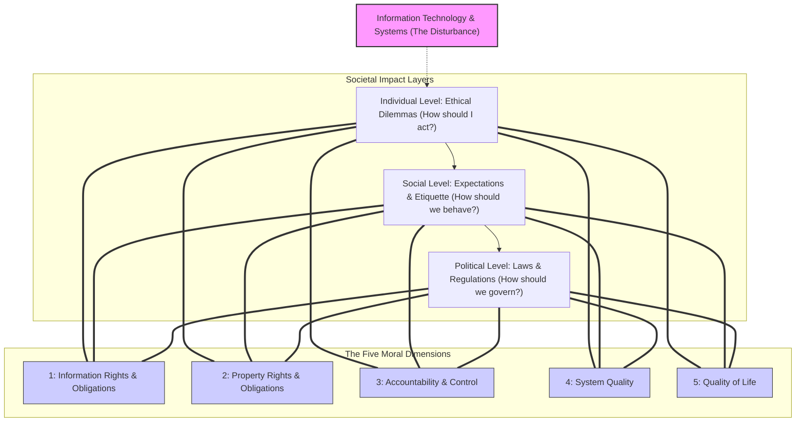
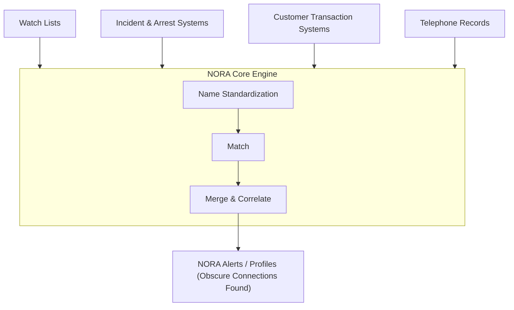
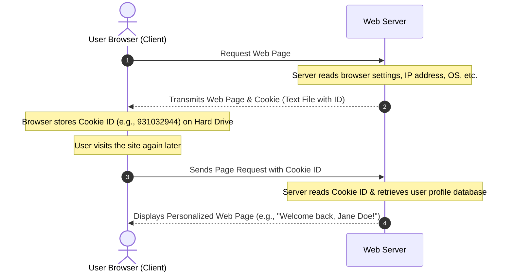

# Chapter 4: Ethical and Social Issues in Information Systems

## Learning Objectives
After reading this chapter, you will be able to answer the following questions:

- **Learning Objective 4-1:** Identify the ethical, social, and political issues raised by information systems.
- **Learning Objective 4-2:** Analyze specific principles for conduct can be used to guide ethical decisions.
- **Learning Objective 4-3:** Evaluate why contemporary information systems technology and the Internet pose challenges to the protection of individual privacy and intellectual property.
- **Learning Objective 4-4:** Assess how information systems have affected laws for establishing accountability and liability and the quality of everyday life.
- **Learning Objective 4-5:** Understand how MIS will help your career.

---

## Chapter & Video Cases

### Chapter Cases
* **Your Smartphone: Big Brother's Best Friend** (Opening Case Study)
* **The Boeing 737 MAX Crashes: What Happened and Why?** (Interactive Session - Management)
* **Do Smartphones Harm Children? Maybe, Maybe Not** (Interactive Session - Technology)
* **Facebook Privacy: Your Life for Sale**

### Video Cases
* **What Net Neutrality Means for You**
* **Facebook and Google Privacy: What Privacy?**
* **United States v. Terrorism: Data Mining for Terrorists and Innocents**

### Instructional Video
* **Viktor Mayer-Schönberger on the Right to Be Forgotten**

---

## Detailed Section Breakdowns

### 4-1: What Ethical, Social, and Political Issues are Raised by Information Systems?
Information systems raise new ethical questions because they create opportunities for intense social change, threatening existing distributions of power, money, rights, and obligations. Like steam engines or electricity, information technology can be a double-edged sword—offering benefits to many while imposing significant costs on others.

#### 1. Failed Ethical and Business Judgments
In recent years, corporate managers have repeatedly failed to exercise proper ethical judgment. In many of these cases, financial and reporting information systems were used to bury decisions and shield fraud from public scrutiny.

| Organization | Year | Ethical & Business Lapses | Impact and Consequences |
| :--- | :--- | :--- | :--- |
| **Volkswagen AG** | 2015 | Installed "defeat-device" software in over 500,000 U.S. diesel vehicles (and 10.5 million worldwide) to cheat emissions tests, while emitting pollutants far exceeding legal limits in real-world driving. | Stiff criminal charges; executive Oliver Schmidt was sentenced to 7 years in prison and fined $400,000. |
| **Wells Fargo** | 2018 | Admitted to opening millions of unauthorized customer accounts, manipulating mortgage terms, and forcing auto loan customers to purchase unneeded insurance to meet aggressive sales targets. | Fined $2.5 billion by the federal government; massive executive turnover and reputational damage. |
| **General Motors, Inc.** | 2015 | Covered up faulty ignition switches for more than a decade, leading to the deaths of at least 114 customers. | Paid billions in settlements and faced federal criminal investigation. |
| **Takata Corporation** | 2017 | Covered up reports of exploding, faulty airbags used in millions of cars over many years. | Fined $1 billion; three executives indicted; company filed for bankruptcy. |

#### 2. A Model for Thinking about Ethical, Social, and Political Issues
To understand the relationship between ethical, social, and political issues, imagine society as a calm pond in equilibrium. Toss a rock—a powerful shock of new information technology—into the center. The ripples disrupt the pond's delicate balance.
- **Ethical Issues** confront individuals who must decide how to act, often in a legal "gray area" where old rules no longer apply.
- **Social Issues** confront society, which must develop new expectations, etiquette, and social responsibilities to adapt.
- **Political Issues** confront political institutions (governments), which must write new laws to prescribe behavior and enforce penalties.

##### Explanatory Breakdown of the Flowchart (Figure 4.1)
The Ripple Model illustrates how information systems impact society at three connected levels:
1. **The Disturbance (Core):** New information technology acts like a rock thrown into a quiet pond, sending ripples outward that disrupt existing ethical, social, and political balances.
2. **Individual Level (Ethical Issues):** Individuals face ethical decisions about what actions to take in the absence of established guidelines (e.g., "Should I track customer location data because it is technically possible?").
3. **Societal Level (Social Issues):** Society must develop new norms, etiquette, and social expectations to manage the technology's impact (e.g., "Is it socially acceptable for apps to share teenage location data?").
4. **Political Level (Political Issues):** Political institutions and governments must codify rules into new laws to define rights, liabilities, and penalties (e.g., passing state-level privacy statutes or the SECURE Data Act).
5. **The Five Moral Dimensions:** These ripples intersect across five core dimensions: Information Rights, Property Rights, Accountability/Control, System Quality, and Quality of Life.

#### 3. The Five Moral Dimensions
The ethical, social, and political issues raised by information systems are organized around five moral dimensions:
1. **Information Rights and Obligations:** What information rights do individuals and organizations possess concerning themselves? What can they protect?
2. **Property Rights and Obligations:** How will traditional intellectual property rights be protected in a digital society where tracing ownership is difficult and copying is easy?
3. **Accountability and Control:** Who will be held accountable and liable for the harm done to individual and collective information and property rights?
4. **System Quality:** What standards of data and software quality should we demand to protect individual safety and the stability of society?
5. **Quality of Life:** What values should be preserved in an information-based society? Which institutions should be protected from disruption?

#### 4. Key Technology Trends that Heighten Ethical Concerns
Five major technological trends have made these ethical concerns urgent:
* **Computing power doubling every 18 months:** Organizations depend on systems for core operations, increasing vulnerability to system failures and errors.
* **Data storage costs declining rapidly:** Organizations can cheaply maintain detailed databases on individuals, making mass data collection ubiquitous.
* **Data analysis advances:** Companies can analyze vast pools of data to develop detailed profiles of individual behaviors.
* **Networking advances:** Drastically reduces the cost of moving and accessing data, enabling remote data mining and unauthorized sharing.
* **Mobile device growth:** Allows continuous tracking of locations and activities without users' explicit knowledge or control.

#### 5. Profiling & Nonobvious Relationship Awareness (NORA)
* **Profiling** is the use of computers to combine data from multiple sources (like utility bills, credit card transactions, and web searches) to build detailed electronic dossiers on individuals.
* **Nonobvious Relationship Awareness (NORA)** is a data analysis technology that correlates relationships across disparate sources (e.g., watch lists, arrest records, phone logs, and transaction systems) to find obscure connections that help identify potential criminals or terrorists.

##### Explanatory Breakdown of the Flowchart (Figure 4.2)
This diagram illustrates how Nonobvious Relationship Awareness (NORA) software ingests and processes data:
1. **Data Ingestion:** Gathers raw, seemingly disconnected records from watch lists, incident/arrest systems, customer transaction records, and telephone logs.
2. **Name Standardization:** Processes various names (e.g., "John Smith," "J. Smith," "Jon Smith") into a unified, standard indexing format.
3. **Match & Merge:** Correlates identifiers (SSNs, phone numbers, transaction locations) to merge disparate accounts.
4. **NORA Alerts:** Generates instant alerts and profile files showing non-obvious connections, helping security teams identify potential threats or connections.

---

### 4-2: What Specific Principles for Conduct Can Be Used to Guide Ethical Decisions?

#### 1. Basic Concepts: Responsibility, Accountability, Liability, and Due Process
* **Responsibility** is a key element of ethical action. It means you accept the potential costs, duties, and obligations for the decisions you make.
* **Accountability** is a feature of systems and social institutions. It means mechanisms are in place to determine who took action and who is responsible.
* **Liability** is a feature of political systems (laws). It is a body of laws in place that permits individuals to recover damages done to them by other actors.
* **Due Process** is a feature of law-governed societies. It is a process in which laws are known and understood, and there is an ability to appeal to higher authorities to ensure laws are applied correctly.

#### 2. Five Steps in an Ethical Analysis
When confronted with a situation that seems to present ethical issues, use the following five-step analysis:
1. **Identify and describe the facts clearly:** Determine who did what to whom, where, when, and how.
2. **Define the conflict or dilemma and identify the higher-order values involved:** Determine the competing values (e.g., freedom, privacy, organizational efficiency, corporate profit).
3. **Identify the stakeholders:** Pinpoint all players who have an interest in the outcome.
4. **Identify the options that you can reasonably take:** List alternatives that do not completely compromise either side.
5. **Identify the potential consequences of your options:** Determine the long-term impact and generalizability of each option.

#### 3. Candidate Ethical Principles
Six ethical principles can be used to guide decisions:
* **The Golden Rule:** Do unto others as you would have them do unto you. (Put yourself in the place of others).
* **Immanuel Kant's Categorical Imperative:** If an action is not right for everyone to take, it is not right for anyone to take.
* **Descartes' Rule of Change (Slippery Slope Rule):** If an action cannot be taken repeatedly, it is not right to take at all. (A small step today might be acceptable, but repeating it indefinitely leads to disaster).
* **The Utilitarian Principle:** Take the action that achieves the higher or greatest value. (Prioritize and rank outcomes based on their utility).
* **The Risk Aversion Principle:** Take the action that produces the least harm or the least potential cost. (Avoid options with high failure costs, even if the probability is low).
* **The Ethical "No Free Lunch" Rule:** Assume that virtually all tangible and intangible objects are owned by someone else unless there is a specific declaration otherwise. (If someone else created it and it is useful to you, it has value; you should assume the creator wants compensation).

---

### 4-3: Why Do Contemporary Information Systems Technology and the Internet Pose Challenges to the Protection of Individual Privacy and Intellectual Property?

#### 1. Privacy and Fair Information Practices (FIP)
* **Privacy** is the claim of individuals to be left alone, free from surveillance or interference from other individuals, organizations, or the state.
* **Fair Information Practices (FIP)** is a set of principles governing the collection and use of information about individuals, based on a mutuality of interest.
* **The FTC Fair Information Practice Principles:**
  1. **Notice/Awareness (Core):** Websites must disclose their information practices before collecting data.
  2. **Choice/Consent (Core):** Consumers must choose how their information is used (Opt-in vs. Opt-out).
  3. **Access/Participation:** Consumers must be able to review and contest the accuracy of their data.
  4. **Security/Integrity:** Data collectors must ensure information is secure and accurate.
  5. **Enforcement/Redress:** Mechanisms must exist to enforce FIP principles and resolve disputes.

#### 2. Privacy Legislation & Global Regulations
* **COPPA (Children's Online Privacy Protection Act):** Restricts data collection from children under 13.
* **Gramm-Leach-Bliley Act (GLBA):** Requires financial institutions to protect consumer data.
* **HIPAA (Health Insurance Portability and Accountability Act):** Protects patient medical records.
* **GDPR (General Data Protection Regulation):** The European Union's strict privacy law. It mandates explicit user consent, the "right to be forgotten", and penalizes companies that build data profiles by tracking individuals across the web.

#### 3. Internet Challenges to Privacy
* **Cookies:** Tiny text files stored on a user's hard drive that identify the visitor's browser and track activities across websites.
* **Web Beacons (Web Bugs):** Tiny software programs embedded invisibly in emails and web pages that report user clickstream data back to the file owner.
* **Spyware:** Software that downloads itself to a user's computer to monitor and report activities to third parties.
* **Opt-in vs. Opt-out Models of Informed Consent:**
  * **Opt-in:** A business is prohibited from collecting personal data unless the consumer specifically takes action to approve it. (Standard in the EU under GDPR).
  * **Opt-out:** Data collection is permitted by default until the consumer specifically requests to stop it. (Standard in the U.S.).

##### Explanatory Breakdown of the Flowchart (Figure 4.3)
This sequence diagram shows how cookie tracking operates between browser clients and servers:
1. **Request (Step 1):** The user browser requests a web page from a web server. The server reads browser attributes (IP address, operating system, browser type).
2. **Deposition (Step 2):** The server returns the requested page along with a cookie (a tiny text file containing a unique identification number) that is deposited on the user's hard drive.
3. **Identification (Step 3):** When the user visits the site again, the browser automatically transmits the page request along with the stored Cookie ID.
4. **Personalization (Step 4):** The server reads the ID, queries its database to retrieve the user's profile and browsing history, and displays a customized web page (e.g., welcome greeting, tailored recommendations).

#### 4. Intellectual Property Protection
Intellectual property is defined as tangible and intangible products of the mind created by individuals or corporations. It is protected by three legal regimes:
* **Trade Secret:** Protects any intellectual work product (formula, design, pattern) used for a business purpose. Requires active efforts by the owner to keep the information secret.
* **Copyright:** A statutory grant protecting creators from having their work copied by others for the creator's lifetime plus 70 years (or 95 years for corporate works).
* **Patent:** Grants the owner an exclusive 20-year monopoly on the ideas behind an invention. It must meet criteria of novelty, originality, and usefulness.

#### 5. Intellectual Property Challenges in the Digital Age
Digital media can be copied and distributed globally via peer-to-peer file sharing networks. 
* **The Digital Millennium Copyright Act (DMCA)** adjusted copyright laws to the digital age, making it illegal to circumvent technology-based copyright protections and establishing "Safe Harbor" protections for Internet Service Providers (ISPs).

---

### 4-4: How Have Information Systems Affected Laws for Establishing Accountability and Liability and the Quality of Everyday Life?

#### 1. Software Liability Problems
Holding software service providers liable for failures remains difficult. Software is often treated as a service rather than a physical product. Courts are reluctant to impose strict liability on software because its high complexity makes it impossible to guarantee 100% bug-free code.

#### 2. System Quality: Bug, Errors, and Data Quality
Three principal sources of system quality problems are:
1. **Software bugs and errors** (inherent in complex code).
2. **Hardware or facility failures** caused by natural or other causes.
3. **Poor input data quality** (the most frequent cause of system failure and business disruption).

#### 3. Quality of Life Impacts
* **Balancing Power:** While decentralized technology exists, giant central organizations (like Google, Amazon, Meta) hold unprecedented market power.
* **Rapidity of Change:** Reduced response time to competition creates high-stress, "just-in-time" business environments.
* **Maintaining Boundaries:** Mobile devices and remote access tools erase boundaries between work and personal life.
* **Dependence and Vulnerability:** Modern businesses and governments are highly dependent on complex information systems, with very few safety-net standards.
* **Computer Crime and Abuse:**
  * **Computer Crime:** Committing illegal acts using computers (e.g., hacking, malware, botnets).
  * **Computer Abuse:** Unethical but not necessarily illegal acts (e.g., sending spam, heavy web tracking).
* **Employment:** Reengineering business processes leads to technological job displacement.
* **Equity and Access (Digital Divide):** High-quality information services are concentrated among wealthier, highly educated segments of society.
* **Health Risks:**
  * **Repetitive Stress Injury (RSI):** Forced repetitive muscle actions (e.g., keyboarding).
  * **Carpal Tunnel Syndrome (CTS):** Pressure on the median nerve in the wrist's carpal tunnel.
  * **Computer Vision Syndrome (CVS):** Eyestrain and dryness related to display screen use.

---

### 4-5: How Will MIS Help My Career?
* **Career Pathways:** Complex privacy laws (like GDPR) and security standards have created high demand for roles like **Chief Privacy Officers**, **Security Analysts**, and **Compliance Managers**.
* **Skills Needed:** Implementing access controls, drafting data use policies, and designing ethical frameworks for data collection.

---

## Case Study Questions & Answers

### Chapter-Opening Case Study: Your Smartphone: Big Brother's Best Friend
#### Q1: Does analyzing mobile phone location data create an ethical dilemma? Why or why not?
**Answer:**
Yes, mobile location tracking creates a significant ethical dilemma. The dilemma involves a direct conflict between two highly valued but competing interests:
1. **Organizational Efficiency & Commercial Utility:** Location tracking provides massive value. For users, it enables real-time navigation, weather updates, and localized business recommendations. For organizations, it offers traffic analysis, public health tracking (e.g., social distancing during pandemics), and highly targeted advertising that drives business revenue.
2. **Individual Privacy & Autonomy:** Continuous location tracking harvests sensitive personal details. It reveals whom a person meets, where they sleep, their religious affiliations (places of worship), and medical visits (e.g., psychiatrists). Because collection is often opaque—mediated by dense, incomprehensible Terms of Service agreements and SDKs hidden inside unrelated apps—users cannot provide truly informed consent. The potential for profiling, surveillance, and discrimination creates an ethical imperative to protect individual rights.

#### Q2: Should there be new privacy laws to protect personal data collected from mobile phone users? Why or why not?
**Answer:**
Yes, new and robust privacy laws are needed. Under the current legal framework in the United States, once location data is collected, there are very few restrictions on how it can be sold, shared, or analyzed. The prevailing "notice and consent" model (clicking "I agree" on terms of service) is broken. New regulations should:
1. **Enforce an Opt-In Standard:** Location tracking should be disabled by default, requiring explicit, granular consent for specific, disclosed uses.
2. **Restrict Third-Party Sharing:** Prevent companies from bundling tracking SDKs into unrelated apps (like the iHeartRadio case sending location data to Cuebiq) or selling location dossiers to data brokers.
3. **Establish Data Erasure Rights:** Grant users the right to inspect and permanently delete their location history.
4. **Mandate De-identification Standards:** Require strict technical verification of "anonymity," as location histories are easily re-identified to real individuals.

---

### Interactive Session Management: The Boeing 737 MAX Crashes: What Happened and Why?
#### Q1: What is the problem described in this case? Would you consider it an ethical dilemma? Why or why not?
**Answer:**
* **The Problem:** The design, self-certification, and rushed rollout of the Boeing 737 MAX aircraft. To compete with Airbus's A320neo, Boeing retrofitted its existing 737 airframe with larger, more efficient engines. Because of their size, the engines had to be placed higher and further forward on the wing, which altered the aerodynamics and created a tendency for the nose to pitch upward during flight. To prevent stalls, Boeing installed the Maneuvering Characteristics Augmentation System (MCAS). Flawed software design caused MCAS to rely on a single Angle-of-Attack (AOA) sensor. When this sensor failed, it triggered MCAS to repeatedly force the nose down. Pilots, who were never trained on MCAS or simulator runs, could not override the system, leading to the crashes of Lion Air Flight 610 and Ethiopian Airlines Flight 302, killing 346 people.
* **Ethical Dilemma:** Yes, it is a clear ethical dilemma between corporate profits/market competitiveness and safety. Boeing's management faced intense competitive pressure from Airbus. To minimize costs and speed up production, they chose to hide MCAS details from the FAA and pilots, cut corners on training (using two-hour iPad lessons instead of simulator runs), and sold critical safety indicators (the AOA disagreement alert) as expensive optional add-ons rather than making them standard.

#### Q2: Describe the role of management, organization, and technology factors in the Boeing 737 MAX safety problems. To what extent was management responsible?
**Answer:**
* **Management Factors:** Management was highly responsible. They prioritized financial efficiency and rapid market entry over engineering redundancy and pilot safety education. They pressured regulators, hid critical system modifications, lobbied to keep MCAS out of flight manuals, and decided to charge extra for critical safety alerts.
* **Organizational Factors:** An organizational culture focused on cost-reduction compromised safety engineering. Furthermore, the FAA's lack of resources led to regulatory capture, allowing Boeing to self-certify 96% of its own work, which removed independent verification. Airline companies also shared responsibility by declining to purchase the optional safety alerts to save money.
* **Technology Factors:** The technology lacked basic fail-safe redundancies. MCAS was designed with a single point of failure (relying on one AOA sensor instead of two). The software also had excessive authority, continuously overriding manual pilot inputs. Additionally, the lack of simulator software in the development phase made real-world testing and training inadequate.

#### Q3: Is the solution provided by Boeing adequate? Explain your answer.
**Answer:**
Boeing's initial response was defensive and inadequate. However, their subsequent software patches—which require MCAS to compare data from both AOA sensors, limit MCAS activation to a single occurrence, prevent the system from overriding manual control, make the AOA disagreement alert standard, and mandate simulator training for all pilots—are technically adequate to address the immediate mechanical failures. Nevertheless, the deeper organizational culture of prioritizing speed over safety and the FAA's reliance on self-certification require systemic, long-term regulatory reforms to be fully resolved.

#### Q4: What steps could Boeing and the FAA have taken to prevent this problem from occurring?
**Answer:**
* **Boeing:** Should have designed MCAS with dual-sensor comparison from the start. They should have maintained absolute transparency, disclosing the system's existence and mechanics in pilot manuals and test pilot briefings. They should have made the simulator training mandatory before the aircraft went into service.
* **The FAA:** Should have refused to delegate 96% of certification to Boeing, especially for a new, automated flight-control system. They should have assigned independent, experienced engineers to evaluate MCAS, run independent flight simulations, and rejected Boeing's request to omit MCAS from manuals.

---

### Interactive Session Technology: Do Smartphones Harm Children? Maybe, Maybe Not
#### Q1: Identify the problem described in this case study. In what sense is it an ethical dilemma?
**Answer:**
* **The Problem:** The potential negative psychological, physiological, and social impacts of heavy smartphone and social media use on children and teenagers. Specific concerns include classroom distraction, reduced focus, sleep deprivation, and correlations with rising anxiety, depression, and suicide rates.
* **Ethical Dilemma:** The dilemma balances the commercial and educational benefits of digital connectivity (instant communication, access to information, learning tools, and tech corporate profits) against the moral duty to protect vulnerable children from potentially addictive, deregulated technology that disrupts healthy development.

#### Q2: Compare the research findings approving or disapproving of smartphone use among children and teenagers.
**Answer:**
* **Disapproving (Harm View):** Research by Jean Twenge demonstrates that teens spending 3+ hours a day on devices have a 35% higher risk of suicide, and 5+ hours increases the risk by 71%. Heavy social media use correlates with a 27% increase in depression among eighth-graders. Surveyed teachers report that 67% of students are distracted by devices and 75% show decreased focus. Sleep deprivation is 51% more likely for heavy screen users.
* **Approving (No Proven Harm View):** Research by Candice Odgers, Madeleine Jensen, Amy Orben, and Jeff Hancock finds the link between social media and adolescent anxiety to be small, inconsistent, and non-causal. Hancock's meta-analysis suggests that the net effect of phone use on well-being is essentially zero compared to sleep or diet. They argue that depression may drive phone usage (reverse causality), rather than the phone causing the depression.

#### Q3: Should restrictions be placed on children's and teenagers' smartphone use? Why or why not?
**Answer:**
* **Yes (Arguments for restrictions):** Yes, restrictions are necessary because children lack the self-regulation to resist tech products designed to be addictive (infinite scroll, notifications). Restrictions, such as banning phones in classrooms and setting screen-time limits at night, protect sleep quality, improve academic performance, and encourage crucial face-to-face social interaction and exercise.
* **No (Arguments against restrictions):** Broad bans are counterproductive. They cut off teenagers from essential communication channels and peer-group coordination. Instead of hard bans, parents and educators should focus on digital literacy, teaching healthy tech habits, and addressing the root causes of anxiety and depression (which smartphones merely reflect, rather than cause).

---

### Case Study 4: Career Case: Junior Privacy Analyst at Pinnacle Air Force Base
#### Q1: What background or job experience do you have in the privacy protection field?
**Answer:**
Academic coursework in MIS covering data privacy laws (GDPR, CCPA, COPPA, HIPAA) and corporate compliance standards. Practical experience includes auditing mock databases for compliance with data minimization principles and drafting organizational data-use policies in team capstone projects.

#### Q2: What do you know about the Privacy Act?
**Answer:**
The Privacy Act of 1974 is a landmark federal statute regulating how U.S. government agencies collect, maintain, use, and disseminate personally identifiable information (PII) about citizens and legal permanent residents. It mandates that agencies provide notice of their record systems (SORNs), grants individuals the right to inspect and request corrections to their records, and prohibits disclosure of PII without prior written consent unless a statutory exception (such as "routine use") applies.

#### Q3: What do you know about privacy protection practices for both written and electronic correspondence?
**Answer:**
* **Written Correspondence:** Physical documents containing sensitive information must be marked appropriately, stored in locked filing cabinets, processed only by authorized personnel, and shredded using micro-cut shredders.
* **Electronic Correspondence:** Email transmission of PII must be encrypted in transit (using TLS/PGP) and at rest. Access controls must enforce the principle of least privilege, requiring multi-factor authentication (MFA). Redaction of sensitive fields (SSNs, birthdays) must be performed using permanent cryptographic redaction software, not simple visual blocks.

#### Q4: If you were asked to improve privacy protection for our organization, how would you proceed?
**Answer:**
1. **Conduct a Privacy Impact Assessment (PIA):** Inventory all data flows to identify where PII is collected, processed, and stored.
2. **Enforce Data Minimization:** Purge records that are no longer necessary for operational transactions.
3. **Implement Granular Access Controls:** Audit systems to restrict database access based on specific job roles.
4. **Mandate Employee Training:** Establish regular security and compliance drills for HR staff.
5. **Deploy Encryption & Anonymization:** Ensure all PII is encrypted at rest and anonymized/pseudonymized in testing environments.

#### Q5: Have you ever dealt with a problem involving privacy protection? What role did you play in its solution?
**Answer:**
During a group database project, I noticed a development server was using a real customer dataset containing unencrypted phone numbers and emails. I flagged this vulnerability as a major compliance risk and led the group to implement a data-masking script that replaced the real PII with synthetic mock data for the staging environment.

---

## Review Questions & Answers

### 4-1: What ethical, social, and political issues are raised by information systems?

#### Q1: Explain how ethical, social, and political issues are connected and give some examples.
**Answer:**
Ethical, social, and political issues are tightly coupled. Ethical issues concern individual choices in gray areas. Social issues represent societal norms and expectations. Political issues involve codifying these expectations into laws. For example, the capability to track cell phones creates an ethical issue for developers (should they track?), a social issue for communities (is constant surveillance polite or healthy?), and a political issue for legislators (passing laws like CCPA to protect consumers).

#### Q2: List and describe the key technological trends that heighten ethical concerns.
**Answer:**
1. **Computing power doubling every 18 months:** Organizations depend on systems for core operations, increasing vulnerability to system failures and errors.
2. **Data storage costs declining rapidly:** Organizations can cheaply maintain detailed databases on individuals, making mass data collection ubiquitous.
3. **Data analysis advances:** Companies can analyze vast pools of data to develop detailed profiles of individual behaviors.
4. **Networking advances:** Drastically reduces the cost of moving and accessing data, enabling remote data mining and unauthorized sharing.
5. **Mobile device growth:** Allows continuous tracking of locations and activities without users' explicit knowledge or control.

#### Q3: Differentiate between responsibility, accountability, and liability.
**Answer:**
* **Responsibility:** Accepting the potential costs, duties, and obligations for the decisions you make.
* **Accountability:** A feature of systems and social institutions that determines who took action and who is responsible.
* **Liability:** A feature of political systems (laws) that permits individuals to recover damages done to them by other actors.

---

### 4-2: What specific principles for conduct can be used to guide ethical decisions?

#### Q1: List and describe the five steps in an ethical analysis.
**Answer:**
1. **Identify and describe the facts clearly:** Determine who did what to whom, where, when, and how.
2. **Define the conflict or dilemma and identify the higher-order values involved:** Determine the competing values (e.g., freedom, privacy, organizational efficiency, corporate profit).
3. **Identify the stakeholders:** Pinpoint all stakeholders.
4. **Identify the options that you can reasonably take:** List alternatives that do not completely compromise either side.
5. **Identify the potential consequences of your options:** Determine the long-term impact and generalizability of each option.

#### Q2: Identify and describe six ethical principles.
**Answer:**
1. **The Golden Rule:** Do unto others as you would have them do unto you. (Put yourself in the place of others).
2. **Immanuel Kant's Categorical Imperative:** If an action is not right for everyone to take, it is not right for anyone to take.
3. **Descartes' Rule of Change (Slippery Slope Rule):** If an action cannot be taken repeatedly, it is not right to take at all. (A small step today might be acceptable, but repeating it indefinitely leads to disaster).
4. **The Utilitarian Principle:** Take the action that achieves the higher or greatest value. (Prioritize and rank outcomes based on their utility).
5. **The Risk Aversion Principle:** Take the action that produces the least harm or the least potential cost. (Avoid options with high failure costs, even if the probability is low).
6. **The Ethical "No Free Lunch" Rule:** Assume that virtually all tangible and intangible objects are owned by someone else unless there is a specific declaration otherwise. (If someone else created it and it is useful to you, it has value; you should assume the creator wants compensation).

---

### 4-3: Why do contemporary information systems technology and the Internet pose challenges to the protection of individual privacy and intellectual property?

#### Q1: Define privacy and Fair Information practices.
**Answer:**
* **Privacy:** The claim of individuals to be left alone, free from surveillance or interference from other individuals, organizations, or the state.
* **Fair Information Practices (FIP):** A set of principles governing the collection and use of information about individuals, based on a mutuality of interest.

#### Q2: Explain how the Internet challenges the protection of individual privacy and intellectual property.
**Answer:**
* **Privacy Challenges:** The Internet allows tracking tools (cookies, web beacons, spyware) to capture user clickstream logs invisibly. Websites collect detailed data without explicit user consent, violating FIP principles.
* **Intellectual Property Challenges:** Digital files (music, software, e-books) can be copied perfectly, distributed globally in seconds via peer-to-peer (P2P) networks, bypassing traditional copyright, trademark, and patent protections.

#### Q3: Explain how informed consent, legislation, industry self-regulation, and technology tools help protect the individual privacy of Internet users.
**Answer:**
* **Informed Consent:** Ensures users understand what data is collected and actively opt-in.
* **Legislation:** Laws like GDPR, HIPAA, and CCPA penalize non-compliance.
* **Self-regulation:** Industry seals (TRUSTe) and voluntary codes of conduct.
* **Technology Tools:** VPNs, cookie blockers, encryption, and Tor browsers.

#### Q4: List and define the three regimes that protect intellectual property rights.
**Answer:**
1. **Trade Secrets:** Protects any intellectual work product (formula, design, pattern) used for a business purpose. Requires active efforts by the owner to keep the information secret.
2. **Copyright:** A statutory grant protecting creators from having their work copied by others for the creator's lifetime plus 70 years (or 95 years for corporate works).
3. **Patents:** Grants the owner an exclusive 20-year monopoly on the ideas behind an invention. It must meet criteria of novelty, originality, and usefulness.

---

### 4-4: How have information systems affected laws for establishing accountability and liability and the quality of everyday life?

#### Q1: Explain why it is so difficult to hold software services liable for failure or injury.
**Answer:**
Software is often classified legally as a service or book/information rather than a physical product, exempting it from strict product liability laws. Furthermore, software is highly complex, and courts recognize that mandating 100% bug-free code would stymie innovation.

#### Q2: List and describe the principal causes of system quality problems.
**Answer:**
1. **Software bugs and errors** (inherent in complex code).
2. **Hardware or facility failures** caused by natural or other causes.
3. **Poor input data quality** (the most frequent cause of system failure and business disruption).

#### Q3: Name and describe four quality of life impacts of computers and information systems.
**Answer:**
1. **Balancing Power:** While decentralized technology exists, giant central organizations (like Google, Amazon, Meta) hold unprecedented market power.
2. **Rapidity of Change:** Reduced response time to competition creates high-stress, "just-in-time" business environments.
3. **Maintaining Boundaries:** Mobile devices and remote access tools erase boundaries between work and personal life.
4. **Equity and Access (Digital Divide):** High-quality information services are concentrated among wealthier, highly educated segments of society.

#### Q4: Define and describe computer vision syndrome and repetitive stress injury (RSI) and explain their relationship to information technology.
**Answer:**
* **RSI:** Occupational disease from repetitive muscle actions (e.g., keyboarding).
* **CTS:** Compression of the median nerve in the wrist.
* **Computer Vision Syndrome:** Eyestrain/dryness from viewing screens.
* **Relationship:** Direct outcomes of prolonged screen time and poor ergonomics in modern IT workplaces.

---

## Glossary of Technical Terms

1. **Accountability:** A feature of systems and social institutions that determines who took action and who is responsible.
2. **Behavioral Targeting:** Tracking the clickstreams of individuals on thousands of databases for the purpose of understanding their interests and exposing them to targeted ads.
3. **Carpal Tunnel Syndrome (CTS):** A type of RSI in which pressure on the median nerve through the wrist's bony carpal tunnel structure produces pain and numbness.
4. **Computer Abuse:** The commission of acts involving a computer that may not be illegal but are considered unethical (e.g., sending spam).
5. **Computer Crime:** The commission of illegal acts through the use of a computer or against a computer system.
6. **Computer Vision Syndrome (CVS):** Any eyestrain condition related to display screen use in computers, laptops, tablets, and smartphones.
7. **Cookies:** Tiny text files deposited on a computer hard drive when a user visits certain websites. Cookies identify the visitor's web browser software and track visits.
8. **Copyright:** A statutory grant protecting creators of intellectual property from having their work copied by others for the creator's life plus 70 years (or 95 years for corporate works).
9. **Digital Divide:** The cleavage between social classes and geographic areas based on access to and capability of using digital technologies.
10. **Digital Millennium Copyright Act (DMCA):** A US law that adjusted copyright laws to the digital age by outlawing the circumvention of copyright protection systems and providing a safe harbor for ISPs.
11. **Due Process:** A process in which laws are known and understood, and there is an ability to appeal to higher authorities to ensure laws are applied correctly.
12. **Ethical "No Free Lunch" Rule:** Assume that virtually all tangible and intangible objects are owned by someone else unless there is a specific declaration otherwise.
13. **Ethics:** The principles of right and wrong that individuals, acting as free moral agents, use to make choices to guide their behaviors.
14. **Fair Information Practices (FIP):** A set of principles governing the collection and use of information about individuals, based on a mutuality of interest between the record holder and the individual.
15. **General Data Protection Regulation (GDPR):** A comprehensive European Union data privacy law that establishes strict rules for consent, profiling, and data portability.
16. **Golden Rule:** Put yourself in the place of others and think of yourself as the object of the decision (Do unto others as you would have them do unto you).
17. **Immanuel Kant's Categorical Imperative:** If an action is not right for everyone to take, it is not right for anyone to take.
18. **Information Rights:** The rights that individuals and organizations have with respect to information that pertains to themselves.
19. **Informed Consent:** Consent given with knowledge of all the facts needed to make a rational decision.
20. **Intellectual Property:** Tangible and intangible products of the mind created by individuals or corporations.
21. **Liability:** A feature of political systems in which a body of laws is in place that permits individuals to recover damages done to them by other actors.
22. **Nonobvious Relationship Awareness (NORA):** A data analysis technology that can take information about people from many disparate sources and correlate relationships to find obscure connections (e.g., matching watch lists and telephone records).
23. **Opt-in:** A model of informed consent in which a business is prohibited from collecting personal information unless the consumer specifically takes action to approve it.
24. **Opt-out:** A model of informed consent in which the collection of personal information is allowed until the consumer specifically requests that the data not be collected.
25. **Patent:** A statutory grant that protects creators of inventions by granting the owner an exclusive monopoly on the ideas behind an invention for 20 years.
26. **Privacy:** The claim of individuals to be left alone, free from surveillance or interference from other individuals, organizations, or the state.
27. **Profiling:** The use of computers to combine data from multiple sources and create electronic dossiers of detailed information about individuals.
28. **Repetitive Stress Injury (RSI):** An occupational disease occurring when muscle groups are forced through repetitive actions under high-impact loads or tens of thousands of repetitions under low-impact loads.
29. **Responsibility:** Accepting the potential costs, duties, and obligations for the decisions you make.
30. **Risk Aversion Principle:** Take the action that produces the least harm or the least potential cost.
31. **Safe Harbor:** A private, self-regulating policy and enforcement mechanism that meets the objectives of government regulators but does not involve government regulation.
32. **Slippery Slope Rule (Descartes' Rule of Change):** If an action cannot be taken repeatedly, it is not right to take at all.
33. **Spam:** Unsolicited commercial email (UCE).
34. **Spyware:** Software that downloads itself to a user's computer and runs in the background, reporting activities to an advertiser or third party.
35. **Trade Secret:** Any intellectual work product (formula, pattern, compilation) used for a business purpose, provided it is not based on public domain information.
36. **Trademarks:** Graphic symbols, designs, or words used to identify and distinguish products or services in the marketplace.
37. **Utilitarian Principle:** Take the action that achieves the higher or greatest value.
38. **Web Beacons (Web Bugs):** Tiny software programs that keep a record of users' online clickstreams and report this data back to the file owner.

---

## 2026 Appendix: Emerging Technological & Legal Shifts

### 1. The U.S. Privacy Landscape Patchwork
* **State-Level Expansion:** As of 2026, the fragmentation of American consumer data privacy policy has grown to include 19 states with comprehensive privacy statutes actively in effect. Notably, Indiana, Kentucky, and Rhode Island officially joined this active framework on January 1, 2026.
* **The SECURE Data Act of 2026:** Introduced as H.R. 8413, the *Securing and Establishing Consumer Uniform Rights and Enforcement over Data Act* represents the most significant push toward a unified federal privacy standard.
* **Key Provisions:** It mandates strict **Data Minimization** rules (limiting data collection to only what is necessary for a transaction), establishes comprehensive consumer rights to access, copy, and delete records, requires the FTC to run a **National Data Broker Registry**, and mandates an explicit opt-in for processing the sensitive data of teenagers aged 13 to 16. The law applies to entities managing data for over 200,000 U.S. consumers, exempting small businesses grossing under $25 million.

### 2. The EU AI Act Implementation
* **The August 2026 Transparency Cliff:** The European Union's landmark risk-based AI framework reaches its critical enforcement milestone on August 2, 2026, rolling out strict Article 50 transparency mandates.
* **Key Provisions:** Businesses deploying AI interaction engines (like chatbots) must clearly notify users immediately. Generative AI providers must embed machine-readable watermarks and detection signatures into synthetic audio, images, video, and text.
* **Public Interest Exception:** A vital exception exists: deployers publishing AI-assisted text to inform the public are exempt from synthetic labeling only if the content undergoes substantive human review and editorial control where a real person takes legal responsibility. Non-compliance penalties remain massive, topping out at €35 million or 7% of global annual turnover.

### 3. Intellectual Property, GenAI, and the DMCA
* **The Data Ingestion Battle:** The traditional framework of the Digital Millennium Copyright Act (DMCA) is undergoing unprecedented structural strain due to multi-district class-action litigation against generative AI companies. Creators, visual artists, and publishers argue that the mass ingestion of copyrighted creative works, scraping of proprietary databases (like the LAION datasets), and synthetic cloning of audio tracks for model training without express licensing, compensation, or attribution constitutes systemic copyright infringement, challenging legacy **fair use** interpretations.
