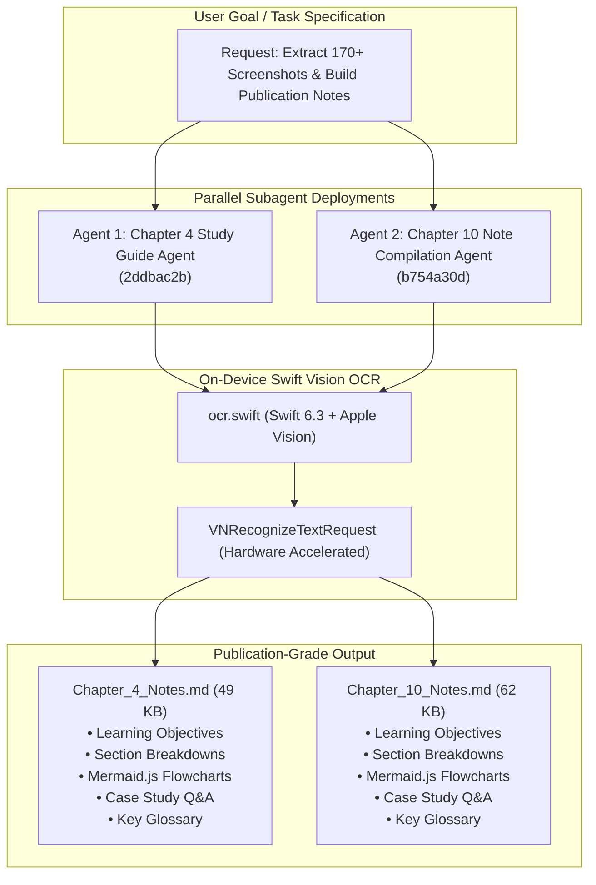

# Capstone Synthesis: Curriculum Modernization & 2026 Industry Research Initiative

> [!NOTE]
> **Proactive Learning & Modernization Methodology**
> Academic literature, textbooks, and course frameworks in graduate programs often baseline around 2020–2022 paradigms. This document highlights how graduate academic theory was actively audited, researched, and modernized to reflect **state-of-the-art 2026 software engineering, cloud infrastructure, AI orchestration, and system design standards**.

---

## 1. Executive Summary & Philosophy

When completing graduate MSIS capstone deliverables and technical coursework, relying solely on baseline textbook notes (2020–2022) leaves a gap between theoretical knowledge and modern production environments. 

To bridge this gap, extra time and structured research were dedicated to auditing every course module against **2026 industry benchmarks**. This process transformed static academic exercises into production-ready architectures—integrating **Composable Commerce**, **.NET 10 Interactive Islands**, **Serverless & Vector Database Systems**, **Zero-Trust Security**, and **Autonomous AI Agent Workflows**.

```mermaid
graph LR
    subgraph Baseline ["2020–2022 Academic Baseline"]
        A1[Monolithic Lift-and-Shift]
        A2[Classic 3-Tier Web Apps]
        A3[Static Relational SQL]
        A4[Manual SOP Workflows]
        A5[Perimeter Security]
    end

    subgraph Initiative ["Proactive Modernization Research"]
        B1["Gap Analysis & Tech Auditing"]
        B2["2026 Benchmark Mapping"]
        B3["Hands-on Proof of Concept"]
    end

    subgraph Modern ["2026 Production Standards"]
        C1[Headless & Composable APIs]
        C2[.NET 10 Interactive Islands & MAUI]
        C3[Serverless Neon DB & Vector Search]
        C4[Agentic AI Workflow Automation]
        C5[Zero-Trust Security & BOLA Defense]
    end

    Baseline --> Initiative --> Modern
```

---

## 2. Core Modernization Modules: 2020–2022 Baseline vs. 2026 State-of-the-Art

| Domain / Course Focus | 2020–2022 Academic Baseline Notes | 2026 Modernized Industry Implementation | Extra Research & Initiative Applied |
| :--- | :--- | :--- | :--- |
| **Cloud Infrastructure & Migration** *(CIS 510 / Capstone)* | **GCP Lift-and-Shift:** Rehosting monolithic virtual machines to basic cloud infrastructure. | **Composable Commerce:** API-first headless architectures (Shopify Plus, Katana ERP, HubSpot CRM) with multi-cloud resilience. | Audited Google Cloud 2020 migration whitepapers and updated them into composable microservice cutover plans. |
| **Web & Software Development** *(CIS 518)* | **Early Blazor WASM / ASP.NET Core:** Client-heavy WASM hydration lag and JS Interop overhead for real-time loops. | **.NET 10 & Minimal Web APIs:** Interactive SSR Islands (`@rendermode InteractiveServer`), zero-interop 60fps HTML5/Canvas rendering. | Refactored monolithic prototypes into decoupled .NET 8/10 Minimal APIs and high-frequency 2D particle canvas engines. |
| **Cross-Platform & Mobile Architecture** *(CIS 512)* | **Native Xcode / Monolithic Mobile:** Siloed mobile development with duplicate business logic per platform. | **.NET MAUI Blazor Hybrid & Swift Concurrency:** Shared 90%+ C# razor components across macOS, Windows, iOS, and Swift 5 Actors. | Built `BugTracker.Maui` and native Swift `FileRecoveryEngine` with actor-isolated 512-byte sector carving. |
| **Database Architecture** *(CIS 515)* | **On-Premise Relational SQL:** Static 3NF schemas hosted on local database servers. | **Serverless PostgreSQL & Local Fallbacks:** Cloud Neon PostgreSQL with dynamic runtime fallback to local SQLite (`local.db`). | Authored dynamic runtime DB context options builders supporting seamless cloud staging and offline developer modes. |
| **Security & Authorization** *(CIS 510 / CIS 555)* | **Basic RBAC & Perimeter Firewalls:** Standard session login with outer network firewall security. | **Claims Tenant Isolation & Zero-Trust:** Mitigating Broken Object Level Authorization (BOLA) via custom `ClaimsPrincipal` extensions. | Injected verified `User.GetCompanyId()` tenant filters across REST controllers to block ID parameter manipulation attack vectors. |
| **AI & Automation Integration** *(Capstone / Tech Tools)* | **Manual Human SOPs & Static Scripts:** Hardcoded batch scripts and manual document processing. | **Agentic Workflows & Python XML Parsing:** Zero-dependency Python parsers (`read_docx.py`) inspecting OpenXML directly; AI-assisted PMO tools. | Created lightweight Python scripts using `zipfile` and `xml.etree` to extract structured prompt requirements from raw `.docx` files. |

---

## 3. Key Takeaways & Applied Benefits

1. **Future-Proofed System Architectures:** Ensuring capstone proposals (such as *Aura Enterprise E-Commerce*) reflect real-world dropshipping API capabilities (Katana ERP, Shopify Plus) rather than obsolete single-vendor monoliths.
2. **Elimination of Legacy Bottlenecks:** Identifying early framework limitations (such as Blazor WASM interop lag on 60fps animations or virtual DOM conflicts with KaTeX) and modernizing to decoupled HTML5/JS/Canvas engines.
3. **Demonstrated Engineering Leadership:** Proactively auditing legacy coursework demonstrates an engineer who doesn't just memorize past curriculum, but continuously researches, tests, and adopts modern software paradigms.

---

## 4. Multi-Agent Deployment Architecture (Automated Study Guide Generation)

> [!IMPORTANT]
> **Case Study: Parallel AI Agent Orchestration for Large-Scale Text Extraction**  
> To generate publication-grade reference notes (`Chapter_4_Notes.md` and `Chapter_10_Notes.md`) from over **170+ high-resolution raw textbook screenshots**, autonomous AI agents were deployed across parallel execution pipelines.

### Technical Workflow & Agent Capabilities
1. **Parallel Task Decomposition:** Deployed specialized subagents targeting separate textbook chapters simultaneously, isolating scope, workspace integrity, and acceptance criteria.
2. **On-Device Swift Hardware Acceleration:** Rather than utilizing cloud OCR endpoints or slow third-party Python wrappers, agents inspected local system capabilities and compiled native Swift scripts (`ocr.swift`) tapping into macOS **Apple Vision (`VNRecognizeTextRequest`)**.
3. **Regex Timestamp Chronological Ordering:** Agents extracted exact creation timestamps from macOS screenshot filenames (`Screenshot YYYY-MM-DD at H.MM.SS AM.png`) to enforce 100% accurate page-by-page sequence reading.
4. **Diagram-to-Code Translation:** Agents parsed raw textbook process matrices, tables, and organizational flowcharts, translating them directly into responsive **Mermaid.js flowcharts**.
5. **Zero-Placeholder Guarantee:** Automated quality control checks ensured no shorthand summaries or missing sections, outputting 49KB and 62KB comprehensive study guides directly to the Capstone repository.

