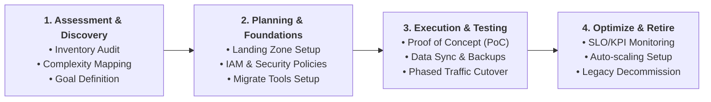
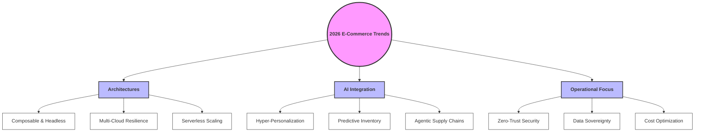

# E-Commerce Cloud Migration & Modernization Notes

This note combines foundational migration strategies from the Google Cloud Platform (GCP) e-commerce migration framework with modern e-commerce cloud trends (2025–2026) focusing on composable architectures and AI orchestration.

---

## 1. Google Cloud Platform (GCP) E-Commerce Migration Framework

### What is E-Commerce Migration?
* **Definition:** Taking an existing on-premises or legacy virtualized e-commerce application and moving it to cloud infrastructure. 
* **First Step:** Often begins as a "lift-and-shift" (rehosting) to move workloads quickly into the cloud, serving as the foundation for eventual refactoring and modernization.

### The 4-Phase Migration Methodology

#### A. Assessment and Discovery
* **Inventory Audit:** Identify and catalog all running databases, code dependencies, and third-party integrations (e.g., payment gateways, search bars).
* **Complexity Mapping:** Categorize applications by business criticality and cloud readiness.
* **Goal Definition:** Determine whether the firm seeks a rapid rehost or an immediate transition to cloud-native microservices.

#### B. Planning and Foundational Setup
* **Landing Zone Architecture:** Build out secure cloud foundations—including Identity & Access Management (IAM), network topologies (VPCs), and compliance guards—before migrating data.
* **Tooling Implementation:** Deploy automated migration tools (such as *Migrate for Compute Engine*) to minimize manual configuration errors.

#### C. Execution and Testing
* **Proof of Concept (PoC):** Move a low-risk, non-critical service first to validate the pipeline.
* **Phased Traffic Cutover:** Shift user traffic progressively rather than executing a total single-moment cutover. Start by routing a tiny fraction (~1%) of active traffic to the cloud to monitor for errors, scaling up as stability is proven.

#### D. Optimization and Decommissioning
* **Performance Monitoring:** Define Service Level Objectives (SLOs) and track performance using Cloud Monitoring dashboards.
* **Compute Optimization:** Configure auto-scaling and pre-allocate compute reservations to handle sudden traffic spikes (e.g., Black Friday).
* **Legacy Sunset:** Decommission on-premises hardware only after the cloud platform operates stably for a predefined period.

---

## 2. Modern E-Commerce Cloud Modernization Trends (2025–2026)

E-commerce migrations have evolved from simple IT rehosting projects into **business-led strategic modernizations**. The primary goal is no longer just "getting to the cloud," but optimizing platforms for agility, profitability, and AI.

### Key Trends Shaping the 2025–2026 Landscape

#### A. Composable and Headless Commerce
* **API-First Modular Stacks:** Monolithic suites are being dismantled in favor of composable commerce. Businesses migrate separate modules (checkout, catalog, search, cart) independently, using APIs to coordinate services. This allows companies to swap out specific vendors without breaking the entire platform.
* **Headless Setup:** Decoupling the frontend user interface (head) from the backend database logic, enabling rapid design changes across mobile apps, websites, and IoT devices.

#### B. Native AI and Autonomous Agent Orchestration
* **AI-Ready Infrastructure:** Cloud databases are migrated directly to vector-enabled databases to support real-time semantic searches and generative recommendations.
* **Agentic Workflows:** Supply chain and ordering processes utilize autonomous AI agents that negotiate with suppliers' systems, manage predictive restocks, and handle customer service issues without human intervention.

#### C. Multi-Cloud and Hybrid Architectures
* **Lock-in Avoidance:** Enterprises increasingly distribute their core value chains across multiple cloud platforms (e.g., database on GCP, frontend on AWS) to prevent single-provider downtime and maximize cost efficiency.

#### D. Data Sovereignty and Zero-Trust Security
* **Sovereign Cloud Environments:** Stricter international regulations require e-commerce databases to store and process customer data locally within national borders.
* **Zero-Trust Networks:** Security models assume breach and require continuous authentication for every microservice interaction, safeguarding payment transactions.

---

## 3. Comparison: 2020 vs. 2026 Migration Paradigms

| Feature | 2020 Paradigm (Classic Cloud Migration) | 2026 Paradigm (Modern Cloud Transformation) |
| :--- | :--- | :--- |
| **Primary Goal** | Virtualization, scalability, and physical datacenter exit. | Composable business agility and native AI capability. |
| **Migration Method** | "Lift-and-Shift" (rehosting) or simple containerization. | Re-architecting into modular, API-first microservices. |
| **Database Structure** | Monolithic relational databases (SQL) migrated to cloud VMs. | Distributed, vector-enabled, and serverless databases. |
| **Workflow Logic** | Rigid, human-led standard operating procedures (SOPs). | Self-orchestrating, multi-agent workflows. |
| **Integration Style** | Tight coupling inside monolithic enterprise suites. | Decoupled "headless" APIs and event-driven architectures. |

---

## 4. References & Sources

1. **Restrepo, G., & Pease, A. (2020).** *Jumpstarting your digital acceleration with ecommerce migration.* Google Cloud Blog. [Google Cloud Migration Source](https://cloud.google.com/blog/products/cloud-migration/getting-started-with-ecommerce-migration)
2. **Amvion Labs. (2025).** *From Migration to Modernization: The E-Commerce Paradigm Shift.* [Read Article](https://www.amvionlabs.com/ecommerce-cloud-modernization)
3. **LogicalWings. (2025).** *Composable Commerce and API-First Architecture Trends.* [Read Article](https://www.logicalwings.com/composable-commerce-trends)
4. **Webvillee Technologies. (2026).** *Scaling Smart: Cloud Cost Optimization and AI-Driven Retail Infrastructure.* [Read Article](https://www.webvillee.com/retail-cloud-optimization)
