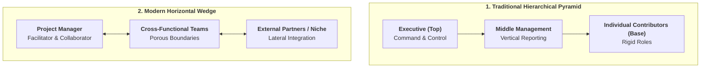

# Horizontal and Hierarchical Structures in Project Management

This note summarizes key concepts from Zachary Wong's book, *The Eight Essential People Skills for Project Management* (specifically the Blinkist summary regarding horizontal and hierarchical workplace structures), and links these structures to modern information system dependencies.

---

## 1. The Structural Shift: From Pyramid to Wedge

Traditional business models rely on vertical hierarchies, but modern project environments are increasingly shifting to flatter, lateral structures.

### A. The Hierarchical Pyramid (Legacy)
* **Structure:** A vertical pyramid with executives at the top, layers of middle managers in the middle, and staff at the base.
* **Control Style:** **Command-and-control**. Decisions are handed down from above, and communication travels strictly up and down vertical reporting lines.
* **Limitation:** Slow response times, information bottlenecks, and high administrative friction (agency costs).

### B. The Horizontal Wedge (Modern)
* **Structure:** A "wedge" model where the pyramid is laid on its side. Workflows, resource allocation, and team interactions occur along a lateral, cross-functional axis.
* **Control Style:** **Collaboration and influence**. Borders between departments and roles are porous, requiring project managers to lead without formal authority.
* **Advantage:** Rapid adaptation, faster decision cycles, and high flexibility.

---

## 2. The Leadership Paradox: Friendliness vs. Friendship

Because horizontal structures soften the boundaries between managers and staff, project leaders often interact on a much closer, informal basis with team members. Wong introduces a critical rule to navigate this:

> **"Be friendly, not friends."**

* **Maintaining Boundaries:** Project managers must maintain professional distance. If a manager becomes personal friends with a team member, it risks creating bias, conflicts of interest, and perceived favoritism.
* **The Decision Test:** A manager must remain objective enough to make hard organizational decisions—such as shifting roles, cutting budgets, or addressing poor performance—without letting personal friendships compromise their professional duty.
* **Tactical Approach:** Combine warmth, active listening, and open communication with strict consistency, professional boundaries, and clear objective metrics.

---

## 3. The Project Manager's Dilemma

In flat or horizontal wedge structures, project managers face a significant challenge:
* **The Authority Gap:** PMs are held accountable for project delivery, but they often do not have direct managerial authority (like hiring, firing, or setting salaries) over the cross-functional team members assigned to them.
* **The Solution:** Managers must develop soft skills—specifically **influence, persuasion, active listening, and psychological alignment**—to align the individual interests of team members with the overarching goals of the project.

---

## 4. Systems Alignment: How IT Enables Flatter Structures

The transition from a hierarchical pyramid to a horizontal wedge is only possible when supported by the right class of **Information Systems**:

* **Enterprise Collaboration Platforms:** Shared workspaces (e.g., Slack, Microsoft Teams) replace linear email chains, allowing lateral, real-time communication across separate divisions.
* **Integrated Project Management & Workflow Engines:** Unified tracking databases (e.g., Jira, ServiceNow, Asana) provide central visibility, allowing self-managing teams to coordinate tasks without requiring middle managers to supervise them.
* **Reduced Agency Costs:** By distributing performance data and metrics directly to the team, information systems flatten the organization, reducing supervision overhead and empowering lower-level decision-making.

---

## 5. The Eight Essential People Skills for Project Management

Below is a detailed breakdown of the eight essential people skills outlined by Dr. Zachary Wong, including their associated tools/metaphors, what they mean, and why they matter for project execution.

### Skill 1: Diagnose and Correct People Problems (The Wedge)
* **What it means:** Using "The Wedge" diagnostic tool to separate behavioral issues (what people do) from individual personalities (who people are).
* **Why it matters:** It prevents managers from making personal attacks and focuses the team on rectifying specific actions, making behavior corrections objective and professional.

### Skill 2: Be Tough on People Problems without Being Tough on People (The Three Hats)
* **What it means:** Alternating roles between being a *Manager* (enforcing standards), a *Leader* (inspiring/coordinating), and a *Friend/Coach* (supporting).
* **Why it matters:** It allows project managers to maintain high performance standards and hold team members accountable without destroying relationships.

### Skill 3: Build Highly Successful Teams (The Loop)
* **What it means:** Creating open feedback loops to facilitate team trust, role alignment, and lateral communication.
* **Why it matters:** In horizontal wedge organizations, projects fail if teams are siloed. Continuous loop communication coordinates workflows and solves conflicts early.

### Skill 4: Boost People’s Attitudes, Happiness, and Performance (The Ice Cream Cone)
* **What it means:** Providing positive reinforcement, recognition, and small motivational rewards (metaphorical "ice cream") that boost team moral.
* **Why it matters:** Project work is stressful. Sustained team energy and high morale directly lower employee turnover and reduce project delivery defects.

### Skill 5: Turn Around Difficult People and Underperformers (Roll the Ball Forward)
* **What it means:** Focus on future goals and specific actions rather than dwelling on past mistakes or placing blame.
* **Why it matters:** It breaks the cycle of defensiveness in underperforming employees, directing their focus immediately back to productive tasks.

### Skill 6: Motivate the Right Team Behaviors (The ABC Boxes)
* **What it means:** Aligning **A**ntecedents (goals/prompts), **B**ehaviors (actions), and **C**onsequences (rewards/reinforcements) to drive desired workflows.
* **Why it matters:** People respond to incentives. If the system setup rewards speed over quality, the team will produce defective outputs; aligning the ABCs ensures behaviors support project objectives.

### Skill 7: Succeed When Faced with Change, Problems, and New Challenges (The Black Box Effect)
* **What it means:** Managing the psychological transition and stress that team members face when systems, processes, or technologies change.
* **Why it matters:** Because organizational resistance is a major cause of project implementation failure, managing the "black box" of transition helps team members adapt quickly.

### Skill 8: Gain Favor and Influence with Your Boss (Be More Visible)
* **What it means:** Proactively communicating project status, challenges, and successes to executives and sponsors.
* **Why it matters:** Keeps project stakeholders aligned, secures continued funding, and builds executive support for the project manager.

---

## 6. What Project Managers Are Doing in 2026

In 2026, the intersection of horizontal structures, AI automation, and people skills has redefined the daily role of the project manager. Rather than acting as traditional administrators, modern PMs focus on **orchestration, facilitation, and human integration**:

### A. Orchestrating Hybrid Teams (Humans + AI Agents)
* **What they do:** PMs design workflows where human professionals collaborate directly with autonomous AI agents. For example, an AI agent might handle daily status aggregation and task routing, while the PM focuses on resolving interpersonal conflict or aligning creative direction.
* **Why it matters:** It maximizes execution speed while ensuring the human elements of empathy, negotiation, and strategic alignment are not lost.

### B. Facilitating People-First Change Management
* **What they do:** With AI automating administrative tasks (taking meeting minutes, updating project boards, generating charts), PMs redirect their time to **"people problems"**—specifically diagnosing motivation gaps, helping team members cope with technological transitions, and active listening.
* **Why it matters:** Addresses the primary cause of project failure (behavioral resistance and change friction) rather than administrative details.

### C. Navigating the Influence Gap in Value Webs
* **What they do:** Modern projects span fluid external networks (gig workers, vendors, and API platform integrations) rather than single, fixed corporate structures. PMs must lead virtual teams without formal organizational authority, relying entirely on emotional intelligence and lateral persuasion.
* **Why it matters:** Ensures alignment and productivity across separate companies and independent contractors.

---

## 7. References & Sources

1. **Wong, Z. (2018).** *The Eight Essential People Skills for Project Management: Solving the Most Common People Problems for Team Leaders.* Berrett-Koehler Publishers.
2. **Blinkist.** *Summary of The Eight Essential People Skills for Project Management by Zachary Wong.* [LinkedIn Learning Link](https://www.linkedin.com/learning/the-eight-essential-people-skills-for-project-management-blinkist-summary/horizontal-and-hierarchal-structures-2?u=57878161)
