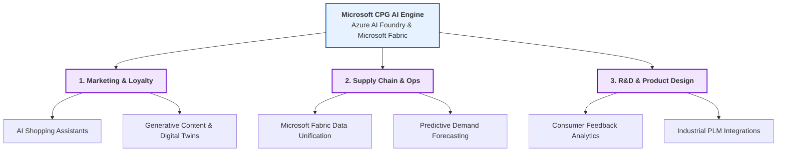

# Microsoft AI for Consumer Goods & CPG Technologies Notes

This note outlines the strategic applications of Microsoft AI technologies in the Consumer Packaged Goods (CPG) and retail sectors, focusing on the shift from static analytics to **agentic AI orchestration**.

---

## 1. The Strategic Shift: From Analytics to Agentic AI

Modern consumer goods companies are moving beyond simple dashboards and predictive algorithms. The focus in 2026 is on **Agentic AI**—autonomous systems built on platforms like **Microsoft Copilot Studio** and **Azure AI Foundry** that can execute business processes, communicate across divisions, and make operational decisions alongside human workers.

---

## 2. Key Areas of Impact and Applications

### A. Marketing, Customer Engagement, & Brand Loyalty
* **AI Shopping Assistants:** Embedding conversational AI assistants directly into e-commerce interfaces to support product discovery, address customer queries, and drive sales conversions.
* **Digital Twins & Generative Content:** Using generative AI to create virtual product displays and photorealistic marketing content. This reduces the necessity and high cost of physical photo shoots, allowing brands to rapidly test different configurations of packaging and advertising.
* **Hyper-Personalized Campaigns:** Analyzing consumer profiles to deliver customized offers and product suggestions in real time, maximizing lifetime customer value.

### B. Supply Chain & Operations
* **Data Integration (Microsoft Fabric):** Connecting fragmented data silos (inventory, shipping, sales, manufacturing) into a single, unified data repository. This provides managers with a single source of truth.
* **Predictive Analytics:** Forecasting product demand based on real-time market trends, weather patterns, and social media data, preventing costly stockouts or inventory surpluses.
* **Operational Automation:** Providing warehouse and storefront employees with real-time mobile data access, streamlining pick-and-pack tasks, and automating inventory audits.

### C. Product Innovation & Lifecycle Management
* **R&D Acceleration:** Using natural language processing to extract product insights from thousands of online customer reviews and social media comments, accelerating the design of new products.
* **Industrial AI & Factory Automation:** Integrating Azure cloud computing with Product Lifecycle Management (PLM) software (such as *Siemens Teamcenter X on Azure*) to coordinate robotic factory floors, automate quality control inspections, and reduce product defect rates.

---

## 3. Business Value & Financial Impact (ROI)

CPG enterprises justify investments in AI platforms by targeting measurable operational returns:
* **Flattened Hierarchies:** Agentic workflows automate administrative checks, allowing managers to oversee larger teams and reducing internal **agency costs**.
* **Lower Transaction Costs:** Cloud-based supplier portals automate ordering, billing, and logistics tracking, cutting transactional frictions.
* **High ROI Metrics:** Independent Forrester research analyzing organizations scaling Microsoft AI solutions projected an Return on Investment (ROI) ranging from **124% to 282%** over a three-year period.

---

## 4. References & Sources

1. **Microsoft. (2025).** *Consumer Goods Solutions and CPG Technologies.* Microsoft AI Industry Solutions. [Microsoft AI CPG Source](https://www.microsoft.com/en-us/ai/consumer-goods)
2. **Microsoft Industry Insights. (2025).** *Unifying Data and Accelerating Retail Workflows.* [Read Insights](https://www.microsoftindustryinsights.com/retail-data-fabric)
3. **Forrester Research. (2025).** *The Total Economic Impact of Microsoft Cloud for Retail and AI Solutions.* [Read Report](https://www.forrester.com/report/tei-microsoft-retail-ai)
