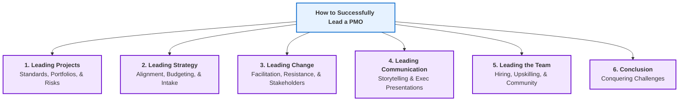
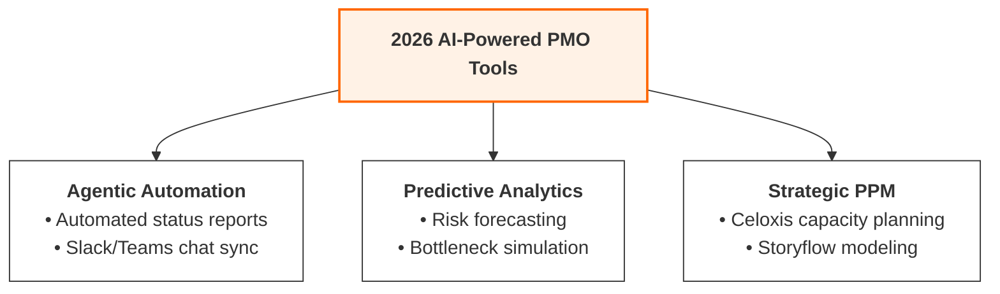

# PMO Steering: Leadership Frameworks & 2026 PMO Tools

This note combines detailed summaries of all modules in Hussain Bandukwala's *How to Successfully Lead a PMO* course with a forward-looking analysis of Project Portfolio Management (PPM) tools and AI integration trends in 2026.

---

## Part 1: Hussain Bandukwala's PMO Leadership Syllabus

---

## 1. Leading Projects

To successfully lead a growing PMO, a leader must transition from basic project monitoring to establishing organizational standards, defining governance, and managing risks at a portfolio scale.

### A. Managing the Standards, Governance, and Execution
* **The Process Overload Trap:** A common PMO failure is implementing overly complex, rigid standards too quickly. This results in "process fatigue" and organizational backlash.
* **The MVP Approach (Minimum Viable Process):**
  * Establish a baseline of core templates (Project Charter, Status Report, Risk Log, Project Schedule).
  * Focus on processes that provide direct value to execution teams rather than just satisfying administrative reporting.
* **Balanced Governance:** Governance should facilitate decision-making, not block it. Clearly document who has authority to make scope, resource, and budget changes, reducing administrative delays.
* **Audit and Execution Cadence:** Implement periodic project health checks. Ensure PMs are updating plans, milestones are validated, and quality standards are maintained.

### B. Overseeing Projects, Programs, and Portfolios
* **Oversight Levels:**
  * **Projects (Execution Focus):** Overseeing individual initiatives to ensure they deliver specific outputs on time, within scope, and under budget (managing the triple constraints).
  * **Programs (Benefits Focus):** Coordinating groups of related projects. The PMO manages interdependencies, shares resources, and aligns deliverables to achieve combined operational benefits.
  * **Portfolios (Strategic Focus):** Balancing the entire mix of projects and programs. The PMO acts as a gatekeeper, ensuring budget is allocated to high-value initiatives and managing total resource capacity constraints.
* **PMO Leadership Alignment:** Ensure project-level status updates roll up to program metrics, which in turn inform portfolio-level prioritization dashboards.

### C. Working with Risks, Issues, and Change Requests
* **Centralized Tracking System:** The PMO must enforce a clear distinction between:
  * **Risks:** Unpredictable future events that could negatively or positively affect the project. *PMO action:* Maintain a centralized risk register and proactively plan mitigations.
  * **Issues:** Active, current problems that are currently impacting scope, schedule, or budget. *PMO action:* Provide structured escalation paths to help PMs resolve blockers.
  * **Change Requests:** Proposed modifications to baseline agreements. *PMO action:* Run a standard Change Control Board (CCB) process to analyze impacts before approval.
* **Escalation Thresholds:** Define clear financial and schedule limits. (e.g., A Project Manager handles budget variances under 5%; the PMO handles variances up to 15%; anything higher escalates to the executive sponsor).

---

## 2. Leading Strategy

A strategic PMO serves as the bridge between high-level C-suite goals and tactical execution.

### A. Aligning the PMO with Organizational Goals
* **The Alignment Matrix:** Create a visual grid mapping every active project against the organization’s yearly strategic objectives (e.g., revenue growth, digital customer experience, regulatory compliance).
* **Terminating Low-Value Work:** Proactively identify and recommend the suspension of "zombie projects"—initiatives that have drifted from organizational goals or no longer deliver positive return on investment.

### B. PMOs Leading Strategic Initiatives
* **The Neutral Facilitator:** High-priority, cross-functional initiatives (like ERP rollouts or corporate restructurings) often fail due to department silos. The PMO acts as a neutral coordinator to manage these efforts.
* **Ensuring Focus:** Keep cross-functional teams focused on the critical path, resolving resource conflicts between departments.

### C. Annual Budget, Work Intake, and Project Portfolio Prioritization
* **Work Intake Gatekeeping:** Establish a formal submission channel for new project ideas. Require a business case, cost estimation, and strategic rationale before a project enters the pipeline.
* **Prioritization Scoring:** Score new requests against objective criteria:
  * Strategic alignment weight.
  * Financial metrics (NPV, ROI, Payback Period).
  * Resource complexity and technical feasibility.
* **Capacity Planning:** Match the prioritized pipeline against real resource availability. If the team is at 120% capacity, projects must be scheduled in phases or put on hold.

---

## 3. Leading Change

PMO leaders must realize that projects fail not because of technology, but because of poor user adoption. Managing change is a core PMO capability.

### A. PMO as the Change Management Facilitator
* **Embedding ADKAR or Prosci Frameworks:** Integrate change management milestones into the standard project lifecycle. Ensure communication, training, and transition plans are built into project schedules.
* **Post-Project Adoption Audits:** Do not close a project immediately upon delivery. Track user adoption rates and operational performance metrics for 30–90 days post-go-live to ensure benefit realization.

### B. Overcoming Organizational Resistance to Change
* **Identifying Resistance Early:** Look for warning signs like passive compliance (nodding in meetings but refusing to use new software), workarounds, or active complaining.
* **The WIIFM Factor:** Communicate the "What's in it for me?" for every layer of affected staff, framing the change around how it solves their day-to-day pain points.

### C. Challenge & Solution: Engaging Challenging Stakeholders
* **The Challenge:** Navigating difficult stakeholders, such as "Sponsors in Name Only" (SINO) who approve budgets but provide no leadership, or vocal detractors who actively block process changes.
* **The Solution:**
  * Map stakeholders on a Power-Interest Grid to customize engagement.
  * Hold regular, informal one-on-one sessions to build trust.
  * Actively listen to detractor concerns—often rooted in fear of losing control, lack of training, or increased workloads—and modify project rollouts to address these challenges.
  * Give detractors ownership of specific project components to turn them into active advocates.

---

## 4. Leading Communication

Maturing a PMO requires shifting from dry status reporting to strategic communication that highlights business value.

### A. Importance of Storytelling and Leveraging Storytelling Tools
* **The Problem with Raw Data:** Executive sponsors do not want to parse spreadsheets of raw tasks or dense project schedules.
* **Strategic Storytelling:** Frame progress updates as a narrative:
  * **The Hero:** The customer or business unit experiencing a problem.
  * **The Conflict:** The operational blocker or bottleneck.
  * **The Quest:** The project implementation.
  * **The Resolution:** The value, efficiency, or revenue generated.
* **Visualization Tools:** Use roadmaps and executive dashboards rather than text-heavy documents.

### B. Showcasing the Benefits of the PMO
* **The Invisible PMO Paradox:** When projects go smoothly, leadership questions why the PMO exists. When projects struggle, the PMO is blamed.
* **Proactive Value Marketing:** Regularly publish value reports summarizing portfolio achievements, budget savings, and risk avoidance metrics.

### C. Challenge & Solution: Presenting to Executives
* **The Challenge:** Presenting technical project details or long slides to busy executives, losing their attention and failing to secure decisions.
* **The Solution:**
  * Apply the **Pyramid Principle**: State the main conclusion/request first, followed by supporting details.
  * Keep slides limited to 1-2 pages, highlighting **decisions needed**, key budget variances, and resource constraints.
  * Clearly present the trade-offs of decisions (e.g., "If we delay this decision, the project launch slips by 4 weeks and costs $50k more").

---

## 5. Leading the Team

A PMO’s success is built upon the capability of its project managers. PMO leaders must prioritize talent development and community building.

### A. Hiring for Your Growing Team
* **T-Shaped Professionals:** Look for project managers who possess deep technical project management expertise but also exhibit broad business acumen and strong interpersonal skills.
* **Soft Skills Assessment:** Prioritize hiring candidates with proven negotiation, active listening, and emotional intelligence capabilities.

### B. Retooling and Upskilling
* **Continuous Capability Building:** Provide regular training on modern project methodologies (Scrum, Kanban, Hybrid) and software platforms.
* **Mentorship Programs:** Establish a system where senior PMs mentor junior coordinators, accelerating professional growth.

### C. Building a Community for Your Team
* **Community of Practice (CoP):** Form a company-wide project management community where PMs from different divisions meet to share templates, lessons learned, and project management tactics.
* **Knowledge Repositories:** Build a shared space for templates, project archives, and historical logs to prevent teams from recreating existing assets.

### D. Challenge & Solution: Hiring Your Next Project Manager
* **The Challenge:** Candidates who look great on paper (many certifications) but struggle to manage complex team dynamics or stakeholder politics in real life.
* **The Solution:**
  * Replace standard interview questions with behavioral questions (e.g., "Tell me about a time a key team member refused to cooperate and how you handled it").
  * Use case study exercises during the interview process, asking candidates to walk through how they would rescue a failing project.

---

## 6. Conclusion: Conquering Your PMO Challenges

* **The 100-Day Plan:** Implement incremental improvements rather than attempting a total process overhaul all at once. Celebrate quick wins to build momentum.
* **Continuous Adaptation:** Review PMO performance indicators regularly and adapt processes to match shifting organizational strategies.

---
---

## Part 2: How PMOs Use Tools in 2026

With the retirement of legacy platforms like *Microsoft Project Online* in **September 2026**, the tool landscape has shifted toward **AI-augmented Project Portfolio Management (PPM)**.

### 1. Key AI-Driven Capabilities in 2026 PMOs
* **Agentic Workflows:** AI agents autonomously compile status updates from Slack, Teams, and git logs, auto-drafting weekly portfolio summaries and routing tasks without requiring manual human data entry.
* **Predictive Analytics:** PPM systems analyze historical patterns to predict team bottlenecks, flag projects at risk of missing deadlines, and simulate resource constraints before new initiatives are approved.
* **The Tool Split:** Clear demarcation between team-level **task management** (Agile boards, lists) and high-level **portfolio management** platforms (resource forecasting, budget modeling).

### 2. Modern PMO Tool Ecosystem (2026)

| Tool | Focus Area | Primary 2026 AI / Analytic Capability |
| :--- | :--- | :--- |
| **Celoxis** | Portfolio Governance | Enterprise-level resource capacity planning and automated portfolio forecasting. |
| **Wrike** | Enterprise Risk Management | Predictive analytics that surface delivery risks and cross-project dependency conflicts automatically. |
| **ClickUp** | Integrated Utility | ClickUp Brain handles automated meeting transcript summaries, natural-language document queries, and task updates. |
| **Asana** | Cross-Functional Workflows | Surfacing hidden task roadblocks and generating executive progress reports. |
| **monday.com** | Visual PMO Boards | Adaptive automated workflow templates and natural-language formula building. |
| **Storyflow** | Strategic Frameworks | Zero-setup project modeling, translating C-suite strategic goals directly into project structures. |

### 3. Selector Framework: Choosing a PMO Tool

When choosing a PMO tool in 2026, leaders use the following framework to avoid feature fatigue:
1. **Define the Scope:** Is the tool for individual task management or high-level strategic portfolio planning?
2. **Data Governance & Compliance:** Verify how the tool's AI models process internal data. Ensure customer and transaction data remain within private, compliant cloud boundaries (data sovereignty).
3. **Integration Footprint:** Select tools that offer native, low-latency API connections to your team's existing communication stacks (e.g., Teams, Slack, GitHub, Jira) to reduce tool sprawl.
4. **Human-in-the-Loop AI:** Ensure the tool is designed to augment human project managers—not replace human decision-making—keeping people-first leadership central to the project's success.

---

## 8. References & Sources

1. **Bandukwala, H. (2020).** *How to Successfully Lead a PMO.* LinkedIn Learning. [LinkedIn Learning Source](https://www.linkedin.com/learning/how-to-successfully-lead-a-pmo/steering-your-growing-pmo)
2. **Celoxis. (2026).** *Navigating the Legacy Transition: The Shift to AI-Powered PPM.* [Read Analysis](https://www.celoxis.com/pmo-trends-2026)
3. **Atlassian. (2025).** *Value-Centric PMO Governance and Portfolio Metrics.* [Read Report](https://www.atlassian.com/pmo-governance-metrics)
