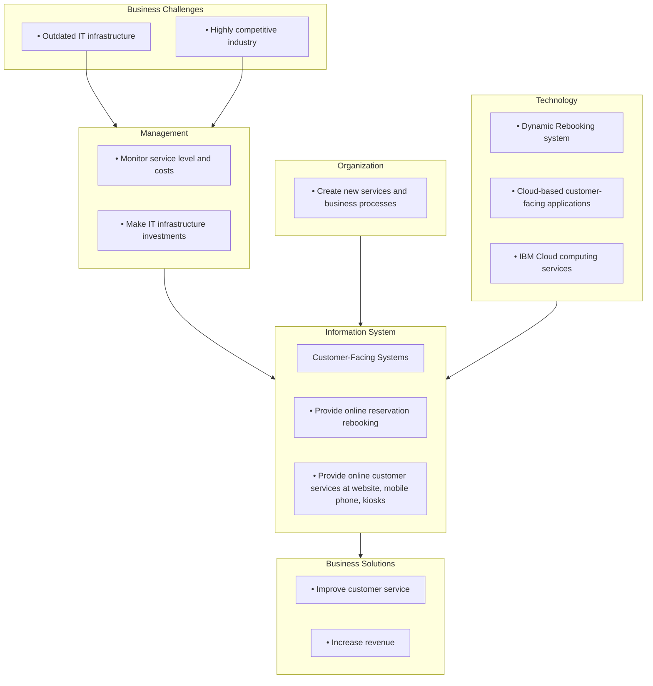
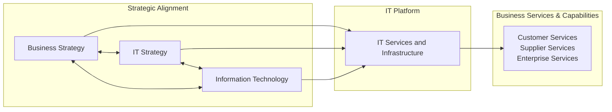
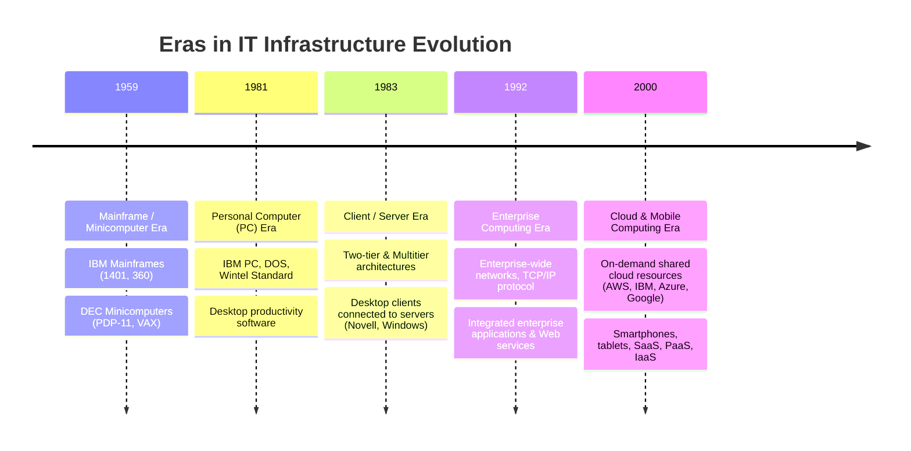
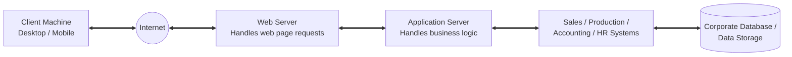
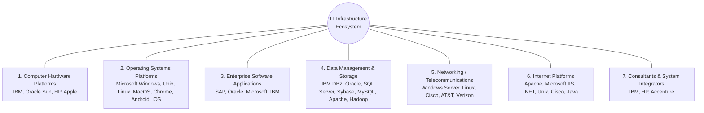

# Batch 1 Raw Extraction (Screenshots 1 to 32)
**Source Directory:** `/Users/gerrell/Library/Mobile Documents/com~apple~CloudDocs/Strayer/Capstone/Week 4/chapter_5_screenshots`
**Chapter Title:** Chapter 5: IT Infrastructure and Emerging Technologies
**Extraction Date:** 2026-07-25

---

## Executive Summary & Overview of Batch 1
Batch 1 covers pages 162 to 175 of *Management Information Systems: Managing the Digital Firm* (Chapter 5). Key sections extracted include:
- **Learning Objectives (5-1 through 5-6)** & **Chapter Cases**
- **Chapter Opening Case Study:** *American Airlines Heads for the Cloud* (Full narrative, sources, discussion, and complete Interactive Case Model Diagram)
- **Section 5-1:** *What is IT infrastructure, and what are the stages and drivers of IT infrastructure evolution?*
  - Definition of IT infrastructure and the "Service Platform" perspective (9 firmwide services)
  - Figure 5.1: Connection Between the Firm, IT Infrastructure, and Business Capabilities
  - Evolution of IT Infrastructure (5 Eras: Mainframe/Minicomputer, Personal Computer, Client/Server, Enterprise Computing, Cloud and Mobile Computing)
  - Figure 5.2: Eras in IT Infrastructure Evolution
  - Figure 5.3: A Multitiered (N-Tier) Client/Server Network
- **Technology Drivers of Infrastructure Evolution:**
  - Moore's Law and Microprocessing Power (Figure 5.4 3D performance chart, Figure 5.5 cost chart, Nanotechnology)
  - Law of Mass Digital Storage (Figure 5.6 storage cost per dollar chart)
  - Metcalfe's Law and Network Economics
  - Declining Communications Costs and the Internet (Figure 5.7 bandwidth cost reduction chart)
  - Standards and Network Effects
  - Table 5.1: Some Important Standards in Computing (ASCII, COBOL, Unix, Ethernet, TCP/IP, Wintel PC, WWW)
- **Section 5-2:** *What are the components of IT infrastructure?*
  - Figure 5.8: The IT Infrastructure Ecosystem (7 major components & vendors)

---

## Detailed Image-by-Image OCR & Text Extraction

### Screenshot 1 (`Screenshot 2026-07-25 at 11.02.19 PM.png`)
- **Page Number:** 162 / 589
- **Header Navigation:** `strayer.vitalsource.com` | `eBook: Management Information Systems` | `Strayer University Bookshelf: Management Information Systems: Managing the Digital Firm`
- **Main Heading:** Chapter 5 IT Infrastructure and Emerging Technologies
- **Section Heading:** Learning Objectives
- **Text Content:**
  After reading this chapter, you will be able to answer the following questions:
  - **5-1 What is IT infrastructure, and what are the stages and drivers of IT infrastructure evolution?** [link]
  - **5-2 What are the components of IT infrastructure?** [link]
  - **5-3 What are the current trends in computer hardware platforms?** [link]
  - **5-4 What are the current computer software platforms and trends?** [link]
  - **5-5 What are the challenges of managing IT infrastructure and management solutions?** [link]
  - **5-6 How will MIS help my career?** [link]
- **Section Heading:** Chapter Cases
- **Links:**
  - **American Airlines Heads for the Cloud** [link]
  - **What Should Firms Do About BYOD?** [link]

---

### Screenshot 2 (`Screenshot 2026-07-25 at 11.02.24 PM.png`)
- **Page Number:** 162 / 589
- **Links:**
  - **Look to the Cloud** [link]
  - **Project JEDI: A Cloud of Controversy** [link]
- **Section Heading:** Video Cases
- **Video Case List:**
  - Rockwell Automation Fuels the Oil and Gas Industry with the Internet of Things (IoT)
  - **ESPN.com:** The Future of Sports Coverage in the Cloud
  - Netflix: Building a Business in the Cloud
- **Sidebar Callout Box:**
  - **Title:** MyLab MIS
  - **Content:** Discussion Questions: 5-6, 5-7, 5-8; Hands-On MIS Projects: 5-9, 5-10, 5-11, 5-12; eText with Conceptual Animations
- **Case Title:** American Airlines Heads for the Cloud
- **Case Text (Paragraph 1):**
  American Airlines Group Inc. is a major US airline company and the world’s largest airline. It has more than 128,000 employees and transports about 200 million passengers each year. American Airlines and American Eagle offer an average of nearly 6,700 flights per day to nearly 350 destinations in more than 50 countries.

---

### Screenshot 3 (`Screenshot 2026-07-25 at 11.02.29 PM.png`)
- **Page Number:** 163 / 589
- **Case Text (Paragraphs 2–4):**
  The airline industry remains highly competitive, and one key area of competitive differentiation is the quality of the customer experience. An airline’s ability to communicate with its customers and provide reservations, seat assignments, ticketing, rebooking, and other customer services increasingly depends on digital channels. Customers are demanding more tools for interacting with airlines online and more seamless responses to their needs.

  American especially wanted to provide customers with better capabilities for self-service if passengers were forced to rebook when flights were disrupted due to bad weather conditions. Although American’s information systems were able to rebook passengers on the next best flight, customers had to call the reservation desk or visit an airport agent if they wanted to explore other options. American wanted customers to be able to see these other options and update their flight selection immediately online via its website, mobile app, or self-service kiosks.

  Unfortunately, American’s legacy information technology (IT) infrastructure prevented it from providing such important services to customers and doing all it wished as a business. American used its own computing centers and large mainframe computers to handle the many millions of transactions it processed each day. Its existing customer-facing applications were in silos where all the pieces of data needed to serve customers could not be easily assembled and integrated. Every change required the same work in up to three places, each managed by different teams.

---

### Screenshot 4 (`Screenshot 2026-07-25 at 11.02.33 PM.png`)
- **Page Number:** 163 / 589
- **Visual Asset:** Photo graphic showing a human hand touching a illuminated cloud icon surrounded by interconnected nodes representing multimedia, servers, mobile devices, and communications.
- **Image Attribution:** `© lpopba/123RF`
- **Case Text (Paragraph 5 Part 1):**
  To respond better and faster to customer needs, American Airlines moved important pieces of computing work from its on-premise computing centers to the IBM Cloud. The IBM Cloud suite of cloud computing services provides computer...

---

### Screenshot 5 (`Screenshot 2026-07-25 at 11.02.37 PM.png`)
- **Page Number:** 163 / 589
- **Case Text (Paragraphs 5–8 & Sources):**
  hardware, software, storage, networking, and other services for running a firm’s systems as on-demand services in remote computing centers managed by IBM and accessed via the Internet.

  IBM and American worked together to develop new applications that were designed specifically to take advantage of cloud technology. American was able to develop a new Dynamic Rebooking app in just four and one-half months, less than half the time required for development using IBM’s outdated IT infrastructure. The app provides vital information and control to customers when travel plans are disrupted, identifying the best solution for each customer. It walks customers through the rebooking process, handles the ticket reissue, delivers the boarding pass, and sends a message to reroute their baggage. Customer feedback has been very positive.

  While Dynamic Rebooking was in development, IBM and American also worked on the migration of the **aa.com** website, customer mobile, and kiosk apps—all of IBM’s customer-facing interfaces—to the IBM Cloud. That will allow customers to prepay their baggage fees and check bags from their phones or computers. Consumers could already do that on many other airlines, but not on American until now.

  Moving to the IBM Cloud also enabled American to avoid large capital expenditures to upgrade its existing hardware, significantly improve server performance and reliability, and reduce end-user response time. IBM provides American with 24-hour application support and management for the computing work performed using IBM cloud services. The time previously dedicated to maintaining inefficient, outdated technology is now available for addressing new business requirements, helping American innovate for its customers and outpace competitors.

  *Sources:* “IBM Cloud Flies with American Airlines,” www.ibm.com, accessed January 27, 2020; www.aa.com, accessed January 28, 2020; Chris Preimesberger “American Airlines Heads for a New Cloud with IBM,” *eWeek*, June 29, 2017; and Becky Peterson, “American Airlines Looks to the IBM Cloud to End Travel Hell,” *Business Insider*, January 27, 2017.

- **Case Analysis / Summary:**
  The experience of American Airlines illustrates the importance of information technology infrastructure in running a business today. The right technology at the right price will improve organizational performance.

---

### Screenshot 6 (`Screenshot 2026-07-25 at 11.02.41 PM.png`)
- **Page Number:** 164 / 589
- **Case Discussion Text:**
  American Airlines was saddled with an outdated hardware and software platform that was too costly and unwieldy for adding new customer services, such as Dynamic Rebooking. This prevented the company from operating as efficiently and effectively as it could have to attract and retain customers.

  The chapter-opening case diagram calls attention to important points raised by this case and this chapter. Using cloud computing for its IT infrastructure enables American Airlines to develop critical applications to serve its customers more quickly and to delegate the operation and management of its IT systems to outside specialists from the cloud service provider IBM. The company pays for only the computing capacity it uses on an as-needed basis and does not have to make extensive and costly up-front IT investments. American Airlines is following a hybrid cloud strategy, where an organization maintains part of its IT infrastructure itself and part by using cloud computing services.

- **Case Discussion Questions:**
  - How did using cloud computing help American Airlines become more competitive?
  - What were the business benefits for American Airlines of using a cloud computing infrastructure?

---

### Screenshot 7 (`Screenshot 2026-07-25 at 11.02.45 PM.png`)
- **Page Number:** 164 / 589
- **Interactive Case Model Diagram (Complete Extraction):**
  - **Business Challenges Box (Pink):**
    - Outdated IT infrastructure
    - Highly competitive industry
  - **Management Box (Teal 3D):**
    - Monitor service level and costs
    - Make IT infrastructure investments
  - **Organization Box (Teal 3D):**
    - Create new services and business processes
  - **Technology Box (Teal 3D):**
    - Dynamic Rebooking system
    - Cloud-based customer-facing applications
    - IBM Cloud computing services
  - **Information System Box (Pink):**
    - Subtitle: *Customer-Facing Systems*
    - Bullets:
      - Provide online reservation rebooking
      - Provide online customer services at website, mobile phone, kiosks
  - **Business Solutions Box (Blue):**
    - Improve customer service
    - Increase revenue
  - **Link:** `5.4-2 Full Alternative Text` [link]

---

### Screenshot 8 (`Screenshot 2026-07-25 at 11.02.50 PM.png`)
- **Page Number:** 165 / 589
- **Section Heading:** 5-1 What is IT infrastructure, and what are the stages and drivers of IT infrastructure evolution?
- **Body Text:**
  In **Chapter 1** [link], we defined *information technology (IT) infrastructure* as the shared technology resources that provide the platform for the firm’s specific information system applications. An IT infrastructure includes investment in hardware, software, and services—such as consulting, education, and training—that are shared across the entire firm or across entire business units in the firm. A firm’s IT infrastructure provides the foundation for serving customers, working with vendors, and managing internal firm business processes (see **Figure 5.1** [link]).
- **Figure Title:** Figure 5.1 Connection Between the Firm, it Infrastructure, and Business Capabilities

---

### Screenshot 9 (`Screenshot 2026-07-25 at 11.02.55 PM.png`)
- **Page Number:** 165 / 589
- **Figure 5.1 Diagram Components:**
  - `Business Strategy` (Pink Circle)
  - `IT Strategy` (Teal Circle)
  - `Information Technology` (Orange Circle)
  - `IT Services and Infrastructure` (Purple Circle)
  - `Customer Services / Supplier Services / Enterprise Services` (Teal Circle)
- **Body Text:**
  The services a firm is capable of providing to its customers, suppliers, and employees are a direct function of its IT infrastructure. Ideally, this infrastructure should support the firm’s business and information systems strategy. New information technologies have a powerful impact on business and IT strategies as well as the services that can be provided to customers.
  
  `Figure 5.1 Full Alternative Text` [link]

  Supplying firms worldwide with IT infrastructure (hardware, software, networking, and IT services) in 2020 was estimated to be a $3.9 trillion industry (**Gartner, 2020** [link]). Investments in infrastructure account for between 25 and 50 percent of information technology expenditures in large firms, led by financial services firms where IT investment is well over half of all capital investment.

- **Subsection Heading:** Defining IT Infrastructure
- **Body Text:**
  An IT infrastructure consists of a set of physical devices and software applications that are required to operate the entire enterprise. But IT infrastructure also includes a set of firmwide services budgeted by management and composed of both human and technical capabilities.

---

### Screenshot 10 (`Screenshot 2026-07-25 at 11.02.59 PM.png`)
- **Page Number:** 166 / 589
- **Firmwide Infrastructure Services List (9 Core Services):**
  1. **Computing platforms** used to provide computing services that connect employees, customers, and suppliers into a coherent digital environment, including large mainframes, midrange computers, desktop and laptop computers, and mobile handheld and remote cloud computing services
  2. **Telecommunications services** that provide data, voice, and video connectivity to employees, customers, and suppliers
  3. **Data management services** that store and manage corporate data and provide capabilities for analyzing the data
  4. **Application software services**, including online software services, that provide enterprise-wide capabilities such as enterprise resource planning, customer relationship management, supply chain management, and knowledge management systems that are shared by all business units
  5. **Physical facilities management services** that develop and manage the physical installations required for computing, telecommunications, and data management services
  6. **IT management services** that plan and develop the infrastructure, coordinate with the business units for IT services, manage accounting for the IT expenditure, and provide project management services
  7. **IT standards services** that provide the firm and its business units with policies that determine which information technology will be used, when, and how
  8. **IT education services** that provide training in system use to employees and offer managers training in how to plan for and manage IT investments
  9. **IT research and development services** that provide the firm with research on potential future IT projects and investments that could help the firm differentiate itself in the marketplace

- **Service Platform Perspective Text:**
  This “service platform” perspective makes it easier to understand the business value provided by infrastructure investments. For instance, the real business value of a fully loaded personal computer operating at 3.5 gigahertz that costs about $1,000 and a high-

---

### Screenshot 11 (`Screenshot 2026-07-25 at 11.03.01 PM.png`)
- **Page Number:** 167 / 589
- **Body Text (Continued):**
  speed Internet connection is hard to understand without knowing who will use it and how it will be used. When we look at the services provided by these tools, however, their value becomes more apparent: The new PC makes it possible for a high-cost employee making $100,000 a year to connect to all the company’s major systems and the public Internet. The high-speed Internet service saves this employee about an hour per day in reduced wait time for Internet information. Without this PC and Internet connection, the value of this one employee to the firm might be cut in half.

---

### Screenshot 12 (`Screenshot 2026-07-25 at 11.03.05 PM.png`)
- **Page Number:** 167 / 589
- **Subsection Heading:** Evolution of IT Infrastructure
- **Body Text:**
  The IT infrastructure in organizations today is an outgrowth of more than 50 years of evolution in computing platforms. There have been five stages in this evolution, each representing a different configuration of computing power and infrastructure elements (see **Figure 5.2** [link]). The five eras are general-purpose mainframe and minicomputer computing, personal computers, client/server networks, enterprise computing, and cloud and mobile computing.
- **Figure Title:** Figure 5.2 Eras in it Infrastructure Evolution
- **Main Diagram Header:** Stages in IT Infrastructure Evolution
- **Diagram Eras 1 & 2:**
  - **Mainframe/Minicomputer (1959–present):** Centralized mainframe server connected to multiple dummy terminals.
  - **Personal Computer (1981–present):** Standalone desktop personal computers.

---

### Screenshot 13 (`Screenshot 2026-07-25 at 11.03.09 PM.png`)
- **Page Number:** 167 / 589
- **Diagram Era 3:**
  - **Client/Server (1983–present):** Desktop clients connected to a server tower over a local network.

---

### Screenshot 14 (`Screenshot 2026-07-25 at 11.03.12 PM.png`)
- **Page Number:** 167 / 589
- **Diagram Eras 4 & 5:**
  - **Enterprise Computing (1992–present):** Enterprise Server connected via the Internet to distributed client/server networks.
  - **Cloud and Mobile Computing (2000–present):** Cloud network labeled `THE INTERNET` enclosing Laptops, Smartphones, Server Racks, Desktop PCs, with internal services bulleted:
    - Hardware
    - Software
    - Services

---

### Screenshot 15 (`Screenshot 2026-07-25 at 11.03.16 PM.png`)
- **Page Number:** 167 / 589
- **Text Following Figure 5.2:**
  Illustrated here are the typical computing configurations characterizing each of the five eras of IT infrastructure evolution.
  
  `Figure 5.2 Full Alternative Text` [link]

  Technologies that characterize one era may also be used in another time period for other purposes. For example, some companies still run traditional mainframe systems or use mainframe computers as servers supporting large websites and corporate enterprise applications.

- **Era 1 Detailed Text:** General-Purpose Mainframe and Minicomputer Era (1959 to Present)
  The introduction of the IBM 1401 and 7090 transistorized machines in 1959 marked the beginning of widespread commercial use of **mainframe** [icon] computers. In 1965, the mainframe computer truly came into its own with the introduction of the IBM 360 series. The 360 was the first commercial computer that could provide time sharing, multitasking, and virtual memory in more advanced models. IBM has dominated mainframe computing from this point on. Mainframe computers became powerful enough to support thousands of online remote terminals connected to the centralized mainframe using proprietary communication protocols and proprietary data lines.

  The mainframe era was a period of highly centralized computing under the control of professional programmers and systems operators (usually in a corporate data center), with most elements of infrastructure provided by a single vendor, the manufacturer of the hardware and the software.

  This pattern began to change with the introduction of **minicomputers** [icon], produced by Digital Equipment Corporation (DEC) in 1965. DEC minicomputers (PDP-11 and later the VAX machines) offered powerful machines at far lower prices than IBM mainframes, making possible decentralized computing, customized to the specific needs of individual departments or business units rather than time sharing on a single huge mainframe. In recent years, the minicomputer has evolved into a midrange computer...

---

### Screenshot 16 (`Screenshot 2026-07-25 at 11.03.21 PM.png`)
- **Page Number:** 167 / 589
- **Text (Continued):**
  or midrange server and is part of a network.

- **Era 2 Detailed Text:** Personal Computer Era (1981 to Present)
  Although the first truly personal computers (PCs) appeared in the 1970s (the Xerox Alto, the MITS Altair 8800, and the Apple I and II, to name a few), these machines had only limited distribution to computer enthusiasts. The appearance of the IBM PC in 1981 is usually considered the beginning of the PC era because this machine was the first to be widely adopted by businesses. At first using the DOS operating system, a text-based command language, and later the Microsoft Windows operating system, the **Wintel PC** [icon] computer (Windows operating system software on a computer with an Intel microprocessor) became the standard desktop personal computer. Worldwide PC sales have declined because of the popularity of tablets and smartphones, but the PC is still a popular tool for business. Approximately 88 percent of desktop PCs are thought to run a version of Windows, and about 8 percent run a version of MacOS. Wintel dominance as a computing platform is receding as iPhone and Android device sales increase.

  Proliferation of PCs in the 1980s and early 1990s launched a spate of personal desktop productivity software tools—word processors, spreadsheets, electronic presentation software, and small data management programs—that were very valuable to both home and corporate users. These PCs were stand-alone systems until PC operating system software in the 1990s made it possible to link them into networks.

- **Era 3 Detailed Text:** Client/Server Era (1983 to Present)
  In **client/server computing** [icon], desktop or laptop computers called **clients** [icon] are networked to powerful **server** [icon] computers that provide the client computers with a variety of services and capabilities. Computer processing work is split between these two types of machines. The client is the user point of entry, whereas the server typically processes and stores shared data, serves up web pages, or manages network activities. The term *server* refers to both the software application and the physical computer on which the network software runs. The server could be a mainframe, but today, server computers typically are more powerful versions of personal computers, based on inexpensive chips and often using multiple processors in a single computer box or in server racks.

---

### Screenshot 17 (`Screenshot 2026-07-25 at 11.03.25 PM.png`)
- **Page Number:** 169 / 589
- **Text (Continued):**
  The simplest client/server network consists of a client computer networked to a server computer, with processing split between the two types of machines. This is called a *two-tiered client/server architecture*. Whereas simple client/server networks can be found in small businesses, most corporations have more complex, **multitiered client/server architectures** [icon] (often called *N-tier client/server architectures*) in which the work of the entire network is balanced over several different levels of servers, depending on the kind of service being requested (see **Figure 5.3** [link]).

- **Figure Title:** Figure 5.3 A Multitiered (N-Tier) Client/Server Network
- **Figure 5.3 Diagram Flow:**
  `Client` <---> `Internet` <---> `Web Server` <---> `Application Server` <---> `Sales / Production / Accounting / HR` <---> `Data`
- **Caption:** In a multitiered client/server network, client requests for service are handled by different levels of servers.

---

### Screenshot 18 (`Screenshot 2026-07-25 at 11.03.28 PM.png`)
- **Page Number:** 169 / 589
- **Text Following Figure 5.3:**
  `Figure 5.3 Full Alternative Text` [link]

  For instance, at the first level, a **web server** [icon] will serve a web page to a client in response to a request for service. Web server software is responsible for locating and managing stored web pages. If the client requests access to a corporate system (a product list or price information, for instance), the request is passed along to an **application server** [icon]. Application server software handles all application operations between a user and an organization’s back-end business systems. The application server may reside on the same computer as the web server or on its own dedicated computer. **Chapters 6** [link] and **7** [link] provide more detail on other pieces of software that are used in multitiered client/server architectures for e-commerce and e-business.

  Client/server computing enables businesses to distribute computing work across a series of smaller, inexpensive machines that cost much less than centralized mainframe systems. The result is an explosion in computing power and applications throughout the firm.

  Novell NetWare was the leading technology for client/server networking at the beginning of the client/server era. Today, Microsoft is the market leader with its **Windows** [icon] operating systems (Windows Server and Windows 10).

- **Era 4 Detailed Text:** Enterprise Computing Era (1992 to Present)
  In the early 1990s, firms turned to networking standards and software tools that could integrate disparate networks and applications throughout the firm into an enterprise-wide infrastructure. As the Internet developed into a trusted communications environment after 1995, business firms began seriously using the *Transmission Control Protocol/Internet Protocol (TCP/IP)* networking standard to tie their disparate networks together. We discuss TCP/IP in detail in **Chapter 7** [link].

  The resulting IT infrastructure links different pieces of computer hardware and smaller networks into an enterprise-wide network so...

---

### Screenshot 19 (`Screenshot 2026-07-25 at 11.03.32 PM.png`)
- **Page Number:** 171 / 589
- **Text (Continued):**
  that information can flow freely across the organization and between the firm and other organizations. It can link different types of computer hardware, including mainframes, servers, PCs, and mobile devices, and it includes public infrastructures such as the telephone system, the Internet, and public network services. The enterprise infrastructure also requires software to link disparate applications and enable data to flow freely among different parts of the business, such as enterprise applications (see **Chapters 2** [link] and **9** [link]) and web services (discussed in **Section 5-4** [link]).

- **Era 5 Detailed Text:** Cloud and Mobile Computing Era (2000 to Present)
  The growing bandwidth power of the Internet has pushed the client/server model one step further, toward what is called the “cloud computing model.” **Cloud computing** [icon] refers to a model of computing that provides access to a shared pool of computing resources (computers, storage, applications, and services) over the network, often the Internet. These “clouds” of computing resources can be accessed on an as-needed basis from any connected device and location.

  Cloud computing has become the fastest-growing form of computing, with worldwide public cloud spending to reach $350 billion by 2022 (**Gartner 2019** [link]). Thousands or even hundreds of thousands of servers are located in cloud data centers, where they can be accessed by desktop computers, laptop computers, tablets, entertainment centers, smartphones, and other client machines linked to the Internet. Amazon, Google, IBM, Oracle, and Microsoft operate huge, scalable cloud computing centers that provide computing power, data storage, application development tools, and high-speed Internet connections to firms that want to maintain their IT infrastructures remotely. Firms such as Google, Microsoft, SAP, Oracle, and **Salesforce.com** sell software applications as services delivered over the Internet.

  We discuss cloud and mobile computing in more detail in **Section 5-3** [link]. The Learning Tracks include a table titled “Comparing Stages in IT Infrastructure Evolution,” which compares each era on the infrastructure dimensions introduced.

---

### Screenshot 20 (`Screenshot 2026-07-25 at 11.03.38 PM.png`)
- **Page Number:** 171 / 589
- **Section Heading:** Technology Drivers of Infrastructure Evolution
- **Body Text:**
  The changes in IT infrastructure we have just described have resulted from developments in computer processing, memory chips, storage devices, networking hardware and software, and software design that have exponentially increased computing power while exponentially reducing costs. Let’s look at the most important developments.

- **Driver 1:** Moore’s Law and Microprocessing Power
  In 1965, Gordon Moore, the director of Fairchild Semiconductor’s Research and Development Laboratories, wrote in *Electronics* magazine that since the first microprocessor chip was introduced in 1959, the number of components on a chip with the smallest manufacturing costs per component (generally transistors) had doubled each year. This assertion became the foundation of **Moore’s Law** [icon]. Moore later reduced the rate of growth to a doubling every two years.

  There are at least three variations of Moore’s Law, none of which Moore ever stated: (1) the power of microprocessors doubles every 18 months, (2) computing power doubles every 18 months, and (3) the price of computing falls by half every 18 months.

  **Figure 5.4** [link] illustrates the relationship between number of transistors on a microprocessor and millions of instructions per second (MIPS), a common measure of processor power. **Figure 5.5** [link] shows the exponential decline in the cost of transistors and rise in computing power. For instance, in 2018, you could buy an Intel i7 processor chip with 2.5 billion transistors for about one ten-millionth of a dollar per transistor.

- **Figure Title:** Figure 5.4 Moore’s Law and Microprocessor Performance
- **Header:** Moore’s Law Means More Performance

---

### Screenshot 21 (`Screenshot 2026-07-25 at 11.03.42 PM.png`)
- **Page Number:** 171 / 589
- **Figure 5.4 Full Visual Diagram Description:**
  - 3D Staircase Graph showing timeline from 1970 to 2018.
  - Processing power axis: reaches 250,000 MIPS.
  - Transistor count axis: reaches 5 billion transistors.

---

### Screenshot 22 (`Screenshot 2026-07-25 at 11.03.45 PM.png`)
- **Page Number:** 171 / 589
- **Body Text:**
  Packing 5 billion transistors into a tiny microprocessor has exponentially increased processing power. Processing power has increased to more than 250,000 MIPS (about 2.6 billion instructions per second).
  *Source: Authors' estimate.*
  
  `Figure 5.4 Full Alternative Text` [link]

- **Figure Title:** Figure 5.5 Falling Cost of Chips
- **Header:** Moore’s Law Means Decreasing Costs
- **Figure 5.5 Graph (Top Portion):** Logarithmic scale graph of Transistor Price in U.S. Dollars from 1965 to 2020.

---

### Screenshot 23 (`Screenshot 2026-07-25 at 11.03.50 PM.png`)
- **Page Number:** 171 / 589
- **Figure 5.5 Graph (Bottom Portion):**
  - Transistor price drops from $10 down to one ten-millionth of a dollar by 2020.
  - Annotation: Packing more transistors into less space has driven dramatic reductions in their cost and in the cost of the products they populate.
  - *Source: Authors' estimate.*
  - `Figure 5.5 Full Alternative Text` [link]

- **Physical Limits of Silicon Text:**
  Exponential growth in the number of transistors and the power of processors coupled with an exponential decline in computing costs may not be able to continue much longer. In the last five years, the cost improvement rate has fallen to single digits from 30 percent annual reductions. Chip manufacturers continue to miniaturize components. Today’s transistors are 14 nanometers (billionths of a meter) in size. Within the next five years or so, chip makers may reach the physical limits of semiconductor size. At that point they may need to use alternatives to fashioning chips from silicon or find other ways to make computers more powerful.

---

### Screenshot 24 (`Screenshot 2026-07-25 at 11.03.52 PM.png`)
- **Page Number:** 173 / 589
- **Visual Graphic:** 3D model of a carbon nanotube structure.
- **Caption:** Nanotubes are tiny tubes about 10,000 times thinner than a human hair. They consist of rolled-up sheets of carbon hexagons, have potential use as minuscule wires or in ultrasmall electronic devices, and are very powerful conductors of electrical current.

---

### Screenshot 25 (`Screenshot 2026-07-25 at 11.03.56 PM.png`)
- **Page Number:** 173 / 589
- **Nanotechnology Text:**
  Chip manufacturers can shrink the size of transistors down to the width of several atoms by using nanotechnology. **Nanotechnology** [icon] uses individual atoms and molecules to create computer chips and other devices that are thousands of times smaller than current technologies permit. Chip manufacturers are trying to develop a manufacturing process to produce nanotube processors economically. Stanford University scientists have built a nanotube computer.

- **Driver 2:** The Law of Mass Digital Storage
  A second technology driver of IT infrastructure change is the Law of Mass Digital Storage. The amount of digital information is roughly doubling every year (**Lyman and Varian, 2003** [link]). Fortunately, the cost of storing digital information is falling at an exponential rate of 100 percent a year. **Figure 5.6** [link] shows that the number of megabytes that can be stored on magnetic media for $1 from 1950 to the present roughly doubled every 15 months. In 2020, a 1 terabyte hard disk drive sells at retail for about $50.

- **Figure Title:** Figure 5.6 The Amount of Storage Per Dollar Rises Exponentially, 1950–2018
- **Header:** Data Storage Per Dollar

---

### Screenshot 26 (`Screenshot 2026-07-25 at 11.03.58 PM.png`)
- **Page Number:** 173 / 589
- **Figure 5.6 Chart (Bottom Portion):**
  - Graph showing gigabytes of storage per dollar rising exponentially from near 0 (1950–2000) to over 100 GB/$ (2018–2020).
  - Caption: Cloud storage services like Google Drive provide 100 gigabytes of storage for $1.99 per month.
  - *Source: Authors' estimates.*
  - `Figure 5.6 Full Alternative Text` [link]

- **Driver 3:** Metcalfe’s Law and Network Economics
  Moore’s Law and the Law of Mass Digital Storage help us understand why computing resources are now so readily available. But why do people want more computing and storage power? The economics of networks and the growth of the Internet provide some answers.

  Robert Metcalfe—inventor of Ethernet local area network technology—claimed in 1970 that the value or power of a network grows exponentially as a function of the number of network members. Metcalfe and others point to the *increasing returns to scale* that network members receive as more and more people join the network. As the number of members in a network grows linearly, the...

---

### Screenshot 27 (`Screenshot 2026-07-25 at 11.04.03 PM.png`)
- **Page Number:** 173 / 589
- **Metcalfe's Law Text (Continued):**
  network members receive as more and more people join the network. As the number of members in a network grows linearly, the value of the entire system grows exponentially and continues to grow as members increase. Demand for information technology has been driven by the social and business value of digital networks, which rapidly multiply the number of actual and potential links among network members.

- **Driver 4:** Declining Communications Costs and the Internet
  A fourth technology driver transforming IT infrastructure is the rapid decline in the costs of communication and the exponential growth in the size of the Internet. Today there are over 4.5 billion Internet users worldwide (**Internetworldstats.com, 2020**). **Figure 5.7** [link] illustrates the exponentially declining cost of communication both over the Internet and over telephone networks (which increasingly are based on the Internet). As communication costs fall toward a very small number and approach zero, utilization of communication and computing facilities explode. In 2008, consumers paid about $9.01 per Mbps for Internet access. Ten years later, in 2018, that price had shrunk to $0.76 per Mbps (**NCTA, 2019** [link]).

- **Figure Title:** Figure 5.7 Exponential Declines in Internet Communications Costs ($/MBPS)

---

### Screenshot 28 (`Screenshot 2026-07-25 at 11.04.06 PM.png`)
- **Page Number:** 174 / 589
- **Figure 5.7 Chart (Bottom Portion):**
  - Graph showing Cost per kilobit ($) declining exponentially from 2000 ($0.50+) to near zero in 2019.
  - Caption: The cost of communication over the Internet and over telephone networks has declined exponentially, fueling the explosive growth of communication and computing worldwide.
  - *Sources:* Statista (2018); John B. Horrigan, Pew Research (2007); Xah Lee (2017).
  - `Figure 5.7 Full Alternative Text` [link]

- **Text:**
  To take advantage of the business value associated with the Internet, firms must greatly expand their Internet connections, including wireless connectivity, and greatly expand the power of their client/server networks, desktop clients, and mobile computing devices. There is every reason to believe these trends will continue.

- **Driver 5:** Standards and Network Effects
  Today’s enterprise infrastructure and Internet computing would be impossible—both now and in the future—without agreements among manufacturers and widespread consumer acceptance of **technology standards** [icon]. Technology standards are specifications that establish the compatibility of products and the ability to communicate in a network.

  Technology standards unleash powerful economies of scale and result in price declines as manufacturers focus on the products built to a single standard. Without these economies of scale, computing of any sort would be far more expensive than is currently...

---

### Screenshot 29 (`Screenshot 2026-07-25 at 11.04.09 PM.png`)
- **Page Number:** 175 / 589
- **Text:**
  the case. **Table 5.1** [link] describes important standards that have shaped IT infrastructure.
- **Table Title:** Table 5.1 Some Important Standards in Computing
- **Table 5.1 Rows 1 to 4:**
  | Standard | Significance |
  | --- | --- |
  | **American Standard Code for Information Interchange (ASCII) (1958)** | Made it possible for computer machines from different manufacturers to exchange data; later used as the universal language linking input and output devices such as keyboards and mice to computers. Adopted by the American National Standards Institute in 1963. |
  | **Common Business Oriented Language (COBOL) (1959)** | An easy-to-use software language that greatly expanded the ability of programmers to write business-related programs and reduced the cost of software. Sponsored by the Defense Department in 1959. |
  | **Unix (1969–1975)** | A powerful multitasking, multiuser, portable operating system initially developed at Bell Labs (1969) and later released for use by others (1975). It operates on a wide variety of computers from different manufacturers. Adopted by Sun, IBM, HP, and others in the 1980s, it became the most widely used enterprise-level operating system. |
  | **Ethernet (1973)** | A network standard for connecting desktop computers into local area networks that enabled the widespread adoption of client/server computing and local area networks and further stimulated the adoption of personal computers. |

---

### Screenshot 30 (`Screenshot 2026-07-25 at 11.04.13 PM.png`)
- **Page Number:** 175 / 589
- **Table 5.1 Rows 5 to 7:**
  | Standard | Significance |
  | --- | --- |
  | **Transmission Control Protocol/Internet Protocol (TCP/IP) (1974)** | Suite of communications protocols and a common addressing scheme that enables millions of computers to connect together in one giant global network (the Internet). Later, it was used as the default networking protocol suite for local area networks and intranets. Developed in the early 1970s for the U.S. Department of Defense. |
  | **IBM/Microsoft/Intel Personal Computer (1981)** | The standard Wintel design for personal desktop computing based on standard Intel processors and other standard devices, Microsoft DOS, and later Windows software. The emergence of this standard, low-cost product laid the foundation for a 25-year period of explosive growth in computing throughout all organizations around the globe. Today, more than 1 billion PCs power business and government activities every day. |
  | **World Wide Web (1989–1993)** | Standards for storing, retrieving, formatting, and displaying information as a worldwide web of electronic pages incorporating text, graphics, audio, and video enable creation of a global repository of billions of web pages. |

- **Text Following Table 5.1:**
  In the 1990s, corporations started moving toward standard computing and communications platforms. The Wintel PC with the Windows operating system and Microsoft Office desktop productivity applications became the standard desktop and mobile client computing platform. (It now shares the spotlight with other standards, such as Apple’s iOS and Macintosh operating systems and the Android operating system.) Widespread adoption of Unix-Linux as the enterprise server operating system of choice made possible the replacement of proprietary and expensive mainframe infrastructures. In networking, the Ethernet standard enabled PCs to connect together in small local area networks (LANs; see **Chapter 7** [link]), and the TCP/IP standard enabled these LANs to be connected into firmwide networks, and ultimately, to the Internet.

---

### Screenshot 31 (`Screenshot 2026-07-25 at 11.04.23 PM.png`)
- **Page Number:** 175 / 589
- **Section Heading:** 5-2 What are the components of IT infrastructure?
- **Body Text:**
  IT infrastructure today is composed of seven major components. **Figure 5.8** [link] illustrates these infrastructure components and the major vendors within each component category. These components constitute investments that must be coordinated with one another to provide the firm with a coherent infrastructure.

- **Figure Title:** Figure 5.8 The it Infrastructure Ecosystem
- **Figure 5.8 Ecosystem Components (Top Portion):**
  - **Data Management and Storage:** IBM DB2, Oracle, SQL Server, Sybase, MySQL, Apache, Hadoop
  - **Internet Platforms:** Apache, Microsoft IIS, .NET, Unix, Cisco, Java
  - **Computer Hardware Platforms:** IBM, Oracle Sun, HP, Apple
  - **Operating Systems Platforms:** Microsoft Windows, Unix, Linux, MacOS, Chrome, Android, iOS

---

### Screenshot 32 (`Screenshot 2026-07-25 at 11.04.27 PM.png`)
- **Page Number:** 175 / 589
- **Figure 5.8 Ecosystem Components (Bottom Portion):**
  - **Enterprise Software Applications (including middleware):** SAP, Oracle, Microsoft, IBM
  - **Networking/Telecommunications:** Microsoft Windows Server, Linux, Cisco, AT&T, Verizon
  - **Consultants and System Integrators:** IBM, HP, Accenture

- **Caption:** There are seven major components that must be coordinated to provide the firm with a coherent IT infrastructure. Listed here are major technologies and suppliers for each component.
  `Figure 5.8 Full Alternative Text` [link]

- **Text Following Figure 5.8:**
  In the past, technology vendors supplying these components offered purchasing firms a mixture of incompatible, proprietary, partial solutions that could not work with other vendor products. Increasingly, vendor firms have been forced to cooperate in strategic partnerships with one another in order to keep their customers. For instance, a hardware and services provider such as IBM cooperates with all the major enterprise software providers, has strategic relationships with system integrators, and promises to work with whichever data management products its client firms wish to use (even though it sells its own database management...

---

## Complete Diagram & Architectural Code Blocks (Mermaid.js)

### 1. Interactive Case Model: American Airlines Cloud Solution (Screenshot 7)

### 2. Figure 5.1: Connection Between Firm, IT Infrastructure, and Business Capabilities (Screenshots 8-9)

### 3. Figure 5.2: Stages in IT Infrastructure Evolution (Screenshots 12-14)

### 4. Figure 5.3: Multitiered (N-Tier) Client/Server Network Architecture (Screenshot 17)

### 5. Figure 5.8: The IT Infrastructure Ecosystem (Screenshots 31-32)

---

## Case Study Text & Questions/Answers Summary

### Case Title: *American Airlines Heads for the Cloud*
- **Context:** World's largest airline (128,000+ employees, 200M passengers/year, 6,700 daily flights).
- **Core Business Challenge:** High competition requiring superior customer experience. Legacy IT infrastructure (siloed applications, mainframe batch processing, multi-team overhead) prevented rapid rollout of self-service rebooking during weather disruptions.
- **Technology Solution:** Partnered with IBM to migrate customer-facing applications (`aa.com`, mobile app, kiosks) to IBM Cloud. Built a new **Dynamic Rebooking app** in 4.5 months (less than half normal time).
- **Key Business Benefits:**
  1. Reduced customer wait time and improved self-service rebooking capabilities.
  2. Avoided large capital expenditures (CapEx) for hardware upgrades.
  3. Improved server performance, reliability, and response times.
  4. Delegated 24/7 infrastructure management to IBM, enabling internal IT to focus on innovation.
  5. Adopted a **hybrid cloud strategy**.

### Case Discussion Questions & Answers:
1. **How did using cloud computing help American Airlines become more competitive?**
   - *Answer:* It dramatically increased agility, reducing application development time for the Dynamic Rebooking app from ~9+ months to 4.5 months. It enabled real-time customer self-service across digital channels (web, mobile, kiosks), enhancing customer satisfaction during flight disruptions while freeing internal resources from routine hardware management to focus on customer-centric innovations.
2. **What were the business benefits for American Airlines of using a cloud computing infrastructure?**
   - *Answer:* Operational efficiency, cost shift from CapEx to OpEx (pay-as-you-go), improved server scalability/reliability, 24/7 vendor application management, and seamless integration of customer-facing applications.

---

## Extracted Key Terms & Glossary Definitions

| Key Term | Definition / Context extracted from text |
| --- | --- |
| **Information Technology (IT) Infrastructure** | Shared technology resources that provide the platform for the firm's specific information system applications, including hardware, software, and services (consulting, training, education) shared firmwide. |
| **Mainframe** | Powerful centralized computer capable of supporting thousands of online remote terminals and executing millions of transactions daily (e.g. IBM 360 series). |
| **Minicomputers** | Midrange computers introduced by DEC in 1965 offering decentralized, departmental computing at lower cost than mainframes. |
| **Wintel PC** | Personal computer architecture combining Microsoft Windows operating system software with an Intel microprocessor. |
| **Client/Server Computing** | A model of computing where processing is split between desktop/laptop "clients" and powerful "server" computers on a network. |
| **Clients** | User points of entry in a client/server network (desktop, laptop, mobile devices). |
| **Server** | Powerful computer or software application on a network that processes and stores shared data, serves web pages, or manages network traffic. |
| **Multitiered (N-Tier) Client/Server Architecture** | Network architecture where processing is distributed across multiple specialized server tiers (e.g., Web servers, Application servers, Database servers). |
| **Web Server** | Software and server hardware responsible for locating and managing stored web pages served to clients. |
| **Application Server** | Software that handles all application operations between user interfaces and an organization's back-end business systems. |
| **Windows** | Microsoft's leading operating system family for client and server computing (e.g., Windows 10, Windows Server). |
| **Cloud Computing** | Model of computing providing access to a shared pool of configurable computing resources (computers, storage, apps, services) over the network on demand. |
| **Moore's Law** | Observation by Gordon Moore that chip component density (transistors per square inch) doubles approximately every 2 years (or 18–24 months), doubling performance or halving costs. |
| **Nanotechnology** | Technology using individual atoms and molecules to fabricate microprocessors and computer devices thousands of times smaller than conventional methods permit. |
| **Law of Mass Digital Storage** | Observation that the amount of digital data stored doubles roughly every year, while the cost of magnetic digital storage falls exponentially (doubling capacity per dollar every ~15 months). |
| **Metcalfe's Law** | Network economics law stating that the value or power of a network grows exponentially as a function of the square of the number of network members ($V \propto N^2$). |
| **Technology Standards** | Specifications that establish product compatibility and enable seamless communication and data exchange across networks. |

---

## Complete Table Extractions

### Table 5.1: Some Important Standards in Computing
- **ASCII (American Standard Code for Information Interchange) (1958):** Universal character set standard permitting data exchange between heterogeneous hardware devices. Adopted by ANSI in 1963.
- **COBOL (Common Business Oriented Language) (1959):** High-level business programming language sponsored by the U.S. Department of Defense that lowered software development costs.
- **Unix (1969–1975):** Multiuser, multitasking portable operating system created at Bell Labs; standard enterprise server OS adopted by Sun, IBM, HP, etc.
- **Ethernet (1973):** Local area network (LAN) physical and data link communications standard connecting desktop computers.
- **TCP/IP (Transmission Control Protocol/Internet Protocol) (1974):** Suite of communications protocols establishing global network addressing and routing across the Internet and enterprise intranets.
- **IBM/Microsoft/Intel Personal Computer (1981):** Wintel standard architecture for personal desktop computing.
- **World Wide Web (1989–1993):** Hypertext and multimedia formatting/retrieval standards (HTTP, HTML) creating the global repository of web pages.
