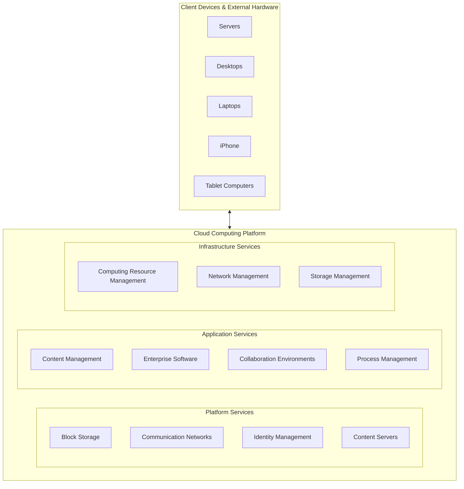
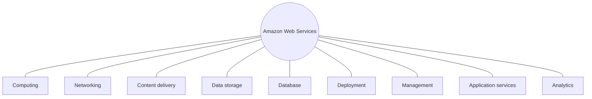

# Chapter 5 Screenshot Extraction - Batch 2 (Screenshots 33 - 64)

**Source Directory**: `/Users/gerrell/Library/Mobile Documents/com~apple~CloudDocs/Strayer/Capstone/Week 4/chapter_5_screenshots`  
**Processed Range**: Images 33 to 64 (32 screenshots total)  
**Extraction Standard**: 100% Verbatim Text, Complete Visual / Layout Inspection, Mermaid.js Diagrams, Case Studies, and Key Terms.

---

## Index of Screenshots Processed

1. **Screenshot 33** (`Screenshot 2026-07-25 at 11.04.32 PM.png`) - Page 175: Hardware/Services Cooperations, Computer Hardware Platforms (Intro).
2. **Screenshot 34** (`Screenshot 2026-07-25 at 11.04.35 PM.png`) - Page 178: Computer Hardware Platforms (Mobile & Mainframes).
3. **Screenshot 35** (`Screenshot 2026-07-25 at 11.04.39 PM.png`) - Page 178: Operating System Platforms (Unix, Linux, Windows, Chrome OS, Android, iOS, Multitouch).
4. **Screenshot 36** (`Screenshot 2026-07-25 at 11.04.44 PM.png`) - Page 178: Enterprise Software Applications (SAP, Oracle, Middleware).
5. **Screenshot 37** (`Screenshot 2026-07-25 at 11.04.48 PM.png`) - Page 179: Data Management and Storage (DB2, Oracle, SQL Server, Sybase, MySQL, Hadoop).
6. **Screenshot 38** (`Screenshot 2026-07-25 at 11.04.51 PM.png`) - Page 179: Networking/Telecommunications Platforms (TCP/IP, Cisco, Juniper, AT&T, Verizon).
7. **Screenshot 39** (`Screenshot 2026-07-25 at 11.04.53 PM.png`) - Page 179: Internet Platforms (Web hosting, server consolidation, Visual Studio, .NET).
8. **Screenshot 40** (`Screenshot 2026-07-25 at 11.04.56 PM.png`) - Page 180: Consulting and System Integration Services (Legacy Systems, Accenture, IBM, HP, Infosys, Wipro).
9. **Screenshot 41** (`Screenshot 2026-07-25 at 11.04.59 PM.png`) - Page 180: 5-3 Hardware Platform Trends, Mobile Digital Platform.
10. **Screenshot 42** (`Screenshot 2026-07-25 at 11.05.02 PM.png`) - Page 180: Wearable Computing Devices.
11. **Screenshot 43** (`Screenshot 2026-07-25 at 11.05.05 PM.png`) - Page 180: Interactive Session Management: BYOD Case Study (Part 1).
12. **Screenshot 44** (`Screenshot 2026-07-25 at 11.05.08 PM.png`) - Page 181: Interactive Session Management: BYOD Case Study (Part 2 - Brother Industries).
13. **Screenshot 45** (`Screenshot 2026-07-25 at 11.05.12 PM.png`) - Page 181: Interactive Session Management: BYOD Case Study (Part 3 - MobileIron & Arup Group).
14. **Screenshot 46** (`Screenshot 2026-07-25 at 11.05.17 PM.png`) - Page 182: BYOD Case Study Questions & Consumerization of IT.
15. **Screenshot 47** (`Screenshot 2026-07-25 at 11.05.19 PM.png`) - Page 182: Consumerization of IT (Continuation).
16. **Screenshot 48** (`Screenshot 2026-07-25 at 11.05.22 PM.png`) - Page 182: Quantum Computing.
17. **Screenshot 49** (`Screenshot 2026-07-25 at 11.05.24 PM.png`) - Page 183: Virtualization & Software-Defined Storage (SDS).
18. **Screenshot 50** (`Screenshot 2026-07-25 at 11.05.27 PM.png`) - Page 183: Cloud Computing Overview & Figure 5.9 Cloud Computing Platform Diagram.
19. **Screenshot 51** (`Screenshot 2026-07-25 at 11.05.32 PM.png`) - Page 184: Figure 5.9 Full Diagram & Intro to NIST Cloud Characteristics.
20. **Screenshot 52** (`Screenshot 2026-07-25 at 11.05.35 PM.png`) - Page 184: NIST 5 Essential Characteristics of Cloud Computing & Infrastructure as a Service (IaaS).
21. **Screenshot 53** (`Screenshot 2026-07-25 at 11.05.38 PM.png`) - Page 185: Figure 5.10 Amazon Web Services Diagram.
22. **Screenshot 54** (`Screenshot 2026-07-25 at 11.05.42 PM.png`) - Page 185: Software as a Service (SaaS), Platform as a Service (PaaS) & Interactive Session Organizations: "Look to the Cloud" Case Study (Part 1).
23. **Screenshot 55** (`Screenshot 2026-07-25 at 11.05.46 PM.png`) - Page 186: "Look to the Cloud" Case Study (Part 2 - AWS, 99designs).
24. **Screenshot 56** (`Screenshot 2026-07-25 at 11.05.49 PM.png`) - Page 186: "Look to the Cloud" Case Study (Part 3 - Runaway Costs, Outages Densify, Azure, Google Cloud, AWS).
25. **Screenshot 57** (`Screenshot 2026-07-25 at 11.05.54 PM.png`) - Page 187: "Look to the Cloud" Case Study (Part 4 - Netflix, Dropbox repatriation, Legacy Systems).
26. **Screenshot 58** (`Screenshot 2026-07-25 at 11.05.57 PM.png`) - Page 187: Cloud Case Study Questions & Salesforce.com Cloud Solutions.
27. **Screenshot 59** (`Screenshot 2026-07-25 at 11.06.01 PM.png`) - Page 188: Salesforce Platform, Public Cloud, Private Cloud, On-Demand Computing.
28. **Screenshot 60** (`Screenshot 2026-07-25 at 11.06.04 PM.png`) - Page 188: Hybrid Cloud & Table 5.2 Intro.
29. **Screenshot 61** (`Screenshot 2026-07-25 at 11.06.06 PM.png`) - Page 188: Table 5.2 Cloud Computing Models Compared (Full Table).
30. **Screenshot 62** (`Screenshot 2026-07-25 at 11.11.00 PM.png`) - Page 188: Edge Computing.
31. **Screenshot 63** (`Screenshot 2026-07-25 at 11.11.04 PM.png`) - Page 189: Green Computing / Green IT.
32. **Screenshot 64** (`Screenshot 2026-07-25 at 11.11.07 PM.png`) - Page 190: High-Performance and Power-Saving Processors (Multicore Processor).

---

## Detailed Exhaustive Extraction per Screenshot

### Screenshot 33 (`Screenshot 2026-07-25 at 11.04.32 PM.png`)
- **Page Indicator**: `175 / 589`
- **Heading**: `Figure 5.8 Full Alternative Text` [link icon]
- **Text Body**:
  > In the past, technology vendors supplying these components offered purchasing firms a mixture of incompatible, proprietary, partial solutions that could not work with other vendor products. Increasingly, vendor firms have been forced to cooperate in strategic partnerships with one another in order to keep their customers. For instance, a hardware and services provider such as IBM cooperates with all the major enterprise software providers, has strategic relationships with system integrators, and promises to work with whichever data management products its client firms wish to use (even though it sells its own database management software called DB2).
  >
  > Another big change is that companies are moving more of their IT infrastructure to the cloud or to outside services, owning and managing much less on their premises. Firms’ IT infrastructure will increasingly be an amalgam of components and services that are partially owned, partially rented or licensed, partially located on site, and partially supplied by external vendors or cloud services.
- **Section Heading**: `Computer Hardware Platforms`
- **Text Body**:
  > Firms worldwide are expected to spend $688 billion on computer hardware devices in 2020, including mainframes, servers, PCs, tablets, and smartphones. All these devices constitute the computer hardware platform for corporate (and personal) computing worldwide.
  >
  > Most business computing has taken place using microprocessor chips manufactured or designed by Intel Corporation and, to a lesser extent, AMD Corporation. Intel and AMD processors are often referred to as “i86” processors because the original IBM PCs used an Intel 8086 processor, and all the Intel (and AMD) chips that followed are downward compatible with this processor. (For instance, you should be able to run a software application designed 10 years ago on a new PC you bought yesterday.)
  >
  > The computer platform changed dramatically with the introduction of mobile computing devices, from the iPod in 2001 to the [continued in image 34]

---

### Screenshot 34 (`Screenshot 2026-07-25 at 11.04.35 PM.png`)
- **Page Indicator**: `178 / 589`
- **Text Body**:
  > worldwide.
  >
  > Most business computing has taken place using microprocessor chips manufactured or designed by Intel Corporation and, to a lesser extent, AMD Corporation. Intel and AMD processors are often referred to as “i86” processors because the original IBM PCs used an Intel 8086 processor, and all the Intel (and AMD) chips that followed are downward compatible with this processor. (For instance, you should be able to run a software application designed 10 years ago on a new PC you bought yesterday.)
  >
  > The computer platform changed dramatically with the introduction of mobile computing devices, from the iPod in 2001 to the iPhone in 2007 and the iPad in 2010. Worldwide, over 3.5 billion people use smartphones. You can think of these devices as a second computer hardware platform, one that is consumer device–driven.
  >
  > Mobile devices are not required to perform as many tasks as computers in the first computer hardware platform, so they consume less power, and generate less heat. Processors for mobile devices are manufactured by a wide range of firms, including Apple, Samsung, and Qualcomm, using an architecture designed by ARM Holdings.
  >
  > Mainframes have not disappeared. They continue to be used to reliably and securely handle huge volumes of transactions, for analyzing very large quantities of data, and for handling large workloads in cloud computing centers. The mainframe is still the digital workhorse for banking and telecommunications networks that are often running software programs that are older and require a specific hardware platform. However, the number of providers has dwindled to one: IBM. IBM has also repurposed its mainframe systems so they can be used as giant servers for enterprise networks and corporate websites. A single IBM mainframe can run thousands of instances of Linux or Windows Server software and is capable of replacing thousands of smaller servers (see the discussion of virtualization in **Section 5-3** [link icon]).

---

### Screenshot 35 (`Screenshot 2026-07-25 at 11.04.39 PM.png`)
- **Page Indicator**: `178 / 589`
- **Section Heading**: `Operating System Platforms`
- **Text Body**:
  > The leading operating systems for corporate servers are Microsoft Windows Server, **Unix** [info icon], and **Linux** [info icon], an inexpensive and robust open source relative of Unix. Microsoft Windows Server is capable of providing enterprise-wide operating system and network services and appeals to organizations seeking Windows-based IT infrastructures. Unix and Linux are scalable, reliable, and much less expensive than mainframe operating systems. They can also run on many different types of processors. The major providers of Unix operating systems are IBM, HP, and Oracle-Sun, each with slightly different and partially incompatible versions.
  >
  > Over 80 percent of PCs use some form of the Microsoft Windows **operating system** [info icon] for managing the resources and activities of the computer. However, there is now a much greater variety of client operating systems than in the past, with new operating systems for computing on handheld mobile digital devices or cloud-connected computers.
  >
  > Google’s **Chrome OS** [info icon] provides a lightweight operating system for cloud computing using a web-connected computer. Programs are not stored on the user’s computer but are used over the Internet and accessed through the Chrome web browser. User data reside on servers across the Internet. **Android** [info icon] is an open source operating system for mobile devices such as smartphones and tablet computers, developed by the Open Handset Alliance led by Google. It has become the most popular smartphone platform worldwide, competing with iOS, Apple’s mobile operating system for the iPhone, iPad, and iPod Touch. Conventional client operating system software is designed around the mouse and keyboard but increasingly is becoming more natural and intuitive by using touch technology. **iOS** [info icon], the operating system for the phenomenally popular Apple iPad and iPhone, features a **multitouch** [info icon] interface, where users employ one or more fingers to manipulate objects on a screen without a mouse or keyboard. Microsoft’s **Windows 10** [info icon] and Windows 8, which run on tablets as well as PCs, have multitouch capabilities, as do many Android devices.

---

### Screenshot 36 (`Screenshot 2026-07-25 at 11.04.44 PM.png`)
- **Page Indicator**: `178 / 589`
- **Section Heading**: `Enterprise Software Applications`
- **Text Body**:
  > Firms worldwide are expected to spend about $503 billion in 2020 on software for enterprise applications that are treated as components of IT infrastructure. We introduced the various types of enterprise applications in **Chapter 2** [link icon], and **Chapter 9** [link icon] provides a more detailed discussion of each.
  >
  > The largest providers of enterprise application software are SAP and Oracle. Also included in this category is middleware software supplied by vendors such as IBM and Oracle for achieving firmwide integration by linking the firm’s existing application systems. Microsoft is attempting to move into the lower ends of this market by focusing on small and medium-sized businesses.

---

### Screenshot 37 (`Screenshot 2026-07-25 at 11.04.48 PM.png`)
- **Page Indicator**: `179 / 589`
- **Section Heading**: `Data Management and Storage`
- **Text Body**:
  > Enterprise database management software is responsible for organizing and managing the firm’s data so that they can be efficiently accessed and used. **Chapter 6** [link icon] describes this software in detail. The leading database software providers are IBM (DB2), Oracle, Microsoft (SQL Server), and SAP Sybase (Adaptive Server Enterprise). MySQL is a Linux open source relational database product now owned by Oracle Corporation, and Apache Hadoop is an open source software framework for managing very large data sets (see **Chapter 6** [link icon]).

---

### Screenshot 38 (`Screenshot 2026-07-25 at 11.04.51 PM.png`)
- **Page Indicator**: `179 / 589`
- **Section Heading**: `Networking/Telecommunications Platforms`
- **Text Body**:
  > Companies worldwide are expected to spend $1.5 trillion for telecommunications services in 2020 (Gartner, Inc., 2020). Windows Server is predominantly used as a local area network operating system, followed by Linux and Unix. Large, enterprise-wide area networks use some variant of Unix. Most local area networks, as well as wide area enterprise networks, use the TCP/IP protocol suite as a standard (see **Chapter 7** [link icon]).
  >
  > Cisco and Juniper Networks are leading networking hardware providers. Telecommunications platforms are typically provided by telecommunications/telephone services companies that offer voice and data connectivity, wide area networking, wireless services, and Internet access. Leading telecommunications service vendors include AT&T and Verizon. This market is exploding with new providers of cellular wireless, high-speed Internet, and Internet telephone services.

---

### Screenshot 39 (`Screenshot 2026-07-25 at 11.04.53 PM.png`)
- **Page Indicator**: `179 / 589`
- **Section Heading**: `Internet Platforms`
- **Text Body**:
  > Internet platforms include hardware, software, and management services to support a firm’s website, including web hosting services, routers, and cabling or wireless equipment. A **web hosting service** [info icon] maintains a large web server, or series of servers, and provides fee-paying subscribers with space to maintain their websites.
  >
  > The Internet revolution created a veritable explosion in server computers, with many firms collecting thousands of small servers to run their Internet operations. There has been a steady push to reduce the number of server computers by increasing the size and power of each and by using software tools that make it possible to run more applications on a single server. Use of standalone server computers is decreasing as organizations transition to cloud computing services. The Internet hardware server market has become increasingly concentrated in the hands of IBM, Dell, Oracle, and HP, as prices have fallen dramatically.
  >
  > The major web software application development tools and suites are supplied by Microsoft (Microsoft Visual Studio and the Microsoft .NET development platform), Oracle-Sun, and a host of independent software developers, including Adobe. **Chapter 7** [link icon] describes the components of the firm’s Internet platform in greater detail.

---

### Screenshot 40 (`Screenshot 2026-07-25 at 11.04.56 PM.png`)
- **Page Indicator**: `180 / 589`
- **Section Heading**: `Consulting and System Integration Services`
- **Text Body**:
  > Today, even a large firm does not have the staff, the skills, the budget, or the necessary experience to deploy and maintain its entire IT infrastructure. Implementing a new infrastructure requires (as noted in **Chapters 13** [link icon] and **14** [link icon]) significant changes in business processes and procedures, training and education, and software integration. Leading consulting firms providing this expertise include Accenture, IBM Services, HP, Infosys, and Wipro.
  >
  > Software integration means ensuring the new infrastructure works with the firm’s older, so-called legacy systems and ensuring the new elements of the infrastructure work with one another. **Legacy systems** [info icon] are generally older transaction processing systems created for mainframe computers that continue to be used to avoid the high cost of replacing or redesigning them. Replacing these systems is cost prohibitive and generally not necessary if these older systems can be integrated into a contemporary infrastructure.

---

### Screenshot 41 (`Screenshot 2026-07-25 at 11.04.59 PM.png`)
- **Page Indicator**: `180 / 589`
- **Main Section Heading**: `5-3 What are the current trends in computer hardware platforms?`
- **Text Body**:
  > The exploding power of computer hardware and networking technology has dramatically changed how businesses organize their computing power, putting more of this power on networks and mobile handheld devices and obtaining more of their computing capabilities in the form of services. We look at eight hardware trends: the mobile digital platform, consumerization of IT and BYOD, quantum computing, virtualization, cloud computing, edge computing, green computing, and high-performance/power-saving processors.
- **Subsection Heading**: `The Mobile Digital Platform`
- **Text Body**:
  > New mobile digital computing platforms have emerged as alternatives to PCs and larger computers. The iPhone and Android smartphones have taken on many functions of PCs, including transmitting data, surfing the web, transmitting email and instant messages, displaying digital content, and exchanging data with internal corporate systems. The mobile platform also includes small, lightweight netbooks optimized for wireless communication and Internet access, **tablet computers** [info icon] such as the iPad, and digital e-book readers such as Amazon’s Kindle with some web access capabilities.
  >
  > Smartphones and tablets are becoming the primary means of accessing the Internet and are increasingly used for business computing as well as for consumer applications. For example, senior executives at General Motors are using smartphone applications that drill down into vehicle sales information, financial performance, manufacturing metrics, and project management status.
  >
  > Wearable computing devices are a recent addition to the mobile digital platform. These include smartwatches, smart glasses, smal [continued in image 42]

---

### Screenshot 42 (`Screenshot 2026-07-25 at 11.05.02 PM.png`)
- **Page Indicator**: `180 / 589`
- **Text Body**:
  > Wearable computing devices are a recent addition to the mobile digital platform. These include smartwatches, smart glasses, smart ID badges, and activity trackers. Wearable computing technology has many business uses, especially for delivering information to workers in warehouses or in the field without requiring them to interrupt their tasks.

---

### Screenshot 43 (`Screenshot 2026-07-25 at 11.05.05 PM.png`)
- **Page Indicator**: `180 / 589`
- **Section Heading**: `Consumerization of IT and BYOD`
- **Sidebar Title**: `Interactive Session Management`
- **Sidebar Heading**: `What Should Firms Do about BYOD?`
- **Case Study Text**:
  > Just about everyone who has a smartphone wants to be able to bring it to work and use it on the job or for work at home, and many employers would like workers to do so. A survey of BYOD trends by MarketsandMarkets found that adoption rates among North American companies approached 50 percent by the start of 2018. Using portable devices for work tasks saves employees 58 minutes per day while increasing productivity by 34 percent. However, BYOD can also cause problems if it is not managed properly.
  >
  > When every employee brings his or her own device to use at work or uses it to work remotely, IT departments risk losing control over the hardware. Without policies or tools for managing mobile devices, the organization can’t control what apps or programs are installed, how the devices are secured, or what files are downloaded. In the past, the firm was able to control who had what technology employees used in order to prevent privacy breaches, hacking, and unauthorized access to corporate information. Inability to control the hardware means more vulnerabilities. That is the big tradeoff with BYOD: offering employees greater flexibility while potentially exposing the company to more risk.
  >
  > When employees bring their own devices to work, they may be tempted to use them on the job for entertainment or catching up with friends. It's incredibly easy for employees to get sucked into an endless black hole of text messaging, YouTube [continued in image 44]

---

### Screenshot 44 (`Screenshot 2026-07-25 at 11.05.08 PM.png`)
- **Page Indicator**: `181 / 589`
- **Case Study Text (continued)**:
  > up with friends. It’s incredibly easy for employees to get sucked into an endless black hole of text messaging, YouTube videos, and checking Facebook updates. Productivity will suffer.
  >
  > BYOD requires a significant portion of corporate IT resources dedicated to managing and maintaining a large number of devices within the organization. The mobile digital landscape is complicated, with a variety of devices and operating systems on the market. Apple’s iOS is considered a closed system and runs only on a limited number of different Apple mobile devices. Android dominates the world smartphone market, but there are many thousands of different models of Android-based devices available around the world.
  >
  > If employees are allowed to work with more than one type of mobile device and operating system, companies need an effective way to keep track of all the devices employees are using. To access company information, the company’s networks must be configured to receive connections from that device. When employees make changes to their personal phone, such as switching cellular carriers, changing their phone number, or buying a new mobile device altogether, companies will need to quickly and flexibly ensure that their employees are still able to remain productive. Firms need a system that keeps track of which devices employees are using, where the device is located, whether it is being used, and what software it is equipped with. For unprepared companies, keeping track of who gets access to what data could be a nightmare.
  >
  > There are significant concerns with securing company information accessed with mobile devices. If a device is stolen or compromised, companies need ways to ensure that sensitive or confidential information isn’t freely available to anyone. Mobility puts assets and data at greater risk than if they were only located within company walls and on company machines. Companies often use technologies that allow them to wipe data from devices remotely or encrypt data so that if the device is stolen, it cannot be used.
  >
  > Because of the heavy emphasis on security at Brother Industries, the company’s initial foray into BYOD was quite restrictive. Brother is a Japanese-headquartered global manufacturer of printing devices. Brother made iPhones and iPads the company standard for mobile devices in 2012. However, this early BYOD program did not allow access to Apple’s App Store [continued in image 45]

---

### Screenshot 45 (`Screenshot 2026-07-25 at 11.05.12 PM.png`)
- **Page Indicator**: `181 / 589`
- **Case Study Text (continued)**:
  > then loosened up these rigid restrictions by adopting a mobile management platform that allowed employees to install apps they needed while securely protecting the corporate network and servers. Users remained dissatisfied because they still couldn’t read password-protected files attached to emails, and email and calendars wouldn’t display correctly. Employees in the field were forced to return to the office in order to view file attachments.
  >
  > These problems were alleviated when Brother adopted MobileIron for enterprise mobility management for the company and its subsidiaries. It became possible to view password-protected files attached to emails and to expand the use of apps that complied with company rules. Management can monitor what apps are being used and how. Brother has not yet standardized on a single mobile device management solution for the entire company. Brother Industries, its Japanese and U.S. subsidiaries, and factories in Asia are using MobileIron, but other Asian sales companies and European subsidiaries are using different solutions. This variation was allowed because of different preferences and ways mobile devices were being used at these other locations.
  >
  > Arup Group Limited, a multinational professional services firm headquartered in London, uses MobileIron to manage a wider array of devices based on the iOS, Android, and Windows mobile operating systems. Arup provides engineering, planning, project management, and consulting services for buildings and other man-made environments, with over 14,000 staff based in 34 countries. Many Arup employees use mobile devices and apps in their work activities, which are often in the field, and mobility has increased their productivity. Arup encouraged employees to enroll their devices in its BYOD program by highlighting a list of productivity apps and the company’s ability to support BYOD. Arup’s mobile policies vary by region. In the Americas and Europe, many employees are outfitted with company-owned mobile devices, but they are still able to enroll their personal devices through a self-service portal. Employees in Asia, however, select mobile devices from a company-approved list. Arup’s BYOD program encompasses thousands of mobile devices, 65 percent of which are based on iOS, 30 percent on Android, and the remainder on Windows for mobile devices.
  >
  > *Sources: “Brother Industries Switches to MobileIron for Optimal Mobile Business Technology” and “Arup Builds a Mobile-First Future with MobileIron,” `www.mobileiron.com`, accessed March 6, 2020; Lilach Bullock,*

---

### Screenshot 46 (`Screenshot 2026-07-25 at 11.05.17 PM.png`)
- **Page Indicator**: `182 / 589`
- **Section Heading**: `Case Study Questions`
- **Questions**:
  1. What are the advantages and disadvantages of allowing employees to use their personal mobile devices for work?
  2. What management, organization, and technology factors should be addressed when deciding whether to allow employees to use their personal mobile devices for work?
  3. Compare and evaluate how the companies described in this case study dealt with the challenges of BYOD.
  4. Allowing employees to use their own smartphones for work will save a company money. Do you agree? Why or why not?

- **Main Body Text**:
  > The popularity, ease of use, and rich array of useful applications for smartphones and tablet computers have created a groundswell of interest in allowing employees to use their personal mobile devices in the workplace, a phenomenon popularly called *“bring your own device” (BYOD)*. **BYOD** [info icon] is one aspect of the **consumerization of IT** [info icon], in which new information technology that first emerges in the consumer market spreads into business organizations. Consumerization of IT includes not only mobile personal devices but also business uses of software services that originated in the consumer marketplace as well, such as Google and Yahoo search, Gmail, Google Maps, Dropbox, and even Facebook and Twitter.
  >
  > Consumerization of IT is forcing businesses to rethink the way they obtain and manage information technology equipment and services. Historically, at least in large firms, the IT department was responsible for selecting and managing the information technology and applications used by the firm and its employees. It furnished employees with desktops or laptops that were able to access corporate systems securely. The IT department maintained control over the firm’s hardware and software to ensure that the business was being protected and that information systems served the purposes of the firm and its management. Today, employees [continued in image 47]

---

### Screenshot 47 (`Screenshot 2026-07-25 at 11.05.19 PM.png`)
- **Page Indicator**: `182 / 589`
- **Main Body Text (continued)**:
  > and business departments are playing a much larger role in technology selection, in many cases demanding that employees be able to use their own personal computers, smartphones, and tablets to access the corporate network. It is more difficult for the firm to manage and control these consumer technologies and make sure they serve the needs of the business. The **Interactive Session on Management** [link icon] explores some of these management challenges created by BYOD and IT consumerization.

---

### Screenshot 48 (`Screenshot 2026-07-25 at 11.05.22 PM.png`)
- **Page Indicator**: `182 / 589`
- **Section Heading**: `Quantum Computing`
- **Text Body**:
  > **Quantum computing** [info icon] uses the principles of quantum physics to represent data and perform operations on these data. While conventional computers handle bits of data as either 0 or 1 but not both, quantum computing can process units of data as 0, 1, or both simultaneously. A quantum computer would gain enormous processing power through this ability to be in multiple states at once, allowing it to solve some scientific and business problems millions of times faster than can be done today. IBM has made quantum computing available to the general public through IBM Cloud. Google’s Alphabet, Microsoft, Intel, and NASA are also working on quantum computing platforms. Quantum computing is still an emerging technology, but its real-world applications are growing.

---

### Screenshot 49 (`Screenshot 2026-07-25 at 11.05.24 PM.png`)
- **Page Indicator**: `183 / 589`
- **Section Heading**: `Virtualization`
- **Text Body**:
  > **Virtualization** [info icon] is the process of presenting a set of computing resources (such as computing power or data storage) so that they can all be accessed in ways that are not restricted by physical configuration or geographic location. Virtualization enables a single physical resource (such as a server or a storage device) to appear to the user as multiple logical resources. For example, a server or mainframe can be configured to run many instances of an operating system (or different operating systems) so that it acts like many different machines. Each virtual server “looks” like a real physical server to software programs, and multiple virtual servers can run in parallel on a single machine. VMware is the leading virtualization software vendor for Windows and Linux servers.
  >
  > Server virtualization is a common method of reducing technology costs by providing the ability to host multiple systems on a single physical machine. Most servers run at just 15 to 20 percent of capacity, and virtualization can boost server utilization rates to 70 percent or higher. Higher utilization rates translate into fewer computers required to process the same amount of work, reduced data center space to house machines, and lower energy usage. Virtualization also facilitates centralization and consolidation of hardware administration.
  >
  > Virtualization also enables multiple physical resources (such as storage devices or servers) to appear as a single logical resource, as in **software-defined storage (SDS)** [info icon], which separates the software for managing data storage from storage hardware. Using software, firms can pool and arrange multiple storage infrastructure resources and efficiently allocate them to meet specific application needs. SDS enables firms to replace expensive storage hardware with lower-cost commodity hardware and cloud storage hardware. There is less under- or over-utilization of storage resources.

---

### Screenshot 50 (`Screenshot 2026-07-25 at 11.05.27 PM.png`) & Screenshot 51 (`Screenshot 2026-07-25 at 11.05.32 PM.png`)
- **Page Indicator**: `183 / 589` - `184 / 589`
- **Section Heading**: `Cloud Computing`
- **Text Body**:
  > It is now possible for companies and individuals to perform all of their computing work using a virtualized IT infrastructure in a remote location, as is the case with cloud computing. Cloud computing is a model of computing in which computer processing, storage, software, and other services are provided as a shared pool of virtualized resources over a network, primarily the Internet. These “clouds” of computing resources can be accessed on an as-needed basis from any connected device and location. **Figure 5.9** [link icon] illustrates the cloud computing concept.
- **Figure Title**: `Figure 5.9 Cloud Computing Platform`

- **Detailed Node Breakdown**:
  - **Connected Devices**: Laptops, iPhone, Desktops, Tablet Computers, Servers.
  - **Platform Services**: Block Storage, Communication Networks, Identity Management, Content Servers.
  - **Application Services**: Content Management, Enterprise Software, Collaboration Environments, Process Management.
  - **Infrastructure Services**: Computing Resource Management, Network Management, Storage Management.

---

### Screenshot 52 (`Screenshot 2026-07-25 at 11.05.35 PM.png`)
- **Page Indicator**: `184 / 589`
- **Heading**: `Figure 5.9 Full Alternative Text` [link icon]
- **Text Body**:
  > The U.S. National Institute of Standards and Technology (NIST) defines cloud computing as having the following essential characteristics (**Mell and Grance, 2009** [link icon]):
  >
  > • **On-demand self-service:** Consumers can obtain computing capabilities such as server time or network storage as needed automatically on their own.
  > • **Ubiquitous network access:** Cloud resources can be accessed using standard network and Internet devices, including mobile platforms.
  > • **Location-independent resource pooling:** Computing resources are pooled to serve multiple users, with different virtual resources dynamically assigned according to user demand. The user generally does not know where the computing resources are located.
  > • **Rapid elasticity:** Computing resources can be rapidly provisioned, increased, or decreased to meet changing user demand.
  > • **Measured service:** Charges for cloud resources are based on amount of resources actually used.
  >
  > Cloud computing consists of three different types of services:
  >
  > • **Infrastructure as a service (IaaS)** [info icon]: Customers use processing, storage, networking, and other computing resources from cloud service providers to run their information systems. For example, Amazon uses the spare capacity of its IT infrastructure to provide a broadly based cloud environment selling IT infrastructure services. These include its Simple Storage Service (S3) for storing customers’ data and its Elastic Compute Cloud (EC2) service for running their applications. Users pay only for the amount of computing and storage capacity they actually use. (See the Interactive Session on Organizations.) **Figure 5.10** [link icon] shows the range of services Amazon Web Services offers.

---

### Screenshot 53 (`Screenshot 2026-07-25 at 11.05.38 PM.png`)
- **Page Indicator**: `185 / 589`
- **Figure Title**: `Figure 5.10 Amazon Web Services`

- **Text Body below Figure 5.10**:
  > Amazon Web Services (AWS) is a collection of web services that Amazon provides to users of its cloud platform. AWS is the largest provider of cloud computing services in the United States.

---

### Screenshot 54 (`Screenshot 2026-07-25 at 11.05.42 PM.png`)
- **Page Indicator**: `185 / 589`
- **Heading**: `Figure 5.10 Full Alternative Text` [link icon]
- **Text Body**:
  > • **Software as a service (SaaS)** [info icon]: Customers use software hosted by the vendor on the vendor’s cloud infrastructure and delivered as a service over a network. Leading software as a service (SaaS) examples are Google’s G Suite, which provides common business applications online, and **Salesforce.com**, which leases customer relationship management and related software services over the Internet. Both charge users an annual subscription fee, although Google has a pared-down free version. Users access these applications from a web browser, and the data and software are maintained on the providers’ remote servers.
  > • **Platform as a service (PaaS)** [info icon]: Customers use infrastructure and programming tools supported by the cloud service provider to develop their own applications. For example, Microsoft offers PaaS tools and services for software development and testing among its Azure cloud services. Another example is **Salesforce.com**’s Salesforce Platform.

- **Sidebar Title**: `Interactive Session Organizations`
- **Sidebar Heading**: `Look to the Cloud`
- **Case Study Text**:
  > If you want to see where computing is taking place, look to the cloud. Cloud computing is now the fastest-growing form of computing. According to global cloud services provider AllCloud’s “2020 Cloud Infrastructure Report,” 85 percent of the companies surveyed said they expect to have the majority of their workloads on the cloud by the end of 2020, and 24 percent plan to be cloud-only.
  >
  > Cloud computing has become an affordable and sensible option for companies of all sizes, ranging from tiny Internet startups to established companies like Netflix and FedEx. For example, Amazon Web Services (AWS) provides subscribing [continued in image 55]

---

### Screenshot 55 (`Screenshot 2026-07-25 at 11.05.46 PM.png`)
- **Page Indicator**: `186 / 589`
- **Case Study Text (continued)**:
  > startups to established companies like Netflix and FedEx. For example, Amazon Web Services (AWS) provides subscribing companies with flexible computing power and data storage as well as data management, messaging, payment, and other services that can be used together or individually, as the business requires. Anyone with an Internet connection and a little bit of money can harness the same computing systems that Amazon itself uses to run its retail business. If customers provide specifications on the amount of server space, bandwidth, storage, and any other services they require, AWS can automatically allocate those resources. You don’t pay a monthly or yearly fee to use Amazon’s computing resources. Instead, you pay for exactly what you use. Economies of scale keep costs low.
  >
  > Cloud computing also appeals to many businesses because the cloud services provider will handle all of the maintenance and upkeep of their IT infrastructures, allowing these businesses to spend more time on higher-value work. Start-up companies and smaller companies are finding that they no longer need to build their own data center. With cloud infrastructures like Amazon’s readily available, they have access to technical capability that was formerly available only to much larger businesses.
  >
  > San Francisco-based 99designs runs an online marketplace that connects companies or individuals who have design needs for logos, brochures, clothing, and packaging with designers who can provide those services. It has over 1.6 million registered users and receives two new design submissions every second. Designers compete for work by responding to customer design briefs posted on the website. The company uses AWS to host its information systems because it can easily accommodate the computing needs posed by its rapid year-to-year growth in traffic and users without high up-front investments in new information technology. 99designs uses AWS for data management, hosting applications, and storing a very high volume of design data (over 100 terabytes). AWS helped 99designs reduce the amount of IT infrastructure it needed to manage directly, producing ongoing operational cost savings.
  >
  > Although cloud computing has been touted as a less expensive yet more flexible alternative to buying and owning information technology, this isn’t always the case. For large companies, paying a public cloud provider a monthly service fee for 10,000 or more employees may actually be more expensive than having the company maintain its own IT infrastructure [continued in image 56]

---

### Screenshot 56 (`Screenshot 2026-07-25 at 11.05.49 PM.png`)
- **Page Indicator**: `186 / 589`
- **Case Study Text (continued)**:
  > and staff. Companies also worry about unexpected “runaway costs” from using a pay-per-use model. Integrating cloud services with existing IT infrastructures, errors, mismanagement, or unusually high volumes of web traffic will run up the bill for cloud service users. When an organization decides to transform its IT infrastructure from in-house to a cloud-based setup, applications may require a major upgrade or need to be retired and replaced.
  >
  > Densify, a cloud optimization firm serving large companies, recently surveyed 70 global companies and 200 cloud-industry professionals and found that companies across all industries may be overspending on cloud services by as much as 42 percent. These companies have been estimating more cloud computing capacity than they actually need or buying reserve capacity in advance that they never use. This can translate into hundreds of thousands or even millions of lost dollars in IT budgets a year.
  >
  > A major barrier to widespread cloud adoption has been concerns about cloud reliability and security. Hardware shutdowns due to severe weather in September 2018 caused a Microsoft Azure cloud outage that impacted three dozen cloud services. It took up to two days for some services to restore operations. A network congestion problem on June 2, 2019 brought down many Google Cloud services, GSuite apps, and YouTube for roughly four hours. A large number of brands using Google Cloud services such as Target, The National Institutes of Health, eBay, Paypal, and Snapchat were potentially impacted by the outage. AWS experienced an outage in one of its data centers in northern Virginia on August 31, 2019 due to utility power failure and has also experienced other significant cloud outages during the preceding five years. As cloud computing continues to mature and the major cloud infrastructure providers gain more experience, cloud service and reliability have steadily improved. Experts recommend that companies for whom an outage would be a major risk consider using another computing service as a backup.
  >
  > In February 2016 Netflix completed a decade-long project to shut down its own data centers and use Amazon’s cloud exclusively to run its business. Management appreciated not having to guess months beforehand about the firm’s hardware, storage, and networking needs or to tie down company resources securing and maintaining hardware. AWS would provide [continued in image 57]

---

### Screenshot 57 (`Screenshot 2026-07-25 at 11.05.54 PM.png`)
- **Page Indicator**: `187 / 589`
- **Case Study Text (continued)**:
  > In February 2016 Netflix completed a decade-long project to shut down its own data centers and use Amazon’s cloud exclusively to run its business. Management appreciated not having to guess months beforehand about the firm’s hardware, storage, and networking needs or to tie down company resources securing and maintaining hardware. AWS would provide whatever hardware Netflix needed at the moment, while Netflix owned its own software, which is more important for a content-driven business.
  >
  > Although Netflix, Intuit, and Juniper Networks are among the companies that have embraced a “cloud first” strategy in which all their computing work takes place in the cloud, others are dialing back their cloud computing investments. These companies found they lacked the in-house expertise to effectively manage the move to public cloud services like Amazon Web Services and Microsoft Azure. Costs soared exponentially if they had to restore, move, or access their information. The cloud introduces new complexity.
  >
  > Online file hosting company Dropbox had been an early AWS success story, but it had never run all of its systems on AWS. Dropbox’s strategy to build one of the largest data stores in the world depended on owning its computing resources. Dropbox removed most of the systems it ran with AWS to build systems better suited to its needs, saving nearly $75 million in infrastructure costs over three years. However, that transition was costly. The company spent more than $53 million for custom architectures in three colocation facilities to accommodate exabytes of storage. Dropbox stores the remaining 10 percent of user data on AWS, in part to localize data in the U.S. and Europe.
  >
  > Many large companies moving more of their computing to the cloud are unable to migrate completely. Legacy systems are the most difficult to switch over. Most midsized and large companies will gravitate toward a hybrid approach. The top cloud providers themselves—Amazon, Google, Microsoft, and IBM—use their own public cloud services for some purposes, but they continue to keep certain functions on private servers. Worries about reliability, security, and risks of change have made it difficult for them to move critical computing tasks to the public cloud.

---

### Screenshot 58 (`Screenshot 2026-07-25 at 11.05.57 PM.png`)
- **Page Indicator**: `187 / 589`
- **Case Study Sources**:
  > *Sources: “AllCloud Reveals Current and Emerging Trends in Cloud Infrastructure,” `https://allcloud.io/press_releases/allcloud-reveals-current-and-emerging-trends-in-cloud-infrastructure`, January 15, 2020, accessed May 11, 2020; “Top IT Outages of 2019,” StatusCast, January 2020; “AWS Case Study: 99Designs,” `https://aws.amazon.com`, accessed March 7, 2020; Chris Preimesberger, “How Cloud Environments Will Evolve Over the Next Few Years,” eWeek, March 12, 2019; Angus Loten, “Rush to the Cloud Creates Risk of Overspending,” Wall Street Journal, July 25, 2018; Trevor Jones, “Dropbox Is Likely an Outlier with Its Successful Cloud Data Migration off AWS,” `searchaws.com`, February 28, 2018; Andy Patrizio and Tom Krazit, “Widespread Outage at Amazon Web Services’ U.S. East Region Takes Down Alexa, Atlassian Developer Tools,” GeekWire, March 2, 2018.*

- **Section Heading**: `Case Study Questions`
- **Questions**:
  1. What business benefits do cloud computing services provide? What problems do they solve?
  2. What are the disadvantages of cloud computing?
  3. What kinds of businesses are most likely to benefit from using cloud computing? Why?

- **Main Body Text**:
  > **Chapter 2** [link icon] discussed Google Docs, Microsoft Office 365, and related software services for desktop productivity and collaboration. These are among the most popular software services for consumers, although they are increasingly used in business. **Salesforce.com** is a leading software service for business. **Salesforce.com** provides customer relationship management (CRM) and other application software solutions as software services leased over the Internet. Its sales and service clouds offer applications for improving sales and customer service. A marketing cloud enables companies to engage in digital marketing interactions with customers through email, mobile, social, web, and connected products. **Salesforce.com** also provides a community cloud platform for online collaboration and engagement and an analytics cloud platform to deploy sales, service, marketing, and custom analytics apps.
  >
  > **Salesforce.com** is also a leading example of platform as a service (PaaS). Its Salesforce Platform gives users the ability to develop [continued in image 59]

---

### Screenshot 59 (`Screenshot 2026-07-25 at 11.06.01 PM.png`)
- **Page Indicator**: `188 / 589`
- **Main Body Text (continued)**:
  > **Salesforce.com** is also a leading example of platform as a service (PaaS). Its Salesforce Platform gives users the ability to develop, launch, and manage applications without having to deal with the infrastructure required for creating new software. The Salesforce Platform provides a set of development tools and IT services that enable users to build new applications and run them in the cloud on **Salesforce.com**’s data center infrastructure. **Salesforce.com** also lists software from other independent developers on its AppExchange, an online marketplace for third-party applications that run on the Salesforce Platform.
  >
  > A cloud can be private or public. A **public cloud** [info icon] is owned and maintained by a cloud service provider, such as Amazon Web Services, and made available to the general public or industry group. Public cloud services are often used for websites with public information and product descriptions, one-time large computing projects, developing and testing new applications, and consumer services such as online storage of data, music, and photos. Google Drive, Dropbox, and Apple iCloud are leading examples of these consumer public cloud services.
  >
  > A **private cloud** [info icon] is operated solely for an organization. It may be managed by the organization or a third party and may be hosted either internally or externally. Like public clouds, private clouds are able to allocate storage, computing power, or other resources seamlessly to provide computing resources on an as-needed basis. Companies that want flexible IT resources and a cloud service model while retaining control over their own IT infrastructure are gravitating toward these private clouds.
  >
  > Because organizations using public clouds do not own the infrastructure, they do not have to make large investments in their own hardware and software. Instead, they purchase their computing services from remote providers and pay only for the amount of computing power they actually use (utility computing) or are billed on a monthly or annual subscription basis. The term **on-demand computing** [info icon] has also been used to describe such services.
  >
  > Cloud computing has some drawbacks. Unless users make provisions for storing their data locally, the responsibility for data [continued in image 60]

---

### Screenshot 60 (`Screenshot 2026-07-25 at 11.06.04 PM.png`) & Screenshot 61 (`Screenshot 2026-07-25 at 11.06.06 PM.png`)
- **Page Indicator**: `188 / 589`
- **Main Body Text**:
  > storage and control is in the hands of the provider. Some companies worry about the security risks related to entrusting their critical data and systems to an outside vendor that also works with other companies. Companies expect their systems to be available 24/7 and do not want to suffer any loss of business capability if cloud infrastructures malfunction. Nevertheless, the trend is for companies to shift more of their computer processing and storage to some form of cloud infrastructure. Startups and small companies with limited IT resources and budgets will find public cloud services especially helpful.
  >
  > Large firms are most likely to adopt a **hybrid cloud** [info icon] computing model where they use their own infrastructure for their most essential core activities and adopt public cloud computing for less critical systems or for additional processing capacity during peak business periods. **Table 5.2** [link icon] compares the three cloud computing models. Cloud computing will gradually shift firms from having a fixed infrastructure capacity toward a more flexible infrastructure, some of it owned by the firm and some of it rented from giant computer centers owned by computer hardware vendors. You can find out more about cloud computing in the Learning Tracks for this chapter.

- **Table Title**: `Table 5.2 Cloud Computing Models Compared`

| Type of Cloud | Description | Managed By | Uses |
| --- | --- | --- | --- |
| **Public cloud** | Third-party service offering computing, storage, and software services to multiple customers and that is available to the public | Third-party service providers | • Companies without major privacy concerns • Companies seeking pay-as-you-go IT services • Companies lacking IT resources and expertise |
| **Private cloud** | Cloud infrastructure operated solely for a single organization and hosted either internally or externally | In-house IT or private third-party host | • Companies with stringent privacy and security requirements • Companies that must have control over data sovereignty |
| **Hybrid cloud** | Combination of private and public cloud services that remain separate entities | In-house IT, private host, third-party providers | • Companies requiring some in-house control of IT that are also willing to assign part of their IT infrastructures to a public cloud |

---

### Screenshot 62 (`Screenshot 2026-07-25 at 11.11.00 PM.png`)
- **Page Indicator**: `188 / 589`
- **Section Heading**: `Edge Computing`
- **Text Body**:
  > Having all the laptops, smartphones, tablets, wireless sensor networks, and local on-premise servers used in cloud computing systems interacting with a single central public cloud data center to process all their data can be inefficient and costly. **Edge computing** [info icon] is a method of optimizing cloud computing systems by performing some data processing on a set of linked servers at the edge of the network, near the source of the data. This reduces the amount of data flowing back and forth between local computers and other devices and the central cloud data center.
  >
  > Edge computing deployments are useful when sensors or other IoT devices do not need to be constantly connected to a central cloud. For example, an oil rig in the ocean might have thousands of sensors producing large amounts of data, perhaps to confirm that systems are working properly. The data do not necessarily need to be sent over a network as soon as they are produced, so the local edge computing system could compile the data and send daily reports to a central data center or cloud for long-term storage. By only sending important data over the network, the edge computing system reduces the amount of data traversing the network.
  >
  > Edge computing also reduces delays in the transmitting and processing of data because data does not have to travel over a network to a remote data center or cloud for processing. This is ideal for situations where delays of milliseconds can be untenable, such as in financial services, manufacturing, or autonomous vehicles.

---

### Screenshot 63 (`Screenshot 2026-07-25 at 11.11.04 PM.png`)
- **Page Indicator**: `189 / 589`
- **Section Heading**: `Green Computing`
- **Text Body**:
  > By curbing hardware proliferation and power consumption, virtualization has become one of the principal technologies for promoting green computing. **Green computing, or green IT** [info icon], refers to practices and technologies for designing, manufacturing, using, and disposing of computers, servers, and associated devices such as monitors, printers, storage devices, and networking and communications systems to minimize impact on the environment.
  >
  > According to Green House Data, the world’s data centers use as much energy as the output of 30 nuclear power plants, which amounts to 1.5 percent of all energy use in the world. A corporate data center can easily consume over 100 times more power than a standard office building. All this additional power consumption has a negative impact on the environment and corporate operating costs. Data centers are now being designed with energy efficiency in mind, using state-of-the art air-cooling techniques, energy-efficient equipment, virtualization, and other energy-saving practices. Large companies like Microsoft, Google, Facebook, and Apple are starting to reduce their carbon footprint with clean energy–powered data centers with power-conserving equipment and extensive use of wind and hydropower.

---

### Screenshot 64 (`Screenshot 2026-07-25 at 11.11.07 PM.png`)
- **Page Indicator**: `190 / 589`
- **Section Heading**: `High-Performance and Power-Saving Processors`
- **Text Body**:
  > Another way to reduce power requirements and hardware sprawl is to use more efficient and power-saving processors. Contemporary microprocessors now feature multiple processor cores (which perform the reading and execution of computer instructions) on a single chip. A **multicore processor** [info icon] is an integrated circuit to which two or more processor cores have been attached for enhanced performance, reduced power consumption, and more efficient simultaneous processing of multiple tasks. This technology enables two or more processing engines with reduced power requirements and heat dissipation to perform tasks faster than a resource-hungry chip with a single processing core. Today you’ll find PCs with dual-core, quad-core, six-core, and eight-core processors and servers with 16- and 32-core processors.
  >
  > Intel and other chip manufacturers are working on microprocessors that minimize power consumption, which is essential for prolonging battery life in small mobile digital devices. Highly power-efficient microprocessors, such as A10, A11 Bionic, and A12 Bionic processors used in Apple’s iPhone and iPad and Intel’s Atom processor, are used in lightweight smartphones and tablets, intelligent cars, and healthcare devices.

---

## Glossary / Key Terms Identified in Batch 2

1. **Unix**: Scalable, reliable multiuser operating system for enterprise servers (IBM, HP, Oracle-Sun).
2. **Linux**: Inexpensive, robust open-source operating system relative of Unix used on servers and mainframes.
3. **Operating system**: System software that manages computer hardware and software resources and provides common services for computer programs.
4. **Chrome OS**: Lightweight operating system for cloud computing using a web-connected computer running applications through Chrome browser.
5. **Android**: Open-source operating system for mobile devices developed by Google and the Open Handset Alliance.
6. **iOS**: Proprietary mobile operating system created by Apple for iPhone, iPad, and iPod Touch.
7. **Multitouch**: Natural UI interface allowing users to employ one or more fingers to manipulate on-screen objects without a mouse/keyboard.
8. **Windows 10**: Microsoft operating system with multitouch capabilities for PCs and tablets.
9. **Web hosting service**: Service that maintains web servers and provides fee-paying subscribers with space to host websites.
10. **Legacy systems**: Older transaction processing systems created for mainframes that continue to be used to avoid high replacement costs.
11. **Tablet computers**: Mobile handheld computers such as the iPad optimized for wireless communications and web access.
12. **BYOD (Bring Your Own Device)**: Workplace phenomenon allowing employees to use personal mobile devices for business tasks.
13. **Consumerization of IT**: Process where new IT emerging in consumer markets spreads into corporate enterprises.
14. **Quantum computing**: Computing paradigm using quantum physics principles (superposition/qubits) to perform operations millions of times faster than classical computers.
15. **Virtualization**: Process of presenting a set of computing resources so they can be accessed free of physical or geographic limitations.
16. **Software-Defined Storage (SDS)**: Abstraction separating data storage management software from physical storage hardware.
17. **Infrastructure as a Service (IaaS)**: Cloud service model providing processing, storage, networking, and computing capacity on demand (e.g. AWS EC2, S3).
18. **Software as a Service (SaaS)**: Cloud model delivering applications hosted by vendors over the web on a subscription basis (e.g., G Suite, Salesforce).
19. **Platform as a Service (PaaS)**: Cloud model providing infrastructure and development tools to build/run applications (e.g., Azure PaaS, Salesforce Platform).
20. **Public cloud**: Cloud infrastructure owned and maintained by a third-party provider and made available to the general public/industry.
21. **Private cloud**: Virtualized cloud infrastructure operated solely for a single organization.
22. **On-demand computing**: Pay-as-you-go computing model where services are purchased as needed from remote providers.
23. **Hybrid cloud**: Cloud computing model combining private cloud infrastructure with public cloud services.
24. **Edge computing**: Optimization method performing data processing on linked servers at the edge of the network near data sources.
25. **Green computing / Green IT**: Practices and technologies for designing, manufacturing, using, and disposing of IT devices to minimize environmental impact.
26. **Multicore processor**: Integrated circuit with two or more processor cores attached to a single chip for enhanced performance and reduced power consumption.
