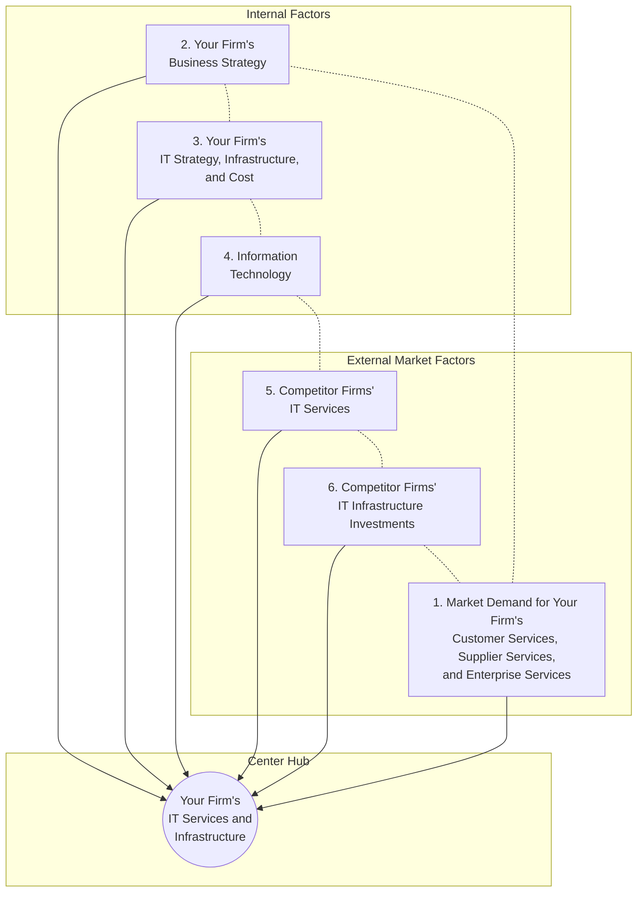

# Chapter 5 Raw OCR & Visual Extraction — Batch 3 (Screenshots 65 to 95)

**Agent:** Explorer 3 (`teamwork_preview_explorer`)  
**Source Directory:** `/Users/gerrell/Library/Mobile Documents/com~apple~CloudDocs/Strayer/Capstone/Week 4/chapter_5_screenshots`  
**Output Path:** `/Users/gerrell/Library/Mobile Documents/com~apple~CloudDocs/Strayer/Capstone/Week 4/.agents/explorer_3/batch_3_raw.md`  
**Extraction Date:** 2026-07-25  

---

## 1. Batch Inventory (Screenshots 65 – 95)

| Index | File Name | Size (Bytes) | Book Page / Section |
|-------|-----------|--------------|---------------------|
| 65 | `Screenshot 2026-07-25 at 11.11.09 PM.png` | 482,452 | p. 190 / Section 5-4 Intro |
| 66 | `Screenshot 2026-07-25 at 11.11.12 PM.png` | 573,388 | p. 191 / Software for the Web (Java, HTML) |
| 67 | `Screenshot 2026-07-25 at 11.11.14 PM.png` | 543,403 | p. 192 / Web Services & Table 5.3 |
| 68 | `Screenshot 2026-07-25 at 11.11.22 PM.png` | 493,423 | p. 191 / Linux & Open Source |
| 69 | `Screenshot 2026-07-25 at 11.11.27 PM.png` | 592,898 | p. 191 / HTML5, Ruby, Python |
| 70 | `Screenshot 2026-07-25 at 11.11.31 PM.png` | 541,280 | p. 192 / Web Services & XML |
| 71 | `Screenshot 2026-07-25 at 11.11.34 PM.png` | 554,158 | p. 192 / Table 5.3 & SOA |
| 72 | `Screenshot 2026-07-25 at 11.11.41 PM.png` | 809,119 | p. 193 / Dollar Rent A Car Case Study & Fig 5.11 Top |
| 73 | `Screenshot 2026-07-25 at 11.11.44 PM.png` | 902,400 | p. 193 / Figure 5.11 Bottom & Caption |
| 74 | `Screenshot 2026-07-25 at 11.22.57 PM.png` | 645,635 | p. 193-194 / Fig 5.12 Chart Bottom & Software Packages |
| 75 | `Screenshot 2026-07-25 at 11.23.03 PM.png` | 565,664 | p. 194 / Software Outsourcing (IKEA) & Cloud SaaS |
| 76 | `Screenshot 2026-07-25 at 11.23.08 PM.png` | 602,047 | p. 195 / Salesforce, SLA, Mashups, Apps |
| 77 | `Screenshot 2026-07-25 at 11.23.12 PM.png` | 569,430 | p. 195-196 / Mobile Apps & Enterprise Pathways |
| 78 | `Screenshot 2026-07-25 at 11.23.18 PM.png` | 569,344 | p. 196 / Section 5-5 Intro, Scalability, MDM |
| 79 | `Screenshot 2026-07-25 at 11.23.21 PM.png` | 579,553 | p. 197 / MDM & Cloud SLA Contracts |
| 80 | `Screenshot 2026-07-25 at 11.23.31 PM.png` | 315,665 | p. 197 / Management and Governance |
| 81 | `Screenshot 2026-07-25 at 11.24.09 PM.png` | 521,586 | p. 197-198 / Wise Investments, Rent-vs-Buy, TCO Intro |
| 82 | `Screenshot 2026-07-25 at 11.25.06 PM.png` | 368,837 | p. 198 / Table 5.4 Total Cost of Ownership Components |
| 83 | `Screenshot 2026-07-25 at 11.25.10 PM.png` | 538,256 | p. 198 / Table 5.4 End & TCO Analysis Text |
| 84 | `Screenshot 2026-07-25 at 11.25.14 PM.png` | 1,382,996 | p. 199 / Figure 5.13 Competitive Forces Model Diagram |
| 85 | `Screenshot 2026-07-25 at 11.25.28 PM.png` | 541,368 | p. 199 / Fig 5.13 Text Factors 1-4 |
| 86 | `Screenshot 2026-07-25 at 11.25.31 PM.png` | 587,217 | p. 200 / Fig 5.13 Text Factors 3-6 |
| 87 | `Screenshot 2026-07-25 at 11.26.02 PM.png` | 468,224 | p. 202 / Review Summary (5-1, 5-2, 5-3 start) |
| 88 | `Screenshot 2026-07-25 at 11.26.07 PM.png` | 585,156 | p. 202-203 / Review Summary (5-3, 5-4) |
| 89 | `Screenshot 2026-07-25 at 11.26.09 PM.png` | 587,267 | p. 203 / Review Summary (5-4, 5-5) |
| 90 | `Screenshot 2026-07-25 at 11.26.14 PM.png` | 416,197 | p. 203 / Key Terms (Android to HTML5) |
| 91 | `Screenshot 2026-07-25 at 11.26.28 PM.png` | 374,566 | p. 203 / Key Terms (Hybrid cloud to On-demand computing) |
| 92 | `Screenshot 2026-07-25 at 11.26.33 PM.png` | 439,249 | p. 203 / Key Terms (Open source to Technology standards) |
| 93 | `Screenshot 2026-07-25 at 11.26.39 PM.png` | 397,959 | p. 203 / Key Terms (Technology standards to XML & MyLab MIS) |
| 94 | `Screenshot 2026-07-25 at 11.26.43 PM.png` | 471,399 | p. 203-204 / Review Questions (5-1 to 5-4) |
| 95 | `Screenshot 2026-07-25 at 11.26.47 PM.png` | 478,696 | p. 204 / Review Questions (5-2 to 5-5) |

---

## 2. Image-by-Image 100% OCR and Visual Extraction

### Screenshot 65 & 68 (`Screenshot 2026-07-25 at 11.11.09 PM.png`, `11.11.22 PM.png`) — Page 190–191

#### Main Section Header
# 5-4 What are the current computer software platforms and trends?

There are four major themes in contemporary software platform evolution:
- Linux and open source software
- Java, HTML, and HTML5
- Web services and service-oriented architecture
- Software outsourcing and cloud services

#### Subsection: Linux and Open Source Software
**Open source software** is software produced by a community of several hundred thousand programmers around the world. According to the leading open source professional association, OpenSource.org, open source software is free and can be modified by users. Works derived from the original code must also be free. Open source software is by definition not restricted to any specific operating system or hardware technology.

Popular open source software tools include the Linux operating system, the Apache HTTP web server, the Mozilla Firefox web browser, and the Apache OpenOffice desktop productivity suite. Google’s Android mobile operating system and Chrome web browser are based on open source tools. You can find out more about the Open Source Definition from the Open Source Initiative and the history of open source software in the Learning Tracks for this chapter.

#### Subheading: Linux
Perhaps the most well-known open source software is Linux, an operating system related to Unix. Linux was created by Finnish programmer Linus Torvalds and first posted on the Internet in August 1991. Linux applications are embedded in cell phones, smartphones, tablet computers, and consumer electronics. Linux is available in free versions downloadable from the Internet or in low-cost commercial versions that include tools and support from vendors such as Red Hat.

Although Linux is not used in many desktop systems, it is a leading operating system for servers, mainframe computers, and supercomputers. IBM, HP, Intel, Dell, and Oracle have made Linux a central part of their offerings to corporations. Linux has profound implications for corporate software platforms—cost reduction, reliability, and resilience—because Linux can work on all the major hardware platforms.

---

### Screenshot 66 & 69 (`Screenshot 2026-07-25 at 11.11.12 PM.png`, `11.11.27 PM.png`) — Page 191

#### Subsection: Software for the Web: Java, HTML, and HTML5
**Java** is an operating system-independent, processor-independent, object-oriented programming language created by Sun Microsystems that has become a leading interactive programming environment for the web. The Java platform has migrated into mobile phones, tablets, automobiles, music players, game machines, and set-top cable television systems serving interactive content and pay-per-view services. Java software is designed to run on any computer or computing device, regardless of the specific microprocessor or operating system the device uses. For each of the computing environments in which Java is used, a Java Virtual Machine interprets Java programming code for that machine. In this manner, the code is written once and can be used on any machine for which there exists a Java Virtual Machine.

Java developers can create small applet programs that can be embedded in web pages and downloaded to run on a web browser. A **web browser** is an easy-to-use software tool with a graphical user interface for displaying web pages and for accessing the web and other Internet resources. Microsoft’s Internet Explorer, Microsoft Edge, Mozilla Firefox, Google Chrome, and Apple Safari browsers are examples. At the enterprise level, Java is being used for more complex e-commerce and e-business applications that require communication with an organization’s back-end transaction processing systems.

#### Subheading: HTML and HTML5
**Hypertext Markup Language (HTML)** is a page description language for specifying how text, graphics, video, and sound are placed on a web page and for creating dynamic links to other web pages and objects. Using these links, a user need only point at a highlighted keyword or graphic, click on it, and immediately be transported to another document.

HTML was originally designed to create and link static documents composed largely of text. Today, however, the web is much more social and interactive, and many web pages have multimedia elements—images, audio, and video. Third-party plug-in applications like Flash, Silverlight, and Java have been required to integrate these rich media with web pages. However, these add-ons require additional programming and put strains on computer processing. The next evolution of HTML, called **HTML5**, solves this problem by making it possible to embed images, audio, video, and other elements directly into a document without processor-intensive add-ons. HTML5 makes it easier for web pages to function across different display devices, including mobile devices as well as desktops, and it supports the storage of data offline for apps that run over the web.

Other popular programming tools for web applications include Ruby and Python. Ruby is an object-oriented programming language known for speed and ease of use in building web applications, and Python (praised for its clarity) is being used for building cloud computing applications.

---

### Screenshot 67, 70, 71 (`Screenshot 2026-07-25 at 11.11.14 PM.png`, `11.11.31 PM.png`, `11.11.34 PM.png`) — Page 192

#### Subsection: Web Services and Service-Oriented Architecture
**Web services** refer to a set of loosely coupled software components that exchange information with each other using universal web communication standards and languages. They can exchange information between two different systems regardless of the operating systems or programming languages on which the systems are based. They can be used to build open standard web-based applications linking systems of two different organizations, and they can also be used to create applications that link disparate systems within a single company. Different applications can use web services to communicate with each other in a standard way without time-consuming custom coding.

The foundation technology for web services is **XML**, which stands for Extensible Markup Language. This language was developed in 1996 by the World Wide Web Consortium (W3C, the international body that oversees the development of the web) as a more powerful and flexible markup language than hypertext markup language (HTML) for web pages. Whereas HTML is limited to describing how data should be presented in the form of web pages, XML can perform presentation, communication, and storage of data. In XML, a number is not simply a number; the XML tag specifies whether the number represents a price, a date, or a ZIP code. Table 5.3 illustrates some sample XML statements.

By tagging selected elements of the content of documents for their meanings, XML makes it possible for computers to manipulate and interpret their data automatically and perform operations on the data without human intervention. Web browsers and computer programs, such as order processing or enterprise resource planning (ERP) software, can follow programmed rules for applying and displaying the data. XML provides a standard format for data exchange, enabling web services to pass data from one process to another.

Web services communicate through XML messages over standard web protocols. Companies discover and locate web services through a directory. Using web protocols, a software application can connect freely to other applications without custom programming for each different application with which it wants to communicate. Everyone shares the same standards.

The collection of web services that are used to build a firm’s software systems constitutes what is known as a service-oriented architecture. A **service-oriented architecture (SOA)** is a set of self-contained services that communicate with each other to create a working software application. Business tasks are accomplished by executing a series of these services. Software developers reuse these services in other combinations to assemble other applications as needed.

Virtually all major software vendors provide tools and entire platforms for building and integrating software applications using web services. Microsoft has incorporated web services tools in its Microsoft .NET platform.

Dollar Rent A Car’s systems use web services for its online booking system with Southwest Airline’s website. Although both companies’ systems are based on different technology platforms, a person booking a flight on **Southwest.com** can reserve a car...

---

### Screenshot 72 & 73 (`Screenshot 2026-07-25 at 11.11.41 PM.png`, `11.11.44 PM.png`) — Page 193

...from Dollar without leaving the airline’s website. Instead of struggling to get Dollar’s reservation system to share data with Southwest’s information systems, Dollar used Microsoft .NET web services technology as an intermediary. Reservations from Southwest are translated into web services protocols, which are then translated into formats that can be understood by Dollar’s computers.

Other car rental companies have linked their information systems to airline companies’ websites before. But without web services, these connections had to be built one at a time. Web services provide a standard way for Dollar’s computers to “talk” to other companies’ information systems without having to build special links to each one. Dollar is now expanding its use of web services to link directly to the systems of a small tour operator and a large travel reservation system as well as a wireless website for cell phones and smartphones. It does not have to write new software code for each new partner’s information systems or each new wireless device (see **Figure 5.11**).

#### Figure 5.11 How Dollar Rent a Car Uses Web Services
*Visual Description & Labels:*
- Center block: `Web Services` (rounded cyan rectangle)
- Right block 1: `Server` (pink rectangle)
- Right block 2: `Legacy Reservation System` (pink rectangle)
- Group label under Server & Legacy Reservation System: `Dollar Rent A Car Systems`
- External Nodes connected to Web Services:
  - Top-left: `Southwest Airlines Systems` (grayish blue box) <--> `Web Services`
  - Left: `Tour Operator's Systems` (peach box) <--> `Web Services`
  - Bottom-left 1: `Travel Reservation System` (purple box) <--> `Web Services`
  - Bottom-left 2: `Wireless WebSite` (cyan box) <--> `Web Services`
  - Bottom-right: `Future Business Partners' Systems` (stacked teal boxes) `<-- -->` `Web Services` (dashed double arrow)

*Caption:* Dollar Rent A Car uses web services to provide a standard intermediate layer of software to “talk” to other companies’ information systems. Dollar Rent A Car can use this set of web services to link to other companies’ information systems without having to build a separate link to each firm’s systems.

---

### Screenshot 74 & 75 (`Screenshot 2026-07-25 at 11.22.57 PM.png`, `11.23.03 PM.png`) — Page 193–194

#### Figure 5.12 Note & Text
*Figure 5.12 Chart Note:* Spending for software that originated outside the firm, provided by a variety of vendors, has been growing steadily.  
*Source:* BEA National Income and Product Accounts, 2018.

There are three external sources for software: software packages from a commercial software vendor (most ERP systems), outsourcing custom application development to an external vendor (which may or may not be offshore), and cloud-based software services and tools (SaaS/PaaS).

#### Subheading: Software Packages and Enterprise Software
We have already described software packages for enterprise applications as one of the major types of software components in contemporary IT infrastructures. A **software package** is a prewritten commercially available set of software programs that eliminates the need for a firm to write its own software programs for certain functions, such as payroll processing or order handling.

Enterprise application software vendors such as SAP and Oracle have developed powerful software packages that can support the primary business processes of a firm worldwide from warehousing, customer relationship management, and supply chain management to finance and human resources. These large-scale enterprise software systems provide a single, integrated, worldwide software system for firms at a cost much less than they would pay if they developed it themselves. **Chapter 9** discusses enterprise systems in detail.

#### Subheading: Software Outsourcing
Software **outsourcing** enables a firm to contract custom software development or maintenance of existing legacy programs to outside firms, which often operate offshore in low-wage areas of the world. For example, in 2013, IKEA announced a six-year offshore IT outsourcing deal with German infrastructure solutions firm Wincor Nixdorf. Wincor Nixdorf set up 12,000 point-of-sale (POS) systems in 300 IKEA stores in 25 countries. Wincor Nixdorf provides IKEA with services that include operation and customization of the systems, as well as updating the software and applications running on them. Having a single software provider offshore helped IKEA reduce the work to run the stores (**Existek, 2017**). Offshore software outsourcing firms have primarily provided lower-level maintenance, data entry, and call center operations, although more sophisticated and experienced offshore firms, particularly in India, have been hired for new-program development. However, as wages offshore rise and the costs of managing offshore projects are factored in (see **Chapter 13**), some work that would have been sent offshore is returning to domestic companies.

#### Subheading: Cloud-Based Software Services and Tools
In the past, software such as Microsoft Word or Adobe Illustrator came in a box and was designed to operate on a single machine. Today, you’re more likely to download the software from the vendor’s website or to use the software as a cloud service delivered over the Internet and pay a subscription fee.

Cloud-based software and the data it uses are hosted on powerful servers in data centers and can be accessed with an Internet connection and standard web browser. In addition to free or low-cost tools for individuals and small businesses provided by Google or Yahoo, enterprise software and other complex business functions are available as services from the major commercial software vendors. Instead of buying and installing software programs, subscribing companies rent the same functions from these services, with users paying either on a subscription or per-transaction basis. A leading example of software as a service (SaaS) is...

---

### Screenshot 76 & 77 (`Screenshot 2026-07-25 at 11.23.08 PM.png`, `11.23.12 PM.png`) — Page 195–196

...**Salesforce.com**, described earlier in this chapter, which provides on-demand software services for customer relationship management.

In order to manage their relationship with an outsourcer or technology service provider, firms need a contract that includes a **service level agreement (SLA)**. The SLA is a formal contract between customers and their service providers that defines the specific responsibilities of the service provider and the level of service expected by the customer. SLAs typically specify the nature and level of services provided, criteria for performance measurement, support options, provisions for security and disaster recovery, hardware and software ownership and upgrades, customer support, billing, and conditions for terminating the agreement. We provide a Learning Track on this topic.

#### Subheading: Mashups and Apps
The software you use for both personal and business tasks today may be composed of interchangeable components that integrate freely with other applications on the Internet. Individual users and entire companies mix and match these software components to create their own customized applications and to share information with others. The resulting software applications are called **mashups**. The idea is to take different sources and produce a new work that is greater than the sum of its parts. You have performed a mashup if you’ve ever personalized your Facebook profile or your blog with a capability to display videos or slide shows.

Web mashups combine the capabilities of two or more online applications to create a kind of hybrid that provides more customer value than the original sources alone. For instance, ZipRealty uses Google Maps and data provided by an online real estate database. **Apps** are small, specialized software programs that run on the Internet, on your computer, or on your mobile phone or tablet and are generally delivered over the Internet. Google refers to its online services as apps. But when we talk about apps today, most of the attention goes to the apps that have been developed for the mobile digital platform. It is these apps that turn smartphones and tablets into general-purpose computing tools. There are now millions of apps for the iOS and Android operating systems.

Some downloaded apps do not access the web, but many do, providing faster access to web content than traditional web browsers. Apps provide a streamlined nonbrowser pathway for users to perform a number of tasks, ranging from reading the newspaper to shopping, searching, personal health monitoring, playing games, and buying. They increasingly are used by managers as gateways to their firm’s enterprise systems. Because so many people are now accessing the Internet from their mobile devices, some say that apps are “the new browsers.” Apps are also starting to influence the design and function of traditional websites as consumers are attracted to the look and feel of apps and their speed of operation.

Many apps are free or purchased for a small charge, much less than conventional software, which further adds to their appeal. The success of these mobile platforms depends in large part on the quantity and the quality of the apps they provide. Apps tie the customer to a specific hardware platform: As the user adds more and more apps to his or her mobile phone, the cost of switching to a competing mobile platform rises.

At the moment, the most commonly downloaded apps are games, news and weather, maps/navigation, social networking, music, and video/movies. But there are also serious apps for business users that make it possible to create and edit documents, connect to corporate systems, schedule and participate in meetings, track shipments, and dictate voice messages. Most large online retailers have apps for consumers for researching and buying goods and services online.

---

### Screenshot 78 & 79 (`Screenshot 2026-07-25 at 11.23.18 PM.png`, `11.23.21 PM.png`) — Page 196–197

#### Main Section Header
# 5-5 What are the challenges of managing IT infrastructure and management solutions?

Creating and managing a coherent IT infrastructure raises multiple challenges: dealing with platform and technology change (including cloud and mobile computing), management and governance, and making wise infrastructure investments.

#### Subsection: Dealing with Platform and Infrastructure Change
As firms grow, they often quickly outgrow their infrastructure. As firms shrink, they can get stuck with excessive infrastructure purchased in better times. How can a firm remain flexible if investments in IT infrastructure are fixed-cost purchases and licenses? How well does the infrastructure scale? **Scalability** refers to the ability of a computer, product, or system to expand to serve a large number of users without breaking down. New applications, mergers and acquisitions, and changes in business volume all affect computer workload and must be considered when planning hardware capacity.

Firms using mobile computing and cloud computing platforms will require new policies, procedures, and tools for managing these platforms. They will need to inventory all of their mobile devices in business use and develop policies and tools for tracking, updating, and securing them, and for controlling the data and applications that run on them. Firms often turn to **mobile device management (MDM)** software, which monitors, manages, and secures mobile devices that are deployed across multiple mobile service providers and across multiple mobile operating systems being used in the organization. MDM tools enable the IT department to monitor mobile usage, install or update mobile software, back up and restore mobile devices, and remove software and data from devices that are stolen or lost.

Firms using cloud computing and SaaS will need to fashion new contractual arrangements with remote vendors to make sure that the hardware and software for critical applications are always available when needed and that they meet corporate standards for information security. It is up to business management to determine acceptable levels of computer response time and availability for the firm’s mission-critical systems to maintain the level of business performance that is expected.

---

### Screenshot 80 (`Screenshot 2026-07-25 at 11.23.31 PM.png`) — Page 197

#### Subsection: Management and Governance
A long-standing issue among information system managers and CEOs has been the question of who will control and manage the firm’s IT infrastructure. **Chapter 2** introduced the concept of IT governance and described some issues it addresses. Other important questions about IT governance are: Should departments and divisions have the responsibility of making their own information technology decisions, or should IT infrastructure be centrally controlled and managed? What is the relationship between central information systems management and business unit information systems management? How will infrastructure costs be allocated among business units? Each organization will need to arrive at answers based on its own needs.

---

### Screenshot 81 (`Screenshot 2026-07-25 at 11.24.09 PM.png`) — Page 197–198

#### Subsection: Making Wise Infrastructure Investments
IT infrastructure is a major investment for the firm. If too much is spent on infrastructure, it lies idle and constitutes a drag on the firm’s financial performance. If too little is spent, important business services cannot be delivered and the firm’s competitors (who spent the right amount) will outperform the underinvesting firm. How much should the firm spend on infrastructure? This question is not easy to answer.

A related question is whether a firm should purchase and maintain its own IT infrastructure components or rent them from external suppliers, including those offering cloud services. The decision either to purchase your own IT assets or to rent them from external providers is typically called the *rent-versus-buy* decision.

Cloud computing is a low-cost way to increase scalability and flexibility, but firms should evaluate this option carefully in light of security requirements and impact on business processes and workflows. In some instances, the cost of renting software adds up to more than purchasing and maintaining an application in-house, or firms can overspend on cloud services (**Loten, 2018**). Yet there are many benefits to using cloud services including significant reductions in hardware, software, human resources, and maintenance costs. Moving to cloud computing allows firms to focus on their core businesses rather than technology issues.

#### Subheading: Total Cost of Ownership of Technology Assets
The actual cost of owning technology resources includes the original cost of acquiring and installing hardware and software as well as ongoing administration costs for hardware and software upgrades, maintenance, technical support, training, and even utility and real estate costs for running and housing the technology. The **total cost of ownership (TCO)** model can be used to analyze these direct and indirect costs to help firms determine the actual cost of specific technology implementations. **Table 5.4** describes the most important components to consider in a TCO analysis.

---

### Screenshot 82 & 83 (`Screenshot 2026-07-25 at 11.25.06 PM.png`, `11.25.10 PM.png`) — Page 198

#### Table 5.4 Total Cost of Ownership (TCO) Cost Components

| Infrastructure Component | Cost Components |
|--------------------------|-----------------|
| **Hardware acquisition** | Purchase price of computer hardware equipment, including computers, terminals, storage, and printers |
| **Software acquisition** | Purchase or license of software for each user |
| **Installation** | Cost to install computers and software |
| **Training** | Cost to provide training for information systems specialists and end users |
| **Support** | Cost to provide ongoing technical support, help desks, and so forth |
| **Maintenance** | Cost to upgrade the hardware and software |
| **Infrastructure** | Cost to acquire, maintain, and support related infrastructure, such as networks and specialized equipment (including storage backup units) |
| **Downtime** | Cost of lost productivity if hardware or software failures cause the system to be unavailable for processing and user tasks |
| **Space and energy** | Real estate and utility costs for housing and providing power for the technology |

When all these cost components are considered, the TCO for a PC might run up to three times the original purchase price of the equipment. Gains in productivity and efficiency from equipping employees with mobile computing devices must be balanced against increased costs from integrating these devices into the firm’s IT infrastructure and from providing technical support. Other cost components include fees for wireless airtime, end-user training, help desk support, and software for special applications. Costs are higher if the mobile devices run many different applications or need to be integrated into back-end systems such as enterprise applications.

Hardware and software acquisition costs account for only about 20 percent of TCO, so managers must pay close attention to administration costs to understand the full cost of the firm’s hardware and software. It is possible to reduce some of these administration costs through better management. Many large firms are saddled with redundant, incompatible hardware and software because their departments and divisions have been allowed to make their own technology purchases.

In addition to switching to cloud services, these firms could reduce their TCO through greater centralization and standardization of their hardware and software resources. Companies could reduce the size of the information systems staff required to support their infrastructure if the firm minimizes the number of different computer models and pieces of software that employees are allowed to use. In a centralized infrastructure, systems can be administered from a central location and troubleshooting can be performed from that location.

#### Subheading: Competitive Forces Model for IT Infrastructure Investment
**Figure 5.13** illustrates a competitive forces model you can use to address the question of how much your firm should spend on IT infrastructure.

---

### Screenshot 84 (`Screenshot 2026-07-25 at 11.25.14 PM.png`) — Page 199

#### Figure 5.13 Competitive Forces Model for it Infrastructure
*Visual Overview:*
- **Center Node:** `Your Firm's IT Services and Infrastructure` (blue circular hub)
- **Left Group Header:** `Internal Factors`
  - `2 Your Firm's Business Strategy` (peach circle)
  - `3 Your Firm's IT Strategy, Infrastructure, and Cost` (light yellow circle)
  - `4 Information Technology` (pink circle)
- **Right Group Header:** `External Market Factors`
  - `1 Market Demand for Your Firm's Customer Services, Supplier Services, and Enterprise Services` (purple circle)
  - `6 Competitor Firms' IT Infrastructure Investments` (blue circle)
  - `5 Competitor Firms' IT Services` (teal circle)
- **Arrows & Links:**
  - Inward solid black arrows pointing from each outer circle (1, 2, 3, 4, 5, 6) into the center hub.
  - Dashed perimeter line looping through circles 1, 2, 3, 4, 5, 6.

---

### Screenshot 85 & 86 (`Screenshot 2026-07-25 at 11.25.28 PM.png`, `11.25.31 PM.png`) — Page 199–200

There are six factors you can use to answer the question “How much should our firm spend on IT infrastructure?”

#### Figure 5.13 Full Alternative Text / Six Factors Detail:
1. **Market demand for your firm’s services.** Make an inventory of the services you currently provide to customers, suppliers, and employees. Survey each group, or hold focus groups to find out if the services you currently offer are meeting the needs of each group. For example, are customers complaining of slow responses to their queries about price and availability? Are employees complaining about the difficulty of finding the right information for their jobs? Are suppliers complaining about the difficulties of discovering your production requirements?
2. **Your firm’s business strategy.** Analyze your firm’s five-year business strategy and try to assess what new services and capabilities will be required to achieve strategic goals.
3. **Your firm’s IT strategy, infrastructure, and cost.** Examine your firm’s information technology plans for the next five years and assess its alignment with the firm’s business plans. Determine the total IT infrastructure costs. You will want to perform a TCO analysis. If your firm has no IT strategy, you will need to devise one that takes into account the firm’s five-year strategic plan.
4. **Information technology assessment.** Is your firm behind the technology curve or at the bleeding edge of information technology? Both situations are to be avoided. It is usually not desirable to spend resources on advanced technologies that are still experimental, often expensive, and sometimes unreliable. You want to spend on technologies for which standards have been established; IT vendors are competing on cost, not design; and where there are multiple suppliers. However, you do not want to put off investment in new technologies or allow competitors to develop new business models and capabilities based on the new technologies.
5. **Competitor firm services.** Try to assess what technology services competitors offer to customers, suppliers, and employees. Establish quantitative and qualitative measures to compare them to those of your firm. If your firm’s service levels fall short, your company is at a competitive disadvantage. Look for ways your firm can excel at service levels.
6. **Competitor firm IT infrastructure investments.** Benchmark your expenditures for IT infrastructure against your competitors. Many companies are quite public about their innovative expenditures on IT. If competing firms try to keep IT expenditures secret, you may be able to find IT investment information in public companies’ SEC Form 10-K annual reports to the federal government when those expenditures affect a firm’s financial results.

Your firm does not necessarily need to spend as much as or more than your competitors. Perhaps it has discovered much less expensive ways of providing services, and this can lead to a cost advantage. Alternatively, your firm may be spending far less than competitors, and experiencing commensurate poor performance and losing market share.

---

### Screenshot 87, 88, 89 (`Screenshot 2026-07-25 at 11.26.02 PM.png`, `11.26.07 PM.png`, `11.26.09 PM.png`) — Page 202–203

#### Main Section Header
# Review Summary

**5-1 What is IT infrastructure, and what are the stages and drivers of IT infrastructure evolution?**  
IT infrastructure is the shared technology resources that provide the platform for the firm’s specific information system applications. IT infrastructure includes hardware, software, and services that are shared across the entire firm.  
The five stages of IT infrastructure evolution are the mainframe era, the personal computer era, the client/server era, the enterprise computing era, and the cloud and mobile computing era. Moore’s Law deals with the exponential increase in processing power and decline in the cost of computer technology, stating that every 18 months the power of microprocessors doubles and the price of computing falls in half. The Law of Mass Digital Storage deals with the exponential decrease in the cost of storing data, stating that the number of kilobytes of data that can be stored on magnetic media for $1 roughly doubles every 15 months. Metcalfe’s Law states that a network’s value to participants grows exponentially as the network takes on more members. The rapid decline in costs of communication and growing agreement in the technology industry to use computing and communications standards are also driving an explosion of computer use.

**5-2 What are the components of IT infrastructure?**  
Major IT infrastructure components include computer hardware platforms, operating system platforms, enterprise software platforms, networking and telecommunications platforms, data management software, Internet platforms, and consulting services and systems integrators.

**5-3 What are the current trends in computer hardware platforms?**  
Increasingly, computing is taking place on a mobile digital platform. Quantum computing is an emerging technology that could dramatically boost processing power through the ability to be in more than one state at the same time. Consumerization of IT is the business use of information technology that originated in the consumer market. Virtualization organizes computing resources so that their use is not restricted by physical configuration or geographic location. In cloud computing, firms and individuals obtain computing power and software as services over a network, including the Internet, rather than purchasing and installing the hardware and software on their own computers. Edge computing helps optimize cloud computing by performing some data processing on a set of linked servers at the edge of the network, near the source of the data. A multicore processor is a microprocessor to which two or more processing cores have been attached for enhanced performance. Green computing includes practices and technologies for producing, using, and disposing of information technology hardware to minimize negative impact on the environment.

**5-4 What are the current computer software platforms and trends?**  
Open source software is produced and maintained by a global community of programmers and is often downloadable for free. Linux is a powerful, resilient open source operating system that can run on multiple hardware platforms and is used widely to run web servers. Java is an operating system– and hardware-independent programming language that is the leading interactive programming environment for the web. HTML5 makes it possible to embed images, audio, and video directly into a web document without add-on programs. Web services are loosely coupled software components based on open web standards that work with any application software and operating system. They can be used as components of web-based applications linking the systems of two different organizations or to link disparate systems of a single company. Companies are purchasing their new software applications from outside sources, including software packages, by outsourcing custom application development to an external vendor (that may be offshore), or by renting online software services (SaaS). Mashups combine two different software services to create new software applications and services. Apps are software applications that run on mobile devices and are delivered over the Internet.

**5-5 What are the challenges of managing IT infrastructure and management solutions?**  
Major challenges include dealing with platform and infrastructure change, infrastructure management and governance, and making wise infrastructure investments. Solution guidelines include using a competitive forces model to determine how much to spend on IT infrastructure and where to make strategic infrastructure investments, and establishing the total cost of ownership (TCO) of information technology assets. The total cost of owning technology resources includes not only the original cost of computer hardware and software but also costs for hardware and software upgrades, maintenance, technical support, and training. Many firms are turning to cloud computing in an effort to reduce their IT platform costs. Firms use tools for mobile device management (MDM) to monitor, manage, and secure mobile devices that are deployed across the enterprise.

---

### Screenshot 90, 91, 92, 93 (`Screenshot 2026-07-25 at 11.26.14 PM.png` to `11.26.39 PM.png`) — Page 203

#### Main Section Header
# Key Terms

- **Android**, 178
- **Application server**, 169
- **Apps**, 195
- **BYOD**, 182
- **Chrome OS**, 178
- **Clients**, 169
- **Client/server computing**, 169
- **Cloud computing**, 170
- **Consumerization of IT**, 182
- **Edge computing**, 189
- **Green computing (green IT)**, 189
- **Hypertext Markup Language (HTML)**, 191
- **HTML5**, 191
- **Hybrid cloud**, 188
- **Infrastructure as a service (IaaS)**, 185
- **iOS**, 178
- **Java**, 191
- **Legacy systems**, 180
- **Linux**, 178
- **Mainframe**, 167
- **Mashup**, 195
- **Minicomputers**, 167
- **Mobile device management (MDM)**, 196
- **Moore’s Law**, 171
- **Multicore processor**, 190
- **Multitiered client/server architecture**, 169
- **Multitouch**, 178
- **Nanotechnology**, 173
- **On-demand computing**, 188
- **Open source software**, 190
- **Operating system**, 178
- **Outsourcing**, 194
- **Platform as a service (PaaS)**, 185
- **Private cloud**, 188
- **Public cloud**, 188
- **Quantum computing**, 183
- **Scalability**, 196
- **Server**, 169
- **Service level agreement (SLA)**, 195
- **Service-oriented architecture (SOA)**, 192
- **Software as a service (SaaS)**, 185
- **Software package**, 194
- **Software-defined storage (SDS)**, 183
- **Tablet computers**, 180
- **Technology standards**, 174
- **Total cost of ownership (TCO)**, 198
- **Unix**, 178
- **Virtualization**, 183
- **Web browser**, 191
- **Web hosting service**, 179
- **Web server**, 169
- **Web services**, 192
- **Windows**, 170
- **Windows 10**, 178
- **Wintel PC**, 169
- **XML**, 192

#### Callout: MyLab MIS
> **MyLab MIS**  
> To complete the problems with MyLab MIS, go to EOC Discussion Questions in MyLab MIS.

---

### Screenshot 94 & 95 (`Screenshot 2026-07-25 at 11.26.43 PM.png`, `11.26.47 PM.png`) — Page 203–204

#### Main Section Header
# Review Questions

#### 5-1 What is IT infrastructure, and what are the stages and drivers of IT infrastructure evolution?
- Define IT infrastructure from both a technology and a services perspective.
- List each of the eras in IT infrastructure evolution and describe its distinguishing characteristics.
- Define and describe the following: web server, application server, multitiered client/server architecture.
- Describe Moore’s Law and the Law of Mass Digital Storage.
- Describe how network economics, declining communications costs, and technology standards affect IT infrastructure.

#### 5-2 What are the components of IT infrastructure?
- List and describe the components of IT infrastructure that firms need to manage.

#### 5-3 What are the current trends in computer hardware platforms?
- Describe the evolving mobile platform, consumerization of IT, and cloud computing.
- Explain how businesses can benefit from virtualization, green computing, and multicore processors.

#### 5-4 What are the current computer software platforms and trends?
- Define and describe open source software and Linux and explain their business benefits.
- Define Java and HTML5 and explain why they are important.
- Define and describe web services and the role played by XML.
- Name and describe the three external sources for software.
- Define and describe software mashups and apps.

#### 5-5 What are the challenges of managing IT infrastructure and management solutions?
- Name and describe the management challenges posed by IT infrastructure.
- Explain how using a competitive forces model and calculating the TCO of technology assets help firms make good infrastructure investments.

---

## 3. Diagram Models (Mermaid.js Code Blocks)

### Figure 5.11: How Dollar Rent a Car Uses Web Services
```mermaid
flowchart LR
    subgraph External_Partners ["External Systems & Devices"]
        SW["Southwest Airlines Systems"]
        TO["Tour Operator's Systems"]
        TR["Travel Reservation System"]
        WW["Wireless WebSite"]
        FP["Future Business Partners' Systems"]
    end

    WS["Web Services<br/>(Intermediate Layer)"]

    subgraph Dollar_Systems ["Dollar Rent A Car Systems"]
        SVR["Server"]
        LRS["Legacy Reservation System"]
    end

    SW <--> WS
    TO <--> WS
    TR <--> WS
    WW <--> WS
    FP <.-.-> WS

    WS <--> SVR
    SVR <--> LRS
```

### Figure 5.13: Competitive Forces Model for IT Infrastructure


---

## 4. Tables Extracted

### Table 5.3: Examples of XML

| Plain English | XML |
|---------------|-----|
| Subcompact | `<AUTOMOBILETYPE="Subcompact">` |
| 4 passenger | `<PASSENGERUNIT="PASS">4</PASSENGER>` |
| $16,800 | `<PRICE CURRENCY="USD">$16,800</PRICE>` |

### Table 5.4: Total Cost of Ownership (TCO) Cost Components

| Infrastructure Component | Cost Components |
|--------------------------|-----------------|
| Hardware acquisition | Purchase price of computer hardware equipment, including computers, terminals, storage, and printers |
| Software acquisition | Purchase or license of software for each user |
| Installation | Cost to install computers and software |
| Training | Cost to provide training for information systems specialists and end users |
| Support | Cost to provide ongoing technical support, help desks, and so forth |
| Maintenance | Cost to upgrade the hardware and software |
| Infrastructure | Cost to acquire, maintain, and support related infrastructure, such as networks and specialized equipment (including storage backup units) |
| Downtime | Cost of lost productivity if hardware or software failures cause the system to be unavailable for processing and user tasks |
| Space and energy | Real estate and utility costs for housing and providing power for the technology |

---

## 5. Bolded Key Terms and Definitions for Glossary

1. **Open source software**: Software produced by a community of several hundred thousand programmers around the world; free, modifiable by users, and not restricted to specific OS or hardware.
2. **Java**: An operating system-independent, processor-independent, object-oriented programming language created by Sun Microsystems that has become a leading interactive programming environment for the web.
3. **Web browser**: An easy-to-use software tool with a graphical user interface for displaying web pages and for accessing the web and other Internet resources.
4. **Hypertext Markup Language (HTML)**: A page description language for specifying how text, graphics, video, and sound are placed on a web page and for creating dynamic links to other web pages and objects.
5. **HTML5**: The evolution of HTML that makes it possible to embed images, audio, video, and other elements directly into a document without processor-intensive add-ons.
6. **Web services**: A set of loosely coupled software components that exchange information with each other using universal web communication standards and languages.
7. **XML (Extensible Markup Language)**: Foundation technology for web services developed in 1996 by the W3C; performs presentation, communication, and storage of data by tagging elements for meaning.
8. **Service-oriented architecture (SOA)**: A set of self-contained services that communicate with each other to create a working software application.
9. **Software package**: A prewritten commercially available set of software programs that eliminates the need for a firm to write its own software programs for certain functions.
10. **Software outsourcing**: Contracting custom software development or maintenance of existing legacy programs to outside firms (often operating offshore).
11. **Service level agreement (SLA)**: A formal contract between customers and their service providers that defines the specific responsibilities of the service provider and the level of service expected by the customer.
12. **Mashups**: Software applications created by mixing and matching interchangeable software components from different online sources.
13. **Apps**: Small, specialized software programs that run on the Internet, on a computer, or on a mobile phone/tablet.
14. **Scalability**: The ability of a computer, product, or system to expand to serve a large number of users without breaking down.
15. **Mobile device management (MDM)**: Software that monitors, manages, and secures mobile devices deployed across multiple service providers and operating systems.
16. **Total cost of ownership (TCO)**: Model used to analyze direct and indirect costs of acquiring, maintaining, and supporting technology assets over their lifecycle.

---

## 6. Case Studies & Real-World Examples

1. **Dollar Rent A Car & Southwest Airlines**:
   - Dollar Rent A Car used Microsoft .NET web services technology as an intermediate layer to connect its reservation system with Southwest Airlines' website (Southwest.com), allowing customers to book rental cars seamlessly without leaving the airline's site.
   - Expanded web services to connect directly with tour operators, travel reservation systems, wireless mobile sites, and future business partners without writing custom code for each system.

2. **IKEA & Wincor Nixdorf**:
   - In 2013, IKEA signed a 6-year offshore IT outsourcing deal with German firm Wincor Nixdorf.
   - Implemented 12,000 Point-of-Sale (POS) systems across 300 stores in 25 countries, handling operation, customization, and updates.

3. **ZipRealty & Google Maps**:
   - ZipRealty created a web mashup combining Google Maps API with an online real estate database to provide enhanced value to homebuyers.

4. **Salesforce.com**:
   - Leading SaaS platform providing on-demand software services for customer relationship management (CRM).

5. **Vendor & Language Mentions**:
   - Open source tools: Linux, Apache HTTP web server, Mozilla Firefox, Apache OpenOffice, Android, Chrome.
   - Web development: Ruby, Python.
