# Chapter 10: E-Commerce: Digital Markets, Digital Goods

## Learning Objectives

After completing this chapter, you will be able to answer the following core management questions:

- **10-1** What are the unique features of e-commerce, digital markets, and digital goods?
- **10-2** What are the principal e-commerce business and revenue models?
- **10-3** How has e-commerce transformed marketing?
- **10-4** How has e-commerce affected business-to-business (B2B) transactions?
- **10-5** What is the role of m-commerce in business, and what are the most important m-commerce applications?
- **10-6** What issues must be addressed when building an e-commerce presence?
- **10-7** How will MIS help my career?

---

## Chapter Opening Case: E-Commerce Comes to the Dashboard — The Battle for the "Fourth Screen"

### Case Summary & Business Context
Businesses continuously seek new digital touchpoints to reach consumers. The automobile dashboard has emerged as the **"fourth screen"** (following televisions, personal computers, and mobile smartphones). With the average American driver spending **51 minutes per day in a vehicle**, auto dashboards represent a massive, captive audience environment for location-based advertising, digital content streaming, automated service scheduling, and in-vehicle transaction processing. According to McKinsey & Co., dashboard-based products and services could generate up to **$750 billion in new revenue by 2030**.

A major battle for control of this display ecosystem is currently raging between traditional automakers and Big Tech giants:
- **Big Tech (Google & Apple)**: Seeking to extend their mobile platform dominance into vehicles. Systems like **Apple CarPlay** and **Android Auto** project smartphone applications onto the dashboard. Google has also developed **Android Automotive**, a standalone vehicle operating system that operates directly on car hardware without needing a smartphone link.
- **Automakers (Volkswagen, Ford, Daimler AG)**: Reluctant to cede control over valuable vehicle and driver data. Volkswagen developed its own car operating system (**vw.OS**) and cloud app store for its ID electric vehicle line to maintain data sovereignty. Automakers fear becoming mere hardware assemblers while tech companies monetize consumer data, location feeds, and digital transactions.

### Key Strategic & Operational Challenges
1. **Safety & Interface Design**: In-vehicle interfaces must be non-distracting. Voice recognition systems must overcome high ambient noise levels (70 mph highway driving, wind, road noise) and intermittent cellular connectivity.
2. **Data Privacy & Governance**: Modern vehicles continuously log vehicle sensor telemetry, fuel/battery levels, location coordinates, and passenger data. Google's requests for direct sensor integration (e.g., seat weight sensors to infer passenger demographics or fuel metrics for targeted gas station ads) have sparked strong pushback, particularly under European data protection standards (GDPR).
3. **Engineering & Lifecycle Misalignment**: Automotive design cycles span 3 to 5 years, whereas consumer software updates continuously. Automakers face technical hurdles updating legacy infotainment hardware to match cloud-based app standards.

### System Model Diagram: In-Vehicle E-Commerce

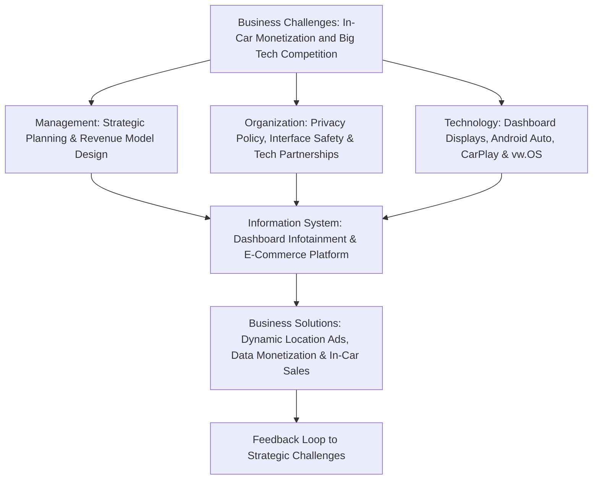

### Explanatory Breakdown of Figure 10.0: Car Dashboard System Architecture
- **Inputs**: Vehicle telemetry sensors, GPS geolocation coordinates, driver preference profiles, ambient noise audio, and sponsor merchant advertising feeds.
- **Core Processing Mechanisms**: The **Dashboard Infotainment Information System** processes data through vehicle operating systems (Android Automotive, Apple CarPlay, vw.OS) and cloud middleware APIs.
- **Decisioning Logic**: Real-time contextual algorithms evaluate driving speed, route proximity, and user privacy constraints to select non-distracting, safety-compliant in-car offers.
- **Outputs**: Rendered dynamic location-based ads, automated maintenance alerts, voice-guided transaction confirmations (gas/coffee payments), and high-margin data monetization streams.

---

## 10-1 E-Commerce and the Internet

### E-Commerce Today: Ubiquitous Digital Transactions
**E-commerce** refers to the use of the Internet and the Web to transact business. More formally, it encompasses **digitally enabled commercial transactions between and among organizations and individuals**. Commercial transactions involve the exchange of value (e.g., money) across organizational or individual boundaries in return for products and services.

#### Scope and Scale of E-Commerce Growth
- E-commerce began in **1995** when **Netscape.com** accepted the first commercial banner advertisements.
- Consumer e-commerce revenues expanded rapidly at double-digit rates, showing resilience even during economic downturns. While traditional retail contracted during the 2008–2009 recession, online sales maintained positive momentum.
- By 2020, over **230 million Americans (92.5% of Internet users)** shopped online, generating over **$1.2 trillion** across retail goods ($675B), digital travel/services ($475B), and digital content ($67B).
- **Market Dominance**: Amazon commands approximately **40%** of U.S. retail e-commerce ($260 billion), followed by omnichannel competitors like Walmart ($35 billion).

#### The New E-Commerce Paradigm: Social, Mobile, Local
Modern e-commerce has evolved from isolated desktop Web browsing into a dynamic environment anchored by three pillars:
1. **Social**: Consumer buying decisions are heavily driven by social networks, peer reviews, recommendations, and creator influence.
2. **Mobile**: Over **45% of retail e-commerce** is executed via handheld mobile devices (m-commerce), with smartphones handling 80% of mobile activity.
3. **Local**: Mobile GPS tracking connects digital transactions directly to real-time physical locations and local merchants.

#### Eyeballs vs. Conversations: Conversational Commerce
Traditional Web advertising relied on television-style broadcast models focused on **eyeballs** (unique visitors) and **impressions** (number of times an ad was served). Modern e-commerce operates on **conversational commerce**, where firms engage in multi-directional dialogues with consumers, listening, interacting, and responding across social media platforms. Brands are no longer pushed; they are discussed and co-created within consumer social networks.

---

### Business Transformation & Technology Foundations

| Category / Dimension | Key Industry Developments & Drivers |
| :--- | :--- |
| **Business Transformation** | • E-commerce remains the fastest-growing retail channel (growing 12–15% annually vs 2–4% for physical retail). • On-demand services (**Uber**, **Lyft**, **Airbnb**, DoorDash) transform service delivery. • Traditional brick-and-mortar retailers adopt **omnichannel** strategies combining physical store assets with digital logistics platforms. • Small businesses flood digital marketplaces leveraging cloud platforms (Amazon Marketplace, Shopify, Google). |
| **Technology Foundations** | • Expansion of high-speed wireless networks (Wi-Fi, 4G, **5G**). • Proliferation of smartphones, tablets, smart wearables (Apple Watch), and smart home voice assistants (Amazon Alexa, Google Assistant). • Adoption of **Cloud Computing**, **SaaS**, and **PaaS** drastically lowers site creation and infrastructure maintenance costs. |
| **Emerging Business Models** | • Social networks serve as primary gateways to news, entertainment, and product discovery. • On-demand service platforms match unutilized capacity with real-time consumer demand. • Shift from traditional print and broadcast advertising to programmatic digital ad networks. • Media distribution shifts to cloud streaming (Netflix, Spotify, YouTube, Disney+), causing cable cord-cutting. |

---

### Eight Unique Features of E-Commerce Technology

The unique business significance of e-commerce stems from eight key technological dimensions that set it apart from traditional commercial channels:

### Explanatory Breakdown of Figure 10.1: Eight Unique Features of E-Commerce Technology
- **Inputs**: User interaction logs, standardized TCP/IP network packets, rich multimedia assets, buyer search queries, location tags, and peer social contributions.
- **Core Processing Mechanisms**: Ubiquitous cloud accessibility, cross-border standard data transmission protocols, rich media streaming engines, interactive two-way messaging, and user-generated content aggregation pipelines.
- **Decisioning Logic**: Algorithmic price transparency filtering, dynamic personalization scoring matching buyer profile vectors, search cost optimization models, and dynamic pricing rules.
- **Outputs**: Boundaryless global marketspace access, reduced transaction and search costs for consumers, customized merchant offerings, transparent price comparisons, and peer-to-peer social commerce feeds.

1. **Ubiquity**: Internet technology is available everywhere (at home, work, mobile, in-vehicle).
   - *Business Impact*: Creates a **marketspace**—a marketplace extended beyond traditional temporal and physical boundaries. Consumers can shop 24/7/365 from any location. Significantly lowers consumer **transaction costs** (the time, effort, and financial costs of participating in a market).
2. **Global Reach**: Technical standards enable cross-border commercial transactions without modification.
   - *Business Impact*: Marketspace potential equals the world’s online population (billions of consumers). Breaks local/regional market limitations faced by traditional media.
3. **Universal Standards**: A single set of global technical standards (Internet/TCP/IP protocols).
   - *Business Impact*: Disparate computing systems communicate effortlessly. Drastically lowers **market entry costs** for merchants and **search costs** for consumers looking for goods.
4. **Richness**: Ability to deliver complex visual, audio, and text marketing messages simultaneously to large audiences.
   - *Business Impact*: Overcomes the traditional tradeoff between reach and richness. Merges the rich sensory experience of physical retail with global digital scale.
5. **Interactivity**: Technology enables dynamic, two-way communication between seller and buyer, as well as peer-to-peer sharing.
   - *Business Impact*: Engages consumers in real-time dialogs, tailoring the purchase journey to user actions and feedback.
6. **Information Density**: The total amount and quality of information available to all market participants is vastly multiplied.
   - *Business Impact*: Lowers data collection, processing, and storage costs. Heightens **price transparency** (ease of discovering market prices) and **cost transparency** (ability to discover merchant wholesale costs). Enables merchants to execute precise **price discrimination** (charging different prices to different customer segments based on willingness to pay).
7. **Personalization / Customization**: Delivering tailored ad messages to specific individuals based on preferences and past behavior (**personalization**), or modifying products/services based on user input (**customization**).
   - *Business Impact*: Increases conversion rates and customer satisfaction by aligning offerings with detailed individual clickstream profiles.
8. **Social Technology**: Supports user-created content (UGC) generation, social networking, and peer-to-peer distribution.
   - *Business Impact*: Shifts media consumption from a central broadcast model (one-to-many) to a decentralized, co-created network model (many-to-many).

---

### Digital Markets vs. Traditional Markets

Digital markets differ fundamentally from traditional physical marketplaces due to the extreme reduction in information processing and distribution costs:

| Market Dimension | Digital Markets | Traditional Markets |
| :--- | :--- | :--- |
| **Information Asymmetry** | VASTLY REDUCED: Buyers and sellers have near-equal access to pricing and product data. | HIGH: Sellers hold superior information regarding true costs and inventory. |
| **Search Costs** | VERY LOW: Instant price comparison engines and search algorithms. | HIGH: Physical store visits, phone inquiries, manual catalog checks. |
| **Transaction Costs** | VERY LOW: Automated checkout, electronic payment routing. | HIGH: Paper invoice processing, manual sales support, travel expenses. |
| **Delayed Gratification** | HIGH for physical goods (shipping delay); LOW for digital goods. | LOW: Immediate physical possession upon purchase. |
| **Menu Costs** | VERY LOW: Digital database prices updated instantly across all systems. | HIGH: Physical price tagging, shelf relabeling, print catalog reissuance. |
| **Dynamic Pricing** | LOW COST & INSTANT: Real-time algorithmic adjustments based on demand/supply. | HIGH COST & DELAYED: Periodic manual price restructuring. |
| **Price Discrimination** | LOW COST & HIGH PRECISION: Behaviorally targeted pricing models. | HIGH COST & LOW PRECISION: Broad demographic coupons/discounts. |
| **Market Segmentation** | HIGH PRECISION: Targeted individual clickstream profiles. | LOW PRECISION: Regional or demographic store-level targeting. |
| **Switching Costs** | VARIABLE: Lower for commoditized goods; higher when locked into vendor ecosystems. | HIGH: Physical distance and relationship inertia. |
| **Network Effects** | EXTREMELY STRONG: Value scales exponentially with user network size. | WEAKER: Localized community network effects. |
| **Disintermediation** | HIGHLY FEASIBLE: Direct manufacturer-to-consumer digital channels. | LESS FEASIBLE: Dependent on multi-tiered wholesaler/retailer networks. |

---

### Supply Chain Disintermediation

**Disintermediation** is the removal of organizations or business process layers responsible for intermediary steps in a value chain. By eliminating intermediaries (distributors, jobbers, wholesalers, retailers), manufacturers sell directly to end consumers, capturing higher profit margins while delivering lower retail prices.

#### Cost Structure Example: The Sweater Supply Chain

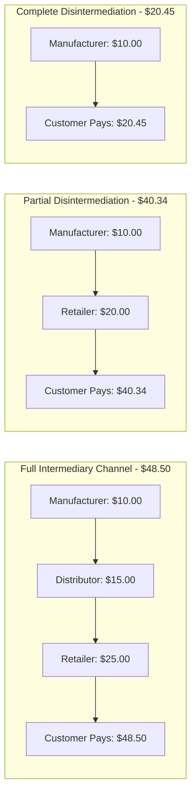

### Explanatory Breakdown of Figure 10.2: Benefits of Disintermediation
- **Inputs**: Manufacturer production cost metrics ($10.00 base cost), wholesaler markup allocations ($15.00), retailer operational markups ($25.00), and final consumer pricing demand ($48.50 vs $20.45).
- **Core Processing Mechanisms**: Direct-to-consumer e-commerce ordering systems, automated warehouse picking, and digital payment processing replacing multi-tier wholesale and retail distributor steps.
- **Decisioning Logic**: Channel cost evaluation logic determining whether intermediary distribution tiers add sufficient value or create price inflation, routing orders directly from factory floor to end buyers.
- **Outputs**: Complete elimination of intermediary overhead layers, 58% price reduction for end consumers ($20.45 direct price), and doubled profit margins retained by original manufacturers ($10.45 direct margin).

---

### Digital Goods

**Digital goods** are goods that can be delivered over a digital network. Examples include software, music tracks, streaming video, e-books, news articles, graphics, and online games. Digital goods represent **intellectual property** ("works of the mind") protected by copyright, patent, trademark, and trade secret law.

#### Economic Characteristics of Digital Goods
- **Zero Marginal Cost**: Producing the initial first unit of a digital good involves high fixed creation costs (movie production, software engineering, music recording). However, the cost of producing unit #2 through unit #1,000,000 is approximately **zero** (zero inventory and manufacturing costs).
- **Extremely Low Distribution Costs**: Network delivery costs are negligible compared to physical pressing, packaging, shipping, and store stocking.
- **Pricing Flexibility**: Low menu costs enable aggressive bundling, subscription access, micro-payments, and dynamic pricing.

#### Industry Disruption Comparison: Digital Goods vs. Traditional Goods

| Dimension | Digital Goods | Traditional Physical Goods |
| :--- | :--- | :--- |
| **Marginal Cost per Unit** | Virtually Zero ($0) | Greater than zero; significant materials and labor. |
| **Initial Production Cost** | Extremely High (Nearly total product investment) | Variable; spread across physical raw materials. |
| **Copying & Duplication Cost** | Approximately Zero ($0) | High (factory processing, materials, quality control). |
| **Distributed Delivery Cost** | Low (Network bandwidth) | High (Freight, trucking, warehousing, logistics). |
| **Inventory Holding Cost** | Zero / Minimal Cloud Storage | High (Physical warehouse space, shrinkage, spoilage). |
| **Pricing Models** | Highly Variable (Freemium, subscription, bundling) | Fixed unit-cost markup pricing. |

---

## 10-2 E-Commerce: Business and Technology

### Major Categories of E-Commerce

E-commerce transactions are classified by the nature of the participating entities:

1. **Business-to-Consumer (B2C)**: Retailing products and services directly to individual shoppers (e.g., Amazon, Walmart.com, Apple Music).
2. **Business-to-Business (B2B)**: Wholesale commercial transactions and procurement among business entities (e.g., Elemica chemical marketplace, VW Group Supply).
3. **Consumer-to-Consumer (C2C)**: Platform-enabled sales directly between consumers (e.g., eBay auctions, Craigslist, Facebook Marketplace).
4. **Mobile Commerce (M-Commerce)**: Any B2C, B2B, or C2C transaction conducted using handheld wireless devices (smartphones, tablets, wearables).

---

### Internet Business Models

Internet platforms add value by leveraging low information costs to create new business architectures:

| Business Model | Core Value Proposition & Description | Primary Industry Examples |
| :--- | :--- | :--- |
| **E-tailer** | Online retail store selling physical products directly to buyers 24/7 with vast inventory selection. Includes pure-play online merchants and "bricks-and-clicks" store extensions. | Amazon, Blue Nile, Walmart.com, eVitamins |
| **Transaction Broker** | Processes online transaction services normally handled in person, saving users time and financial transaction costs. | E*Trade, Expedia, Fidelity, Orbitz |
| **Market Creator** | Builds a digital environment where buyers and sellers meet, search, display products, and establish prices (auctions, fixed price, or on-demand capacities). | eBay, Priceline, Airbnb, Uber, Kickstarter |
| **Content Provider** | Monetizes intellectual property by distributing digital content (video, music, news, art, text) over the Web. | Wall Street Journal (WSJ.com), Getty Images, Netflix, Apple Music, Spotify |
| **Community Provider** | Creates an online environment for individuals with shared interests to communicate, share content, build profiles, and transact. | Facebook, Instagram, Twitter, LinkedIn, Pinterest |
| **Portal** | Serves as a primary Web gateway providing search tools, integrated news, email, maps, and entertainment content to retain user focus. | Yahoo, MSN, AOL, Google |
| **Service Provider** | Delivers online applications, data storage, photo sharing, or cloud software services (SaaS) on a subscription or utility basis. | Google Docs, Dropbox, Office 365, Salesforce |

---

### E-Commerce Revenue Models

A firm’s **revenue model** describes how it will earn revenue, generate profits, and produce a superior return on investment. Major e-commerce revenue models include:

1. **Advertising Revenue Model**: A website generates revenue by attracting large user audiences (or highly targeted niches) and charging advertisers for ad placements (banner display, search text, video ads).
   - *Dominance*: Google and Facebook generate over 90% of revenues from advertising formats. Digital ad spend accounts for nearly 60% of all U.S. advertising outlays ($154B+).
2. **Sales Revenue Model**: Companies earn revenue by selling physical goods, digital products, or services directly to customers (e.g., Amazon, Gap.com).
   - Includes **micropayment systems**, which cost-effectively process high volumes of micro-transactions (25¢ to $5.00), pioneered by Apple iTunes for individual track and app downloads.
3. **Subscription Revenue Model**: Charging ongoing recurring fees for access to premium content or software services (e.g., Netflix with 180M+ global subscribers, Consumer Reports at $39/year, Match.com, Xbox Live). Requires highly differentiated, non-replicable value.
4. **Free / Freemium Revenue Model**: Basic services or basic content are offered for free, while premium advanced features or ad-free versions require a fee (e.g., Pandora radio, Spotify, LinkedIn premium).
   - *Managerial Challenge*: High "freeloader conversion barrier." Converting free users into paying subscribers is difficult; free ad-supported tiers often subsidize non-paying users.
5. **Transaction Fee Revenue Model**: A fee or commission is collected for enabling or executing a transaction (e.g., eBay charging transaction commissions on successful sales; E*Trade processing stock trades).
6. **Affiliate Revenue Model**: Websites (*affiliate sites*) redirect traffic to external merchant sites in exchange for a referral fee or percentage of sales (e.g., Yelp, MyPoints, personal blogs utilizing Amazon Affiliate links).

---

### FinTech & Non-Bank Online Lending Innovations

Financial Technology (**FinTech**) platforms leverage big data analytics and transactional histories to disrupt traditional corporate banking services.

#### FinTech Underwriting vs. Traditional Banking

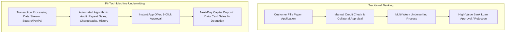

### Explanatory Breakdown of Figure 10.3: FinTech Underwriting vs. Traditional Banking
- **Inputs**: Real-time point-of-sale (POS) transaction streams (Square, PayPal), historical cash flow velocity, chargeback rates, return metrics vs traditional paper credit applications and collateral appraisals.
- **Core Processing Mechanisms**: Automated machine-learning credit risk scoring models auditing daily sales volume and cash flow volatility vs manual human loan officer committee reviews.
- **Decisioning Logic**: Automated real-time risk threshold evaluation determining pre-approved loan amounts and dynamic fee structures without requiring fixed physical collateral.
- **Outputs**: 24-hour capital disbursement ("Next-Day Capital Deposit"), 1-click dashboard approval offers, and automated daily percentage deductions from ongoing credit card sales.

#### Key FinTech Industry Dynamics
- **Data-Driven Credit Risk Models**: FinTech lenders (Square Capital, PayPal Working Capital, Kabbage, Quickbooks Capital) analyze real-time operational data—such as card processing volume, customer repeat rates, and daily cash flows—eliminating paper loan applications and collateral requirements.
- **Repayment Mechanisms**: Instead of variable interest rates, platforms like Square Capital charge flat upfront fees (e.g., 10% to 16% of loan principal). Loans are repaid automatically through daily percentage deductions (e.g., 14.8%) from card sales until paid in full (usually within 18 months).
- **Tradeoffs for Small Businesses**:
  - *Advantages*: Unmatched speed (funds arriving in 24 hours), zero collateral required, simple 1-click execution for underserved small vendors.
  - *Disadvantages*: High effective interest costs (ranging from 10% to 25%+ APR equivalent), automated sudden offer terminations without human customer service explanations, and strict short-term repayment schedules.

---

## 10-3 How Has E-Commerce Transformed Marketing?

### Internet Marketing & Long Tail Strategy

The Internet provides marketers with low-cost channels to identify and communicate with targeted micro-audiences.

#### Long Tail Marketing
Before the Internet, brick-and-mortar shelf constraints forced retailers to focus on mass-market "hit" products. **Long tail marketing** enables merchants to profitably sell products with extremely low demand to niche markets globally. Because digital inventory display and storage costs are minimal, combining thousands of low-volume niche sales generates significant aggregate revenue (e.g., Amazon’s inventory of obscure books, or Spotify’s catalog of independent musicians).

#### Online Ad Spending Formats ($ Billions)

| Ad Format | 2020 Spend | Structural Description & Business Purpose |
| :--- | :--- | :--- |
| **Search Engine** | $54.4B | Text ads displayed against active keyword queries. Highly sales-oriented; captures immediate buying intent. |
| **Video** | $35.5B | Fastest-growing format. Rich interactive video ads placed pre-roll/in-stream. Highly effective for brand building. |
| **Display Ads** | $31.1B | Banner ads, pop-ups, and social media display graphics. Behaviorally targeted to user history. |
| **Rich Media** | $5.6B | Interactive animation, puzzles, and interactive expandable ad modules for engagement. |
| **Sponsorships** | $2.8B | Co-branded web content, sponsored online games, and contest integrations. |
| **Lead Generation** | $2.5B | Web lead collection forms sold to outbound sales organizations. |
| **Classifieds** | $2.1B | Online real estate, job listings, and service directory postings. |
| **Email Marketing** | $0.49B | High ROI targeted direct communication with option to opt-in/opt-out. |

---

### Behavioral Targeting, Ad Networks & Personalization

**Behavioral targeting** tracks individual clickstream behavior across thousands of websites to construct behavioral profiles for serving targeted ads.

#### Website Visitor Tracking Process

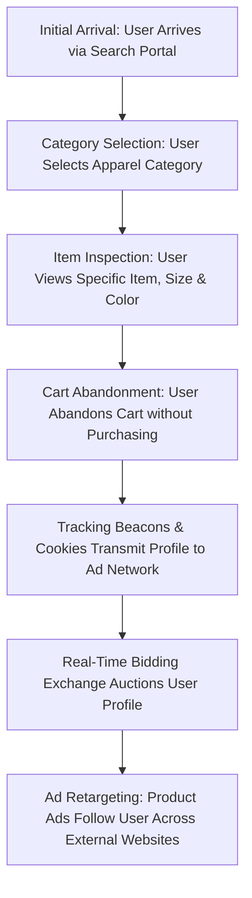

### Explanatory Breakdown of Figure 10.4: Visitor Tracking Architecture
- **Inputs**: User entry portal referrer data, timestamp, IP geolocation, browser headers, clicked product attributes (blouse size 10, pink color), and cart status signals.
- **Core Processing Mechanisms**: E-commerce analytics engines, cookie tracking beacons, ad network profile synchronization, and real-time bidding (RTB) exchange auctions.
- **Decisioning Logic**: Abandonment detection rules evaluating uncompleted checkout sessions and retargeting bidding algorithms matching user intent with advertiser product catalogs.
- **Outputs**: Broadcast abandoned cart profiles, dynamic retargeted product display ads rendered across partner web/social properties, and optimized conversion recovery pipelines.

---

#### Website Personalization Mechanisms

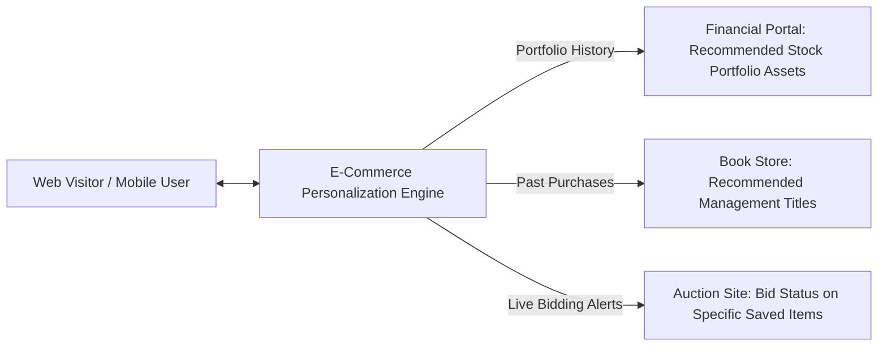

### Explanatory Breakdown of Figure 10.5: Dynamic Personalization
- **Inputs**: Authenticated user credentials, cookie session identifiers, historical purchase records, real-time browsing behavior, active watchlist items, and recommendation model embeddings.
- **Core Processing Mechanisms**: Personalization decision engines querying customer relational databases, market basket analysis models, and live auction bidding state feeds.
- **Decisioning Logic**: Conditional business rule matching (e.g., Portfolio History -> Financial Portal Alerts; Past Purchases -> Recommended Management Titles; Live Bidding -> Watchlist Status Updates).
- **Outputs**: Real-time custom rendered homepages, targeted banner advertisements, personalized product recommendations, and dynamic notification widgets.

---

#### How an Advertising Network Works

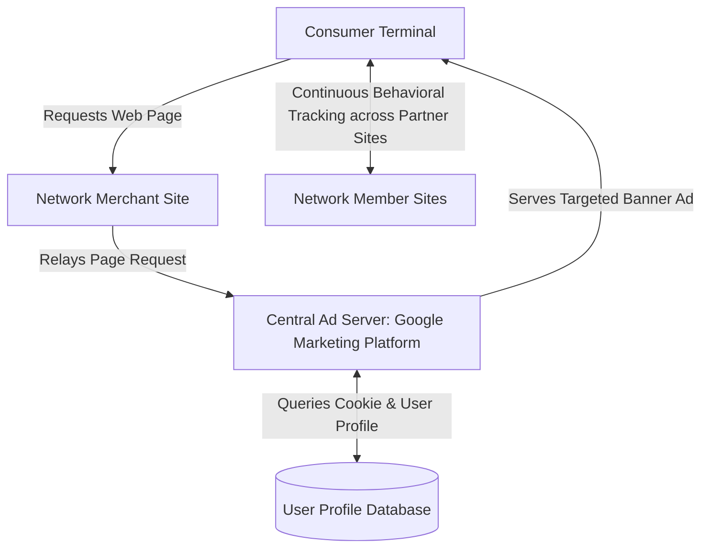

### Explanatory Breakdown of Figure 10.6: Ad Network Architecture
- **Inputs**: Consumer web page requests, merchant site publisher calls, tracking cookie identifiers, user profile database records, and advertiser campaign bids.
- **Core Processing Mechanisms**: Central ad server request handling (Google Marketing Platform), database querying across demographic/behavioral profiles, algorithmic auction scoring, and cross-site tracking.
- **Decisioning Logic**: Real-time ad placement scoring selecting the optimal target ad based on publisher context, user demographic match, and highest advertiser bid price within milliseconds.
- **Outputs**: Targeted banner ads served directly to consumer terminals, continuous cross-site clickstream logging, and updated user behavioral database profiles.

---

### Social E-Commerce & Social Graph Marketing

Social e-commerce leverages the **social graph**—a digital mapping of all significant online social relationships. Based on **small world theory**, any individual is linked to any other person on Earth by approximately six degrees of separation.

#### Key Features of Social Commerce Platforms (Table 10.7)
- **Newsfeed**: Dynamic streams of notifications, friend updates, and sponsored brand posts.
- **Timelines**: Chronological histories of photos and personal milestones that anchor user identity.
- **Social Sign-On**: Authentication via Facebook/Google credentials, sharing user profile attributes with third-party sites.
- **Collaborative Shopping**: Shared browsing environments, co-shopping chat, and real-time product discussions.
- **Network Notification**: Real-time broadcasts of peer likes, check-ins, recommendations, and ratings.
- **Social Search / Recommendations**: Peer-driven search filters evaluating product quality through trusted social circles.

---

### Wisdom of Crowds & Crowdsourcing

The **wisdom of crowds** phenomenon suggests that large groups of people can make better decisions about products, design, and forecasting than single experts or small committees.

#### Crowdsourcing Applications
- **Product Design**: BMW solicited urban vehicle designs for 2025; Lego Ideas enables fans to vote on sets for commercial manufacture; Caterpillar co-designs heavy machinery with equipment operators.
- **Crowdfunding**: Platforms like **Kickstarter** enable entrepreneurs to validate demand and secure direct equity/product pre-orders from thousands of individual backers.

---

## 10-4 How Has E-Commerce Affected Business-to-Business Transactions?

### B2B E-Commerce Scope & Procurement Overhead

B2B trade represents a vast market, exceeding **$14.5 trillion** in the U.S., with B2B e-commerce accounting for over **$6.7 trillion**. Automating corporate procurement is critical because traditional manual purchase order (PO) workflows cost upwards of **$100 per PO** in administrative overhead (processing invoices, faxing orders, checking inventory, arranging logistics). Automated B2B platforms eliminate paper handling, reducing procurement costs while expanding supplier choices.

---

### Electronic Data Interchange (EDI)

**Electronic Data Interchange (EDI)** enables the computer-to-computer exchange between two organizations of standard business transactions (invoices, bills of lading, purchase orders, shipping schedules).

#### EDI Continuous Replenishment Workflow

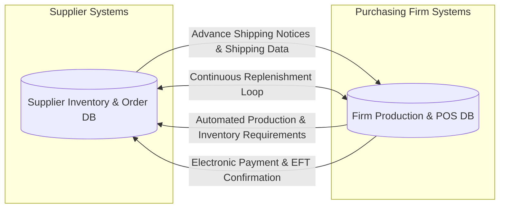

### Explanatory Breakdown of Figure 10.7: EDI System Integration
- **Inputs**: Real-time point-of-sale (POS) store sales, warehouse stock thresholds, automated production schedule requirements, and standardized EDI document formats (ANSI X12 / EDIFACT).
- **Core Processing Mechanisms**: Direct system-to-system computer data transmission between buyer ERP/WMS systems and supplier inventory databases, eliminating manual purchase order creation.
- **Decisioning Logic**: Automated replenishment threshold triggers generating advance shipping notices (ASN) and Electronic Funds Transfer (EFT) payment authorizations based on inventory level rules.
- **Outputs**: Automated inventory replenishment shipments, advance shipping notices, digital invoice reconciliation, and direct EFT bank settlements.

---

### Private Industrial Networks (Private Exchanges)

A **private industrial network** (or **private exchange**) is a secure Web platform owned by a buyer firm to link its internal systems directly with strategic suppliers, distributors, and logistics partners.

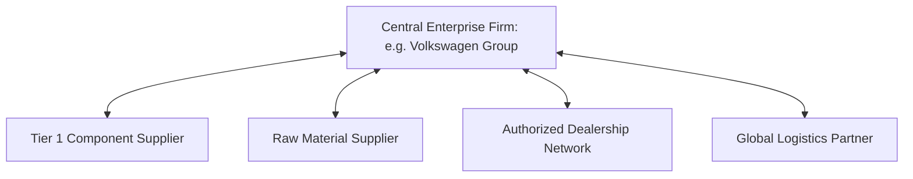

### Explanatory Breakdown of Figure 10.8: Private Industrial Network Architecture
- **Inputs**: Strategic buyer enterprise requirements (e.g., Volkswagen Group), Tier 1 component supplier capacity data, raw material specs, logistics tracking feeds, and dealership inventory reports.
- **Core Processing Mechanisms**: Centralized private exchange extranet platform facilitating collaborative engineering design, joint demand forecasting, shared inventory visibility, and unstructured project communications.
- **Decisioning Logic**: Collaborative supply chain decisioning balancing joint production schedules, supplier allocation quotas, and component engineering changes across long-term partner networks.
- **Outputs**: Synchronized global supply chain schedules, reduced procurement overhead, joint product design revisions, and streamlined multi-tier logistics coordination.

---

### Net Marketplaces (E-Hubs)

**Net marketplaces** (e-hubs) bring together hundreds of buyers and suppliers into a single digital platform.

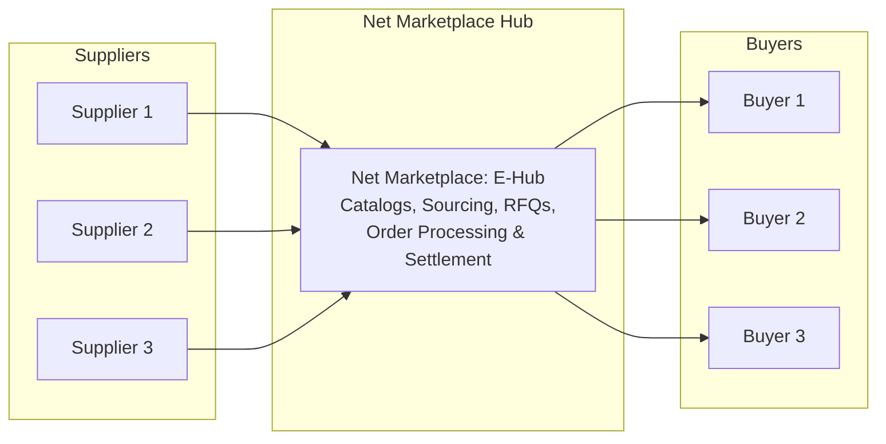

### Explanatory Breakdown of Figure 10.9: Net Marketplace Structure
- **Inputs**: Buyer Request for Quotations (RFQs), supplier product catalogs, spot market purchasing bids, and contract pricing agreements across direct and indirect goods categories.
- **Core Processing Mechanisms**: Digital e-hub platform services aggregating hundreds of buyers and suppliers, providing centralized product catalogs, automated RFQ matching, order consolidation, and settlement.
- **Decisioning Logic**: Marketplace matching algorithms evaluating contract vs spot purchasing terms, pricing thresholds, supplier ratings, and volume discount brackets.
- **Outputs**: Consolidated purchase orders, competitive RFQ supplier bids, automated payment processing, fulfillment tracking metrics, and market clearing price transparency.

---

### Third-Party Exchanges

**Exchanges** are independently owned third-party Net marketplaces that connect thousands of buyers and suppliers for spot purchasing (e.g., Go2Paper for spot paper trade). 
- *Historical Failure Dynamics*: Hundreds of spot exchanges established during the early dot-com era failed. Suppliers avoided exchanges that drove prices down via aggressive bidding without offering long-term buyer relationships or supply security.

---

## 10-5 The Mobile Digital Platform and Mobile Commerce

### M-Commerce Growth & Revenue Scale

Retail **m-commerce** represents the fastest-growing segment of digital commerce. By 2020, mobile retail sales reached **$305 billion (45% of total retail e-commerce)**, projected to exceed **$500 billion (54% of total e-commerce)**. Growth is fueled by larger smartphone screens, faster 5G networks, location-based services, and frictionless mobile wallet checkouts.

#### Revenue Growth Trend (Figure 10.9)
Mobile retail commerce revenue shows a steep upward trajectory, expanding from $120 billion to over $425 billion between 2016 and 2022, consistently outstripping desktop e-commerce expansion rates.

---

### Location-Based Services & Applications

Location-based applications rely on GPS, cell tower triangulation, and Wi-Fi beacons:

1. **Geosocial Services**: Inform users of friend locations and social check-ins (e.g., Foursquare, Facebook Local).
2. **Geoadvertising Services**: Deliver targeted promotional messages based on exact proximity to physical storefronts (e.g., Kiehl's sending instant coupons to shoppers within 100 yards of a retail location).
3. **Geoinformation Services**: Provide contextual data regarding surrounding environments (e.g., Waze delivering crowdsourced traffic alerts, speed traps, and gas price comparisons; real-time real estate app values).

---

### Mobile Payment Systems (Table 10.8)

FinTech innovations have introduced three primary mobile payment technologies:

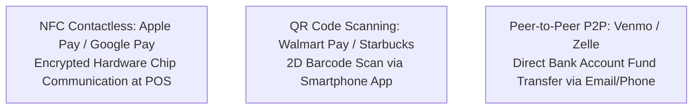

### Explanatory Breakdown of Figure 10.10: Mobile Payment Systems
- **Inputs**: User payment credentials (credit/debit cards), contactless NFC radio signals, 2D QR code scans, and mobile app P2P identifiers (phone/email).
- **Core Processing Mechanisms**: Mobile OS hardware secure element tokenization (Apple Pay / Google Pay), optical camera barcode reading algorithms, cloud software P2P bank routing (Venmo / Zelle), and PCI-DSS encrypted payment gateway authorization.
- **Decisioning Logic**: Biometric authentication rules (Face ID / Touch ID), tokenized security validation matching temporary payment tokens against account vaulted credentials, and fraud risk scoring.
- **Outputs**: Instant POS payment authorizations, digital transaction receipts, encrypted token exchanges, and direct bank account fund transfers.

| Technology Type | Technical Mechanism & Process | Leading Market Examples |
| :--- | :--- | :--- |
| **Near Field Communication (NFC)** | Short-range wireless radio communication between NFC chips in mobile devices and merchant POS card readers. Exchanging encrypted tokenized credentials when held within inches. | Apple Pay, Google Pay, Samsung Pay |
| **QR Code Payment** | Scanning dynamic 2D barcodes using smartphone camera apps. The merchant display generates a transaction QR code scanned by the buyer, or the buyer app displays a barcode scanned by the merchant laser scanner. | Walmart Pay, Starbucks App, Target, Dunkin' |
| **Peer-to-Peer (P2P)** | Cloud-based software enabling direct transfer of funds between personal bank accounts or linked debit cards using phone numbers or email identifiers. | Venmo, Zelle, Cash App |

---

## 10-6 Building an E-Commerce Presence

### Management Challenges

Building a successful e-commerce presence requires managing two core imperatives:
1. **Developing a Clear Understanding of Business Objectives**: Defining exact customer outcomes rather than adopting technology for its own sake.
2. **Choosing the Right Technology Infrastructure**: Selecting platforms, site architectures, and mobile frameworks aligned with organizational capacity.

---

### E-Commerce Presence Map

A complete digital presence requires coordinating four core touchpoints:

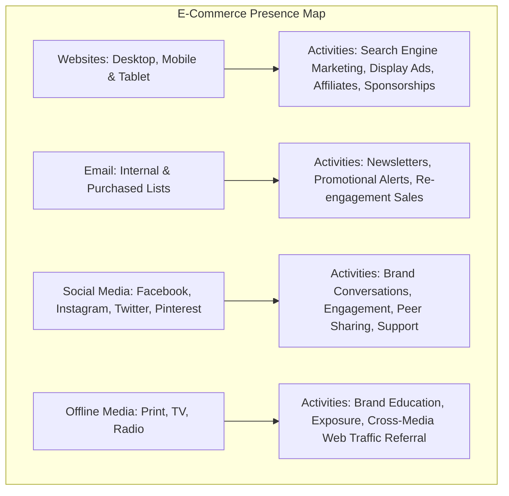

### Explanatory Breakdown of Figure 10.11: Presence Architecture
- **Inputs**: Target audience demographic profiles, multi-channel customer touchpoint interactions, campaign marketing budgets, and media channel performance metrics.
- **Core Processing Mechanisms**: Multi-channel digital presence coordination across Web platforms (desktop/mobile), email automation systems, social media management tools, and offline media referrals.
- **Decisioning Logic**: Resource allocation logic mapping customer touchpoint intent to channel execution activities (e.g., SEO/SEM for web acquisition, cart recovery automation for email, brand engagement for social, exposure for offline).
- **Outputs**: Integrated multi-platform brand presence, cross-channel traffic conversion, social community engagement, and synchronized customer journey touchpoints.

---

### E-Commerce Presence Development Timeline

Developing an enterprise digital presence requires a structured phased roadmap:

| Phase | Core Operational Activity | Primary Deliverable / Milestone |
| :--- | :--- | :--- |
| **Phase 1: Planning** | Define target audience, identify business goals, determine internal team staffing. | **Web Mission Statement** |
| **Phase 2: Website Development** | Content acquisition, user interface (UI/UX) design, cloud hosting arrangements. | **Website Architecture Plan** |
| **Phase 3: Web Implementation** | Front-end/back-end programming, SEO keyword integration, payment gateway setup. | **Functional Operational Website** |
| **Phase 4: Social Media Plan** | Platform selection (Instagram vs. LinkedIn), social tone definition, content calendar. | **Social Media Strategy Plan** |
| **Phase 5: Social Implementation** | Account launch, content deployment, ad campaign setup, customer social listening. | **Active Social Media Channels** |
| **Phase 6: Mobile Plan** | Responsive web optimization, native app development for iOS/Android, mobile wallet integration. | **Functional Mobile Media Presence** |

---

## 10-7 How Will MIS Help My Career? — E-Commerce Operations Specialist

### Position Summary & Business Role
An **E-Commerce Operations Specialist** oversees the day-to-day technological, transactional, and logistical execution of a firm's digital sales channels. Positioned at the intersection of marketing, information technology, and supply chain management, this role ensures that online customer touchpoints—ranging from primary Web desktop and mobile storefronts to native social media checkout feeds—function seamlessly, securely, and profitably.

### Core Operational Responsibilities
1. **Digital Storefront & Catalog Management**: Maintaining product information management (PIM) databases, updating dynamic pricing rules, configuring catalog tax/shipping attributes, and deploying promotional content.
2. **Order Fulfillment & Systems Integration**: Monitoring real-time order flows passing through Electronic Data Interchange (EDI), Enterprise Resource Planning (ERP), and Warehouse Management Systems (WMS) to prevent inventory stockouts and delivery delays.
3. **Conversion Funnel Optimization & Analytics**: Utilizing Web analytics and tracking beacon telemetry to evaluate consumer clickstreams, identify cart abandonment causes, and implement A/B testing for site usability improvements.
4. **Payment Gateway & Security Compliance**: Overseeing mobile app payment integrations (NFC, QR Code, P2P), ensuring PCI-DSS payment compliance, and monitoring automated fraud detection algorithms to minimize chargebacks.
5. **Vendor & Marketplace Operations**: Coordinating third-party logistics (3PL) partners, Net marketplace integrations (Amazon, Walmart Marketplace), and affiliate network marketing feeds.

### How Information Systems Knowledge Empowers This Career
- **Systems Thinking & Infrastructure Integration**: Understanding how front-end user interfaces interface with back-end database architectures, middleware APIs, and cloud hosting environments enables specialists to diagnose technical glitches quickly and manage IT supplier vendor SLAs.
- **Data Analytics & Behavioral Targeting Mastery**: MIS training equips specialists to analyze structured transactional data and unstructured behavioral clickstream logs, translating raw traffic metrics into actionable dynamic pricing, personalization, and retargeting strategies.
- **Strategic Supply Chain Alignment**: Understanding disintermediation, continuous replenishment EDI workflows, and private industrial networks allows operations specialists to streamline order-to-cash cycles and lower operational transaction costs.
- **Adaptability to Next-Generation Commerce**: As digital markets shift toward agentic e-commerce, AI-driven conversational avatars, biometric mobile checkout, and surveillance pricing regulations, MIS expertise provides the conceptual foundation needed to evaluate and adopt emerging technology platforms.

---

# Case Study Questions & Answers

## Case Study 1: Opening Case — E-Commerce Comes to the Dashboard: The Battle for the "Fourth Screen"

### Case Context
Automakers and Big Tech tech giants (Apple, Google) are competing for control of in-vehicle infotainment displays. With drivers spending 51 minutes daily in cars, dashboard software offers a $750 billion market opportunity by 2030 across location-based advertising, automated maintenance scheduling, and digital commerce. Automakers like Volkswagen (vw.OS) and Ford are attempting to preserve data ownership and branded software ecosystems, while Apple (CarPlay) and Google (Android Auto / Android Automotive) seek to extend smartphone operating system dominance.

### Questions & Answers

#### Question 1: What people, organization, and technology issues must be addressed when designing and implementing car dashboard display systems for e-commerce?
- **Answer**:
  - **People Issues**: Drivers require completely non-distracting interfaces that prioritize road safety. Voice-recognition controls must function flawlessly under high ambient noise conditions (wind, engine noise, highway speeds). Drivers also voice strong concerns over personal location tracking and data privacy.
  - **Organization Issues**: Automakers must balance partnering with established tech giants against losing control of proprietary vehicle data and customer relationships. They must also manage long automotive design lifecycles (3–5 years) alongside fast-moving consumer software expectations.
  - **Technology Issues**: Hardware display durability, continuous wireless cloud connectivity in low-signal areas, secure operating system integration (e.g., Android Automotive vs. vw.OS), and onboard sensor data processing (fuel, tire pressure, passenger weight sensors).

#### Question 2: What are the advantages and drawbacks to using this form of e-commerce?
- **Answer**:
  - **Advantages**: Provides merchants with an captive, highly targeted local audience; enables drivers to execute frictionless transactions (ordering coffee, paying for fuel/tolls automatically); allows automakers to monetize telemetry data and schedule proactive service appointments.
  - **Drawbacks**: High potential for driver distraction and accidents; severe privacy risks associated with continuous location and behavioral data tracking; technical frustration if voice interfaces or cellular connectivity fail while driving.

---

## Case Study 2: Interactive Session: Technology — Small Business Loans from a FinTech App

### Case Context
FinTech platforms (Square Capital, PayPal Working Capital, Kabbage, Quickbooks Capital) are disrupting small business lending. By analyzing real-time transaction processing data, customer repeat rates, and cash flow history, FinTech platforms offer automated 1-click business loans without formal paper applications, collateral requirements, or traditional bank credit checks.

### Questions & Answers

#### Question 1: What distinguishes the FinTech services described in this case from traditional banks? Explain your answer.
- **Answer**: FinTech lenders eliminate traditional paper loan applications, credit scores, collateral requirements, and multi-week underwriting delays. Instead, they rely on automated machine learning algorithms that continuously audit real-time credit card processing data and sales histories. Loans are disbursed within 24 hours, charging flat upfront fees (10–16%) repaid via daily automated deductions from credit card sales rather than conventional compound monthly interest.

#### Question 2: How do the financial services described here use information technology to innovate?
- **Answer**: FinTech providers utilize cloud big data analytics, automated transaction auditing algorithms, and integrated mobile app interfaces. By processing millions of daily point-of-sale transactions, the software proactively identifies creditworthy merchants, calculates optimal loan offers, executes 1-click loan agreements, and automatically deducts daily repayment percentages from credit card settlements.

#### Question 3: What are the advantages and disadvantages of small businesses obtaining loans from FinTech services?
- **Answer**:
  - **Advantages**: Immediate access to capital (often within 24 hours), frictionless application process (no paperwork or tax returns), zero collateral requirements, and repayment structures that dynamically adjust down during slow sales days.
  - **Disadvantages**: Significantly higher capital costs (effective APRs ranging from 10% to 25%+), complete lack of human customer service support during disputes, and automated sudden loan offer terminations without explanation (as experienced by Hardcore Sweets Bakery).

#### Question 4: If you were a small business, what factors would you consider in deciding whether to use a FinTech service?
- **Answer**: Key factors include: (1) **Urgency of Need** (emergency repairs vs long-term capital expansion); (2) **Effective Cost of Capital** (comparing flat FinTech fees against lower-rate traditional SBA bank loans); (3) **Cash Flow Stability** (ability to withstand daily automated revenue deductions); and (4) **Loan Size** (FinTech loans average $6,500–$20,000; larger expansions require commercial bank financing).

---

## Case Study 3: Interactive Session: Management — Engaging "Socially" with Customers

### Case Context
Brands use social platforms (Instagram, Facebook, Twitter) to foster customer engagement and conversational commerce. Nike excels by leveraging lifestyle storytelling and athletic inspiration on Instagram. NBC Sports uses social analytics (Oracle Social Cloud) to drive real-time Olympic debates. Conversely, Lush UK opted to close its major social accounts, citing frustration with opaque platform feed algorithms that forced brands to pay for post visibility.

### Questions & Answers

#### Question 1: Assess the management, organization, and technology issues for using social media technology to engage with customers.
- **Answer**:
  - **Management**: Formulating social content strategies focused on customer engagement and brand values rather than hard selling; managing response strategies to negative public sentiment.
  - **Organization**: Restructuring marketing and customer service teams to provide continuous, real-time social listening and monitoring.
  - **Technology**: Deploying cloud social analytics platforms (Oracle Customer Experience Social Cloud), tracking sentiment tools, and managing multi-channel social APIs.

#### Question 2: What are the advantages and disadvantages of using social media for advertising, brand building, market research, and customer service?
- **Answer**:
  - **Advantages**: Direct viral connection to massive global audiences; instant market research feedback on consumer sentiment; highly cost-effective peer-to-peer amplification.
  - **Disadvantages**: Loss of total brand message control; vulnerability to public backlash; dependence on third-party platform algorithm changes that suppress organic reach to force paid ad buying.

#### Question 3: Give an example of a business decision in this case study that was facilitated by using social media to interact with customers.
- **Answer**: NBC Sports utilized Oracle Social Cloud to monitor live viewer discussions during the PyeongChang Winter Olympics. Topics generating high social buzz were immediately incorporated into main television broadcasts and social channels, while low-engagement segments were dropped.

#### Question 4: Should all companies use social media technology for customer service and marketing? Why or why not? What kinds of companies are best suited to use these platforms?
- **Answer**: Not all companies benefit equally. Highly visual, consumer-facing, lifestyle, apparel, and entertainment brands (e.g., Nike, NBC Sports) thrive on social engagement. However, specialized B2B industrial manufacturers or niche service providers may find traditional direct communication channels more effective. Companies must ensure they have the resources to actively maintain social channels; unmonitored accounts can severely damage brand reputation.

---

## Case Study 4: Chapter Closing Case Study — Can Uber Be the Uber of Everything?

### Case Context
Uber transformed urban transit by applying the **market creator** business model to the on-demand service economy. Utilizing smartphone GPS positioning, algorithmic matching, and dynamic **surge pricing**, Uber expanded into food delivery (**Uber Eats**), freight logistics (**Uber Freight**), and micro-mobility. However, the platform faces continuous challenges regarding driver classification (independent contractors vs. employees), urban congestion regulations, profitability targets, and intense global competition.

### Questions & Answers

#### Question 1: Analyze Uber using the competitive forces and value chain models. What is its competitive advantage?
- **Answer**: Uber disrupted traditional taxi monopolies by creating a multi-sided digital platform with powerful network effects. Its competitive advantage stems from its proprietary matching algorithms, dynamic surge pricing models, seamless mobile payment integration, and massive driver/rider network scale. However, threat of substitutes (Lyft, public transit) and low consumer switching costs represent ongoing competitive pressures.

#### Question 2: What is the role of information technology in Uber's business model?
- **Answer**: IT is the foundational engine of Uber. Real-time GPS tracking, algorithmic driver dispatch, predictive demand forecasting, automated customer rating systems, cloud payment processing, and dynamic price balancing are all executed purely through its mobile app architecture.

#### Question 3: How has Uber disrupted traditional industries?
- **Answer**: Uber disintermediated the municipal taxi industry by eliminating medallion monopolies, centralized dispatchers, and cash payments. It established the "on-demand economy" model, shifting consumer expectations toward instant, app-based service procurement.

#### Question 4: Can Uber successfully expand to become the "Uber of Everything"? Why or why not?
- **Answer**: Expanding beyond ride-hailing into food delivery and logistics leverages existing platform routing infrastructure and brand recognition. However, becoming the "Uber of Everything" is constrained by thin operating margins in food delivery, fierce local competition (DoorDash), regulatory pushback against worker classification, and high driver acquisition costs. Success depends on maintaining platform density and optimizing operational efficiencies.

---

## Key Terms Glossary

1. **Advertising Revenue Model**: An e-commerce revenue framework where a website generates income by attracting visitor traffic and charging advertisers to display promotional messages.
2. **Affiliate Revenue Model**: A model where referral websites direct traffic to merchant sites in exchange for a fee or percentage of resulting sales.
3. **Behavioral Targeting**: Tracking individual consumer clickstream history across Web properties to serve highly specific targeted advertisements.
4. **Business-to-Business (B2B)**: Digitally enabled commercial transactions occurring exclusively between business organizations.
5. **Business-to-Consumer (B2C)**: Electronic retailing of goods and services directly to individual consumers.
6. **Community Providers**: Web platforms that create digital environments for individuals with shared interests to interact, share media, and communicate.
7. **Consumer-to-Consumer (C2C)**: Platforms enabling consumers to sell directly to other consumers (e.g., online auctions, classifieds).
8. **Cost Transparency**: The ease with which consumers can discover the actual underlying costs merchants pay for products.
9. **Crowdsourcing**: Harnessing broad online communities to solve business problems, create designs, or aggregate capital.
10. **Customization**: Modifying a delivered product or service based on specific user choices or preferences.
11. **Digital Goods**: Intangible goods that can be stored, delivered, and consumed entirely over a digital network.
12. **Direct Goods**: Raw materials and inputs directly incorporated into the manufacturing production process.
13. **Disintermediation**: The removal of intermediate steps or distribution layers from a value chain.
14. **Dynamic Pricing**: Real-time algorithmic price adjustment based on changing supply and demand parameters.
15. **Electronic Data Interchange (EDI)**: Computer-to-computer exchange of standardized business transaction documents between organizations.
16. **E-tailer**: An online retail storefront selling physical goods directly to buyers over the Web.
17. **Exchanges**: Independently owned third-party Net marketplaces serving spot buyers and sellers.
18. **FinTech**: Financial technology firms leveraging software and big data analytics to deliver automated financial services.
19. **Free / Freemium Revenue Model**: Offering baseline services for free while charging premium fees for advanced features.
20. **Geoadvertising Services**: Delivering location-specific promotional ads based on mobile GPS proximity.
21. **Geoinformation Services**: Providing contextual environmental data to smartphones based on user coordinates.
22. **Geosocial Services**: Mobile applications notifying users of peer locations and check-ins.
23. **Indirect Goods**: Maintenance, repair, and operating (MRO) supplies not directly built into end products.
24. **Information Asymmetry**: Market conditions where one party in a transaction possesses superior information compared to the other.
25. **Information Density**: The total quantity and quality of information available to all market participants.
26. **Intellectual Property**: Creative works of the mind protected by copyright, patent, trademark, and trade secret laws.
27. **Location-Based Services**: Mobile services tied directly to the geographic location of the user's handheld device.
28. **Long Tail Marketing**: The capacity to profitably market and sell low-demand niche products to global audiences.
29. **Market Creator**: Business model building digital platforms where buyers and sellers meet, search, and establish prices.
30. **Market Entry Costs**: The total cost merchants must incur to bring their products and services to market.
31. **Marketspace**: A digital marketplace extended beyond traditional physical and temporal boundaries.
32. **Menu Costs**: Merchant financial and operational costs associated with changing product prices.
33. **Micropayment Systems**: Payment processing infrastructure designed to cost-effectively handle small transaction amounts.
34. **Mobile Commerce (M-Commerce)**: Commercial transactions executed via handheld wireless devices.
35. **Native Advertising**: Ad content integrated seamlessly into social newsfeeds or editorial articles.
36. **Net Marketplaces**: Single digital platforms based on Internet technology bringing together multiple buyers and suppliers.
37. **Personalization**: Adjusting targeted ad messages and content based on an individual's unique preferences and past behavior.
38. **Podcasting**: Publishing downloadable digital audio or video files over the Internet.
39. **Price Discrimination**: Selling identical goods to different targeted consumer groups at different prices.
40. **Price Transparency**: The ease with which consumers can discover the full range of prices for a product in a market.
41. **Private Exchange / Private Industrial Network**: Secure buyer-owned web network connecting a firm to strategic suppliers.
42. **Revenue Model**: An organizational framework detailing how a firm earns revenue and produces profits.
43. **Richness**: The complexity, depth, and sensory detail of a commercial message.
44. **Sales Revenue Model**: Earning income through direct sales of goods, services, or digital content.
45. **Search Costs**: The time and financial effort required by consumers to locate a suitable product.
46. **Social Graph**: A digital map of all significant online social relationships.
47. **Social Shopping**: Exchanging shopping recommendations and product reviews within social networks.
48. **Streaming**: Flowing continuous video or audio content to a user's device without local file storage.
49. **Subscription Revenue Model**: Charging ongoing recurring fees for access to digital content or software services.
50. **Transaction Costs**: Financial, temporal, and mental costs incurred by participating in a market transaction.
51. **Transaction Fee Revenue Model**: Collecting fees or commissions for executing transactions between parties.
52. **Wisdom of Crowds**: The phenomenon where large decentralized groups make superior decisions compared to individual experts.

---

## 2026 Appendix: Emerging E-Commerce & Digital Market Shifts

### 1. Agentic E-Commerce & Autonomous Machine Buyers
By 2026, digital commerce is experiencing a paradigm shift with the emergence of **Agentic E-Commerce**. Autonomous AI agents act as personal purchasing proxy agents on behalf of consumers.
- **Protocol-Driven Procurement**: Rather than humans browsing websites, autonomous AI agents utilize standardized API protocols to query merchant databases, evaluate dynamic volume discounts, negotiate terms, and execute financial transactions automatically.
- **Impact on Marketing**: Traditional visual advertising display formats are rendered ineffective when machine buyers execute decisions based purely on structured data parameters (price, specifications, warranty, delivery speed). Merchants must optimize for **Agentic API Discoverability** rather than human visual click-through rates.

### 2. EU AI Act Synthetic Media Rules (August 2026 Compliance)
Enforcement of the **European Union Artificial Intelligence Act (EU AI Act)** introduces strict legal mandates for synthetic digital media in e-commerce:
- **Mandatory Transparency & Watermarking**: As of August 2026, all AI-generated product advertisements, synthetic model imagery, virtual try-on renders, and conversational store avatars must incorporate indelible digital watermarks and explicit user disclosures.
- **Conversational Shopping Agents**: Autonomous customer service bots must explicitly disclose their non-human identity at the onset of any consumer interaction, imposing legal penalties for deceptive conversational tactics.

### 3. Regulatory Crackdowns on Algorithmic Dynamic Pricing & Surveillance Pricing
Global regulatory authorities (including the FTC and EU competition commissions) have enacted aggressive rules governing algorithmic price discrimination:
- **Drip Pricing & Dark Patterns**: Strict prohibitions against "drip pricing" (concealing mandatory fees until final checkout screens) and manipulative user interface dark patterns designed to artificiality induce urgency.
- **Surveillance Pricing Restrictions**: Regulations restrict merchants from exploiting personal behavioral data, location telemetry, or smartphone battery status to dynamically inflate individual prices (surveillance pricing), restoring baseline price transparency to digital marketplaces.

### 4. Social Commerce Disintermediation & Unified Native Checkout
Social platforms (TikTok Shop, Instagram Shopping, YouTube Shopping) have evolved into fully disintermediated commerce engines:
- **Unified Platform Checkout**: Purchasing occurs directly within short-form video feeds using single-tap biometrics (Apple Pay/Google Pay integration), eliminating external website redirects and cart abandonment points.
- **Creator-Led B2C Disintermediation**: Content creators partner directly with overseas manufacturers via cloud logistics platforms, bypassing traditional retail intermediaries and establishing instant micro-brands backed by real-time social proof.
