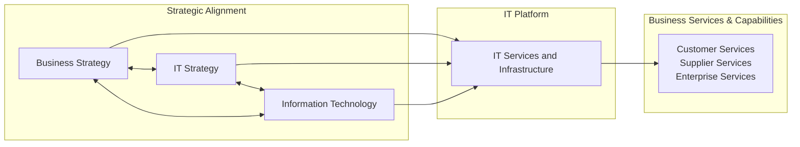
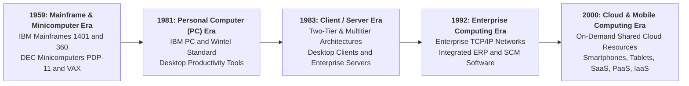
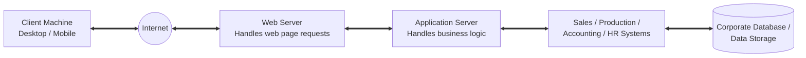
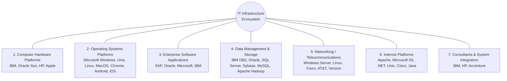
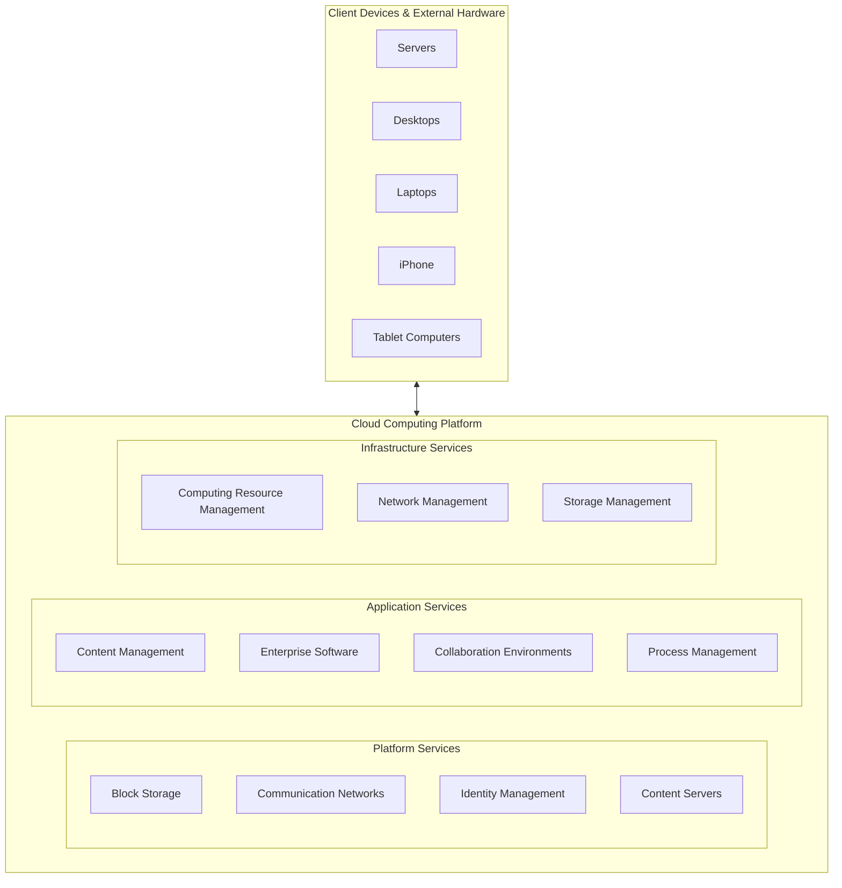
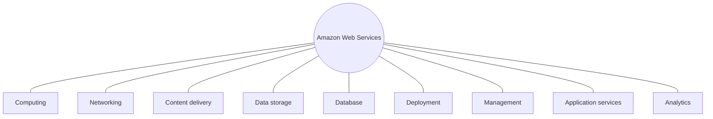
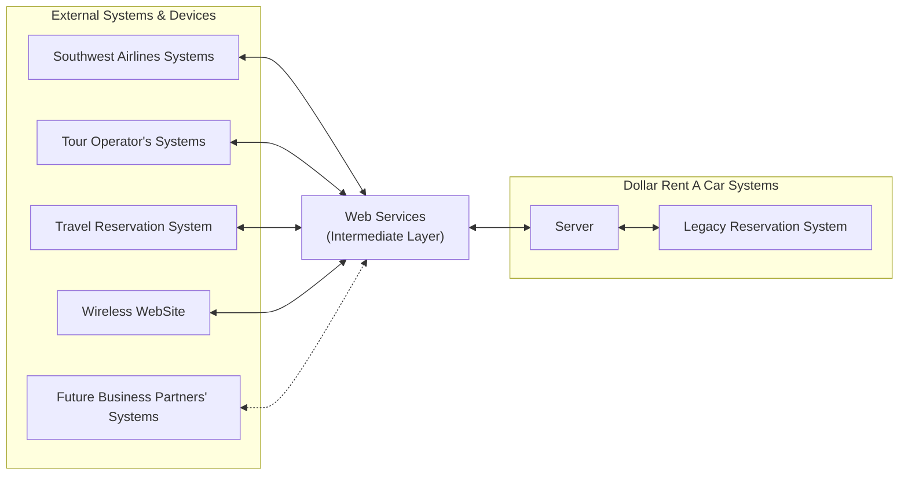
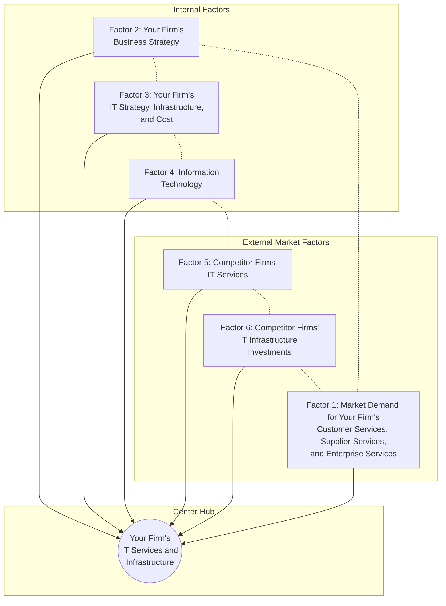
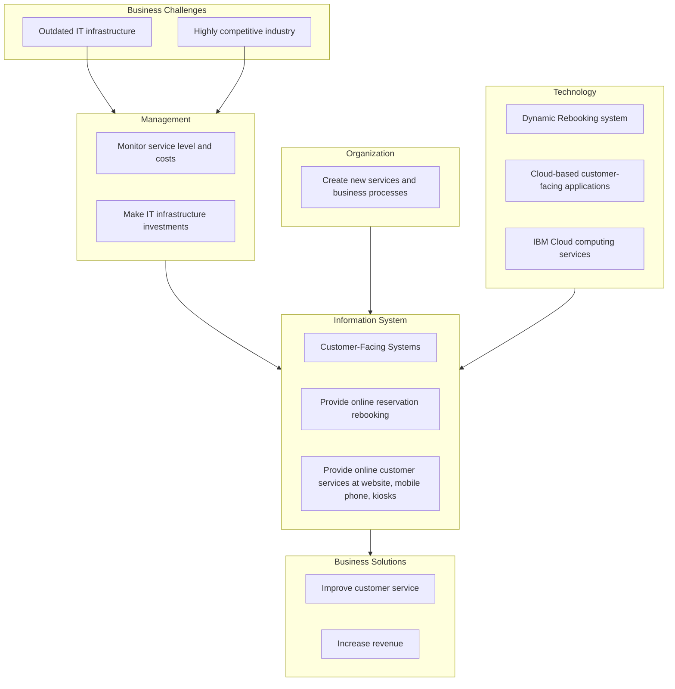

# Chapter 5: IT Infrastructure and Emerging Technologies

---

## Learning Objectives

- **Learning Objective 5-1:** What is IT infrastructure, and what are the stages and drivers of IT infrastructure evolution?
- **Learning Objective 5-2:** What are the components of IT infrastructure?
- **Learning Objective 5-3:** What are the current trends in computer hardware platforms?
- **Learning Objective 5-4:** What are the current computer software platforms and trends?
- **Learning Objective 5-5:** What are the challenges of managing IT infrastructure and management solutions?
- **Learning Objective 5-6:** How will MIS help my career?

---

## Section 5-1: What Is IT Infrastructure and What Are the Stages and Drivers of IT Infrastructure Evolution?

### Definition of IT Infrastructure & Service Platform Perspective
**Information technology (IT) infrastructure** is defined as the shared technology resources that provide the foundation and platform for a firm's specific information system applications. IT infrastructure includes investment in **hardware**, **software**, and **services**—such as consulting, education, and training—that are shared across the entire enterprise or across business units within the firm.

From a business perspective, IT infrastructure should not be viewed merely as a collection of physical devices and software code. Instead, management must view IT infrastructure as a **service platform** composed of both technical capabilities and human expertise. This platform encompasses nine core firmwide infrastructure services:
1. **Computing platforms:** Used to provide computing services that connect employees, customers, and suppliers into a coherent digital environment, including large mainframes, midrange computers, desktop and laptop computers, mobile handheld devices, and remote cloud computing services.
2. **Telecommunications services:** Providing data, voice, and video connectivity to employees, customers, and suppliers.
3. **Data management services:** Storing, managing, and analyzing corporate data across the enterprise.
4. **Application software services:** Delivering enterprise-wide applications such as enterprise resource planning (ERP), customer relationship management (CRM), supply chain management (SCM), and knowledge management systems (KMS) shared across business units.
5. **Physical facilities management services:** Developing, maintaining, and managing physical installations required for computing, telecommunications, and data storage.
6. **IT management services:** Planning and developing infrastructure, coordinating with business units, accounting for IT expenditures, and managing IT projects.
7. **IT standards services:** Establishing corporate policies that determine which information technologies are utilized, when, and how.
8. **IT education services:** Providing systems training to end users and training managers on how to plan for and evaluate IT investments.
9. **IT research and development services:** Investigating potential future IT projects, emerging technologies, and strategic investments to differentiate the firm in the market.

This "service platform" perspective makes the business value of infrastructure investments clear: hardware and software alone do not generate business value until they enable services that allow high-value employees to collaborate, process transactions, and serve customers efficiently.

#### Figure 5.1: Connection Between the Firm, IT Infrastructure, and Business Capabilities

##### Explanatory Breakdown of Figure 5.1: Strategic Alignment & Infrastructure Platform
1. **Strategic Alignment Loop:** Demonstrates the bidirectional relationship between **Business Strategy**, **IT Strategy**, and **Information Technology**. A firm's business strategy (e.g., expanding e-commerce) directly drives its IT strategy, which dictates IT hardware and software requirements. Conversely, emerging IT capabilities (e.g., AI microservices) enable new business strategies.
2. **IT Services & Infrastructure Platform:** Hardware, software, and human expertise are synthesized into an enterprise-wide **service platform**. This platform translates abstract strategic goals into operational computing environments.
3. **Business Services & Capabilities Output:** The service platform powers specific operational services, including **Customer Services** (web portals, mobile apps), **Supplier Services** (automated procurement APIs), and **Enterprise Services** (ERP and financial reporting).

---

### Stages of IT Infrastructure Evolution (5 Eras)
The IT infrastructure in modern organizations is the result of over 50 years of evolution across five distinct eras:

1. **General-Purpose Mainframe and Minicomputer Era (1959 to Present):**
   - Commercial mainframe computing began with the introduction of transistorized machines (IBM 1401 and 7090) in 1959 and matured with the **IBM 360 series** in 1965. The IBM 360 was the first commercial computer supporting time-sharing, multitasking, and virtual memory.
   - Characterized by highly centralized computing controlled by professional programmers and system operators in corporate data centers.
   - In 1965, Digital Equipment Corporation (DEC) introduced **minicomputers** (PDP-11 and VAX series), offering decentralized, departmental computing at far lower costs than mainframes. Mainframes today persist as giant enterprise servers for high-volume transaction processing in banking and telecommunications.

2. **Personal Computer (PC) Era (1981 to Present):**
   - Although early PCs emerged in the 1970s (Xerox Alto, Altair 8800, Apple I/II), the PC era officially began with the introduction of the **IBM PC** in 1981.
   - The combination of the Microsoft DOS/Windows operating system and Intel microprocessors established the **Wintel PC** standard for desktop business computing.
   - Spurred an explosion of desktop productivity tools (word processors, spreadsheets, presentation graphics, personal databases).

3. **Client/Server Era (1983 to Present):**
   - In **client/server computing**, computer processing is split between user points of entry (**clients** such as desktops, laptops, or mobile devices) and powerful **server** computers that manage shared data, host applications, and manage network traffic.
   - Simple setups use **two-tiered client/server architecture**, while enterprise environments rely on **multitiered (N-tier) client/server architectures** where workloads are distributed across specialized servers (Web servers, Application servers, Database servers).

4. **Enterprise Computing Era (1992 to Present):**
   - Driven by the adoption of **Transmission Control Protocol/Internet Protocol (TCP/IP)** networking standards and enterprise application software packages (ERP, SCM, CRM).
   - Links disparate networks, mainframes, servers, PCs, and mobile devices into a single, firmwide infrastructure where data flows seamlessly across departments and business partners.

5. **Cloud and Mobile Computing Era (2000 to Present):**
   - Driven by high-speed broadband and mobile connectivity, moving computing power and data storage from local devices and on-premise servers into remote, shared pools of virtualized resources.
   - Enables on-demand access to enterprise applications and infrastructure from smartphones, tablets, laptops, and thin clients anywhere in the world.

#### Figure 5.2: Eras in IT Infrastructure Evolution

##### Explanatory Breakdown of Figure 5.2: Eras in IT Infrastructure Evolution
1. **Mainframe & Minicomputer Era (1959–Present):** Shifted computing from manual processing to centralized IBM mainframes (1401, 360) controlled by specialized operators, followed by DEC minicomputers introducing decentralized departmental computing.
2. **Personal Computer (PC) Era (1981–Present):** Initiated by the Wintel (Windows OS + Intel CPU) IBM PC standard, shifting processing power directly to the employee's desktop and spawning personal productivity tools.
3. **Client/Server Era (1983–Present):** Split processing between desktop user interfaces (**clients**) and centralized **servers** hosting shared databases and network controls across 2-tier and multitier architectures.
4. **Enterprise Computing Era (1992–Present):** Adopted enterprise TCP/IP networking standards and integrated ERP/SCM applications to link isolated departmental systems into a unified corporate infrastructure.
5. **Cloud & Mobile Computing Era (2000–Present):** Transitioned computing power off local hardware into virtualized, on-demand cloud resource pools (AWS, Azure, GCP) accessible globally via mobile devices.

#### Figure 5.3: A Multitiered (N-Tier) Client/Server Network

##### Explanatory Breakdown of Figure 5.3: Multitiered (N-Tier) Client/Server Network Architecture
1. **Client Tier:** Desk-bound PCs, laptops, and mobile devices interface with users, capturing inputs and rendering user interface screens.
2. **Network / Internet Tier:** Secure TCP/IP networks and public Internet protocols connect client requests to enterprise data centers.
3. **Web Server Tier:** **Web Servers** accept incoming HTTP/HTTPS requests, serving static HTML pages and passing transaction requests down the stack.
4. **Application Server Tier:** **Application Servers** run the core business logic (e.g., calculating pricing, executing workflow rules, processing transactions) for Sales, Production, Accounting, and HR systems.
5. **Database Tier:** Centralized **Database Management Systems (DBMS)** host structured transactional data, providing ACID-compliant data storage and retrieval.

---

### Technology Drivers of Infrastructure Evolution
Five key technological drivers have exponentially increased computing power while exponentially reducing costs:

1. **Moore's Law and Microprocessing Power:**
   - Formulated by Gordon Moore in 1965, stating that the number of components (transistors) on a microchip doubles every year (later adjusted to every 2 years / 18–24 months).
   - Three common interpretations: (a) microprocessor power doubles every 18 months, (b) computing power doubles every 18 months, and (c) the cost of computing falls by half every 18 months.
   - Processing power has reached over 250,000 MIPS with 5+ billion transistors per chip. As transistor components shrink to 14 nanometers and approach atomic limits, manufacturers are exploring **nanotechnology** (using individual atoms/molecules and carbon nanotubes) to build smaller, faster chips.

2. **The Law of Mass Digital Storage:**
   - The total amount of digital information generated doubles roughly every year, while the cost of magnetic digital storage falls exponentially (doubling storage capacity per dollar every 15 months).
   - Retail storage costs have dropped from thousands of dollars per gigabyte to under $0.02 per gigabyte.

3. **Metcalfe's Law and Network Economics:**
   - Formulated by Robert Metcalfe, stating that the value or power of a network grows exponentially as a function of the square of the number of network members ($V \propto N^2$).
   - Returns to scale increase as more participants join digital networks, driving exponential demand for network-connected infrastructure.

4. **Declining Communications Costs and the Internet:**
   - Communication costs over Internet and telecommunications networks have plummeted toward zero. For example, Internet access costs dropped from $9.01 per Mbps in 2008 to $0.76 per Mbps in 2018.
   - Fueled global expansion to over 4.5 billion Internet users worldwide, driving demand for cloud, mobile, and web infrastructure.

5. **Standards and Network Effects:**
   - **Technology standards** are specifications that establish product compatibility and network communication capability.
   - Universal standards create powerful economies of scale, driving down prices and unleashing network effects.

#### Table 5.1: Important Standards in Computing
| Standard | Year | Significance |
| --- | --- | --- |
| **ASCII** (American Standard Code for Information Interchange) | 1958 | Standardized character encoding allowing heterogeneous computers to exchange text data. Adopted by ANSI in 1963. |
| **COBOL** (Common Business Oriented Language) | 1959 | High-level programming language sponsored by the U.S. DoD that expanded business software development capability. |
| **Unix** | 1969–1975 | Multiuser, multitasking, portable operating system created at Bell Labs; standard enterprise server OS across major hardware vendors. |
| **Ethernet** | 1973 | Local area network (LAN) standard enabling high-speed local data communications between desktop PCs and servers. |
| **TCP/IP** (Transmission Control Protocol/Internet Protocol) | 1974 | Standard networking protocol suite and IP addressing scheme enabling global internetworking across heterogeneous networks. |
| **Wintel PC** | 1981 | Standard architecture integrating Microsoft operating systems with Intel microprocessors. |
| **World Wide Web** | 1989–1993 | Open protocols (HTTP, HTML, URL) for storing, retrieving, and displaying hypermedia pages across the global Internet. |

---

## Section 5-2: What Are the Components of IT Infrastructure?

Modern IT infrastructure consists of **seven major interconnected components** that must be carefully coordinated:

#### Figure 5.8: The IT Infrastructure Ecosystem

##### Explanatory Breakdown of Figure 5.8: The 7 Components of the IT Infrastructure Ecosystem
1. **Computer Hardware Platforms (Component 1):** Client devices (PCs, ARM smartphones) and server hardware (IBM mainframes, Dell/HP blade servers) providing physical processing power.
2. **Operating System Platforms (Component 2):** Core system software (Windows Server, Linux, Unix, iOS, Android) managing physical hardware resources.
3. **Enterprise Software Applications (Component 3):** Large-scale business suites (SAP, Oracle) driving ERP, SCM, and CRM execution.
4. **Data Management & Storage (Component 4):** Database engines (Oracle, DB2, SQL Server, MySQL) and physical Storage Area Networks (SANs).
5. **Networking/Telecommunications (Component 5):** Telecommunication providers (AT&T, Verizon) and networking hardware (Cisco, Juniper) maintaining WAN/LAN connectivity.
6. **Internet Platforms (Component 6):** Web hosting, web server software (Apache, IIS), and web development platforms (.NET, Java).
7. **Consultants & System Integrators (Component 7):** External advisory firms (IBM, Accenture, Infosys) helping migrate legacy systems to modern architectures.

### Detailed Component Analysis
1. **Computer Hardware Platforms:**
   - Includes client machines (desktop PCs, laptops, mobile devices like smartphones and tablets) and server platforms (blade servers, rack servers, mainframes, supercomputers).
   - Dominant desktop microprocessors are x86 architecture (Intel, AMD). Mobile devices utilize low-power ARM architecture processors (Apple, Qualcomm, Samsung). Mainframes (dominated by IBM) persist for high-volume enterprise transactions and large-scale server virtualization.

2. **Operating System Platforms:**
   - Manage system hardware resources and application processes.
   - Enterprise servers rely on **Microsoft Windows Server**, **Unix** (IBM AIX, HP-UX, Oracle Solaris), and **Linux** (open-source Unix relative).
   - Desktop clients primarily run Microsoft Windows (over 80%) or macOS. Mobile client platforms are dominated by Google **Android** and Apple **iOS**. Google **Chrome OS** provides a lightweight cloud-centric client OS.

3. **Enterprise Software Applications:**
   - Includes enterprise systems (ERP), customer relationship management (CRM), supply chain management (SCM), and warehouse management software.
   - Market leaders are **SAP** and **Oracle**. Middleware providers like IBM and Oracle offer integration software to bridge legacy systems and modern applications.

4. **Data Management and Storage:**
   - Database management software (DBMS) organizes and indexes enterprise structured data. Leading commercial vendors: **Oracle Database**, **IBM DB2**, **Microsoft SQL Server**, and **SAP Sybase**.
   - Open-source database software includes **MySQL** (owned by Oracle). Big data unstructured data management relies on open-source frameworks like **Apache Hadoop**. Physical storage options include Storage Area Networks (SANs) and software-defined storage (SDS).

5. **Networking/Telecommunications Platforms:**
   - Local Area Network (LAN) and Wide Area Network (WAN) infrastructure.
   - Operating systems: Windows Server, Linux, Unix. Networking hardware dominated by **Cisco Systems** and **Juniper Networks**. Telecommunications carriers providing voice/data connectivity include **AT&T** and **Verizon**.

6. **Internet Platforms:**
   - Hardware, software, and hosting infrastructure supporting corporate websites and intranet/extranet portals.
   - Includes **web hosting services**, web server hardware (Dell, HP, IBM), and web server software (**Apache HTTP Server**, **Microsoft IIS**). Development environments include **Microsoft .NET**, **Java**, and Adobe tools.

7. **Consulting and System Integration Services:**
   - External service providers assisting with infrastructure migration, system implementation, process redesign, and software integration.
   - Leading integrators: **Accenture**, **IBM Global Services**, **HP**, **Infosys**, and **Wipro**. Crucial for integrating modern platforms with **legacy systems** (older mainframe transaction processing systems).

---

## Section 5-3: What Are the Current Trends in Computer Hardware Platforms?

### 8 Key Hardware Platform Trends

1. **The Mobile Digital Platform:**
   - Shift from desktop PCs to mobile handheld devices (smartphones, tablets, e-readers).
   - Addition of **wearable computing devices** (smartwatches, smart glasses, smart ID badges, activity trackers) for real-time field operations, warehouse logisitics, and hands-free data collection.

2. **Consumerization of IT and BYOD (Bring Your Own Device):**
   - **Consumerization of IT:** Trend where consumer-market technology innovations (smartphones, cloud apps like Dropbox, Gmail, social media) spill over into business enterprises.
   - **BYOD:** Practice permitting employees to use personal mobile devices to access corporate networks. Offers flexibility and productivity gains, but introduces severe security, data governance, and device management complexities.

3. **Quantum Computing:**
   - Uses principles of quantum mechanics (superposition and entanglement) to process data as **qubits** (which exist simultaneously as 0, 1, or both).
   - Delivers exponential processing power capable of solving complex cryptographic, optimization, and scientific problems millions of times faster than classical supercomputers. IBM Cloud, Google, Microsoft, and NASA actively offer quantum platforms.

4. **Virtualization & Software-Defined Storage (SDS):**
   - **Virtualization:** Abstraction technique enabling a single physical machine to run multiple virtual machines (VMs) with independent operating systems, boosting server utilization rates from 15–20% up to 70%+ while reducing power, cooling, and hardware footprint. VMware is the market leader.
   - **Software-Defined Storage (SDS):** Separates storage management software from underlying physical hardware, enabling dynamic pooling and allocation of heterogeneous storage assets.

5. **Cloud Computing:**
   - Model delivering on-demand access to shared pools of configurable virtualized computing resources over the network.
   - Defined by NIST through **5 essential characteristics**:
     - *On-demand self-service*
     - *Ubiquitous network access*
     - *Location-independent resource pooling*
     - *Rapid elasticity*
     - *Measured service*
   - Categorized into **3 cloud service models**:
     - **Infrastructure as a Service (IaaS):** On-demand compute, storage, and networking (e.g., AWS EC2/S3).
     - **Platform as a Service (PaaS):** Development frameworks, deployment environments, and database tools (e.g., AWS Elastic Beanstalk, Microsoft Azure PaaS, Salesforce Platform).
     - **Software as a Service (SaaS):** Complete applications delivered over the web on subscription basis (e.g., Google G Suite, Salesforce CRM, Microsoft 365).

#### Figure 5.9: Cloud Computing Platform

##### Explanatory Breakdown of Figure 5.9: Cloud Computing Platform Architecture
1. **Ubiquitous Client Access:** External client devices (servers, desktops, laptops, smartphones, tablets) connect securely over the Internet to access cloud resources.
2. **Platform Services Layer:** Manages core cloud infrastructure functions, including block storage allocation, virtual network communications, identity management (IAM), and content delivery.
3. **Application Services Layer (SaaS):** Hosts shared software environments, including web content management, enterprise software suites, collaboration spaces, and business process automation tools.
4. **Infrastructure Services Layer (IaaS/PaaS):** Controls raw underlying compute resource management (virtual CPU allocation), network routing, and virtual storage pooling.

#### Figure 5.10: Amazon Web Services (AWS) Ecosystem

##### Explanatory Breakdown of Figure 5.10: Amazon Web Services (AWS) Infrastructure Stack
1. **Core Compute & Networking:** AWS EC2 provides elastic virtual servers, while VPC manages isolated virtual cloud networks.
2. **Storage & Content Delivery:** AWS S3 provides high-durability object storage, while CloudFront accelerates global content delivery.
3. **Database & Analytics:** AWS RDS/DynamoDB host relational and NoSQL databases, while Redshift and EMR support big data analytics.
4. **Deployment & Application Management:** AWS Elastic Beanstalk, CloudFormation, and IAM automate software deployment, scaling, and security controls.

#### Table 5.2: Cloud Computing Models Compared
| Type of Cloud | Description | Managed By | Primary Business Uses |
| --- | --- | --- | --- |
| **Public Cloud** | Shared infrastructure available to the public or industry groups over the Internet on a utility/subscription basis. | Third-party providers (AWS, Azure, Google Cloud). | Web applications, peak capacity offloading, non-sensitive workloads, startups seeking low CapEx. |
| **Private Cloud** | Cloud infrastructure operated exclusively for a single organization, hosted internally or externally. | In-house IT department or dedicated third-party host. | Core enterprise workloads with stringent security, regulatory, or data sovereignty requirements. |
| **Hybrid Cloud** | Integrated environment combining public cloud services with private clouds and on-premise legacy systems. | Hybrid coordination between internal IT and cloud vendors. | Balancing security for sensitive data with cloud scalability for web applications and temporary workloads. |

6. **Edge Computing:**
   - Optimization technique processing data on localized servers situated at the edge of the network, close to data sensors/IoT devices, before sending aggregated data to central clouds.
   - Dramatically reduces latency and network bandwidth consumption; critical for IoT, autonomous vehicles, manufacturing sensors, and financial trading platforms.

7. **Green Computing (Green IT):**
   - Practices and technologies for designing, manufacturing, operating, and disposing of computer hardware to minimize environmental impact and energy consumption.
   - Focuses on energy-efficient data center cooling, server virtualization, and renewable energy adoption (solar, wind, hydro).

8. **High-Performance and Power-Saving Processors:**
   - Adoption of **multicore processors** (dual-, quad-, 8-, 16-, 32-core chips) combining multiple CPU execution engines on a single integrated circuit to boost processing speed while reducing thermal output and energy consumption.
   - Ultra-low-power microprocessors (Apple A-series/M-series, Intel Atom) designed for mobile devices, IoT, and embedded systems.

---

## Section 5-4: What Are the Current Computer Software Platforms and Trends?

### 4 Major Software Platform Trends

1. **Linux and Open Source Software:**
   - **Open source software** is developed by global communities of programmers who make the source code freely available for modification and distribution.
   - **Linux** is the most widely adopted open-source Unix derivative. It dominates enterprise servers, web servers, mainframes, supercomputers, and mobile devices (Android core). Leading commercial distributions (Red Hat, SUSE) provide enterprise support. Major open-source tools include **Apache HTTP Server**, **Mozilla Firefox**, and **MySQL**.

2. **Software for the Web: Java, HTML, and HTML5:**
   - **Java:** Object-oriented, operating-system-independent programming language created by Sun Microsystems. Runs inside a **Java Virtual Machine (JVM)**, allowing developers to "Write Once, Run Anywhere" (WORA) across servers, desktops, mobile phones, and embedded devices.
   - **HTML & HTML5:** Hypertext Markup Language defines content formatting on web pages. **HTML5** natively supports rich multimedia (audio, video, interactive graphics) directly within web browsers without requiring processor-intensive third-party plug-ins (Flash, Silverlight). Other web development tools include **Ruby** and **Python**.

3. **Web Services and Service-Oriented Architecture (SOA):**
   - **Web services:** Universal software components that exchange data over networks using standard web communication protocols regardless of underlying operating systems or programming languages.
   - **XML (Extensible Markup Language):** The foundation technology for web services. Unlike HTML (which specifies formatting), XML tags convey data meaning and semantic structure (e.g., `<PRICE CURRENCY="USD">$16,800</PRICE>`), enabling automated machine processing.
   - **Service-Oriented Architecture (SOA):** Software design approach constructing enterprise applications from reusable, self-contained web services that communicate using standard protocols.

#### Table 5.3: Examples of XML
| Plain English Statement | XML Format Tagging |
| --- | --- |
| Subcompact | `<AUTOMOBILE TYPE="Subcompact">` |
| 4 passenger | `<PASSENGER UNIT="PASS">4</PASSENGER>` |
| $16,800 | `<PRICE CURRENCY="USD">$16,800</PRICE>` |

#### Figure 5.11: How Dollar Rent a Car Uses Web Services

##### Explanatory Breakdown of Figure 5.11: Service-Oriented Architecture (SOA) in Dollar Rent A Car
1. **Heterogeneous External Partners:** External systems (Southwest Airlines, tour operators, travel reservation systems, wireless mobile sites) operate on different computing platforms and OSs.
2. **Intermediate Web Services Layer:** Acts as a universal translation layer using standard XML and SOAP/REST protocols to standardize incoming reservation queries.
3. **Decoupled Backend Connection:** Web services pass standardized requests to Dollar's internal servers, which interact directly with Dollar's legacy mainframe reservation system without modifying legacy code.

4. **Software Outsourcing and Cloud Services:**
   - **Software Packages:** Prewritten commercial software suites (e.g., SAP ERP, Oracle Financials) eliminating custom code development.
   - **Software Outsourcing:** Contracting custom application development or legacy maintenance to external vendor firms (domestic or offshore).
   - **Cloud Services (SaaS):** Subscribing to web-hosted applications on pay-per-use or annual subscription terms. Managed via formal **Service Level Agreements (SLAs)** specifying service uptime, performance metrics, disaster recovery, and security parameters.
   - **Mashups & Apps:** **Mashups** combine two or more existing web applications into a new composite application (e.g., ZipRealty merging real estate databases with Google Maps). **Apps** are lightweight mobile/web software modules designed for mobile platforms, creating user lock-in and serving as key business portals.

---

## Section 5-5: What Are the Challenges of Managing IT Infrastructure and Management Solutions?

### Key Infrastructure Management Challenges & Solutions

1. **Platform and Infrastructure Change & Scalability:**
   - IT demand fluctuates as firms expand, contract, merge, or launch new products. Fixed infrastructure investments risk becoming underutilized or overloaded.
   - **Scalability:** The capability of an IT system or platform to expand capacity seamlessly to serve increasing numbers of users without crashing. Cloud computing provides elastic scalability.
   - **Mobile Device Management (MDM):** Software suites monitoring, managing, and securing mobile devices across multiple mobile carriers and operating systems in BYOD environments.

2. **Management and Governance:**
   - **IT Governance:** Allocating decision-making authority and control over IT infrastructure between centralized IT departments and decentralized business units. Requires clear policies for infrastructure cost-allocation and service chargebacks.

3. **Making Wise Infrastructure Investments & Rent-Versus-Buy:**
   - Evaluating whether to purchase physical hardware and on-premise software licenses (Buy) versus renting cloud services and SaaS subscriptions (Rent).

4. **Total Cost of Ownership (TCO) Analysis:**
   - Original hardware/software purchase costs account for only ~20% of TCO; administration, maintenance, training, downtime, and utilities constitute ~80%.

#### Table 5.4: Total Cost of Ownership (TCO) Cost Components
| Infrastructure Component | Cost Components Included |
| --- | --- |
| **Hardware acquisition** | Purchase price of server hardware, desktops, laptops, storage arrays, and network devices. |
| **Software acquisition** | Licensing fees or purchase costs per user/core for OS and application software. |
| **Installation** | Direct labor and technical cost to install hardware and software. |
| **Training** | End-user training and specialized technical training for IT staff. |
| **Support** | Help desk operations, technical documentation, and ongoing end-user assistance. |
| **Maintenance** | Hardware repair contracts, software patch management, and system upgrades. |
| **Infrastructure** | Network cabling, backup power systems, switches, and specialized physical facilities. |
| **Downtime** | Financial loss from lost business transactions and staff productivity during system outages. |
| **Space and energy** | Data center real estate costs, cooling, and electricity consumption. |

5. **Competitive Forces Model for IT Infrastructure Investment:**
   - Managers use a 6-factor decision model to determine optimal infrastructure spending levels:

#### Figure 5.13: Competitive Forces Model for IT Infrastructure

##### Explanatory Breakdown of Figure 5.13: 6-Factor Competitive Forces Model for IT Infrastructure
1. **Factor 1 (Market Demand):** Evaluates customer and supplier demand for digital services (e.g., mobile tracking, self-service portals).
2. **Factor 2 (Firm Business Strategy):** Aligns IT investments with 5-year corporate goals (e.g., low-cost leader vs. product differentiator).
3. **Factor 3 (Firm IT Strategy & Cost):** Assesses current IT performance, 5-year technology plans, and total cost of ownership limits.
4. **Factor 4 (Information Technology):** Evaluates emerging technology trends (e.g., cloud, AI, edge computing) against current capabilities.
5. **Factor 5 (Competitor IT Services):** Benchmarks digital services offered by direct competitors.
6. **Factor 6 (Competitor IT Infrastructure Investments):** Analyzes infrastructure spending of market peers to prevent falling behind or over-investing.

---

## Case Study Questions & Answers

### 1. Case Study: American Airlines Heads for the Cloud

#### Case Context
American Airlines Group Inc. is the world’s largest airline (128,000+ employees, 200 million annual passengers, 6,700 daily flights to 350 destinations). In the competitive airline industry, customer experience and digital self-service are critical differentiators. However, American's legacy IT infrastructure—built around self-managed data centers, mainframe computers, and siloed customer applications—hampered operational responsiveness. When flights were disrupted by weather, passengers could not self-rebook custom flight paths online, forcing long queues at airport kiosks and phone desks.

To overcome infrastructure rigidity, American partnered with IBM to migrate customer-facing digital applications (`aa.com`, mobile apps, self-service kiosks) to the **IBM Cloud**. American developed a breakthrough **Dynamic Rebooking app** in just 4.5 months (less than half the traditional timeline) using IBM Cloud developer tools. The cloud migration eliminated high capital expenditures for physical server refreshes, improved system reliability, and transferred routine infrastructure maintenance to IBM.

##### Explanatory Breakdown of the American Airlines Enterprise Cloud Migration Architecture
1. **Business Challenges & Driver Inputs:** Outdated, rigid legacy IT data centers and high industry competition forced American to modernize customer service touchpoints.
2. **Management & Organization Strategy:** Management prioritized cost optimization and service level responsiveness, while the organization redesigned rebooking workflows.
3. **Technology Implementation:** IBM Cloud infrastructure and cloud-native microservices were deployed alongside the new Dynamic Rebooking application.
4. **Information System Output:** Delivered unified online reservation self-service across aa.com, iOS/Android mobile apps, and airport kiosks.
5. **Business Solution Result:** Elevated passenger satisfaction during weather disruptions, reduced operational costs, and accelerated digital product development cycles.

#### Case Questions & Answers
**Question 1: How did using cloud computing help American Airlines become more competitive?**
- *Answer:* Cloud computing provided American Airlines with rapid application development capabilities and infrastructure agility. By leveraging IBM Cloud, American created the Dynamic Rebooking app in 4.5 months instead of 9+ months. It enabled real-time passenger self-service across web, mobile, and kiosk channels during severe weather events, elevating customer satisfaction and loyalty over competitors whose passengers remained stuck in manual queues. Furthermore, offloading routine hardware management allowed internal IT personnel to concentrate on innovative customer services rather than server maintenance.

**Question 2: What were the business benefits for American Airlines of using a cloud computing infrastructure?**
- *Answer:*
  1. *CapEx Reduction:* Replaced expensive up-front hardware capital expenditures with a predictable, scalable operational expense model (pay-as-you-go).
  2. *Enhanced Uptime and Response Times:* Improved application speed, server reliability, and database responsiveness for millions of customer transactions.
  3. *Operational Agility:* Rapidly developed, deployed, and scaled customer-facing apps across `aa.com`, mobile, and airport kiosks.
  4. *Outsourced Maintenance:* Offloaded 24/7 infrastructure monitoring, patching, and hardware management to IBM, redirecting internal resources toward digital business strategy.
  5. *Hybrid Infrastructure:* Successfully combined cloud agility for customer-facing applications with on-premise stability for core enterprise data.

---

### 2. Interactive Session - Management: What Should Firms Do About BYOD?

#### Case Context
BYOD (Bring Your Own Device) adoption in North American companies has surpassed 50%. Allowing employees to use personal mobile devices saves an average of 58 minutes per day and boosts productivity by 34%. However, unmanaged BYOD introduces severe data security risks, malware vulnerabilities, loss of corporate control, and employee distraction.

**Brother Industries** initially imposed severe restrictions on personal devices (allowing only company-issued iPhones/iPads without App Store access), causing user frustration over unreadable email attachments. Brother alleviated these issues by adopting **MobileIron** for mobile device management (MDM) across its Japanese/U.S. headquarters and Asian manufacturing plants. **Arup Group Limited**, a global engineering firm with 14,000 employees across 34 countries, embraced a flexible BYOD program managed via MobileIron across iOS (65%), Android (30%), and Windows (5%) devices, utilizing regional self-service portals and approved device lists.

#### Case Questions & Answers
**Question 1: What are the advantages and disadvantages of allowing employees to use their personal mobile devices for work?**
- *Answer:*
  - *Advantages:* High employee satisfaction, increased flexibility, time savings (~58 min/day), 34% productivity gains, immediate access to workplace applications in field settings, and reduced corporate hardware acquisition spending.
  - *Disadvantages:* Severe data security risks, risk of corporate data exposure on lost/stolen devices, inability to enforce security patches, high IT support overhead from device heterogeneity, employee workplace distractions, and potential regulatory non-compliance.

**Question 2: What management, organization, and technology factors should be addressed when deciding whether to allow employees to use their personal mobile devices for work?**
- *Answer:*
  - *Management Factors:* Formulate comprehensive BYOD policies defining acceptable workplace device usage, security requirements, remote wipe permissions, and expense reimbursement guidelines.
  - *Organization Factors:* Conduct employee training on mobile security awareness, manage cultural shifts toward mobile work, and establish regional policy variations (e.g., self-service enrollment vs. corporate-approved lists as done by Arup).
  - *Technology Factors:* Deploy robust Mobile Device Management (MDM) software (e.g., MobileIron), mandate hardware containerization/encryption, establish secure VPN access, and enable remote data wipe capabilities.

**Question 3: Compare and evaluate how the companies described in this case study dealt with the challenges of BYOD.**
- *Answer:* Brother Industries initially pursued an overly restrictive top-down strategy that severely hampered user productivity before transitioning to MobileIron MDM to containerize and secure files. Arup Group adopted an inclusive, employee-centric BYOD model tailored by geographic region, offering self-service portals in the Americas/Europe while maintaining curated device lists in Asia. Both successfully resolved BYOD complexity by deploying centralized MDM software.

**Question 4: Allowing employees to use their own smartphones for work will save a company money. Do you agree? Why or why not?**
- *Answer:* Disagree that savings are guaranteed. While hardware purchase costs (CapEx) decrease, total cost of ownership (TCO) often increases due to elevated support, network security configuration, MDM software licensing, wireless stipend administrative management, and potential financial losses from data breaches or stolen proprietary files.

---

### 3. Interactive Session - Organizations: Look to the Cloud (Cloud Battles)

#### Case Context
Cloud computing spending represents the fastest-growing segment of IT infrastructure. Startups (like **99designs**) rely on **Amazon Web Services (AWS)** to handle massive growth (100+ terabytes of graphic design data) without up-front hardware capital. **Netflix** completed a decade-long data center migration, moving 100% of its streaming platform to AWS.

Conversely, companies face challenges including **runaway costs** (overspending by up to 42% due to over-provisioned cloud capacity), severe cloud service outages (Azure 2018 weather outage, Google Cloud 2019 network congestion, AWS data center outages), and complex migration efforts. **Dropbox** successfully repatriated most of its storage infrastructure off AWS into custom colocation facilities, saving $75 million over 3 years while retaining AWS for 10% of international data footprint. Most enterprise organizations settle on a **hybrid cloud** strategy.

#### Case Questions & Answers
**Question 1: What business benefits do cloud computing services provide? What problems do they solve?**
- *Answer:* Cloud services eliminate up-front hardware CapEx, provide elastic computational scaling, allow rapid application prototyping, convert fixed costs to variable utility costs, and offload physical facility management. They solve capacity planning bottlenecks, hardware obsolescence, and geographic deployment latency.

**Question 2: What are the disadvantages of cloud computing?**
- *Answer:* Disadvantages include vendor lock-in, unexpected financial overspending ("runaway costs"), risk of public cloud outages, potential data privacy/security vulnerabilities, loss of direct control over infrastructure, and high network egress fees when moving data.

**Question 3: What kinds of businesses are most likely to benefit from using cloud computing? Why?**
- *Answer:*
  1. *Startups and Small Businesses:* Gain enterprise-grade infrastructure without capital investments.
  2. *Firms with Highly Variable Demand:* (e.g., e-commerce, seasonal retail, media streaming like Netflix) scale capacity up or down dynamically.
  3. *Global Enterprises:* Deploy worldwide web platforms rapidly using global cloud data center availability zones.

---

### 4. Case Study: Dollar Rent A Car (Web Services & SOA)

#### Case Context
Dollar Rent A Car needed to integrate its rental booking engine with **Southwest Airlines'** website (**Southwest.com**) so passengers could reserve cars during flight checkout. Rather than building expensive custom point-to-point software links, Dollar implemented **Microsoft .NET web services** as an intermediary layer. Standard XML messages translate booking requests between Southwest's servers and Dollar's legacy mainframe reservation system seamlessly. Dollar subsequently extended this web services layer to connect with tour operators, travel reservation systems, wireless mobile sites, and future partners without custom programming.

#### Case Questions & Answers
**Question 1: What are the strategic benefits of using web services and Service-Oriented Architecture (SOA) over traditional custom system links?**
- *Answer:* Web services utilize universal open standards (XML, HTTP, SOAP) that enable disparate systems to exchange data without custom point-to-point coding. This reduces integration software costs, eliminates vendor lock-in, enables reusability of software components across multiple partner integrations, and grants extreme agility when adding new business channels.

---

## Glossary of Key Terms

- **Android:** An open-source operating system for mobile devices developed by Google and the Open Handset Alliance, dominating the global smartphone market.
- **Application Server:** Software program that handles all application operations and business logic between user interfaces and an organization's back-end enterprise systems.
- **Apps:** Small, specialized software applications delivered over the Internet designed to run on mobile devices, desktop computers, or web browsers.
- **BYOD (Bring Your Own Device):** Corporate practice permitting employees to use personal mobile devices to access workplace applications and networks.
- **Chrome OS:** A lightweight, cloud-centric operating system developed by Google that runs web-based applications inside the Chrome browser.
- **Client/Server Computing:** A distributed computing model splitting processing tasks between desktop/mobile "clients" and powerful "server" computers on a network.
- **Clients:** User points of entry in client/server architectures, including desktop PCs, laptops, smartphones, and tablets.
- **Cloud Computing:** A model of computing providing on-demand network access to a shared pool of configurable virtualized computing resources (servers, storage, apps, services).
- **Consumerization of IT:** Phenomenon where new technology innovations originating in consumer markets spread into corporate enterprises.
- **Edge Computing:** Optimization technique performing data processing on localized servers situated near data sources/IoT sensors at the edge of the network.
- **Green Computing (Green IT):** Practices and technologies for manufacturing, operating, and disposing of computer hardware to minimize environmental impact.
- **Hypertext Markup Language (HTML):** Page description language specifying how text, graphics, and links are formatted on web pages.
- **HTML5:** Advanced version of HTML natively supporting embedded video, audio, and interactive graphics without third-party browser plug-ins.
- **Hybrid Cloud:** Cloud model combining public cloud services, private cloud infrastructure, and on-premise legacy systems into a unified architecture.
- **Infrastructure as a Service (IaaS):** Cloud service model providing processing, storage, networking, and virtual hardware on demand.
- **iOS:** Proprietary mobile operating system developed by Apple for iPhone, iPad, and iPod Touch devices.
- **Java:** Operating-system-independent, object-oriented programming language created by Sun Microsystems ("Write Once, Run Anywhere").
- **Legacy Systems:** Older transaction processing systems created for mainframes that continue to be used to avoid high replacement costs.
- **Linux:** Robust, free, open-source operating system relative of Unix used extensively across servers, mainframes, and cloud data centers.
- **Mainframe:** High-performance, centralized commercial computer handling massive transaction volumes and enterprise database workloads.
- **Mashup:** Composite web application created by combining capabilities and data from two or more online services (e.g., real estate data + Google Maps).
- **Minicomputer:** Midrange computer introduced by DEC in 1965 offering decentralized departmental computing at lower cost than mainframes.
- **Mobile Device Management (MDM):** Software tools for monitoring, securing, managing, and wiping enterprise data across employee mobile devices.
- **Moore's Law:** Empirical observation stating that microprocessor transistor density doubles approximately every 18 to 24 months, doubling power or halving cost.
- **Multicore Processor:** Integrated circuit containing two or more CPU processing cores on a single chip to enhance speed and power efficiency.
- **Multitiered (N-Tier) Client/Server Architecture:** Network architecture distributing workload across multiple specialized server tiers (Web, Application, Database).
- **Multitouch:** User interface technology enabling users to manipulate on-screen objects using one or more finger gestures directly on display screens.
- **Nanotechnology:** Technology engineering materials and circuits at the atomic scale (billionths of a meter) to create ultra-small microprocessors.
- **On-Demand Computing:** Utility computing model where firms purchase computing power and storage capacity from remote cloud providers as needed.
- **Open Source Software:** Software developed by open global communities whose source code is freely available for inspection, modification, and redistribution.
- **Operating System:** System software managing hardware resources, memory allocation, execution of tasks, and user interface capabilities.
- **Outsourcing:** Practice of contracting software development, infrastructure management, or business processes to external service vendors.
- **Platform as a Service (PaaS):** Cloud service model offering hosted development tools, application execution environments, and database engines.
- **Private Cloud:** Cloud infrastructure operated exclusively for a single organization, hosted either internally or by a dedicated host.
- **Public Cloud:** Cloud infrastructure owned and maintained by a third-party vendor accessible to the general public or industry groups over the web.
- **Quantum Computing:** Advanced computing model utilizing quantum physics (qubits, superposition) to execute parallel operations millions of times faster than silicon computers.
- **Scalability:** The capability of an IT system, network, or application to expand user capacity seamlessly without performance degradation.
- **Server:** Computer hardware or software application providing shared services, data processing, web page delivery, or network management to clients.
- **Service Level Agreement (SLA):** Formal contract defining specific performance, uptime, support, and security standards delivered by a service vendor.
- **Service-Oriented Architecture (SOA):** Software engineering model building applications from reusable, self-contained web services.
- **Software as a Service (SaaS):** Cloud model delivering complete application software over the web on a subscription or pay-per-use basis.
- **Software Package:** Prewritten, commercially available software application suite (e.g., SAP ERP) eliminating internal custom software development.
- **Software-Defined Storage (SDS):** Storage architecture separating physical hardware from storage management software for dynamic resource pooling.
- **Tablet Computer:** Lightweight mobile handheld computer featuring a touchscreen interface optimized for wireless web browsing and apps.
- **Technology Standards:** Authoritative technical specifications establishing product compatibility and network interoperability.
- **Total Cost of Ownership (TCO):** Financial model measuring direct and indirect lifetime costs of acquiring, operating, supporting, and maintaining technology assets.
- **Unix:** Powerful, scalable, multitasking operating system developed at Bell Labs; standard enterprise server OS across major hardware vendors.
- **Virtualization:** Abstraction technology enabling a single physical machine to host multiple virtual operating environments simultaneously.
- **Web Browser:** Graphical software client used to navigate, display, and interact with hypermedia documents across the World Wide Web.
- **Web Hosting Service:** Commercial service maintaining internet servers to store and serve client website files and applications.
- **Web Server:** Software and hardware infrastructure responsible for locating, managing, and serving web pages to client requests over HTTP.
- **Web Services:** Universal software components exchanging structured data over networks using open XML and web communication protocols.
- **Windows:** Dominant family of client and server operating systems developed by Microsoft Corporation.
- **Windows 10:** Microsoft desktop and tablet operating system featuring integrated touchscreen and multitouch support.
- **Wintel PC:** Desktop personal computer standard combining Microsoft Windows operating system software with Intel x86 microprocessors.
- **XML (Extensible Markup Language):** General-purpose markup language providing semantic data tagging for automated machine data exchange.

---

## 2026 Appendix: Emerging Technological & Legal Shifts

### 1. Active U.S. State Privacy Laws Landscape (19 Comprehensive State Acts)
By 2026, 19 U.S. states have enacted comprehensive consumer privacy legislation, replacing fragmented state-level oversight with rigorous data subject rights, mandatory data protection assessment (DPA) audits, and opt-out requirements for targeted advertising, data sales, and profiling.

#### Key 2026 Effective Dates Highlighted:
- **Indiana Consumer Data Protection Act (INCDPA):** Effective **January 1, 2026**. Grants Indiana residents rights to confirm, access, correct, delete, and port personal data; mandates universal opt-out recognition and mandatory data protection assessments for high-risk data processing.
- **Kentucky Consumer Data Privacy Act (KCDPA):** Effective **January 1, 2026**. Establishes strict data controller responsibilities, controller-processor contract mandates, 45-day consumer request fulfillment windows, and explicit opt-in requirements for processing sensitive personal data.
- **Rhode Island Data Transparency and Privacy Protection Act (RIDTPPA):** Effective **January 1, 2026**. Imposes mandatory website transparency disclosures regarding third-party data sharing, explicit category labeling of personal data sold, and strict state attorney general civil penalties up to $10,000 per violation.

#### Additional Enacted State Frameworks Active in 2026:
California (CPRA/CCPA), Virginia (VCDPA), Colorado (CPA), Connecticut (CTDPA), Utah (UCPA), Texas (TDPSA), Oregon (OCPA), Montana (MTCDPA), Iowa (ICDPA), Delaware (DPPD), Tennessee (TCDPA), Florida (FDBR), New Jersey (NJPA), New Hampshire, Maryland, and Nebraska.

---

### 2. Federal IT Compliance under SECURE Data Act of 2026 (H.R. 8413)
Enacted to overhaul federal infrastructure cybersecurity and corporate data governance, the **SECURE Data Act of 2026 (H.R. 8413)** enforces strict statutory compliance requirements for enterprise systems, cloud vendors, and federal defense contractors:

1. **Strict Data Minimization Rules:**
   - Enterprise systems are prohibited from collecting, retaining, or processing consumer personal information beyond what is strictly necessary to deliver the specific requested transaction or service.
2. **Statutory Retention Caps:**
   - Enforces a mandatory **30-day post-transaction purge rule** for unaggregated user telemetry and biometric identification data unless explicitly required under federal financial recordkeeping laws.
3. **Purpose Limitation Audits:**
   - Mandates annual independent third-party algorithmic and data pipeline audits to prevent secondary commercial monetization of federal enterprise dataset feeds.
4. **Logging and Audit Trail Infrastructure:**
   - Requires cloud service providers and internal IT architectures hosting federal systems to maintain immutable, cryptographically sealed access logs for all database queries involving personally identifiable information (PII).

---

### 3. EU Artificial Intelligence Act (August 2026 Article 50 Transparency Mandates)
Entering full statutory enforcement in **August 2026**, **Article 50 of the European Union Artificial Intelligence Act** mandates comprehensive transparency and provenance disclosures for downstream enterprise AI deployments and Generative AI (GenAI) platform providers:

1. **Mandatory Synthetic Content Watermarking:**
   - AI system providers producing synthetic audio, image, video, or text content must embed robust, cryptographically verifiable, machine-readable watermarks (adhering to **C2PA / Coalition for Content Provenance and Authenticity** standards) into generated outputs.
2. **AI Interaction Disclosures:**
   - Enterprise application providers deploying conversational AI chatbots or automated agents must notify users in clear, unambiguous language that they are interacting with an artificial intelligence system unless self-evident from context.
3. **Deepfake Labeling Obligations:**
   - Systems generating synthetic media altering physical human appearances or speech must apply automated metadata tags identifying the content as artificially generated or manipulated.
4. **Training Data Copyright Summaries:**
   - Providers of General Purpose AI (GPAI) models must document and publish comprehensive technical summaries of all copyrighted training data datasets utilized during model pre-training and fine-tuning.

---

### 4. Multi-District Copyright Litigation & GenAI Model Training Datasets
By 2026, multi-district litigation (MDL) across federal appellate courts has reshaped corporate IT procurement and Generative AI infrastructure deployment following landmark legal challenges by media conglomerates, code repository platforms, and creative guilds against LLM developers:

1. **Fair Use vs. Copyright Infringement Standards:**
   - Federal courts have established that unauthorized ingestion of copyrighted text, source code, and artistic media for GenAI training datasets does not automatically qualify under statutory Fair Use defenses, forcing AI model providers to negotiate commercial data licensing agreements.
2. **IP Indemnification in Enterprise SaaS Contracts:**
   - Enterprise IT buyers now mandate explicit **Intellectual Property (IP) Indemnification clauses** in cloud PaaS/SaaS contracts with vendors (e.g., Microsoft, AWS, Google, Salesforce), transferring legal liability for GenAI output copyright claims directly to the platform vendor.
3. **Data Provenance Governance in IT Architectures:**
   - Corporate IT departments have implemented strict data lineage and provenance tracking platforms (e.g., Apache Atlas, enterprise data catalogs) to ensure proprietary company code, trade secrets, and customer data are isolated from public LLM telemetry and training pipelines.
