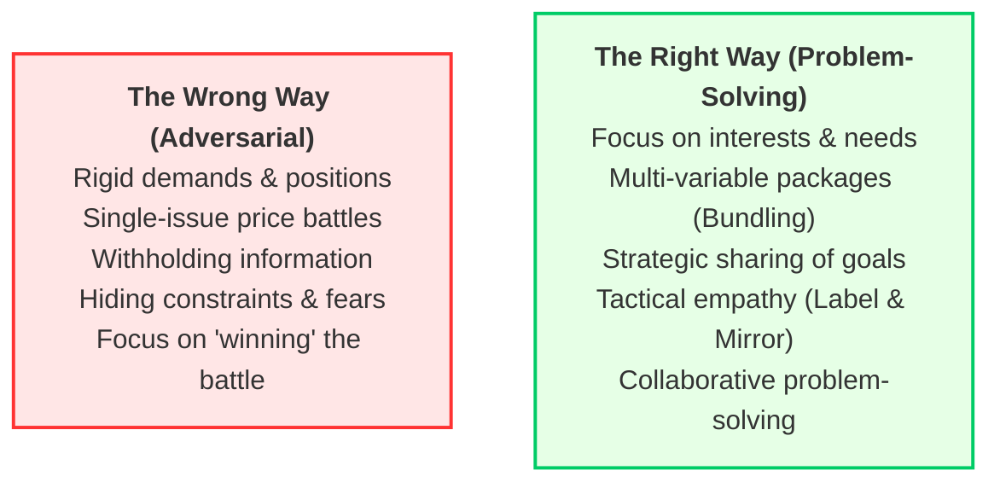
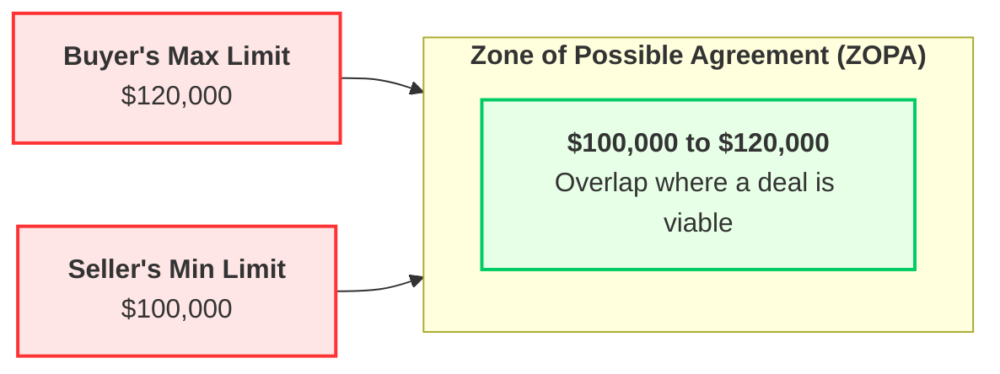

# Negotiation Foundations

## Learning Objectives
After completing this course, you will be able to answer the following questions:

- **Learning Objective 1:** How do you shift your mindset from competitive bargaining to collaborative, interest-based negotiation?
- **Learning Objective 2:** How do you prepare for a negotiation by defining your BATNA, Reservation Price, Target Price, and ZOPA?
- **Learning Objective 3:** What communication techniques (such as diagnostic questioning, mirroring, and labeling) help build connection and extract information?
- **Learning Objective 4:** How do you utilize anchoring and framing tactics during negotiation dialogue?
- **Learning Objective 5:** How do you resolve conflicts, overcome impasses, and manage negotiations in remote environments?

---

## Detailed Section Breakdowns

### Introduction: Negotiate with Better Results
*   **Core Message:** Negotiation is not a battle to be won or a game of manipulation. It is a collaborative, problem-solving conversation aimed at finding a solution that meets the core needs of both parties.
*   **The Paradigm Shift:** Shifting your mindset from combative positioning to mutual problem-solving dramatically increases the likelihood of long-term partnership success and expands the value pool for both sides.

---

### 1. The Basics of Negotiation

#### A. Developing a Negotiation Mindset
*   **Positional Bargaining:** Focusing strictly on demands and rigid positions (e.g., "I will only pay $10,000"). This creates defensiveness and results in a zero-sum outcome.
*   **Interest-Based Negotiation:** Focuses on the underlying needs, goals, and motivations of both parties (e.g., "I need a system with high uptime during our peak sales season because we cannot afford cart abandonment").

#### B. The Three Core Negotiation Practices
To move from adversarial bargaining to cooperative problem-solving, negotiators must master three core habits:
1.  **Ensuring Attention:** Checking in with the other party to ensure they are fully present and able to engage, setting a respectful and focused tone.
2.  **Getting Connected:** Building rapport and establishing a human connection, which shifts the interaction from a purely transactional exchange to a productive, collaborative dialogue.
3.  **Asking Open-Ended Questions:** Moving away from binary "Yes/No" questions and using diagnostic questions (starting with "What" or "How") to uncover the other party's underlying interests and constraints.

#### C. Anchoring and Framing for Mutual Benefit
*   **Anchoring:** Setting the initial offer to establish the bargaining range. The anchor acts as a cognitive baseline, pulling all subsequent counteroffers toward it.
*   **Framing:** Presenting your proposal in a way that highlights the specific value it provides to the other party's interests (e.g., framing a higher price as a guarantee of zero operational downtime).

#### D. Listening and Building Tactical Empathy
*   **Tactical Empathy:** Actively listening to and verbally acknowledging the other party's perspective, constraints, and emotions to lower their defensiveness.
*   **Mirroring:** Repeating the last 2 to 3 critical words spoken by the other party. This prompts them to elaborate on their constraints without feeling pressured.
*   **Labeling:** Verbally identifying and neutralizing the other party's unstated concerns (e.g., "It seems like you are concerned about meeting your quarterly margin targets").

#### E. Trading Things of Value
*   **Variable Bundling:** Never negotiate a single issue (like price) in isolation. Expand the scope of the negotiation by introducing multiple variables (e.g., payment terms, delivery speed, warranty length, volume commitments).
*   **Trade-Offs:** Trade concessions on low-priority items for gains on high-priority items. For example, give up a price discount in exchange for a guaranteed 30-minute support SLA during peak sales months.

#### F. The Wrong and Right Way to Negotiate
*   **The Wrong Way (Adversarial):** Entering the room with a combative attitude, making rigid demands, refusing to share information, hiding constraints, and trying to "defeat" the other party.
*   **The Right Way (Problem-Solving):** Entering the room with a collaborative attitude, actively listening to uncover interests, sharing non-sensitive constraints, and building a customized package of variables that creates mutual value.

##### Explanatory Breakdown of the Diagram (Figure 1: The Negotiation Axis)
This diagram contrasts the two primary approaches to negotiation:
1.  **Adversarial (Wrong):** Characterized by a combative stance, single-issue battles (usually price), hidden agendas, and positional locking. This approach often leads to impasse or damaged relationships.
2.  **Problem-Solving (Right):** Focuses on joint value creation, multi-variable bundling (trading low-value items for high-value items), active listening, and building tactical empathy. This approach secures win-win outcomes and strengthens relationships.

---

### 2. Getting Ready for a Negotiation

#### A. Researching and Preparing
*   **Information Gathering:** Investigate the market rates, vendor history, competitor offerings, and current industry constraints.
*   **Defining Your BATNA:** The **Best Alternative to a Negotiated Agreement**. This is your "Plan B"—what you will do if the negotiation fails. *Your BATNA defines your walk-away point.*
*   **Calculating Key Numbers:**
    *   **Target Price:** The optimal, realistic outcome you hope to achieve.
    *   **Reservation Price:** The absolute limit of what you will accept. (For a buyer, the maximum budget; for a seller, the minimum price).

##### Explanatory Breakdown of the Diagram (Figure 2: ZOPA Boundaries)
This diagram maps the overlap of financial boundaries that creates a Zone of Possible Agreement (ZOPA):
1.  **Sellers' Reservation Price ($100,000):** The minimum price the seller must receive to cover costs and margins.
2.  **Buyers' Reservation Price ($120,000):** The maximum budget allocation for this purchase.
3.  **ZOPA:** The overlapping range ($100,000 to $120,000) where both parties can agree to terms. If the seller's minimum is higher than the buyer's maximum (e.g., $130,000 min vs. $120,000 max), no ZOPA exists, and parties should execute their BATNAs.

#### B. Identifying Priorities and Designing Options
*   **Prioritize Variables:** Rank all variables (price, support, timeline, warranty) by importance (e.g., High, Medium, Low).
*   **Create Multiple Equivalent Offers (MEOs):** Design 3 different packages of variables that have equal value to you, and present them simultaneously. This helps you identify what the other party values most based on which package they prefer.

---

### 3. Engaging Your Allies

#### A. Understanding How Influence Works
*   **The Influence Map:** Mapping out the decision-makers, influencers, and detractors within both organizations.
*   **The Principle of Reciprocity:** Building trust by offering value or concessions early in the relationship, which encourages the other party to return the favor.

#### B. Creating Your Influence Plan
*   **Identify Allies:** Find internal and external champions who support your project goals and can influence the decision-makers.
*   **Neutralize Detractors:** Meet one-on-one with detractors to understand their underlying concerns (usually fear of change or increased workload) and adjust your proposal to address their concerns.

---

### 4. Getting Through and Past No

#### A. Understanding Conflict Styles
Negotiators must identify the conflict styles of both parties to adjust their approach:
*   **Collaborating (Win-Win):** Joint problem-solving. Best when both parties' interests are too important to compromise.
*   **Competing (Win-Lose):** Asserting power. Best in emergencies when quick action is needed.
*   **Compromising:** Splitting the difference. Best when under tight deadlines.
*   **Accommodating (Lose-Win):** Giving in. Best when building long-term goodwill is more important than the current issue.
*   **Avoiding:** Withdrawing. Best when emotions run high and you need time to cool down.

#### B. A Template for Getting Past No
When a counterpart says "No," do not push back. Use this template:
1.  **Acknowledge and Validate:** "I understand that our current timeline proposal is a challenge for you."
2.  **Ask Diagnostic Questions:** "What would need to happen for this timeline to work with your current team capacity?"
3.  **Explore Variables:** "If we extend the deadline by two weeks, could you guarantee a dedicated developer for our checkout module?"

#### C. A Template for Saying No
To protect your boundaries without damaging the relationship, use the "Positive No" template:
1.  **The Yes (Core Value):** Start by validating a shared value or interest (e.g., "We are committed to delivering a high-quality product on time").
2.  **The No (Clear Boundary):** State the refusal clearly and objectively (e.g., "However, we cannot accept a budget cut of 20% because it would compromise our testing standards").
3.  **The Yes (Alternative Offer):** Propose a constructive alternative (e.g., "What we can do is reduce the scope of the optional features to fit your target budget").

---

### 5. Essential Negotiation Tips and Strategies

#### A. Dealing with Contentious Tactics
*   **Hardball Tactics:** Tactics like threats, extreme anchors, silent treatments, or "good cop/bad cop" routines.
*   **How to Handle Them:**
    *   *Name the Tactic:* Politely point out what they are doing (e.g., "It seems like we are facing a take-it-or-leave-it offer").
    *   *Ignore it:* Focus on the underlying interests rather than responding to the emotional posture.
    *   *Set Boundaries:* Explicitly state what behavior is unacceptable and, if necessary, take a break to reset the meeting.

#### B. Negotiation Hacks
*   **The Power of Silence:** After making a proposal or asking a diagnostic question, stop talking. Silence forces the other party to process the information and often leads them to fill the gap with valuable information.
*   **The "If You, Then We" Rule:** Never give away a concession without requesting something in return.
    *   *Example:* "If you can sign a 2-year contract today, then we can waive the onboarding fee."

---

### 6. Negotiating at a Distance

#### A. Telephone and Video Conference Negotiation
*   **Establish Presence:** Maintain eye contact by looking at the camera, ensure proper lighting, and speak clearly.
*   **Read the Room:** Pay close attention to micro-expressions and tone changes, as physical cues are limited.
*   **Establish Ground Rules:** Agree on a structured agenda and confirm who is participating on the call.

#### B. Email and Text Negotiation
*   **The Tone Gap:** Email lacks vocal tone and body language, making it easy for the other party to interpret your messages as adversarial.
*   **Best Practices:**
    *   *Use Explicitly Warm Language:* Start with a friendly greeting and express appreciation.
    *   *Explain the "Why":* Never just send a number; always explain the rationale and data behind your offer.
    *   *Highlight Mutual Value:* Frame your emails around how the proposal benefits both organizations.

---

### Conclusion: Deepening Your Knowledge
*   **Continuous Practice:** Negotiation is a skill that must be practiced regularly. Review your negotiation outcomes, analyze what worked and what didn't, and refine your approach.
*   **Interest-Based Focus:** Keep your focus on building long-term relationships and creating mutual value, which is the hallmark of a successful, professional negotiator.

---

## 2026 Appendix: Modern Negotiation Dynamics in the Digital Firm

### 1. AI-Powered Negotiation Prep and Roleplay Engines
*   **The Shift:** By 2026, enterprise negotiators utilize specialized AI agents (fine-tuned on historical contract templates and corporate procurement data) to simulate negotiation scenarios.
*   **Key Advantage:** Negotiators run interactive roleplay sessions against the AI (acting as the vendor), mapping out counter-anchors, testing objection handling, and calculating ZOPA limits before entering the actual boardroom.

### 2. Negotiating Composable Service Level Agreements (SLAs)
*   **The Composable Challenge:** In headless and modular cloud environments, negotiating a single monolithic SLA is no longer viable.
*   **Key Advantage:** Procurement managers negotiate distinct SLAs and variable pricing models for individual microservices (e.g., 99.99% uptime for the checkout module, but 99.5% for the recommendation engine), optimizing software budgets by paying only for business-critical reliability.

### 3. Synchronous vs. Asynchronous Digital Negotiation Patterns
*   **The Asynchronous Reality:** A large portion of enterprise contract negotiations has shifted from live meetings to asynchronous collaborative documents (e.g., structured comment threads in Google Docs or contract management platforms).
*   **Key Advantage:** Allows legal and technical teams to conduct impact analysis on proposed clauses in real time, preventing snap decisions under pressure and promoting objective, data-backed counteroffers.

---

## Case Study Questions & Answers

### Case Study: Negotiating a Composable E-Commerce Cloud SLA Migration
#### Q1: Identify the interests, BATNA, and ZOPA of the Retailer (Buyer) and the Cloud SaaS Vendor (Seller) in this negotiation.
**Answer:**
*   **Retailer's Interests:** Wants 99.99% uptime for the checkout module during Black Friday, rapid technical support response times (under 30 minutes), and a contract price under $120,000/year.
*   **Retailer's BATNA:** Maintain their existing monolithic hosting partner for another year at $140,000, while continuing to search for other vendor candidates.
*   **SaaS Vendor's Interests:** Wants to secure a multi-year contract, maintain their standard support response times (2 hours), and close a contract price above $100,000/year.
*   **SaaS Vendor's BATNA:** Walk away from the deal and focus their sales capacity on another enterprise lead.
*   **ZOPA:** The contract price range between **$100,000** (SaaS Vendor's minimum reservation price) and **$120,000** (Retailer's maximum reservation price).

#### Q2: Demonstrate how the Retailer can use "Mirroring" and "Labeling" when the Vendor states: "We absolutely cannot offer a 30-minute support SLA at the $110,000 price point."
**Answer:**
*   **Mirroring:**
    *   *Retailer:* "Cannot offer a 30-minute support SLA?"
    *   *Vendor:* "Yes, our support engineers are heavily loaded during peak retail hours, and dedicating a team to guarantee a 30-minute response costs us significant overhead." (This extracts the underlying resource constraint).
*   **Labeling:**
    *   *Retailer:* "It seems like you are concerned that guaranteeing a rapid response time will strain your engineering team's capacity and hurt your margins."
    *   *Vendor:* "Exactly. We want to support you, but we can't do it at the expense of our team's stability." (This builds trust by demonstrating tactical empathy and validating their operational reality).

#### Q3: How should the Retailer structure a "Variable Bundle" to resolve this support SLA impasse while staying within their budget?
**Answer:**
The Retailer should avoid arguing strictly over the $110,000 price. Instead, they should introduce other variables to create trade-offs:
*   *Proposal:* "We understand your resource constraints. Let's structure the SLA differently. We will agree to a 2-hour response time for standard modules (catalog, search), but we require a guaranteed 30-minute response time *only* for the critical checkout module during our peak sales months (November and December). In exchange, we will sign a 2-year contract at $112,000/year."
*   *Impact:* This satisfies the Retailer's peak-risk concerns and the Vendor's resource and margin interests, creating a win-win resolution.

---

## Review Questions & Answers

### 1: The Negotiation Mindset & Preparation

#### Q1: Contrast positional bargaining with interest-based negotiation.
**Answer:**
*   **Positional Bargaining:** Parties adopt rigid, extreme positions (e.g., "I will only pay $50,000") and make incremental concessions. It often damages relationships, creates defensive environments, and yields suboptimal, split-the-difference compromises.
*   **Interest-Based Negotiation:** Parties share their underlying business needs, goals, and constraints. It fosters a collaborative, problem-solving atmosphere and allows negotiators to find creative alternatives (expanding the value pool) that satisfy both parties.

#### Q2: Explain the relationship between your BATNA and your walk-away reservation price.
**Answer:**
Your BATNA is the real-world alternative you will execute if the current deal fails. Your reservation price is the financial translation of that BATNA. For example, if your BATNA is buying a competitor's software for $50,000, then your maximum reservation price in the current negotiation is $50,000. *You must calculate your BATNA first to determine your objective reservation price.*

---

### 2: Elicitation and Tactical Empathy

#### Q1: What is tactical empathy, and how does it benefit a negotiator?
**Answer:**
Tactical empathy is the practice of actively listening to and verbally acknowledging the other party's emotions, perspectives, and business constraints. It does not mean you agree with them; it means you understand their point of view. It benefits a negotiator by lowering the other party's defensiveness, building trust, and encouraging them to share critical info about their real limits.

#### Q2: Provide an example of how to reframe a closed-ended question into a diagnostic question.
**Answer:**
*   *Closed-Ended (Ineffective):* "Can you lower your price to meet our budget?" (Invites a simple "No").
*   *Diagnostic (Effective):* "How can we structure this contract so that it aligns with our corporate budget constraints while still meeting your margin requirements?" (Forces the other party to help solve the problem).

---

### 3: Negotiation Tactics & Remote Dynamics

#### Q1: Under what conditions should you make the first offer (anchor)?
**Answer:**
You should make the first offer (anchor) only when you possess robust, objective market data regarding the value of the deal. Anchoring first allows you to define the boundaries of the negotiation range. If you lack information or are negotiating in an unfamiliar market, you should let the other party anchor first to avoid proposing a number that is disadvantageous to you.

#### Q2: What are the primary challenges of email negotiations, and how can they be mitigated?
**Answer:**
*   **Challenges:** Lack of non-verbal cues (tone, body language), which leads to misinterpretations; a higher likelihood of adversarial language; and delays in response times that can create suspicion.
*   **Mitigations:** Keep messages clear, concise, and structured. Use explicitly warm, collaborative language (e.g., "I look forward to finding a mutually beneficial path forward"). Always explain the rationale behind numbers rather than just listing demands, and suggest a quick phone or video call if the email exchange stalls.

---

## Glossary of Technical Terms

1.  **Anchor:** The initial offer or proposal that sets the cognitive range for subsequent negotiation counteroffers.
2.  **Best Alternative to a Negotiated Agreement (BATNA):** The specific course of action a party will take if the current negotiation fails.
3.  **Collaborating:** A win-win conflict resolution style where both parties work together to satisfy their respective interests.
4.  **Competing:** A win-lose conflict resolution style where one party pursues their goals at the expense of the other.
5.  **Compromising:** A middle-ground conflict resolution style where both parties make concessions to reach an agreement.
6.  **Diagnostic Questioning:** Open-ended questions (starting with "What" or "How") used to prompt the other party to explain their underlying needs.
7.  **Framing:** Presenting a proposal in a way that highlights how it aligns with the other party's interests and constraints.
8.  **Interest-Based Negotiation:** A negotiation methodology focused on satisfying the underlying needs of both parties rather than arguing over rigid positions.
9.  **Interests:** The underlying needs, fears, desires, and goals that drive a party to adopt a specific position.
10. **Labeling:** The practice of verbally identifying and acknowledging the other party's emotions or unstated concerns (e.g., "It seems like you feel...").
11. **Mirroring:** Repeating the last 2 to 3 critical words spoken by the other party to demonstrate active listening and prompt elaboration.
12. **Positional Bargaining:** A legacy negotiation method where parties argue over rigid, adversarial demands.
13. **Reservation Price:** The absolute financial walk-away limit for a negotiator (the highest price a buyer will pay or the lowest a seller will accept).
14. **Tactical Empathy:** Actively listening to and demonstrating an understanding of the other party's business constraints and perspective.
15. **Target Price:** The realistic, optimal outcome a negotiator aims to achieve, backed by objective market data.
16. **Zone of Possible Agreement (ZOPA):** The overlapping financial range between the buyer's maximum price limit and the seller's minimum price limit.
