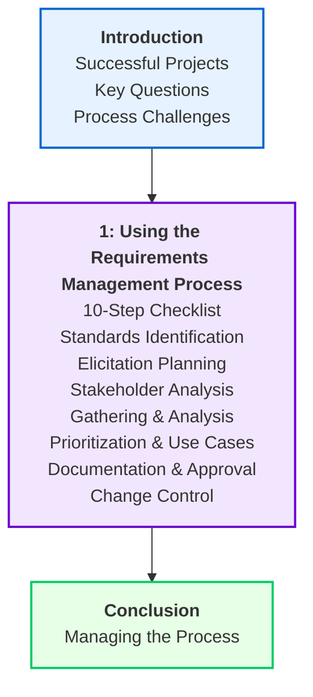

# Project Management Foundations: Requirements

This note provides detailed, lecture-level study notes for the *Project Management Foundations: Requirements* course on LinkedIn Learning, instructed by Daniel Stanton, PMP. It is structured to align exactly with the course Table of Contents.

---

---

## Introduction

### A. Managing Requirements for Successful Projects
*   **The Baseline of Success:** A project is successful only if it delivers the expected value to the business and stakeholders. Project requirements serve as the foundation of this value, defining the scope that the project team must build.
*   **The Scope-Budget-Schedule Link (Triple Constraints):** Requirements explicitly define the scope. When requirements are poorly managed, the scope expands unpredictably (Scope Creep), leading to budget overruns and schedule delays.
*   **Requirements vs. Desires:** A key task of the project manager is distinguishing between what stakeholders *actually need* to solve a business problem (requirements) and what they *want* (desires or "nice-to-haves").

### B. Defining Requirements: Key Questions to Consider
In this article, Stanton outlines five critical questions that the project team must answer during the initiation phase:
1.  **What specific problem are we trying to solve?** (Establishes the business case and underlying objective).
2.  **Who is going to use the solution?** (Identifies the primary end users and stakeholder groups).
3.  **What does success look like?** (Defines the measurable criteria and metrics for acceptance).
4.  **What are our constraints?** (Identifies the limitations regarding timeline, budget, technical boundaries, and regulatory rules).
5.  **What is the cost of doing nothing?** (Quantifies the financial or operational impact if the project is not executed).

### C. Manage Project Requirements Challenges
Project managers face several recurring challenges when managing requirements:
*   **Communication Gaps:** Misalignments between business stakeholders (who describe needs in functional terms) and technical developers (who require structured technical specifications).
*   **Scope Creep:** The gradual, uncontrolled expansion of project scope without adjustments to time, cost, and resources.
*   **Gold-Plating:** The development team adding extra features that were not requested or approved, which wastes resources and increases testing overhead.
*   **Undocumented Assumptions:** Stakeholders assuming certain capabilities will be included without explicitly stating them, leading to disappointment during acceptance testing.
*   **Changing Priorities:** Shifting corporate goals or market conditions that render previously approved requirements obsolete.

---

## 1. Using the Requirements Management Process

### A. A Ten-Step Project Requirements Checklist
Stanton outlines a structured 10-step checklist to guide project managers through the requirements lifecycle:
1.  `[ ]` **Identify standards:** Determine external and internal guidelines that apply to the project.
2.  `[ ]` **Prepare the elicitation plan:** Plan the gathering schedule, methods, and participant list.
3.  `[ ]` **Identify the stakeholders:** List all parties affected by or involved in the project.
4.  `[ ]` **Gather project requirements:** Conduct interviews, workshops, and observations.
5.  `[ ]` **Analyze requirements:** Refine, clean, and check requirements for consistency.
6.  `[ ]` **Prioritize project requirements:** Grade requirements by value and feasibility.
7.  `[ ]` **Create use cases:** Model user-system interactions to illustrate functionality.
8.  `[ ]` **Document project requirements:** Compile specifications into a formal document (e.g., RTM).
9.  `[ ]` **Approve project requirements:** Secure formal, documented sign-off to establish the baseline.
10. `[ ]` **Manage change requirements:** Run the formal change control process for all modifications.

### B. Identify Standards
*   **Definition:** Standards are established rules, guidelines, or characteristics that the project deliverables must satisfy.
*   **Categories of Standards:**
    *   *Regulatory Standards:* Mandated by law or government agencies (e.g., GDPR, HIPAA, PCI-DSS payment security rules). Non-compliance results in legal penalties.
    *   *Industry Standards:* Established best practices within a specific field (e.g., ISO quality standards, IEEE software engineering rules).
    *   *Internal/Corporate Standards:* Company-specific rules regarding branding, database architecture, or security policies.

### C. More on Project Management Standards
This article highlights the primary organizations that publish standards and bodies of knowledge for requirements engineering and project management:
*   **ISO (International Organization for Standardization):** Publishes international standards like **ISO 21500** (guidance on project management) and **ISO/IEC/IEEE 29148** (systems and software engineering life cycle processes - requirements engineering).
*   **PMI (Project Management Institute):** Publishes the **PMBOK Guide** (Project Management Body of Knowledge), which integrates requirements management within Scope Management.
*   **IIBA (International Institute of Business Analysis):** Publishes the **BABOK Guide** (Business Analysis Body of Knowledge), detailing elicitation, analysis, and life cycle management.

### D. Prepare the Elicitation Plan
*   **Purpose:** Establishes the strategy and roadmap for requirements gathering before engaging stakeholders.
*   **Key Components of the Elicitation Plan:**
    *   *Elicitation Scope:* Defining which business areas are included in the requirements gathering.
    *   *Selected Methods:* Matching elicitation techniques (interviews, surveys, observations, workshops) to the target audience.
    *   *Schedule & Logistics:* Setting dates, booking rooms, and distributing pre-reading materials.
    *   *Rules of Engagement:* Establishing guidelines for resolving conflicts and documenting responses.

### E. Identify the Stakeholders
*   **The Stakeholder Registry:** A project document containing names, roles, contact info, communication preferences, and the estimated impact of all stakeholders.
*   **Stakeholder Mapping (Power-Interest Grid):**
    *   *High Power, High Interest:* Manage closely. (e.g., Project Sponsor, Division Head).
    *   *High Power, Low Interest:* Keep satisfied. (e.g., CFO, Compliance Director).
    *   *Low Power, High Interest:* Keep informed. (e.g., End Users, Store Managers).
    *   *Low Power, Low Interest:* Monitor only. (e.g., External vendors, administrative staff).

### F. Gather Project Requirements
*   **Elicitation Execution:** The active phase of collecting raw requirements data using:
    *   *Interviews:* Deep-dive conversations to capture individual operational needs.
    *   *Shadowing/Observation:* Watching users perform their daily tasks to see actual processes and workarounds.
    *   *Workshops:* Cross-functional sessions to map workflows and resolve design conflicts in real time.
    *   *Surveys:* Collecting quantitative feedback from large, distributed user groups.
    *   *Document Analysis:* Reviewing legacy system user manuals and logs.

### G. Analyze Requirements
*   **The Refinement Process:** Raw data from gathering sessions is sorted, analyzed, and refined to ensure quality.
*   **Characteristics of Analyzed Requirements:**
    *   *Unambiguous:* Has only one possible interpretation.
    *   *Complete:* Contains all necessary details to construct the feature.
    *   *Consistent:* Does not conflict with other requirements or constraints.
    *   *Verifiable (Testable):* Can be tested to confirm compliance (e.g., "The system must load in under 2 seconds" vs. "The system must be fast").
    *   *Feasible:* Can be built within budget, schedule, and technical boundaries.

### H. Prioritize Project Requirements
*   **Why Prioritize:** Projects have limited time and money. Prioritization ensures that the team builds the highest-value items first.
*   **Prioritization Framework (MoSCoW):**
    *   *Must-Have:* Essential for launch. The project fails without them.
    *   *Should-Have:* High value, but can be deferred if schedule pressures arise.
    *   *Could-Have:* Nice-to-have features that do not impact core operations.
    *   *Won't-Have (for now):* Deferred to future releases.

### I. Create Use Cases
*   **Definition:** A use case models how a user (actor) interacts with a system to achieve a specific goal.
*   **Structure of a Use Case:**
    *   *Actor:* The user role (e.g., Customer, Administrator).
    *   *Preconditions:* The state of the system before the use case begins (e.g., "User is logged in").
    *   *Basic Flow:* The step-by-step sequence of success (e.g., Input details $\rightarrow$ Verify card $\rightarrow$ Approve transaction).
    *   *Postconditions:* The state of the system after completion (e.g., "Transaction recorded, inventory updated").

### J. Document Project Requirements
*   **The System of Record:** Requirements must be documented in a structured format (e.g., a Product Requirements Document or a backlog database).
*   **Requirements Traceability Matrix (RTM):** A table that links each requirement from its source stakeholder, through design elements, to test scripts.
    *   *Forward Traceability:* Ensures every requirement is built and tested.
    *   *Backward Traceability:* Ensures no extra code is written unless it maps back to an approved requirement (prevents gold-plating).

### K. Approve Project Requirements
*   **Establishing the Baseline:** Approval marks the transition from planning to execution. The requirements document is signed off and "baselined."
*   **Sign-Off Requirements:** Formal agreement (physical or electronic signature) from the project sponsor and primary business stakeholders, confirming that the document accurately reflects their needs.

### L. Manage Change Requirements
*   **The Change Control Process:** Any change to the baselined requirements must go through a formal process:
    1.  *Submission:* Requester submits a formal Change Request (CR) document.
    2.  *Impact Analysis:* The PM evaluates how the change affects the budget, schedule, resources, and quality.
    3.  *CCB Review:* The Change Control Board (CCB) evaluates the CR.
    4.  *Decision:* The CCB approves, rejects, or defers the change.
    5.  *Update Plan:* If approved, the PM updates the project baseline and communicates changes to the team.

---

## Conclusion

### Manage the Project Requirements Process
*   **The Continuous Effort:** Requirements management does not end after the planning phase. The project manager must audit the RTM regularly, monitor developer progress against approved scope, and verify deliverables during acceptance testing.
*   **Final Acceptance:** At the end of the project, the PM uses the RTM and test reports to verify that all requirements have been met, securing final sign-off from the customer or business owners.

---

## 2026 Appendix: Emerging Technological Shifts in Requirements Management

### 1. AI-Assisted Requirements Drafting and Validation
*   **The Shift:** By 2026, project managers utilize generative AI tools (trained on corporate project histories and industry standards) to draft initial requirements specifications from raw workshop transcripts.
*   **Key Advantage:** Natural language models analyze drafted requirements to flag ambiguities, logical inconsistencies, or compliance issues before they reach the review stage, cutting analysis time by 40%.

### 2. Composable Commerce Requirements Modeling
*   **API-First Scope Definition:** With the rise of composable commerce, requirements are no longer mapped to monolithic systems.
*   **Key Advantage:** Requirements are defined as modular, independent business capabilities (e.g., a "checkout module" or a "tax calculation engine") that interface via APIs. This allows PMs to define functional requirements at the microservice level, making it easier to swap vendors without re-eliciting the entire system requirements stack.

### 3. Real-Time Automated Traceability Matrices
*   **Live Requirements Sync:** Legacy Excel-based Requirements Traceability Matrices (RTMs) are being replaced by automated, cloud-based tracking systems (e.g., Jira Product Discovery synced with GitHub/GitLab).
*   **Key Advantage:** When a developer commits code or a QA tester runs a test suite, the system automatically writes verification tokens back to the central requirements record, providing real-time compliance dashboards to stakeholders and auditing teams.

---

## Case Study Questions & Answers

### Case Study: Requirements Gathering for a Global Retail Composable Commerce Migration
#### Q1: Identify the primary problem in this case. What is the impact of failing to gather proper requirements?
**Answer:**
*   **The Problem:** The retail company decided to migrate its legacy monolithic e-commerce system to a composable (headless) cloud architecture without documenting the existing business logic and integration dependencies.
*   **The Impact:** The project team build interfaces that do not support localized tax rules, fail to sync inventory data with regional warehouses in real time, and break existing payment gateways. This results in scope creep, budget overruns of 50%, and an extended schedule delay as the team must halt development to re-verify fundamental business rules.

#### Q2: Contrast how functional and non-functional requirements would differ for this migration.
**Answer:**
*   **Functional Requirements:** Focus on what the composable system must do. (e.g., "The system must allow customers to apply digital discount codes at checkout," "The shopping cart must sync inventory status across five regional warehouses," and "The system must generate automated VAT invoices for European customers").
*   **Non-functional Requirements:** Focus on how the system must perform. (e.g., "The headless APIs must respond to mobile client requests in under 200 milliseconds," "The checkout microservice must maintain 99.99% operational availability," and "All customer transactional data must be encrypted in transit using TLS 1.3").

#### Q3: How should the project manager handle a major stakeholder who demands a late-stage requirements change to add a new social-commerce checkout channel?
**Answer:**
The project manager must not accept or reject the change immediately. Instead, they should follow the formal Change Control Process:
1.  **Submit a Change Request:** Document the stakeholder's request.
2.  **Perform an Impact Analysis:** Quantify how adding the social checkout channel affects the schedule (requires 3 weeks of API development), budget (costs an additional $25,000 for developers), and resource availability (diverts the database team from core tasks).
3.  **Present to the Change Control Board (CCB):** Present the impact findings to the CCB, highlighting that approving this change will delay the primary website launch. The CCB must make the strategic decision to approve, reject, or defer the change.

---

## Review Questions & Answers

### 1: Introduction to Requirements & Elicitation Planning

#### Q1: What is the difference between a business requirement, a stakeholder requirement, and a functional requirement?
**Answer:**
*   **Business Requirement:** High-level corporate goals that justify the project (e.g., "Increase customer retention by 10%").
*   **Stakeholder Requirement:** Needs of specific user groups to perform their tasks (e.g., "The customer support team needs a dashboard showing user interaction history").
*   **Functional Requirement:** Specific capabilities or actions the software system must perform to meet user needs (e.g., "The system must store customer interaction logs for 90 days").

#### Q2: Describe the purpose of a Power-Interest Grid and how it shapes the communication plan.
**Answer:**
The Power-Interest Grid classifies project stakeholders based on their authority (power) and interest in project outcomes. It dictates four tailored communication paths:
*   *High Power/High Interest:* Require close, interactive communication and formal sign-offs.
*   *High Power/Low Interest:* Require strategic reporting to keep them satisfied without overloading them with details.
*   *Low Power/High Interest:* Require regular informational updates (newsletters, demos) to maintain support and leverage their detailed feedback.
*   *Low Power/Low Interest:* Require minimal monitoring via automated progress reports.

---

### 2: Elicitation, Analysis, and Prioritization

#### Q1: Compare interviews, observation, and facilitated workshops as elicitation techniques.
**Answer:**
*   **Interviews:** Excellent for capturing detailed, personal feedback and complex business rules from single decision-makers. However, they are time-consuming and can result in conflicting requirements across different managers.
*   **Observation:** Crucial for documenting actual workflows and identifying "hidden" workarounds that users perform but fail to mention verbally. It is limited because it is time-consuming and does not explain the underlying business rules.
*   **Facilitated Workshops:** Highly effective for gathering cross-functional teams to resolve conflicts, align on system interfaces, and generate ideas quickly. The primary drawback is that dominant personalities can overshadow quieter participants.

#### Q2: How does the MoSCoW method assist in scope management?
**Answer:**
The MoSCoW method divides requirements into Must-haves, Should-haves, Could-haves, and Won't-haves. This categorizing system establishes a clear baseline of minimum viable scope (Must-haves). If the project runs behind schedule or over budget, the project manager can defer the Could-haves and Should-haves without compromising the core project objectives, preventing scope creep and project failure.

---

### 3: Documentation, Approval, and Change Control

#### Q1: What is a Requirements Traceability Matrix (RTM) and what problem does it solve?
**Answer:**
An RTM is a tracking sheet that links each requirement from its initial source (stakeholder request) forward through design specifications, code modules, and test scripts. It solves two major problems:
*   *Missing Requirements:* Ensures that every approved requirement is actually built and tested.
*   *Scope Creep (Gold-Plating):* Ensures that no extra, unapproved features are built, as every line of code can be traced back to an approved requirement.

#### Q2: Describe the steps of the formal change control process.
**Answer:**
1.  **Submission:** The requester submits a formal Change Request (CR) document.
2.  **Impact Analysis:** The PM analyzes the impact on project cost, timeline, resource allocation, and quality.
3.  **Evaluation:** The Change Control Board (CCB) evaluates the request against strategic goals.
4.  **Decision:** The CCB formally approves, rejects, or defers the request.
5.  **Update & Baseline:** If approved, the PM updates the project plans, baseline schedules, and budget, and distributes the updated documents to the team.

---

## Glossary of Technical Terms

1.  **Actor:** In use cases, any entity (human user or external system) that interacts with the system to achieve a goal.
2.  **Assumptions:** Factors in project planning that are considered to be true, real, or certain without proof.
3.  **Baseline:** The approved version of a work product (scope, schedule, budget) that is used as a baseline for comparison.
4.  **Business Requirement:** High-level goals, objectives, and needs of the organization that justify a project.
5.  **Change Control Board (CCB):** A committee of stakeholders responsible for approving, rejecting, or deferring changes to the project baseline.
6.  **Change Request (CR):** A formal proposal to modify any document, deliverable, or baseline.
7.  **Clickstream Data:** The record of a user's activity on the internet, detailing every page request and click.
8.  **Composable Commerce:** An e-commerce system built from modular, best-of-breed services that communicate via APIs.
9.  **Constraints:** Restricting factors that limit the execution of a project (e.g., budget, timeline, technology).
10. **Customer Data Platform (CDP):** Software that aggregates customer data from multiple sources to build a single profile database.
11. **Disintermediation:** The removal of intermediary layers (distributors, retailers) from a supply chain, allowing direct sales to consumers.
12. **Elicitation:** The process of gathering requirements from stakeholders through interviews, observations, and workshops.
13. **Functional Requirement:** A statement describing a capability or behavior that a system must display.
14. **Gold-Plating:** The practice of adding unapproved features or enhancements to a project without going through change control.
15. **Headless Commerce:** E-commerce architecture where the front-end user interface is decoupled from the back-end transaction database.
16. **Information Asymmetry:** A transaction scenario where one party possesses more or better information than the other.
17. **Landing Zone:** A pre-configured cloud environment that establishes security, networking, identity, and compliance controls.
18. **MoSCoW Method:** A prioritization framework that categorizes requirements as Must, Should, Could, or Won't.
19. **Non-functional Requirement:** A statement defining a quality attribute or constraint (performance, security, usability) of a system.
20. **Nonobvious Relationship Awareness (NORA):** Data analysis software that correlates information from disparate sources to find obscure relationships.
21. **Opt-in:** A model of informed consent requiring users to actively approve data collection before it occurs.
22. **Opt-out:** A model of informed consent where data collection is active by default until the user explicitly requests to stop.
23. **Power-Interest Grid:** A matrix tool used to categorize stakeholders by power and interest to design communication strategies.
24. **Requirements Traceability Matrix (RTM):** A table linking requirements from their origin through design, development, and testing.
25. **Scope Creep:** The uncontrolled expansion of project scope without adjustments to time, cost, and resources.
26. **Service Level Objective (SLO):** Target performance metrics defined within a service level agreement (SLA) (e.g., uptime).
27. **Stakeholder:** Any individual, group, or organization that can affect or be affected by a project.
28. **Triple Constraints:** The fundamental project constraints: Scope, Time, and Cost.
29. **Use Case:** A description of user-to-system interactions to achieve a specific functional goal.
30. **Vector Database:** A database that stores data as high-dimensional vectors to support semantic search and AI operations.
