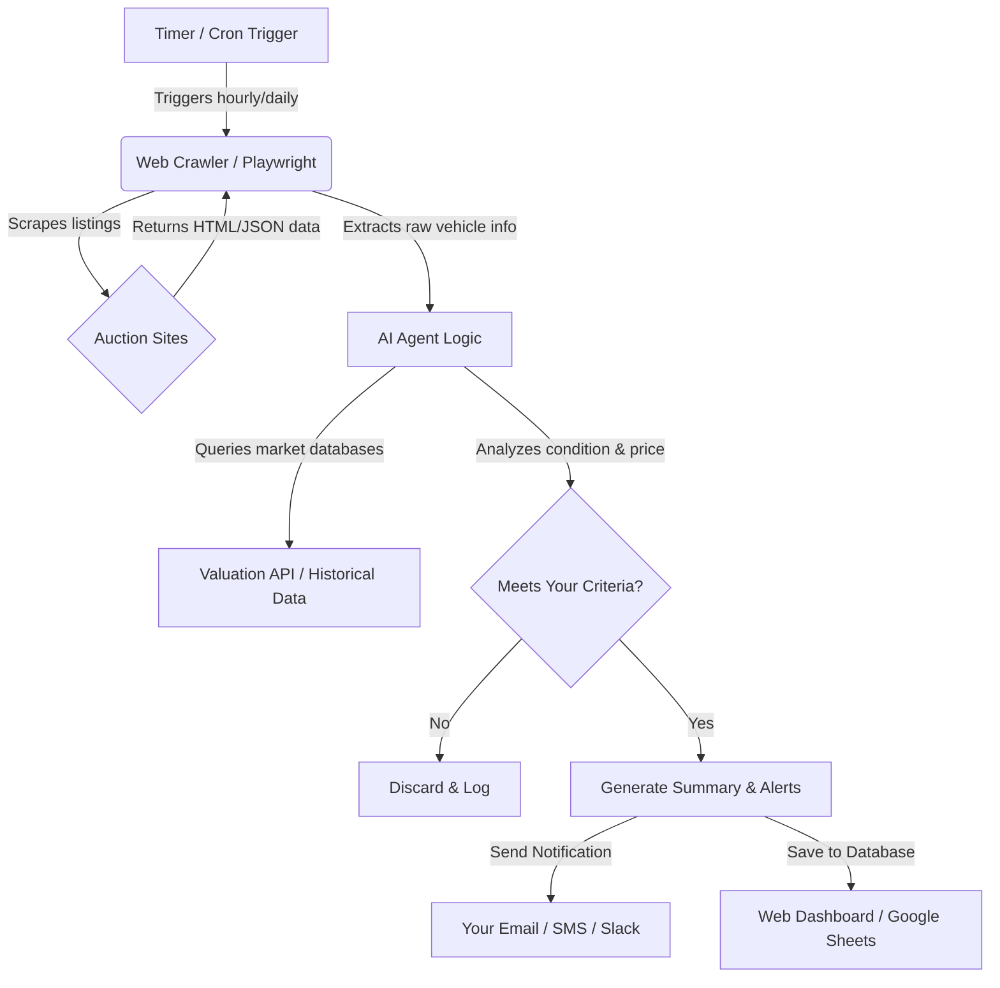

# Proposal: AI-Powered Auction Monitoring Agent

This proposal outlines how we can set up an automated AI agent to monitor auction websites (e.g., Copart, IAAI, Bring a Trailer, Cars & Bids, eBay Motors, or local auction sites) for specific cars, equipment, or other assets. 

Using an automated system ensures you never miss a deal, saves hours of manual searching, and allows for immediate, data-driven analysis of listings.

---

## 1. Core Workflow

Below is the conceptual flow of how the monitoring agent operates from data extraction to user notification.

---

## 2. What Kind of "Stuff" Can We Monitor?

The agent is highly customizable and can be programmed to track and filter almost any asset category or specific criteria:

| Asset Category | Example Monitoring Criteria |
| :--- | :--- |
| **Collector Cars** | "1990-2005 Porsche 911 Carrera, Manual Transmission, under 80,000 miles, clean title, price under $50,000." |
| **Salvage / Project Cars** | "Late-model trucks (Ford F-150, Ram 1500) with minor front-end damage, run & drive verified, located within 250 miles." |
| **Fleet / Commercial Vehicles** | "Cargo vans (Mercedes Sprinter, Ford Transit) under $25,000 with less than 100k miles." |
| **Heavy Machinery** | "John Deere or Caterpillar excavators under 5,000 hours, located in the Midwest." |
| **Commercial Equipment** | "Industrial kitchen gear or CNC machines listed on liquidator sites." |

### Intelligent AI Filters
Unlike basic keyword alerts, an AI-powered agent can perform **semantic analysis** and decision-making:
* **Damage Assessment:** Look at damage descriptions and photos to estimate repair costs.
* **Smart Valuation:** Automatically cross-reference auction prices with market value guides (KBB, Edmunds, or completed auction listings) to calculate potential profit margins.
* **Location & Logistics:** Calculate the distance to the vehicle and estimate shipping costs to your zip code.

---

## 3. How We Can Build & Deploy It

There are two primary paths depending on the budget, time, and level of customization needed:

### Option A: The No-Code / Low-Code Approach (Fastest Setup)
Ideal for testing the concept quickly without writing complex software.
* **How it works:** 
  1. Use **Browse.ai** or **Apify** to point-and-click scrape auction search result pages.
  2. Send new listings automatically to **Make.com** or **Zapier**.
  3. Use **OpenAI/Gemini API** modules in Make/Zapier to filter the description and decide if it's a good match.
  4. Write matching listings to a **Google Sheet** and send an email or SMS notification.
* **Timeline:** 1 to 2 days.
* **Pros:** Very fast to set up, easy to modify search terms without code.
* **Cons:** Monthly subscription fees for scraping and automation platforms; less robust against auction site layout changes.

### Option B: The Custom Code Approach (Most Robust & Scalable)
Ideal for long-term production use, handling complex logins, and scraping multiple sites reliably.
* **How it works:** 
  1. Build a custom scraper script using **Python** (with **Playwright** or **BeautifulSoup**).
  2. Parse listings and pass them to a local instance of the **Gemini SDK** for analysis.
  3. Save all results into a local database (SQLite/PostgreSQL).
  4. Deploy a simple, sleek web portal/dashboard for you to view matches, filter results, and adjust alert parameters.
* **Timeline:** 1 to 2 weeks.
* **Pros:** Zero platform fees (only pay minor server hosting/API usage fees), high customizability, bypasses complex website bot-detection.
* **Cons:** Requires development time and maintenance.

---

## 4. Role of Antigravity (Your AI Assistant) in This Project

We can use our current workspace and chat interface to develop, test, and even run this monitoring system. Here is how we will divide the work:

### Phase 1: Prototype Development & Local Testing (Done via Antigravity)
* **What I (the AI) will do:** I will write the custom scraping and filtering code directly into this workspace.
* **How we run it:** You can ask me to run the scraper. I will fetch the live data (with your approval for internet access), use my AI reasoning to filter the listings, and format a beautiful report or update a spreadsheet in your workspace.
* **Pros:** Great for rapid iteration, testing out search criteria, and refining the AI's valuation logic without needing external hosting.
* **Cons:** I only run when your computer is awake and this editor is active. It is not suitable for 24/7 background running.

### Phase 2: Autonomous 24/7 Cloud Deployment
* **What I (the AI) will do:** Once we are happy with how the scraper and filters perform locally, I will write the deployment configurations and package the code.
* **How we run it:** We will host the code on a lightweight, secure cloud server (e.g., Render, Railway, or AWS). The script will run on a cloud timer (cron job) 24/7.
* **Pros:** Runs completely independently of your local computer. It will automatically monitor sites and send email/SMS alerts directly to your inbox.

---

## 5. Example Alert Format

When the agent finds a match, you can receive an email or text message that looks like this:

> ### 🚨 NEW VEHICLE MATCH FOUND
> **Vehicle:** 2018 Chevrolet Silverado 1500 LTZ  
> **Auction Site:** Copart (Lot #12345678)  
> **Current Bid:** $11,200 | **Buy It Now:** $14,500  
> **Location:** Houston, TX (Est. Shipping: $450)  
>
> **AI Analysis:**
> * **Condition:** Listed as "Front End Damage." Estimated repair cost is $3,500.
> * **Estimated Clean Retail Value:** $24,500.
> * **Calculated Profit Margin:** ~$5,350 (taking repairs and shipping into account).
> * **Recommendation:** **High Match.** Highly profitable if bid stays under $13,500.
> 
> [View Auction Listing] | [View Details on Dashboard]

---

## 6. Next Steps to Get Started

To build this for you, we need to define the following parameters:
1. **Target Websites:** Which auction sites do you use most often?
2. **Search Criteria:** What specific cars or items are you looking for, and what are your budget limits?
3. **Preferred Alerts:** How would you like to be notified (Email digest, real-time SMS, Slack channel, or a Google Sheet)?

We can start by building a small prototype for one website using your exact search criteria to demonstrate how it works.
